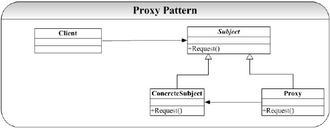
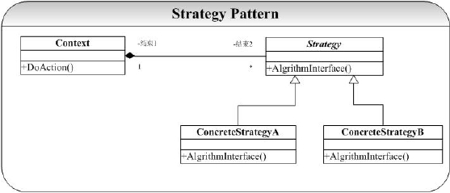
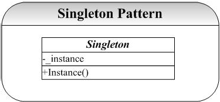
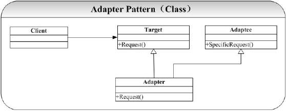
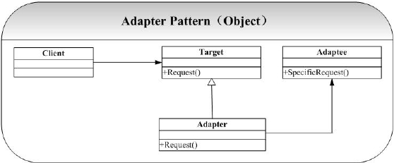
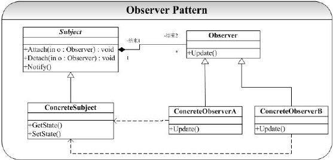
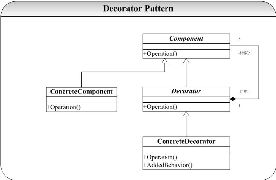
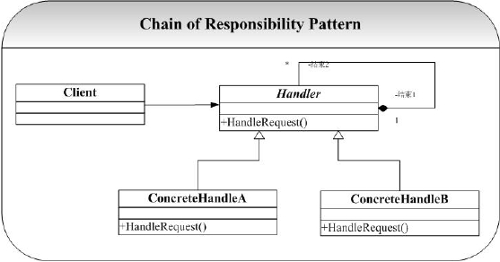
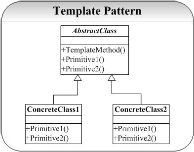
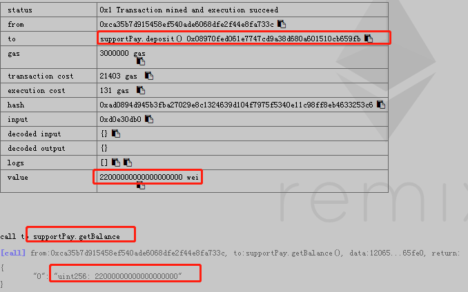

[TOC]

------

##  [CPP] 读取文件

```c++
static bool ReadFile(const char *file, std::string &out)
{
    std::ifstream fin(file);
    if (!fin.is_open())
    {
        return false;
    }

    std::stringstream buffer;
    buffer << fin.rdbuf();
    out.assign(buffer.str());
    fin.close();

    return true;
}
```

## [C/CPP] 切分字符串

### 利用 std::string 的成员方法实现

> 根据指定的分割字符串切分目标字符串，支持忽略空字符串、去除前后空白字符

```cpp
#include <string>
#include <iostream>
#include <vector>

std::vector<std::string> Split(
    const std::string &str,
    const std::string &delimiter,
    const bool allow_empty,
    const bool trim_whitespaces
    )
{
	// 切分字符串
    std::vector<std::string> vec;
    if (delimiter.empty())
    {
        return vec;
    }

    std::size_t current = 0;
    std::size_t index = 0;
    while ((index = str.find(delimiter, current)) != str.npos)
    {
        if (index - current != 0 || allow_empty)
        {
            vec.emplace_back(str.substr(current, index - current));
        }
        current = index + delimiter.length();
    }
    if (current < str.length() || allow_empty)
    {
        vec.emplace_back(str.substr(current));
    }

    if (!trim_whitespaces)
    {
        return vec;
    }
    
    // 去除前后空白字符
    std::string raw;
    std::size_t beg = 0;
    std::size_t end = 0;
    std::vector<std::string> vec2;
    for (auto v : vec)
    {
        if ((beg = v.find_first_not_of(" \t\f\v\n\r")) != raw.npos
            && (end = v.find_last_not_of(" \t\f\v\n\r"), beg) != raw.npos)
        {
            vec2.push_back(v.substr(beg, end - beg + 1));
        }
    }

    return vec2;
}

int main()
{
    std::string target = "hello, world   , a b c  ,   ,,kevin's blog ,";
    std::vector<std::string> result = Split(target, ",", false, true);
    for (auto v : result)
    {
        std::cout << v << std::endl;
    }

    return 0;
}
```

**输出**

```basic
hello
world
a b c
kevin's blog
```

### 利用 std::stringstream 实现

> **限制：**分隔符为一个或多个空格

```cpp
#include <sstream>
#include <string>
#include <iostream>

int main()
{
    std::string input = "hello  glad to  see you  ";
    std::stringstream ss(input);
    std::string str;

    while (ss >> str)
    {
        std::cout << str << std::endl;
    }

    return 0;
}
```

**输出**

```basic
hello
glad
to
see
you
```

### 利用 strtok/strtok_r 实现

> **源码路径：**[split.c](https://dudebing99.github.io/blog/archives/code_snippet/split.c)
>
> **是否线程安全：**strtok 在提取字符串时使用了静态缓冲区，非线程安全；strtok_r 线程安全

```c
#include <stdio.h>
#include <string.h>

// char *strtok(char *str, const char *delim);
// char *strtok_r(char *str, const char *delim, char **saveptr);

void Split()
{
    char str[] = "1, hello, world";
    char *ptr = strtok(str, ",");
    
    while (ptr != NULL)
    {
        printf("%s\n", ptr);
        ptr = strtok(NULL, ",");
    }
}

void Split2()
{
    char str[] = "2, hello, world";
    char *buf = NULL;
    char *ptr = strtok_r(str, ",", &buf);
    
    while (ptr != NULL)
    {
        printf("%s\n", ptr);
        ptr = strtok_r(NULL, ",", &buf);
    }
}

int main()
{
    Split();
    Split2();

    return 0;
}
```

**输出**

````bash
1
 hello
 world
2
 hello
 world
````

## [CPP] 递增序列/随机序列

- 利用 std::itoa 实现 list/vector 自增序列
- 利用 std::shuffle 实现随机序列

```cpp
#include <algorithm>
#include <iostream>
#include <list>
#include <numeric>
#include <random>
#include <vector>

int main()
{
    std::vector<int> vec(10);
    std::iota(vec.begin(), vec.end(), 1);
    std::cout << "Contents of the vector: ";
    for (auto n : vec) std::cout << n << ' ';
    std::cout << '\n';

    std::list<int> l(10);
    std::iota(l.begin(), l.end(), -4);

    std::vector<std::list<int>::iterator> v(l.size());
    std::iota(v.begin(), v.end(), l.begin());

    std::shuffle(v.begin(), v.end(), std::mt19937{ std::random_device{}() });

    std::cout << "Contents of the list: ";
    for (auto n : l) std::cout << n << ' ';
    std::cout << '\n';

    std::cout << "Contents of the list, shuffled: ";
    for (auto i : v) std::cout << *i << ' ';
    std::cout << '\n';

    return 0;
}
```

**输出**

```basic
Contents of the vector: 1 2 3 4 5 6 7 8 9 10
Contents of the list: -4 -3 -2 -1 0 1 2 3 4 5
Contents of the list, shuffled: -3 3 5 1 4 0 -2 2 -4 -1
```

- std::itoa 模拟实现

```cpp
template<class ForwardIterator, class T>
void iota(ForwardIterator first, ForwardIterator last, T value)
{
    while (first != last)
    {
        *first++ = value;
        ++value;
    }
}
```

## [CPP] 处理信号，服务优雅退出

```c++
#include <chrono>

#include <signal.h>
#include <unistd.h>
#include <sys/types.h>
#include <sys/wait.h>

static bool g_done = false;

static void SignalHandler(int)
{
    std::cout << "[WARN] try to stop and exit" << std::endl;
    g_done = true;
}

static void RegisterSignalHandler(void)
{
    struct sigaction action;

    action.sa_handler = SignalHandler;
    sigemptyset(&action.sa_mask);

    // Handle signals properly before shutting down the server.
    // Ctrl + C
    sigaction(SIGINT, &action, (struct sigaction *)nullptr);
    // kill PID
    sigaction(SIGTERM, &action, (struct sigaction *)nullptr);
}

int main(int argc, char **argv)
{
    RegisterSignalHandler();

    // start service

    while (!g_done)
    {
        std::this_thread::sleep_for(std::chrono::seconds(1));
    }

    // stop service

    return 0;
}
```

## [CPP] 自定义服务运行参数

```c++
static void ShowHelp()
{
    const char *help =
        "=============================================\n"
        " Desc: Danbay's Access Service\n"
        "\n"
        " Usage:\n"
        "  -c/--conf <file>     default 'default.conf'\n"
        "  -d/--daemon          run in daemon mode\n"
        "  -w/--watchdog        run with watchdog\n"
        "  -h/--help            show help and exit\n"
        "=============================================\n";

    std::cout << help << std::endl;
}

int main(int argc, char **argv)
{
    const char *conf = "default.conf";
    bool daemon_alias = false;
    bool watchdog = false;

    const struct option options[] = {
        {"conf", 1, nullptr, 'c'},
        {"daemon", 0, nullptr, 'd'},
        {"watchdog", 0, nullptr, 'w'},
        {"help", 0, nullptr, 'h'}
    };

    int opt = -1;
    while ((opt = getopt_long(argc, argv, "c:dwh", options, nullptr)) != -1)
    {
        switch (opt)
        {
            case 'c':
                conf = optarg;
                break;
            case 'd':
                daemon_alias = true;
                break;
            case 'w':
                watchdog = true;
                break;
            case 'h':
            default:
                ShowHelp();
                return -1;
        }
    }

    // RegisterSignalHandler();

    std::string config;
    if (!ReadFile(conf, config))
    {
        std::cerr << "[ERROR] open conf file failed" << std::endl;
        return -1;
    }

    std::cout << "[INFO] here is all configuration information" <<
        std::endl << config << std::endl;

    int ret = 0;
    if (daemon_alias)
    {
        int nochdir = 1;
        int noclose = 0;
        ret = daemon(nochdir, noclose);
        if (ret == -1)
        {
            std::cerr << "[ERROR] run in daemon mode failed" << std::endl;
            return -1;
        }
    }

    while (watchdog)
    {
        ret = fork();
        if (ret == -1)
        {
            std::cerr << "[ERROR] run with watchdog failed" << std::endl;
            return -1;
        }
        else if (ret == 0)
        {
            break;
        }

        if (wait(&ret) == -1)
        {
            std::cerr << "[ERROR] run with watchdog failed" << std::endl;
            return -1;
        }
    }
    
    // ...
}
```

## [CPP] SSL/TLS 客户端

> **源码路径：**
>
> 1. [openssl_client.c](https://dudebing99.github.io/blog/archives/code_snippet/openssl_client.c)
> 2. [boost_ssl_client.cpp](https://dudebing99.github.io/blog/archives/code_snippet/boost_ssl_client.cpp)

```c
#include <stdio.h>
#include <string.h>
#include <errno.h>
#include <sys/socket.h>
#include <resolv.h>
#include <stdlib.h>
#include <netinet/in.h>
#include <arpa/inet.h>
#include <unistd.h>
#include <openssl/ssl.h>
#include <openssl/err.h>

#define MAXBUF 1024

#define CA_FILE             "ca.pem"
#define CLIENT_KEY          "client.pem"
#define CLIENT_CERT         "client.pem"

void ShowCerts(SSL * ssl)
{
    X509 *cert;
    char *line;
    cert = SSL_get_peer_certificate(ssl);
    if (cert != NULL)
    {
        line = X509_NAME_oneline(X509_get_subject_name(cert), 0, 0);
        printf("证书: %s\n", line);
        free(line);
        line = X509_NAME_oneline(X509_get_issuer_name(cert), 0, 0);
        printf("颁发者: %s\n", line);
        free(line);
        X509_free(cert);
    }
    else
    {
        printf("无证书信息！\n");
    }
}

int main(int argc, char **argv)
{
    int sockfd, len;
    struct sockaddr_in dest;
    char buffer[MAXBUF + 1];
    SSL_CTX *ctx;
    SSL *ssl;
    const SSL_METHOD *method;

    if (argc != 3)
    {
        printf("%s <ip> <port>\n", argv[0]);
        exit(0);
    }

    SSL_library_init();
    SSL_load_error_strings();
    OpenSSL_add_all_algorithms();
    method = TLSv1_2_client_method();
    ctx = SSL_CTX_new(method);

    if (!ctx)
    {
        printf("create ctx is failed.\n");
    }

    /* 设置会话的握手方式 */
    SSL_CTX_set_verify(ctx, SSL_VERIFY_PEER | SSL_VERIFY_FAIL_IF_NO_PEER_CERT, 0);

    /* 加载 CA FILE */
    if (SSL_CTX_load_verify_locations(ctx, CA_FILE, 0) != 1)
    {
        SSL_CTX_free(ctx);
        printf("Failed to load CA file %s", CA_FILE);
    }

    if (SSL_CTX_set_default_verify_paths(ctx) != 1)
    {
        SSL_CTX_free(ctx);
        printf("Call to SSL_CTX_set_default_verify_paths failed");
    }

    /* 加载客户端证书 */
    if (SSL_CTX_use_certificate_file(ctx, CLIENT_CERT, SSL_FILETYPE_PEM) != 1)
    {
        SSL_CTX_free(ctx);
        printf("Failed to load client certificate from %s", CLIENT_KEY);
    }

    /* 加载客户端私钥 */
    if (SSL_CTX_use_PrivateKey_file(ctx, CLIENT_KEY, SSL_FILETYPE_PEM) != 1)
    {
        SSL_CTX_free(ctx);
        printf("Failed to load client private key from %s", CLIENT_KEY);
    }

    /* 验证私钥 */
    if (SSL_CTX_check_private_key(ctx) != 1)
    {
        SSL_CTX_free(ctx);
        printf("SSL_CTX_check_private_key failed");
    }

    /* 处理握手多次 */
    SSL_CTX_set_mode(ctx, SSL_MODE_AUTO_RETRY);

    if ((sockfd = socket(AF_INET, SOCK_STREAM, 0)) < 0)
    {
        perror("Create socket error.\n");
        exit(errno);
    }

    bzero(&dest, sizeof(dest));
    dest.sin_family = AF_INET;
    dest.sin_port = htons(atoi(argv[2]));
    if (inet_aton(argv[1], (struct in_addr *)&dest.sin_addr.s_addr) == 0)
    {
        perror(argv[1]);
        exit(errno);
    }

    if (connect(sockfd, (struct sockaddr *)&dest, sizeof(dest)) != 0)
    {
        perror("Connect error.\n");
        exit(errno);
    }

    /* 创建 SSL */
    ssl = SSL_new(ctx);
    if (ssl == NULL)
    {
        printf("SSL_new error.\n");
    }

    /* 将 fd 添加到 ssl 层 */
    SSL_set_fd(ssl, sockfd);
    if (SSL_connect(ssl) == -1)
    {
        printf("SSL_connect fail.\n");
        ERR_print_errors_fp(stderr);
    }
    else
    {
        printf("SSL 最终协商的算法：%s\n", SSL_get_cipher(ssl));
        ShowCerts(ssl);
    }

    bzero(buffer, MAXBUF + 1);
    strcpy(buffer, "Hello World!");
    len = SSL_write(ssl, buffer, strlen(buffer));
    if (len < 0)
    {
        printf("消息'%s'发送失败，错误码：%d，错误信息：'%s'\n",
            buffer, errno, strerror(errno));
        goto finish;
    }
    else
    {
        printf("消息'%s'发送成功，长度：%d 字节\n", buffer, len);
    }

    bzero(buffer, MAXBUF + 1);
    len = SSL_read(ssl, buffer, MAXBUF);
    if (len > 0)
    {
        printf("接收消息成功: '%s'，长度：%d\n", buffer, len);
    }
    else
    {
        printf("接收消息失败，错误码：%d，错误信息：'%s'\n",
            errno, strerror(errno));
    }

finish:

    SSL_shutdown(ssl);
    SSL_free(ssl);
    close(sockfd);
    SSL_CTX_free(ctx);

    return 0;
}
```

```cpp
#include <cstdlib>
#include <iostream>
#include <boost/bind.hpp>
#include <boost/asio.hpp>
#include <boost/asio/ssl.hpp>

enum { max_length = 1024 };

class client
{
public:
  client(boost::asio::io_service& io_service,
      boost::asio::ssl::context& context,
      boost::asio::ip::tcp::resolver::iterator endpoint_iterator)
    : socket_(io_service, context)
  {
    socket_.set_verify_mode(boost::asio::ssl::verify_peer);
    socket_.set_verify_callback(
        boost::bind(&client::verify_certificate, this, _1, _2));

    boost::asio::async_connect(socket_.lowest_layer(), endpoint_iterator,
        boost::bind(&client::handle_connect, this,
          boost::asio::placeholders::error));
  }

  bool verify_certificate(bool preverified,
      boost::asio::ssl::verify_context& ctx)
  {
    // The verify callback can be used to check whether the certificate that is
    // being presented is valid for the peer. For example, RFC 2818 describes
    // the steps involved in doing this for HTTPS. Consult the OpenSSL
    // documentation for more details. Note that the callback is called once
    // for each certificate in the certificate chain, starting from the root
    // certificate authority.

    // In this example we will simply print the certificate's subject name.
    char subject_name[256];
    X509* cert = X509_STORE_CTX_get_current_cert(ctx.native_handle());
    X509_NAME_oneline(X509_get_subject_name(cert), subject_name, 256);
    std::cout << "Verifying " << subject_name << "\n";

    return preverified;
  }

  void handle_connect(const boost::system::error_code& error)
  {
    if (!error)
    {
      socket_.async_handshake(boost::asio::ssl::stream_base::client,
          boost::bind(&client::handle_handshake, this,
            boost::asio::placeholders::error));
    }
    else
    {
      std::cout << "Connect failed: " << error.message() << "\n";
    }
  }

  void handle_handshake(const boost::system::error_code& error)
  {
    if (!error)
    {
      std::cout << "Enter message: ";
      std::cin.getline(request_, max_length);
      size_t request_length = strlen(request_);

      boost::asio::async_write(socket_,
          boost::asio::buffer(request_, request_length),
          boost::bind(&client::handle_write, this,
            boost::asio::placeholders::error,
            boost::asio::placeholders::bytes_transferred));
    }
    else
    {
      std::cout << "Handshake failed: " << error.message() << "\n";
    }
  }

  void handle_write(const boost::system::error_code& error,
      size_t bytes_transferred)
  {
    if (!error)
    {
      boost::asio::async_read(socket_,
          boost::asio::buffer(reply_, bytes_transferred),
          boost::bind(&client::handle_read, this,
            boost::asio::placeholders::error,
            boost::asio::placeholders::bytes_transferred));
    }
    else
    {
      std::cout << "Write failed: " << error.message() << "\n";
    }
  }

  void handle_read(const boost::system::error_code& error,
      size_t bytes_transferred)
  {
    if (!error)
    {
      std::cout << "Reply: ";
      std::cout.write(reply_, bytes_transferred);
      std::cout << "\n";
    }
    else
    {
      std::cout << "Read failed: " << error.message() << "\n";
    }
  }

private:
  boost::asio::ssl::stream<boost::asio::ip::tcp::socket> socket_;
  char request_[max_length];
  char reply_[max_length];
};

std::string get_password()
{
    return "Danbay666!";
}

int main(int argc, char* argv[])
{
  try
  {
    if (argc != 3)
    {
      std::cerr << "Usage: client <host> <port>\n";
      return 1;
    }

    boost::asio::io_service io_service;

    boost::asio::ip::tcp::resolver resolver(io_service);
    boost::asio::ip::tcp::resolver::query query(argv[1], argv[2]);
    boost::asio::ip::tcp::resolver::iterator iterator = resolver.resolve(query);

    boost::asio::ssl::context ctx(boost::asio::ssl::context::sslv23);
    ctx.set_password_callback(boost::bind(&get_password));
    ctx.use_certificate_chain_file("client.pem");
    ctx.use_private_key_file("client.pem", boost::asio::ssl::context::pem);
    ctx.load_verify_file("ca.pem");

    client c(io_service, ctx, iterator);

    io_service.run();
  }
  catch (std::exception& e)
  {
    std::cerr << "Exception: " << e.what() << "\n";
  }

  return 0;
}
```

## [CPP] SSL/TLS 服务器端

> **源码路径：**[boost_ssl_server.cpp](https://dudebing99.github.io/blog/archives/code_snippet/boost_ssl_server.cpp)

```cpp
#include <cstdlib>
#include <iostream>
#include <boost/bind.hpp>
#include <boost/asio.hpp>
#include <boost/asio/ssl.hpp>

typedef boost::asio::ssl::stream<boost::asio::ip::tcp::socket> ssl_socket;

class session
{
public:
  session(boost::asio::io_service& io_service,
      boost::asio::ssl::context& context)
    : socket_(io_service, context)
  {
  }

  ssl_socket::lowest_layer_type& socket()
  {
    return socket_.lowest_layer();
  }

  void start()
  {
    socket_.async_handshake(boost::asio::ssl::stream_base::server,
        boost::bind(&session::handle_handshake, this,
          boost::asio::placeholders::error));
  }

  void handle_handshake(const boost::system::error_code& error)
  {
    if (!error)
    {
      socket_.async_read_some(boost::asio::buffer(data_, max_length),
          boost::bind(&session::handle_read, this,
            boost::asio::placeholders::error,
            boost::asio::placeholders::bytes_transferred));
    }
    else
    {
      delete this;
    }
  }

  void handle_read(const boost::system::error_code& error,
      size_t bytes_transferred)
  {
    if (!error)
    {
      boost::asio::async_write(socket_,
          boost::asio::buffer(data_, bytes_transferred),
          boost::bind(&session::handle_write, this,
            boost::asio::placeholders::error));
    }
    else
    {
      delete this;
    }
  }

  void handle_write(const boost::system::error_code& error)
  {
    if (!error)
    {
      socket_.async_read_some(boost::asio::buffer(data_, max_length),
          boost::bind(&session::handle_read, this,
            boost::asio::placeholders::error,
            boost::asio::placeholders::bytes_transferred));
    }
    else
    {
      delete this;
    }
  }

private:
  ssl_socket socket_;
  enum { max_length = 1024 };
  char data_[max_length];
};

class server
{
public:
  server(boost::asio::io_service& io_service, unsigned short port)
    : io_service_(io_service),
      acceptor_(io_service,
          boost::asio::ip::tcp::endpoint(boost::asio::ip::tcp::v4(), port)),
      context_(boost::asio::ssl::context::sslv23)
  {
    context_.set_options(
        boost::asio::ssl::context::default_workarounds
        | boost::asio::ssl::context::no_sslv2
        | boost::asio::ssl::context::single_dh_use);
    context_.set_password_callback(boost::bind(&server::get_password, this));
    context_.set_verify_callback(boost::bind(&server::verify_certificate, this, _1, _2));
    context_.use_certificate_chain_file("server.pem");
    context_.use_private_key_file("server.pem", boost::asio::ssl::context::pem);
    context_.load_verify_file("ca.pem");
    context_.set_verify_mode(boost::asio::ssl::verify_peer);

    start_accept();
  }

  bool verify_certificate(bool preverified,
      boost::asio::ssl::verify_context& ctx)
  {
    // The verify callback can be used to check whether the certificate that is
    // being presented is valid for the peer. For example, RFC 2818 describes
    // the steps involved in doing this for HTTPS. Consult the OpenSSL
    // documentation for more details. Note that the callback is called once
    // for each certificate in the certificate chain, starting from the root
    // certificate authority.

    // In this example we will simply print the certificate's subject name.
    char subject_name[256];
    X509* cert = X509_STORE_CTX_get_current_cert(ctx.native_handle());
    X509_NAME_oneline(X509_get_subject_name(cert), subject_name, 256);
    std::cout << "Verifying " << subject_name << "\n";

    return preverified;
  }

  std::string get_password() const
  {
    return "Danbay666!";
  }

  void start_accept()
  {
    session* new_session = new session(io_service_, context_);
    acceptor_.async_accept(new_session->socket(),
        boost::bind(&server::handle_accept, this, new_session,
          boost::asio::placeholders::error));
  }

  void handle_accept(session* new_session,
      const boost::system::error_code& error)
  {
    if (!error)
    {
      new_session->start();
    }
    else
    {
      delete new_session;
    }

    start_accept();
  }

private:
  boost::asio::io_service& io_service_;
  boost::asio::ip::tcp::acceptor acceptor_;
  boost::asio::ssl::context context_;
};

int main(int argc, char* argv[])
{
  try
  {
    if (argc != 2)
    {
      std::cerr << "Usage: server <port>\n";
      return 1;
    }

    boost::asio::io_service io_service;

    using namespace std; // For atoi.
    server s(io_service, atoi(argv[1]));

    io_service.run();
  }
  catch (std::exception& e)
  {
    std::cerr << "Exception: " << e.what() << "\n";
  }

  return 0;
}
```
## [CPP] protobuf 反射

> **源码路径：**[protobuf_reflection.cpp](https://dudebing99.github.io/blog/archives/code_snippet/protobuf_reflection.cpp)
>
> **参考资料：**https://github.com/chenshuo/recipes

```cpp
#include <google/protobuf/descriptor.h>
#include <google/protobuf/message.h>

#include <string>

#include <arpa/inet.h>  // htonl, ntohl
#include <stdint.h>

// struct ProtobufTransportFormat __attribute__ ((__packed__))
// {
//   int32_t  len;
//   int32_t  nameLen;
//   char     typeName[nameLen];
//   char     protobufData[len-nameLen-4];
// }

const int32_t kHeaderLen = sizeof(int32_t);
///
/// Encode protobuf Message to transport format defined above
/// returns a std::string.
///
/// returns a empty string if message.AppendToString() fails.
///
inline std::string Encode(const google::protobuf::Message& message)
{
    std::string result;

    result.resize(kHeaderLen);

    const std::string& typeName = message.GetTypeName();
    int32_t nameLen = static_cast<int32_t>(typeName.size() + 1);
    int32_t be32 = ::htonl(nameLen);
    result.append(reinterpret_cast<char*>(&be32), sizeof(be32));
    result.append(typeName.c_str(), nameLen);
    bool succeed = message.AppendToString(&result);

    if (succeed)
    {
        int32_t len = ::htonl(result.size() - kHeaderLen);
        std::copy(reinterpret_cast<char*>(&len),
                reinterpret_cast<char*>(&len) + sizeof(len),
                result.begin());
    }
    else
    {
        result.clear();
    }

    return result;
}

inline google::protobuf::Message* CreateMessage(const std::string& type_name)
{
    google::protobuf::Message* message = nullptr;
    const google::protobuf::Descriptor* descriptor =
        google::protobuf::DescriptorPool::generated_pool()->FindMessageTypeByName(type_name);
    if (descriptor)
    {
        const google::protobuf::Message* prototype =
            google::protobuf::MessageFactory::generated_factory()->GetPrototype(descriptor);
        if (prototype)
        {
            message = prototype->New();
        }
    }
    return message;
}

inline int32_t AsInt32(const char* buf)
{
    int32_t be32 = 0;
    ::memcpy(&be32, buf, sizeof(be32));
    return ::ntohl(be32);
}

///
/// Decode protobuf Message from transport format defined above.
/// returns a Message*
///
/// returns nullptr if fails.
///
inline google::protobuf::Message* Decode(const std::string& buf)
{
    google::protobuf::Message* result = nullptr;

    // len(4) + nameLen(4) + typeName(2)
    assert(buf.size() >= (2 * kHeaderLen + 2));
    int32_t len = AsInt32(buf.c_str());
    assert(len == static_cast<int32_t>(buf.size() - kHeaderLen));
    int32_t nameLen = AsInt32(buf.c_str() + kHeaderLen);
    if (nameLen >= 2)
    {
        std::string typeName(buf.begin() + 2 * kHeaderLen,
            buf.begin() + 2 * kHeaderLen + nameLen - 1);
        google::protobuf::Message* message = CreateMessage(typeName);
        if (message)
        {
            const char* data = buf.c_str() + 2 * kHeaderLen + nameLen;
            int32_t dataLen = buf.size() - 2 * kHeaderLen - nameLen;
            if (message->ParseFromArray(data, dataLen))
            {
                result = message;
            }
            else
            {
                // parse error
                delete message;
            }
        }
        else
        {
            // unknown message type
        }
    }
    else
    {
        // invalid name len
    }

    return result;
}

int main()
{
    ClientInfoReq client_info;
    client_info.set_user_type(2);
    client_info.set_client_id(1101);
    client_info.set_enroll_date("2018-06-01 14:22:39");
    client_info.set_client_name("Jack");

    std::string data = Encode(client_info);

    google::protobuf::Message *message = Decode(data);
    if (dynamic_cast<ClientInfoReq *>(message))
    {
        std::cout << "succeed to call decode" << std::endl;
    }

    delete client_info2;
}
```

## [CPP] 字符串十六进制转换

> **源码路径：**[hex_str.cpp](https://dudebing99.github.io/blog/archives/code_snippet/hex_str.cpp)

```cpp
#include <iostream>
#include <string>
#include <cstdint>
#include <cassert>

const int8_t HexDigitTable[256] = { -1, -1, -1, -1, -1, -1, -1, -1, -1, -1, -1, -1, -1, -1, -1, -1, -1, -1, -1,
    -1, -1, -1, -1, -1, -1, -1, -1, -1, -1, -1, -1, -1, -1, -1, -1, -1, -1, -1, -1, -1, -1, -1, -1, -1, -1, -1, -1,
    -1, 0, 1, 2, 3, 4, 5, 6, 7, 8, 9, -1, -1, -1, -1, -1, -1, -1, 0xa, 0xb, 0xc, 0xd, 0xe, 0xf, -1, -1, -1, -1, -1,
    -1, -1, -1, -1, -1, -1, -1, -1, -1, -1, -1, -1, -1, -1, -1, -1, -1, -1, -1, -1, -1, 0xa, 0xb, 0xc, 0xd, 0xe,
    0xf, -1, -1, -1, -1, -1, -1, -1, -1, -1, -1, -1, -1, -1, -1, -1, -1, -1, -1, -1, -1, -1, -1, -1, -1, -1, -1, -1,
    -1, -1, -1, -1, -1, -1, -1, -1, -1, -1, -1, -1, -1, -1, -1, -1, -1, -1, -1, -1, -1, -1, -1, -1, -1, -1, -1, -1,
    -1, -1, -1, -1, -1, -1, -1, -1, -1, -1, -1, -1, -1, -1, -1, -1, -1, -1, -1, -1, -1, -1, -1, -1, -1, -1, -1, -1,
    -1, -1, -1, -1, -1, -1, -1, -1, -1, -1, -1, -1, -1, -1, -1, -1, -1, -1, -1, -1, -1, -1, -1, -1, -1, -1, -1, -1,
    -1, -1, -1, -1, -1, -1, -1, -1, -1, -1, -1, -1, -1, -1, -1, -1, -1, -1, -1, -1, -1, -1, -1, -1, -1, -1, -1, -1,
    -1, -1, -1, -1, -1, -1, -1, -1, -1, -1, -1, -1, -1, -1, };

const int8_t HexTable[] = "0123456789abcdef";

std::string Str2Hex(std::string src)
{
    std::string dst;
    dst.reserve(src.size() * 2);

    for (auto itor : src)
    {
        dst.push_back(HexTable[itor >> 4]);
        dst.push_back(HexTable[itor & 0x0f]);
    }

    return dst;
}

std::string Hex2Str(std::string src)
{
    assert(src.size() % 2 == 0);
    std::string dst;
    int8_t c;
    dst.reserve(src.size() / 2);
    for (auto itor = src.begin(); itor != src.end(); ++ itor)
    {
        c = (HexDigitTable[*itor++] << 4) | HexDigitTable[*itor];
        dst.push_back(c);
    }

    return dst;
}


int main()
{
    std::string src = "hello world";
    std::string dst = Str2Hex(src);
    std::cout << dst << std::endl;
    std::cout << Hex2Str(dst) << std::endl;

    return 0;
}
```

**输出**

```basic
68656c6c6f20776f726c64
hello world
```

## [CPP] find sub vector

> **源码路径：**[find_sub_vector.cpp](https://dudebing99.github.io/blog/archives/code_snippet/find_sub_vector.cpp)

```cpp
#include <iostream>  // std::cout
#include <algorithm> // std::find_end
#include <vector>    // std::vector

bool myfunction(int i, int j)
{
    return (i == j);
}

int main()
{
    int myints[] = {1, 2, 3, 4, 5, 1, 2, 3, 4, 5};
    std::vector<int> haystack(myints, myints + 10);

    int needle1[] = {1, 2, 3};

    // using default comparison:
    std::vector<int>::iterator it;
    it = std::find_end(haystack.begin(), haystack.end(), needle1, needle1 + 3);

    if (it != haystack.end())
        std::cout << "needle1 last found at position " << (it - haystack.begin()) << '\n';

    int needle2[] = {4, 5, 1};

    // using predicate comparison:
    it = std::find_end(haystack.begin(), haystack.end(), needle2, needle2 + 3, myfunction);

    if (it != haystack.end())
        std::cout << "needle2 last found at position " << (it - haystack.begin()) << '\n';

    std::vector<int> needle3{3, 4, 5};
    it = std::search(haystack.begin(), haystack.end(), needle3.begin(), needle3.end());
    if (it != haystack.end())
        std::cout << "needle3 first found at position " << (it - haystack.begin()) << '\n';

    return 0;
}
```

**输出**

```basic
needle1 last found at position 5
needle2 last found at position 3
needle3 first found at position 2
```

## [CPP] 排序算法/快速排序

> **源码路径：**[quick_sort.cpp](https://dudebing99.github.io/blog/archives/code_snippet/quick_sort.cpp)

```cpp
#include <iostream>

int partition(int unsorted[], int low, int high)
{
    int pivot = unsorted[low];
    while (low < high)
    {
        while (low < high && unsorted[high] > pivot) high--;
        unsorted[low] = unsorted[high];
        while (low < high && unsorted[low] <= pivot) low++;
        unsorted[high] = unsorted[low];
    }
    unsorted[low] = pivot;
    return low;
}

void quick_sort(int unsorted[], int low, int high)
{
    int loc = 0;
    if (low < high)
    {
        loc = partition(unsorted, low, high);
        quick_sort(unsorted, low, loc - 1);
        quick_sort(unsorted, loc + 1, high);
    }
}

int main()
{
    int x[] = { 6, 21, 4, 13, 51, 9, 21 };
    int len = sizeof(x) / sizeof(int);
    quick_sort(x, 0, len - 1);

    for each (int i in x)
    {
        std::cout << i << " ";
    }
    
    return 0;
}
```

**输出**

```basic
4 6 9 13 21 21 51 
```

## [CPP] 设计模式/代理模式



> **源码路径：**[proxy.cpp](https://dudebing99.github.io/blog/archives/code_snippet/proxy.cpp)

```cpp
#include <string>
#include <iostream>

class Subject
{
public:
    Subject() {}
    virtual ~Subject() {}

public:
    virtual void Request() = 0;
};

class ConcreteSubject : public Subject
{
public:
    ConcreteSubject() {}
    ~ConcreteSubject() {}

public:
    void Request()
    {
        std::cout << "Done in ConcreteSubject" << std::endl;
    }
};

class Proxy : public Subject
{
public:
    Proxy(Subject *subject) 
    :m_subject(subject)
    {}
    ~Proxy() {}

public:
    void Request()
    {
        std::cout << "Call ConcreteSubject::Request() to do the job" << std::endl;
        m_subject->Request();
    }

private:
    Subject * m_subject;
};


int main()
{
    Subject *subject = new ConcreteSubject();
    Proxy *proxy = new Proxy(subject);

    proxy->Request();

    delete proxy;
    proxy = nullptr;
    delete subject;
    subject = nullptr;

    return 0;
}
```

**输出**

```bash
[root@localhost design_pattern]# g++ proxy.cpp -std=c++11
[root@localhost design_pattern]# ./a.out 
Call ConcreteSubject::Request() to do the job
Done in ConcreteSubject
```

## [CPP] 策略模式

 

> **源码路径：**[strategy.cpp](https://dudebing99.github.io/blog/archives/code_snippet/strategy.cpp)

```cpp
#include <string>
#include <iostream>

class Strategy
{
public:
    Strategy() {}
    virtual ~Strategy() {}

public:
    virtual void AlgrithmInterface() = 0;
};

class ConcreteStrategyA : public Strategy
{
public:
    ConcreteStrategyA() {}
    ~ConcreteStrategyA() {}

public:
    void AlgrithmInterface()
    {
        std::cout << "ConcreteStategyA::AlgrithmInterface()" << std::endl;
    }
};

class ConcreteStrategyB : public Strategy
{
public:
    ConcreteStrategyB() {}
    ~ConcreteStrategyB() {}

public:
    void AlgrithmInterface()
    {
        std::cout << "ConcreteStrategyB::AlgrithmInterface()" << std::endl;
    }
};


class  Context
{
public:
    Context(Strategy *strategy)
    {
        m_strategy = strategy;
    }
    ~Context() {}

public:
    void DoAction()
    {
        if (m_strategy)
        {
            m_strategy->AlgrithmInterface();
        }   
    }

private:
    Strategy * m_strategy;
};

int main()
{
    Strategy *strategy = new ConcreteStrategyA();
    Context *context = new Context(strategy);

    context->DoAction();

    delete strategy;
    strategy = nullptr;
    delete context;
    context = nullptr;

    return 0;
}
```

**输出**

```bash
ConcreteStategyA::AlgrithmInterface()
```

## [CPP] 设计模式/单例模式

 

### 饿汉式

> **源码路径：**[hungry_singleton.cpp](https://dudebing99.github.io/blog/archives/code_snippet/hungry_singleton.cpp)

```cpp
#include <iostream>

class Singleton {
public:
    static Singleton* Instance()
    {
        return &m_instance;
    }

private:
    Singleton() {}
    Singleton(const Singleton&) {}
    Singleton& operator=(const Singleton&) {}

    static Singleton m_instance;
};

Singleton Singleton::m_instance;

int main()
{
    Singleton *singleton1 = Singleton::Instance();
    Singleton *singleton2 = Singleton::Instance();

    if (singleton1 == singleton2)
    {
        std::cout << "Got the same instance" << std::endl;
    }
    else
    {
        std::cout << "unexpected error" << std::endl;
    }

    return 0;
}
```

**输出**

```bash
[root@localhost design_pattern]# g++ hungry_singleton.cpp -std=c++11
[root@localhost design_pattern]# ./a.out 
Got the same instance
```

### 饱汉式

> **源码路径：**[full_singleton.cpp](https://dudebing99.github.io/blog/archives/code_snippet/full_singleton.cpp)

```cpp
#include <iostream>

class Singleton {
public:
    static Singleton* Instance()
    {
        if (m_instance == nullptr)
        {
            m_instance = new Singleton();
        }

        return m_instance;
    }

    static void Release()
    {
        if (m_instance != nullptr)
        {
            delete m_instance;
            m_instance = nullptr;
        }
    }

private:
    Singleton() {}
    Singleton(const Singleton&) {}
    Singleton& operator=(const Singleton&) {}

    static Singleton *m_instance;
};

Singleton *Singleton::m_instance = nullptr;

int main()
{
    Singleton *singleton1 = Singleton::Instance();
    Singleton *singleton2 = Singleton::Instance();

    if (singleton1 == singleton2)
    {
        std::cout << "Got the same instance" << std::endl;
    }
    else
    {
        std::cout << "unexpected error" << std::endl;
    }

    singleton1->Release();

    return 0;
}
```

**输出**

```bash
[root@localhost design_pattern]# g++ full_singleton.cpp -std=c++11
[root@localhost design_pattern]# ./a.out 
Got the same instance
```

### 双重检测（线程安全）

> **源码路径：**[double_check_singleton.cpp](https://dudebing99.github.io/blog/archives/code_snippet/double_check_singleton.cpp)

```cpp
#include <iostream>
#include <mutex>

class Singleton {
public:
    static Singleton* Instance()
    {
        if (m_instance == nullptr)
        {
            m_mtx.lock();
            if (m_instance == nullptr)
            {
                m_instance = new Singleton();
            }
            m_mtx.unlock();
        }

        return m_instance;
    }

    static void Release()
    {
        if (m_instance != nullptr)
        {
            m_mtx.lock();
            if (m_instance != nullptr)
            {
                delete m_instance;
                m_instance = nullptr;
            }
            m_mtx.unlock();
        }
    }

private:
    Singleton() {}
    Singleton(const Singleton&) {}
    Singleton& operator=(const Singleton&) {}

    static Singleton *m_instance;
    static std::mutex m_mtx;
};

Singleton *Singleton::m_instance = nullptr;
std::mutex Singleton::m_mtx;

int main()
{
    Singleton *singleton1 = Singleton::Instance();
    Singleton *singleton2 = Singleton::Instance();

    if (singleton1 == singleton2)
    {
        std::cout << "Got the same instance" << std::endl;
    }
    else
    {
        std::cout << "unexpected error" << std::endl;
    }

    singleton1->Release();

    return 0;
}
```

**输出**

```bash
[root@localhost design_pattern]# g++ double_check_singleton.cpp -std=c++11
[root@localhost design_pattern]# ./a.out 
Got the same instance
```

### 模板

> **源码路径：**[template_singleton.cpp](https://dudebing99.github.io/blog/archives/code_snippet/template_singleton.cpp)

```cpp
#include <iostream>
#include <mutex>

template<typename T>
class Singleton {
public:
    static T* Instance()
    {
        if (m_instance == nullptr)
        {
            m_instance = new T();
        }

        return m_instance;
    }

    static void Release()
    {
        if (m_instance != nullptr)
        {
            delete m_instance;
            m_instance = nullptr;
        }
    }

private:
    Singleton() {}
    Singleton(const Singleton&) {}
    Singleton& operator=(const Singleton&) {}

    static T *m_instance;
};

template<typename T>
T *Singleton<T>::m_instance = nullptr;

class A
{
public:
    void SayHello()
    {
        std::cout << "hello world" << std::endl;
    }
};

int main()
{
    A *a1 = Singleton<A>::Instance();
    A *a2 = Singleton<A>::Instance();
    if (a1 == a2)
    {
        std::cout << "Got the same instance" << std::endl;
    }
    else
    {
        std::cout << "unexpected error" << std::endl;
    }

    a1->SayHello();

    return 0;
}
```

**输出**

```bash
[root@localhost design_pattern]# g++ template_singleton.cpp -std=c++11
[root@localhost design_pattern]# ./a.out 
Got the same instance
hello world
```

## [CPP] 设计模式/适配器模式

### 类适配器

 

> **源码路径：**[class_adapter.cpp](https://dudebing99.github.io/blog/archives/code_snippet/class_adapter.cpp)

```cpp
#include <iostream>

class Target
{
public:
    Target() {}
    virtual ~Target() {}

public:
    virtual void Request() = 0;
};

class Adaptee
{
public:
    Adaptee(){}
    virtual ~Adaptee() {}

public:
    virtual void SpecificRequest() = 0;
};

class Adapter : public Target, public Adaptee
{
public:
    Adapter() {}
    ~Adapter() {}

public:
    void Request()
    {
        std::cout << "Transfer Specific Request to Reuest" << std::endl;
        SpecificRequest();
        std::cout << "Finally, Request" << std::endl;
    }

    void SpecificRequest()
    {
        std::cout << "Specific Request" << std::endl;
    }
};

int main()
{
    Target *target = new Adapter();
    target->Request();

    delete target;
    target = nullptr;

    return 0;
}
```

**输出**

```bash
[root@localhost design_pattern]# g++ class_adapter.cpp -std=c++11
[root@localhost design_pattern]# ./a.out 
Transfer Specific Request to Reuest
Specific Request
Finally, Request
```

### 对象适配器



> **源码路径：**[object_adapter.cpp](https://dudebing99.github.io/blog/archives/code_snippet/object_adapter.cpp)

```cpp
#include <iostream>

class Target
{
public:
    Target() {}
    virtual ~Target() {}

public:
    virtual void Request() = 0;
};

class Adaptee
{
public:
    Adaptee(){}
    virtual ~Adaptee() {}

public:
    void SpecificRequest()
    {
        std::cout << "Specific Request" << std::endl;
    }
};

class Adapter : public Target
{
public:
    Adapter(Adaptee *adaptee) {}
    ~Adapter() {}

public:
    void Request()
    {
        std::cout << "Transfer Specific Request to Reuest" << std::endl;
        m_adaptee->SpecificRequest();
        std::cout << "Finally, Request" << std::endl;
    }

private:
    Adaptee * m_adaptee;
};

int main()
{
    Adaptee *adaptee = new Adaptee();
    Target *target = new Adapter(adaptee);
    target->Request();

    delete target;
    target = nullptr;

    return 0;
}
```

**输出**

```bash
[root@localhost design_pattern]# g++ object_adapter.cpp -std=c++11
[root@localhost design_pattern]# ./a.out 
Transfer Specific Request to Reuest
Specific Request
Finally, Request
```

## [CPP] 设计模式/桥接模式

 

> **源码路径：**[bridge.cpp](https://dudebing99.github.io/blog/archives/code_snippet/bridge.cpp)

```cpp
#include <iostream>
#include <string>

class USB
{
public:
    USB() {}
    virtual ~USB() {}

public:
    virtual void Transfer() = 0;
};

// USB 2.0
class USB20 : public USB
{
public:
    USB20() {}
    ~USB20() {}

public:
    void Transfer()
    {
        std::cout << "Transfer by USB 2.0" << std::endl;
    }
};

// USB 3.0
class USB30 : public USB
{
public:
    USB30() {}
    ~USB30() {}

public:
    void Transfer()
    {
        std::cout << "Transfer by USB 3.0, faster" << std::endl;
    }
};

class PC
{
public:
    PC() {}
    virtual ~PC() {}

public:
    virtual void Transfer(USB *usb) = 0;
};

class DellPC : public PC
{
public:
    DellPC() {}
    ~DellPC() {}

public:
    void Transfer(USB *usb)
    {
        std::cout << "Dell PC, try to transfer data by USB device" << std::endl;
        usb->Transfer();
    }
};


int main()
{
    USB *usb20 = new USB20();
    USB *usb30 = new USB30();

    PC *pc = new DellPC();

    pc->Transfer(usb20);
    pc->Transfer(usb30);

    delete usb20;
    usb20 = nullptr;
    delete usb30;
    usb30 = nullptr;
    delete pc;
    pc = nullptr;

    return 0;
}
```

**输出**

```basic
[root@localhost design_pattern]# g++ bridge.cpp -std=c++11
[root@localhost design_pattern]# ./a.out 
Dell PC, try to transfer data by USB device
Transfer by USB 2.0
Dell PC, try to transfer data by USB device
Transfer by USB 3.0, faster
```

## [CPP] 设计模式/观察者模式

 

> **源码路径：**[observer.cpp](https://dudebing99.github.io/blog/archives/code_snippet/observer.cpp)

```cpp
#include <iostream>
#include <list>
#include <string>

class Observer
{
public:
    Observer() {}
    virtual ~Observer() {}

public:
    virtual void Update(int status) = 0;
};

class ConcreteObserver : public Observer
{
public:
    ConcreteObserver() {}
    ~ConcreteObserver() {}

public:
    void Update(int status)
    {
        std::cout << "The target subject is changing status: " << status << std::endl;
    }
};

class Subject
{
public:
    Subject() {}
    virtual ~Subject() {}

public:
    virtual void Attach(Observer *observer) = 0;
    virtual void Detach(Observer *observer) = 0;
    virtual void Notify() = 0;
    virtual void SetStatus(int status) = 0;
    virtual int GetStatus() = 0;

private:
    int status;
};

class ConcreteSubject : public Subject
{
public:
    ConcreteSubject() {}
    virtual ~ConcreteSubject() {}

    void Attach(Observer *observer)
    {
        m_observers.push_back(observer);
    }

    void Detach(Observer* observer)
    {
        m_observers.remove(observer);
    }

    void Notify()
    {
        for (auto itor = m_observers.begin(); itor != m_observers.end(); itor++)
        {
            (*itor)->Update(m_status);
        }
    }

    void SetStatus(int status)
    {
        m_status = status;
    }

    int GetStatus()
    {
        return m_status;
    }

private:
    std::list<Observer*> m_observers;
    int m_status;
};

int main()
{
    Observer *observer = new ConcreteObserver();
    Subject *subject = new ConcreteSubject();
        
    subject->Attach(observer);
    subject->SetStatus(99);
    std::cout << "Subject's status: " << subject->GetStatus() << std::endl;
    subject->Notify();

    subject->Detach(observer);

    delete observer;
    observer = nullptr;
    delete subject;
    subject = nullptr;

    return 0;
}
```

**输出**

```basic
[root@localhost design_pattern]# g++ observer.cpp -std=c++11
[root@localhost design_pattern]# ./a.out 
Subject's status: 99
The target subject is changing status: 99
```

## [CPP] 设计模式/装饰器模式

 

> **源码路径：**[decorator.cpp](https://dudebing99.github.io/blog/archives/code_snippet/decorator.cpp)

```c++
#include <iostream>
#include <string>

class Phone
{
public:
    Phone() {}
    virtual ~Phone() {}
    virtual void ShowDecorate() = 0;
};

class iPhone : public Phone
{
public:
    iPhone(std::string name)
        : m_name(name) {}
    ~iPhone() {}
    void ShowDecorate()
    {
        std::cout << "Name: " << m_name << std::endl;
    }

private:
    std::string m_name;

};

class NokiaPhone : public Phone
{
public:
    NokiaPhone(std::string name)
        : m_name(name)
    {
    }
    ~NokiaPhone()
    {
    }
    void ShowDecorate()
    {
        std::cout << "Name: " << m_name << std::endl;
    }

private:
    std::string m_name;
};

class DecoratorPhone : public Phone
{
public:
    DecoratorPhone(Phone *phone)
        : m_phone(phone)
    {
    }
    virtual void ShowDecorate()
    {
        m_phone->ShowDecorate();
    }

private:
    Phone *m_phone;
};

class DecoratePhoneA : public DecoratorPhone
{
public:
    DecoratePhoneA(Phone *ph)
        : DecoratorPhone(ph)
    {
    }
    void ShowDecorate()
    {
        DecoratorPhone::ShowDecorate();
        AddDecorate();
    }

private:
    void AddDecorate()
    {
        std::cout << "Decorator: HiFi Audio System" << std::endl;
    }
};

class DecoratePhoneB : public DecoratorPhone
{
public:
    DecoratePhoneB(Phone *ph)
        : DecoratorPhone(ph)
    {
    }
    void ShowDecorate()
    {
        DecoratorPhone::ShowDecorate();
        AddDecorate();
    }

private:
    void AddDecorate()
    {
        std::cout << "Decorator: Duel Camera" << std::endl;
    }
};

int main()
{
    Phone *nokia = new NokiaPhone("Nokia N8");
    Phone *iphone = new iPhone("iPhone 4");
    Phone *dpa = new DecoratePhoneA(nokia);
    Phone *dpb = new DecoratePhoneB(iphone);

    nokia->ShowDecorate();
    dpa->ShowDecorate();
    dpb->ShowDecorate();

    delete nokia;
    nokia = nullptr;
    delete iphone;
    iphone = nullptr;
    delete dpa;
    dpa = nullptr;
    delete dpb;
    dpb = nullptr;

    return 0;
}
```

**输出**

```bash
[root@localhost design_pattern]# g++ decorator.cpp -std=c++11
[root@localhost design_pattern]# ./a.out                     
Name: Nokia N8
Name: Nokia N8
Decorator: HiFi Audio System
Name: iPhone 4
Decorator: Duel Camera
```

## [CPP] 设计模式/职责链模式

 

> **源码路径：**[chain_of_responsibility.cpp](https://dudebing99.github.io/blog/archives/code_snippet/chain_of_responsibility.cpp)

```cpp
#include <iostream>

class Handler
{
public:
    Handler() {}
    virtual ~Handler() {}

public:
    virtual void HandleRequest(int count) = 0;
    void SetSuccessor(Handler *successor)
    {
        m_successor = successor;
    }
    Handler *GetSuccessor()
    {
        return m_successor;
    }

protected:
    Handler *m_successor;
};

class ConcreteHandlerA : public Handler
{
public:
    ConcreteHandlerA() {}
    ~ConcreteHandlerA() {}

public:
    void HandleRequest(int count)
    {
        if (count < 100)
        {
            std::cout << "A: I can do it, done" << std::endl;
        }
        else
        {
            std::cout << "A: I can not do it, next" << std::endl;
            if (GetSuccessor() != nullptr)
            {
                GetSuccessor()->HandleRequest(count);
            }
        }
    }
};

class ConcreteHandlerB : public Handler
{
public:
    ConcreteHandlerB() {}
    ~ConcreteHandlerB() {}

public:
    void HandleRequest(int count)
    {
        if (count >= 100)
        {
            std::cout << "B: I can do it, done" << std::endl;
        }
    }
};

int main()
{
    Handler *a = new ConcreteHandlerA();
    Handler *b = new ConcreteHandlerB();
    a->SetSuccessor(b);

    a->HandleRequest(50);
    a->HandleRequest(150);

    a->SetSuccessor(nullptr);
    delete b;
    b = nullptr;
    delete a;
    a = nullptr;

    return 0;
}
```

**输出**

```bash
[root@localhost design_pattern]# g++ chain_of_responsibility.cpp -std=c++11
[root@localhost design_pattern]# ./a.out 
A: I can do it, done
A: I can not do it, next
B: I can do it, done
```

## [CPP] 设计模式/模板方法模式



> **源码路径：**[template_function.cpp](https://dudebing99.github.io/blog/archives/code_snippet/template_function.cpp)

```cpp
#include <iostream>
#include <string>

class AbstractClass 
{
public:
    AbstractClass() {}
    virtual ~AbstractClass() {}

public:
    void TemplateMethod() 
    {
        this->Primitive1();
        this->Primitive2();
    }

protected:
    virtual void Primitive1() = 0;
    virtual void Primitive2() = 0;
};

class ConcreteClass1 : public AbstractClass 
{
public:
    ConcreteClass1() {}
    ~ConcreteClass1() {}
protected:
    void Primitive1()
    {
        std::cout << "ConcreteClass1::Primitive1()" << std::endl;
    }
    void Primitive2()
    {
        std::cout << "ConcreteClass1::Primitive2()" << std::endl;
    }
};

class ConcreteClass2 : public AbstractClass
{
public:
    ConcreteClass2() {}
    ~ConcreteClass2() {}
protected:
    void Primitive1()
    {
        std::cout << "ConcreteClass2::Primitive1()" << std::endl;
    }
    void Primitive2()
    {
        std::cout << "ConcreteClass2::Primitive2()" << std::endl;
    }
};

int main(int argc, char* argv[]) {
    AbstractClass* p1 = new ConcreteClass1();
    AbstractClass* p2 = new ConcreteClass2();

    p1->TemplateMethod();
    p2->TemplateMethod();

    delete p1;
    p1 = nullptr;
    delete p2;
    p2 = nullptr;

    return 0;
}
```

**输出**

```bash
[root@localhost design_pattern]# g++ template_function.cpp -std=c++11
[root@localhost design_pattern]# ./a.out 
ConcreteClass1::Primitive1()
ConcreteClass1::Primitive2()
ConcreteClass2::Primitive1()
ConcreteClass2::Primitive2()
```

## [CPP] LevelDB 基础使用

```cpp
#include <iostream>
#include <cassert>
#include "leveldb/db.h"
#include "leveldb/write_batch.h"

int main()
{
    // Open a database.
    leveldb::DB* db;
    leveldb::Options opts;
    opts.create_if_missing = true;
    leveldb::Status status = leveldb::DB::Open(opts, "./testdb", &db);
    assert(status.ok());
    
    // Write data.
    status = db->Put(leveldb::WriteOptions(), "key", "value");
    assert(status.ok());

    // Read data.
    std::string val;
    status = db->Get(leveldb::ReadOptions(), "key", &val);
    assert(status.ok());
    std::cout << val << std::endl;

    // Batch atomic write.
    leveldb::WriteBatch batch;
    batch.Delete("key");
    batch.Put("key0", "value0");
    batch.Put("key1", "value1");
    batch.Put("key2", "value2");
    status = db->Write(leveldb::WriteOptions(), &batch);
    assert(status.ok());

    // Scan database.
    leveldb::Iterator* it = db->NewIterator(leveldb::ReadOptions());
    for (it->SeekToFirst(); it->Valid(); it->Next()) {
        std::cout << it->key().ToString() << ": " << 
          it->value().ToString() << std::endl;
    }
    assert(it->status().ok());
    
    // Range scan, example: [key1, value2)
    for (it->Seek("key1"); 
         it->Valid() && it->key().ToString() < "value2"; 
         it->Next()) {
        std::cout << it->key().ToString() << ": " << 
          it->value().ToString() << std::endl;
    } 

    // Close a database.
    delete db;
}
```

## [Python] 输出不换行

> **环境：**Python 2.7.14 

```python
# -*- coding:utf-8 -*-

if __name__ == '__main__':
    print("hello")
    print("world")
    
    print("hello"),
    print("world")
```

**输出**

```basic
hello
world
hello world
```

## [Python] 获取 unixstamp

```python
import time
import datetime
import calendar

original_seconds = time.time()
print original_seconds

seconds = int(time.time())
print seconds

millis = int(round(time.time() * 1000))
print millis

now = datetime.datetime.utcnow()
tt = long(calendar.timegm(now.utctimetuple()))
print tt
```

**输出**

```basic
1527122035.76
1527122035
1527122035756
1527122035
```

## [Python] 日期时间格式化

```python
# -*- coding:utf-8 -*-

import datetime
import time

if __name__ == '__main__':

    date = datetime.datetime.now().strftime("%Y-%m-%d")
    print(date)

    now = datetime.datetime.strptime("2018-04-25 18:00:34.123456", "%Y-%m-%d %H:%M:%S.%f")
    print(now)

    now = datetime.datetime.utcnow()
    vn_now = now + datetime.timedelta(hours=7)
    vn_date = vn_now.strftime("%Y-%m-%d")
    print(vn_date)
```

**输出**

```bash
2018-05-24
2018-04-25 18:00:34.123456
2018-05-24
```

## [Python] 计算比特币发行总量

```python
# -*- coding: utf-8 -*-

# 初始的块奖励为 50 BTC
start_block_reward = 50
# 以10分钟为一个区块的间隔，210000 个块共约 4 年时间
reward_interval = 210000

def max_money():
    # 50 BTC = 50 0000 0000 Satoshis
    current_reward = 50 * 10**8
    total = 0
    while current_reward > 0:
        total += reward_interval * current_reward
        current_reward /= 2
    return total

print "Total BTC to ever be created:", max_money(), "Satoshis"
```

**输出**

```basic
Total BTC to ever be created: 2099999997690000 Satoshis
```

## [Python] 简化的工作量证明算法

> 可以任意调整难度值（按二进制 bit 数来设定，即哈希值开头多少个 bit 必须是 0）

```python
# -*- coding: utf-8 -*-
# example of proof-of-work algorithm

import hashlib
import time

max_nonce = 2 ** 32 # 4 billion

def proof_of_work(header, difficulty_bits):

    # calculate the difficulty target
    target = 2 ** (256-difficulty_bits) 

    for nonce in xrange(max_nonce):
        hash_result = hashlib.sha256(str(header)+str(nonce)).hexdigest() 

        # check if this is a valid result, below the target

        if long(hash_result, 16) < target:
            print "Success with nonce %d" % nonce 
            print "Hash is %s" % hash_result 
            return (hash_result,nonce)

    print "Failed after %d (max_nonce) tries" % nonce 
    return nonce

if __name__ == '__main__': 

    nonce = 0
    hash_result = ''

    # difficulty from 0 to 31 bits
    for difficulty_bits in xrange(32): 

        difficulty = 2 ** difficulty_bits
        print "Difficulty: %ld (%d bits)" % (difficulty, difficulty_bits) 

        print "Starting search..."

        # checkpoint the current time
        start_time = time.time()

        # make a new block which includes the hash from the previous block 
        # we fake a block of transactions - just a string
        new_block = 'test block with transactions' + hash_result

        # find a valid nonce for the new block
        (hash_result, nonce) = proof_of_work(new_block, difficulty_bits) 

        # checkpoint how long it took to find a result
        end_time = time.time()

        elapsed_time = end_time - start_time
        print "Elapsed Time: %.4f seconds" % elapsed_time 

        if elapsed_time > 0:

            # estimate the hashes per second
            hash_power = float(long(nonce)/elapsed_time)
            print "Hashing Power: %ld hashes per second" % hash_power
```

**输出**

> 输出较多，仅列出一小部分

```bash
Difficulty: 1 (0 bits)
Starting search...
Success with nonce 0
Hash is ff8253ed10b5f719d52a709a66af8cd5e2054f702e675af4ca0cae70f0988634
Elapsed Time: 0.0001 seconds
Hashing Power: 0 hashes per second
Difficulty: 2 (1 bits)
Starting search...
Success with nonce 0
Hash is 22c608547e239faf5c353e7ebd204042760b93891d1d0be9ab488d36c73c077b
Elapsed Time: 0.0000 seconds
Hashing Power: 0 hashes per second
Difficulty: 4 (2 bits)
Starting search...
Success with nonce 2
Hash is 0635f41cdb98c6e73516f84fc88da19a13a3bac6298dbfc0df5170bac93ba4dd
Elapsed Time: 0.0000 seconds
Hashing Power: 55553 hashes per second
Difficulty: 8 (3 bits)
Starting search...
Success with nonce 9
Hash is 1c1c105e65b47142f028a8f93ddf3dabb9260491bc64474738133ce5256cb3c1
Elapsed Time: 0.0001 seconds
Hashing Power: 140329 hashes per second
Difficulty: 16 (4 bits)
Starting search...
Success with nonce 25
Hash is 0f7becfd3bcd1a82e06663c97176add89e7cae0268de46f94e7e11bc3863e148
Elapsed Time: 0.0001 seconds
Hashing Power: 227456 hashes per second
Difficulty: 32 (5 bits)
Starting search...
Success with nonce 36
Hash is 029ae6e5004302a120630adcbb808452346ab1cf0b94c5189ba8bac1d47e7903
Elapsed Time: 0.0003 seconds
Hashing Power: 108085 hashes per second
Difficulty: 64 (6 bits)
Starting search...
Success with nonce 0
Hash is 0083214fa878cea749bd07bd77e92b311be876dd72f3d4924d5ae4ead54febe5
Elapsed Time: 0.0001 seconds
Hashing Power: 0 hashes per second
Difficulty: 128 (7 bits)
Starting search...
Success with nonce 26
Hash is 00f7abab177613afc42270e3f5f79ffddd694093030663b32fe26ce2a377a993
Elapsed Time: 0.0008 seconds
Hashing Power: 32956 hashes per second
Difficulty: 256 (8 bits)
```

## [Python] 字串串十六进制转换

> **环境：**Python 2.7.14 
>
> **源码：**[点此下载](https://dudebing99.github.io/blog/archives/code_snippet/hex_str.py)

````python
#!/usr/bin/env python
# -*- coding: utf-8 -*-

import sys

choose = ""
data = ""


def hex2char():
    output = data.decode('hex')
    print output


def char2hex():
    output = data.encode('hex')
    print output


if __name__ == '__main__':
    if len(sys.argv) == 3:
        choose = sys.argv[1]
        data = sys.argv[2]

        if choose.lower() == 'hex2char':
            hex2char()
        if choose.lower() == 'char2hex':
            char2hex()

        if choose.lower() != 'hex2char' and choose.lower() != 'char2hex':
            print "Wrong param,try again"
    else:
        print "Usage: <hex2char|char2hex> <data>"

````

**输出**

```bash
$ ./hex_str.py char2hex "hello wolrd"
68656c6c6f20776f6c7264
$ ./hex_str.py hex2char "68656c6c6f20776f6c7264"
hello wolrd
```

## [Python] 列表

### 列表的遍历

```python
#!/usr/bin/env python
# -*- coding: utf-8 -*-

if __name__ == '__main__':
    my_list = ['html', 'js', 'css', 'python']

    for i in my_list:
        print("index:%d, value:%s" % (my_list.index(i), i))

    for i in range(len(my_list)):
        print("index:%d, value:%s" % (i, my_list[i]))

    for i, val in enumerate(my_list):
        print("index:%d, value:%s" % (i, val))

    # 只是改变索引的输出，默认从 0 开始，如下设置从 2 开始
    for i, val in enumerate(my_list, 2):
        print("index:%d, value:%s" % (i, val))
```

**输出**

```basic
index:0, value:html
index:1, value:js
index:2, value:css
index:3, value:python
index:0, value:html
index:1, value:js
index:2, value:css
index:3, value:python
index:0, value:html
index:1, value:js
index:2, value:css
index:3, value:python
index:2, value:html
index:3, value:js
index:4, value:css
index:5, value:python
```

### 列表的去重

```python
#!/usr/bin/env python
# -*- coding: utf-8 -*-

if __name__ == '__main__':
    my_list = ['html', 'js', 'css', 'python', 'cpp', 'css']
    print my_list

    my_set = set(my_list)
    my_list = [x for x in my_set]
    print my_list
```

**输出**

```basic
['html', 'js', 'css', 'python', 'cpp', 'css']
['python', 'cpp', 'html', 'css', 'js']
```

## [Python] 集合

```python
#!/usr/bin/env python
# -*- coding: utf-8 -*-

import traceback

if __name__ == '__main__':
    set1 = set([1, 3, 5, 6, 7])
    set2 = set([2, 3, 4, 5, 8])

    print "set1:", set1
    print "set2:", set2

    if 4 in set1:
        print "4 in set1"
    else:
        print "4 not in set1"

    # 添加元素
    set1.add(9)
    print "set1:", set1
    set1.update([9, 10, 11])
    print "set1:", set1

    # 删除元素
    try:
        set1.remove(99)
    except Exception as ex:
        print traceback.format_exc()
    print "after remove 99, set1:", set1
    set1.discard(99)
    print "after discard 99, set1:", set1
    set1.remove(10)
    print "after remove 10, set1:", set1
    set1.discard(9)
    print "after discard 9, set1:", set1

    # 测试是否 set1 中每一个元素都在 set2 中
    if set1.issubset(set2):
        print "set1 is subset of set2"
    else:
        print "set1 is not subset of set2"

    # 测试是否 set2 中每一个元素都在 set1 中
    if set1.issuperset(set2):
        print "set1 is superset of set2"
    else:
        print "set1 is not superset of set2"

    print "set1:", set1
    print "set2:", set2
    # x ∈ set1 || x ∈ set2
    print set1.union(set2)
    # (x ∈ set1 && x ∉ set2) || (x ∈ set2 && x ∉ set1)
    print set1.symmetric_difference(set2)
    # x ∈ set1 && x ∈ set2
    print set1.intersection(set2)
    # x ∈ set1 && x ∉ set2
    print set1.difference(set2)
    print set2.difference(set1)
```

**输出**

```basic
set1: set([1, 3, 5, 6, 7])
set2: set([8, 2, 3, 4, 5])
4 not in set1
set1: set([1, 3, 5, 6, 7, 9])
set1: set([1, 3, 5, 6, 7, 9, 10, 11])
Traceback (most recent call last):
  File "d:\blog\archives\debug\debug.py", line 26, in <module>
    set1.remove(99)
KeyError: 99

after remove 99, set1: set([1, 3, 5, 6, 7, 9, 10, 11])
after discard 99, set1: set([1, 3, 5, 6, 7, 9, 10, 11])
after remove 10, set1: set([1, 3, 5, 6, 7, 9, 11])
after discard 9, set1: set([1, 3, 5, 6, 7, 11])
set1 is not subset of set2
set1 is not superset of set2
set1: set([1, 3, 5, 6, 7, 11])
set2: set([8, 2, 3, 4, 5])
set([1, 2, 3, 4, 5, 6, 7, 8, 11])
set([1, 2, 4, 6, 7, 8, 11])
set([3, 5])
set([1, 11, 6, 7])
set([8, 2, 4])
```

## [Python] range 与 xrange

```python

# -*- coding: utf-8 -*-

for i in range(2, 10, 3):
    print i

for i in range(3):
    print i

print range(2, 10, 2)


for j in xrange(2, 10, 3):
    print j

for j in xrange(3):
    print j

print xrange(2, 10, 2)
print list(xrange(2, 10, 2))
```

**输出**

```basic
2
5
8
0
1
2
[2, 4, 6, 8]
2
5
8
0
1
2
xrange(2, 10,
[2, 4, 6, 8]
```

## [Python] 字典的遍历

> **效率：**由高到低，性能要求高的地方需要注意

```python
from time import clock

l = [(x, x) for x in xrange(1000000)]
d = dict(l)

t0 = clock()
for i in d:
    t = i + d[i]
t1 = clock()

for k, v in d.iteritems():
    t = k + v
t2 = clock()

for k, v in zip(d.iterkeys(), d.itervalues()):
    t = k + v
t3 = clock()

for k, v in d.items():
    t = k + v
t4 = clock()

print t1-t0, t2-t1, t3-t2, t4-t3
```

**输出**

```basic
0.147005027863 0.151357206668 0.273842580021 0.696996068627
```

## [Python] 构造、析构

```python
class X(object):
    def __init__(self, a, b, range):
        self.a = a
        self.b = b
        self.range = range
        print('__init__ with {}, {}, {}'.format(self.a, self.b, self.range))

    def __call__(self, a, b):
        self.a = a
        self.b = b
        print('__call__ with {}, {}'.format(self.a, self.b))

    def __del__(self):
        del self.a
        del self.b
        del self.range
        print('__del__')


if __name__ == '__main__':
    x = X(1, 2, 3)
    x(3, 4)
```

**输出**

```basic
__init__ with 1, 2, 3
__call__ with 3, 4
__del__
```

## [Python] 全局变量

- 全局变量可在函数中直接使用
- 函数中存在同名变量，局部变量覆盖全局变量作用域
- 函数中显示声明 global var，实现对全局变量的修改；对于列表、字典等全局变量，不需要额外的 global 声明

```python
#! /usr/bin/python

a = 1
b = [2, 3]


def func1():
    a = 11
    print "in func1 a:", a
    b[0] = 22
    print "in func1 b:", b


def func2():
    global a
    a = 11
    print "in func a:", a
    b[1] = 33
    print "in func b:", b


if __name__ == '__main__':
    print "init, a:", a
    print "init, b:", b

    func1()

    print "after func1 a:", a
    print "after func1 b:", b

    func2()

    print "after func2 a:", a
    print "after func2 b:", b
```

**输出**

```basic
init, a: 1
init, b: [2, 3]
in func1 a: 11
in func1 b: [22, 3]
after func1 a: 1
after func1 b: [22, 3]
in func a: 11
in func b: [22, 33]
after func2 a: 11
after func2 b: [22, 33]
```

## [Python] lambda 表达式

```python
# -*- coding: utf-8 -*-

# 常规使用
f = lambda x : x + 1
print f(99)

# 映射
print map(lambda x : x + 1, [1, 2, 3])
print map(lambda x: x*x, [y for y in range(10)])

# 过滤
foo = [2, 18, 9, 22, 17, 24, 8, 12, 27]
print filter(lambda x : x % 3 == 0, foo)

# 归纳
print reduce(lambda x, y : x + y, foo)

# 闭包
def add(n):
    return lambda x : x + n

print add(3)(5)
# 等价于
add_3 = add(3)
print add_3(5)
```

**输出**

```basic
100
[2, 3, 4]
[0, 1, 4, 9, 16, 25, 36, 49, 64, 81]
[18, 9, 24, 12, 27]
139
8
8
```

## [Python] Redis 使用

> **环境：**Python 2.7.14 

> **安装 redis：**pip install redis *redis*-py-cluster

> **源码：**[点此下载](https://dudebing99.github.io/blog/archives/code_snippet/redis_helper.py)

```python
# -*- coding:utf-8 -*-
import datetime
import time


class RedisHelper(object):
    def __init__(self, redis_type=None, **args):
        if redis_type == "cluster":
            import rediscluster
            self.r_conn = rediscluster.StrictRedisCluster(**args)
        else:
            import redis
            self.r_conn = redis.StrictRedis(**args)

    def GetValue(self, name):
        return self.r_conn.get(name)

    def IncrValue(self, name):
        return self.r_conn.incr(name)

    def SetValue(self, name, value):
        self.r_conn.set(name, value)

    def GetSetValue(self, name, value):
        return self.r_conn.getset(name, value)


if __name__ == '__main__':

    # 单点
    conn_dict = {'host': '127.0.0.1', 'port': 6379}
    redis_type = 'single'

    # 集群
    # conn_dict={"startup_nodes":[
    #    {'host':'192.168.0.3', 'port':4000},
    #    {'host':'192.168.0.3', 'port':5000},
    #    {'host':'192.168.0.4', 'port':6000},
    #    {'host':'192.168.0.5', 'port':7000}]}
    # redis_type='cluster'

    myredis = RedisHelper(redis_type, **conn_dict)
    print(myredis.SetValue('name', 'kevin'))
    print(myredis.GetValue('name'))
    print(myredis.GetSetValue('nickname', 0))
    print(myredis.GetValue('nickname'))

```

**输出**

```basic
None
kevin
0
0
```

## [Python] MySQL 使用

> **环境：**Python 2.7.14 

> **源码：**[点此下载](https://dudebing99.github.io/blog/archives/code_snippet/mysql_helper.py)

> **Tag：**查询、批量插入、truncate

```python
# coding=utf-8
import sys
import time
import datetime
import logging
import MySQLdb
import MySQLdb.cursors

logger = logging.getLogger("latest_active_user")
logger.setLevel(logging.DEBUG)

# user_tbl
vntopnews_user = {
    "host": "10.99.0.120",
    "port": 3306,
    "user": "topnews",
    "passwd": "topnews2016",
    "db": "vntopnews_user"
}

vntopnews_latest_active_user = {
    "host": "10.99.0.120",
    "port": 3306,
    "user": "topnews",
    "passwd": "topnews2016",
    "db": "vntopnews_user"
}

# push_stat_{}
vntopnews_push_stat = {
    "host": "10.99.0.166",
    "port": 4000,
    "user": "root",
    "passwd": "",
    "db": "vntopnews_log"
}

# user_register_{}
vntopnews_user_register = {
    "host": "10.99.0.112",
    "port": 3306,
    "user": "topnews",
    "passwd": "topnews2016",
    "db": "vntopnews_ureg"
}

# user_action_log_{}
vntopnews_user_action_log = {
    "host": "10.99.0.26",
    "port": 3306,
    "user": "topnews",
    "passwd": "topnews2016",
    "db": "vntopnews_uact"
}

user_id_set = set()


def format_date(diff_days):
    date_time = datetime.datetime.utcnow() + datetime.timedelta(hours=7)
    return (date_time + datetime.timedelta(days=diff_days)).strftime("%Y%m%d")


def init_logger(log_module):
    handler = logging.FileHandler(filename="latest_active_user.log", mode='w')
    # handler.setLevel(logging.DEBUG)
    formatter = logging.Formatter("%(asctime)s - %(levelname)s - %(message)s")
    handler.setFormatter(formatter)
    log_module.addHandler(handler)


def get_db_conn(mysql_config):
    db = MySQLdb.connect(host=mysql_config['host'],
                         port=mysql_config['port'],
                         user=mysql_config['user'],
                         passwd=mysql_config['passwd'],
                         db=mysql_config['db'],
                         cursorclass=MySQLdb.cursors.DictCursor)
    db.set_character_set('utf8mb4')
    cursor = db.cursor()
    cursor.execute('SET NAMES utf8mb4;')

    return db, cursor


def truncate_table_helper():
    sql = "truncate table `vntopnews_user`.`latest_active_user_tbl`"
    logger.debug("database: %s, sql: %s", vntopnews_latest_active_user, sql)
    db, cursor = get_db_conn(vntopnews_latest_active_user)
    cursor.execute(sql)
    db.commit()
    cursor.close()
    db.close()


def fetch_helper(conn, sql):
    logger.debug("database: %s, sql: %s", conn, sql)
    db, cursor = get_db_conn(conn)
    cursor.execute(sql)
    ret = cursor.fetchall()
    cursor.close()
    db.close()
    if not ret:
        logger.warn("sql not ret")
    return ret


def batch_insert_helper(user_id_set):
    if len(user_id_set) == 0:
        return
    total = 0
    try:

        db, cursor = get_db_conn(vntopnews_latest_active_user)
        batch = 100000
        values = []

        for i in user_id_set:
            values.append((i,))
            # 批量插入
            if len(values) == batch:
                total += batch
                logger.info("batch insert, count: %d", len(values))
                cursor.executemany(
                    'INSERT INTO `vntopnews_user`.`latest_active_user_tbl` (user_id) VALUES (%s)', values)
                db.commit()
                values = []

        if len(values) > 0:
            total += len(values)
            logger.info("final batch insert, count: %d", len(values))
            cursor.executemany(
                'INSERT INTO `vntopnews_user`.`latest_active_user_tbl` (user_id) VALUES (%s)', values)
            db.commit()
            values = []

        cursor.close()
        db.close()
    except MySQLdb.Error as ex:
        logger.error("MySQL Error %d: %s", ex.args[0], ex.args[1])

    return total


def from_push_stat():
    sql = """
    select distinct(user_id) from `vntopnews_log`.`push_stat_{}`
    union select distinct(user_id) from `vntopnews_log`.`push_stat_{}`
    union select distinct(user_id) from `vntopnews_log`.`push_stat_{}`
    union select distinct(user_id) from `vntopnews_log`.`push_stat_{}`
    union select distinct(user_id) from `vntopnews_log`.`push_stat_{}`
    union select distinct(user_id) from `vntopnews_log`.`push_stat_{}`
    union select distinct(user_id) from `vntopnews_log`.`push_stat_{}`
    """.format(format_date(-1), format_date(-2), format_date(-3), format_date(-4),
               format_date(-5), format_date(-6), format_date(-7))
    users = fetch_helper(vntopnews_push_stat, sql)
    if not users:
        logger.info("call fetch_helper(), no record")
    else:
        logger.info("call fetch_helper(), got %d record(s)", len(users))
        for row in users:
            user_id_set.add(row['user_id'])


def from_user():
    sql = """
    select id from `vntopnews_user`.`user_tbl`
    where create_time > date_add(now(), interval - 7 day)
    """
    users = fetch_helper(vntopnews_user, sql)
    if not users:
        logger.info("call fetch_helper(), no record")
    else:
        logger.info("call fetch_helper(), got %d record(s)", len(users))
        for row in users:
            user_id_set.add(row['id'])


def from_user_register():
    sql = """
    select distinct(user_id) from `vntopnews_ureg`.`user_register_{}`
    union select distinct(user_id) from `vntopnews_ureg`.`user_register_{}`
    union select distinct(user_id) from `vntopnews_ureg`.`user_register_{}`
    """.format(format_date(-1), format_date(-2), format_date(-3))
    users = fetch_helper(vntopnews_user_register, sql)
    if not users:
        logger.info("call fetch_helper(), no record")
    else:
        logger.info("call fetch_helper(), got %d record(s)", len(users))
        for row in users:
            user_id_set.add(row['user_id'])


def from_user_action_log():
    sql = """
    select distinct(user_id) from `vntopnews_uact`.`user_action_log_{}`
    union select distinct(user_id) from `vntopnews_uact`.`user_action_log_{}`
    union select distinct(user_id) from `vntopnews_uact`.`user_action_log_{}`
    """.format(format_date(-1), format_date(-2), format_date(-3))
    users = fetch_helper(vntopnews_user_action_log, sql)
    if not users:
        logger.info("call fetch_helper(), no record")
    else:
        logger.info("call fetch_helper(), got %d record(s)", len(users))
        for row in users:
            user_id_set.add(row['user_id'])


if __name__ == '__main__':
    init_logger(logger)

    logger.info("begin task")

    # 清空表
    truncate_table_helper()

    # 清洗数据
    from_push_stat()
    logger.info("after from_push_stat(), size: %d", len(user_id_set))
    from_user()
    logger.info("after from_user(), size: %d", len(user_id_set))
    from_user_register()
    logger.info("after from_user_register(), size: %d", len(user_id_set))
    from_user_action_log()
    logger.info("after from_user_action_log(), size: %d", len(user_id_set))

    # 批量插入数据
    batch_insert_helper(user_id_set)

    logger.info("end task")
```

## [Python] kafka 使用

> **环境：**Python 2.7.14/kafka-python 1.4.2

> **源码：**[kafka_consumer.py](https://dudebing99.github.io/blog/archives/code_snippet/kafka_consumer.py)、[kafka_producer.py](https://dudebing99.github.io/blog/archives/code_snippet/kafka_producer.py)
>

> **Tag：**kafka 生产者、消费者

> **参考：**http://kafka-python.readthedocs.io/en/master/usage.html

### 消费者

```python
from kafka import KafkaConsumer

def consume():
    # To consume latest messages and auto-commit offsets
    consumer = KafkaConsumer('test',
                             group_id='test-group',
                             bootstrap_servers=['192.168.2.99:9092'],
                             api_version=(0, 10))
    for message in consumer:
        # message value and key are raw bytes -- decode if necessary!
        # e.g., for unicode: `message.value.decode('utf-8')`
        print("%s:%d:%d: key=%s value=%s" % (message.topic, message.partition,
                                              message.offset, message.key,
                                              message.value))


if __name__ == '__main__':
    consume()
```

### 生产者

```python
from kafka import KafkaProducer
from kafka.errors import KafkaError
import json
import sys

def on_send_success(record_metadata):
    print(record_metadata.topic, record_metadata.partition, record_metadata.offset)

def on_send_error(excp):
    print('I am an errback', str(exc_info=excp))
    # handle exception

producer = KafkaProducer(bootstrap_servers=['192.168.2.99:9092'],
                         api_version=(0, 10),
                         max_block_ms=10000,
                         retries=2)

def produce():
    for i in range(3):
        message = {
            'id': i,
            'msg': 'hello world',
        }
        # produce asynchronously with callbacks
        # produce keyed messages to enable hashed partitioning
        producer.send('test', key='bingo', value=json.dumps(message)).add_callback(
            on_send_success).add_errback(on_send_error)
        # un-keyed messages
        producer.send('test', json.dumps(message)).add_callback(on_send_success).add_errback(
            on_send_error)

    # block until all async messages are sent
    producer.flush()

if __name__ == '__main__':
    produce()
```

**输出**

```basic
$ python kafka_producer.py
('test', 0, 132)
('test', 0, 133)
('test', 0, 134)
('test', 0, 135)
('test', 0, 136)
('test', 0, 137)
```

```basic
$ python kafka_consumer.py
test:0:132: key=bingo value={"msg": "hello world", "id": 0}
test:0:133: key=None value={"msg": "hello world", "id": 0}
test:0:134: key=bingo value={"msg": "hello world", "id": 1}
test:0:135: key=None value={"msg": "hello world", "id": 1}
test:0:136: key=bingo value={"msg": "hello world", "id": 2}
test:0:137: key=None value={"msg": "hello world", "id": 2}
```

## [Python] YAML 配置文件

> **环境：**Python 2.7.14/PyYAML 3.12

> **依赖库：**pip install pyyaml

```python
# coding: utf8

import os
import yaml
import time
from os import path


class DynFileLoader(object):
    def __init__(self, file_path, detect_interval=10):
        if not path.exists(file_path):
            raise IOError('{} not existed'.format(file_path))

        self._detect_interval = detect_interval
        self._file_path = file_path
        self._file_last_mtime = None
        self._file_content = None
        self._file_last_load_time = None

        self._reload()

    def _reload(self):
        with open(self._file_path) as f:
            now = int(time.time())
            self._file_content = f.read()
            self._file_last_mtime = now
            self._file_last_load_time = now

    def _is_file_modified(self):
        return path.getmtime(self._file_path) > self._file_last_mtime

    def _should_reload(self):
        now = int(time.time())
        if now - self._file_last_load_time > self._detect_interval:
            return self._is_file_modified()
        else:
            return False

    def get_content(self):
        if self._should_reload():
            self._reload()

        return self._file_content


class DynYamlConfig(DynFileLoader):
    def __init__(self, file_path, detect_interval=10):
        self._yaml_map = {}
        DynFileLoader.__init__(self, file_path, detect_interval)

    def _reload(self):
        with open(self._file_path) as f:
            now = int(time.time())
            self._yaml_map = yaml.safe_load(f)
            self._file_last_mtime = now
            self._file_last_load_time = now

    def get_content(self):
        if self._should_reload():
            self._reload()
        return self._yaml_map

    def get_value(self, key, default=None):
        config = self.get_content()

        if not config:
            return default

        return config.get(key, default)

if __name__ == '__main__':
    conf = DynYamlConfig('dummy.yml')

    content = conf.get_content()
    print(content)

    item = conf.get_value("product")['item']
    print(item)

    numbers = conf.get_value("numbers")
    print(numbers)

    item = conf.get_value("food")['fruit']['item']
    print(item)
```

**输出**

```basic
{'food': {'fruit': {'item': 'apple'}}, 'product': {'item': 'hello'}, 'numbers': [1, 2, 3, 4]}
hello
[1, 2, 3, 4]
apple
```

## [Python] HTTP GET/POST 请求

### urllib2

```python
# coding = utf-8
import urllib2
import json
import sys
reload(sys)
sys.setdefaultencoding('utf-8')


def get(url):
    resp = urllib2.urlopen(url=url, timeout=10)
    return resp.read()


def post(url, data):
    resp = urllib2.urlopen(url=url, data=data, timeout=10)
    return resp.read()


if __name__ == '__main__':
    data1 = get('http://45.77.40.154:9999/admin_stat/product')
    print(data1)

    payload = {
        'product': 'ahihi'
    }
    data2 = post('http://45.77.40.154:9999/admin_stat/category',
                 json.dumps(payload))
    print(data2)
```

**输出**

```basic
{"message": "success", "data": [{"name": "\u5934\u6761\u4ea7\u54c1", "value": "topnews"}, {"name": "\u5c0f\u8bf4\u6f2b\u753b", "value": "ahihi"}]}

{"message": "success", "data": [{"description": "total product data", "children": [], "name": "\u4ea7\u54c1\u603b\u4f53\u6570\u636e",
"data_cat": "total_product_data,"}]}
```

### requests

```python
# coding = utf-8
import requests
import sys
import json
reload(sys)
sys.setdefaultencoding('utf-8')

RETRY_TIMES = 1
REQUEST_TIMEOUT = 3

http_session = requests.Session()


def common_request(url, payload):
    retry_times = 0
    resp = None
    while retry_times < RETRY_TIMES:
        try:
            resp = http_session.post(
                url, data=json.dumps(payload), timeout=REQUEST_TIMEOUT)
            break
        except Exception as ex:
            print("common_request post error: %s, url=%s" % (ex, url))
            retry_times += 1

    if (resp is not None) and (resp.status_code == 200):
        r = resp.json()
        result = r.get('data', {})
        print("return resp result_len=%d" % (len(result)))
        return result
    else:
        print("common_request post error! url=%s, payload=%s" % (url, payload))
        return None


if __name__ == '__main__':
    r = requests.get('http://45.77.40.154:9999/admin_stat/product')
    print(r.content)

    payload = {'product': 'ahihi'}
    r = requests.post('http://45.77.40.154:9999/admin_stat/category',
                      json.dumps(payload))
    print('URL: ', r.url)
    print('HEADERS: ', r.headers)
    print('Content-Type: ', r.headers.get('content-type'))
    print('CODE: ', r.status_code)
    print(r.content)

    result = common_request('http://45.77.40.154:9999/admin_stat/category',
                            payload)
    print(result)
```

**输出**

```basic
{"message": "success", "data": [{"name": "\u5934\u6761\u53f7\u4f5c\u8005", "value": "top_author"}, {"name": "\u5934\u6761\u4ea7\u54c1", "value": "topnews"}, {"name": "\u5c0f\u8bf4\u6f2b\u753b", "value": "novel&comic"}]}

('URL: ', u'http://45.77.40.154:9999/admin_stat/category')
('HEADERS: ', {'Date': 'Tue, 29 May 2018 03:29:47 GMT', 'Content-Length': '171', 'Content-Type': 'application/json', 'Server': 'Werkzeug/0.12.2 Python/2.7.5'})
('Content-Type: ', 'application/json')
('CODE: ', 200)
{"message": "success", "data": [{"description": "total product data", "children": [], "name": "\u4ea7\u54c1\u603b\u4f53\u6570\u636e",
"data_cat": "total_product_data,"}]}

return resp result_len=1
[{u'data_cat': u'total_product_data,', u'description': u'total product data', u'name': u'\u4ea7\u54c1\u603b\u4f53\u6570\u636e', u'children': []}]
```

## [Python] Flask RESTful

> **环境：**Python 2.7.14/Flask 0.11.1/Flask-RESTful 0.3.5/Flask-SQLAlchemy 2.2

```python
# -*- coding:utf-8 -*-
from flask import Flask
from flask_restful import Api
from flask_restful import Resource

import os
import sys
sys.path.insert(0, os.path.dirname(os.path.abspath(__file__)))
reload(sys)
sys.setdefaultencoding('utf-8')

class IndexView(Resource):
    def post(self):
        return {'message': 'error! please use http get'}

    def get(self):
        return {'message': 'hello world'}

if __name__ == '__main__':
    app = Flask(__name__)
    api = Api(app)
    api.add_resource(IndexView, '/index')

    app.run(host='0.0.0.0', port=12345, debug=True)
```

**输出**

```bash
[root@~]# python app.py
 * Running on http://0.0.0.0:12345/ (Press CTRL+C to quit)
 * Restarting with stat
 * Debugger is active!
 * Debugger PIN: 293-571-458
127.0.0.1 - - [25/May/2018 09:34:49] "GET /index HTTP/1.1" 200 -
```

```bah
[root@~]# curl http://0.0.0.0:12345/index
{
    "message": "hello world"
}
```

## [Python] WSGI 服务器以及中间件

> **环境：**Python 2.7.4

> **源码：**[点此下载](https://dudebing99.github.io/blog/archives/code_snippet/wsgi_server.py)

```python
from wsgiref.simple_server import make_server

URL_PATTERNS = (
    ('hi/', 'say_hi'),
    ('hello/', 'say_hello'),
)


# 自定义中间件
class Dispatcher(object):
    def _match(self, path):
        path = path.split('/')[1]
        for url, app in URL_PATTERNS:
            if path in url:
                return app

    def __call__(self, environ, start_response):
        path = environ.get('PATH_INFO', '/')
        app = self._match(path)
        if app:
            app = globals()[app]
            return app(environ, start_response)
        else:
            start_response("404 NOT FOUND", [('Content-type', 'text/plain')])
            return ["Not Found!"]


def say_hi(environ, start_response):
    start_response("200 OK", [('Content-type', 'text/html')])
    return ["Hi!"]


def say_hello(environ, start_response):
    start_response("200 OK", [('Content-type', 'text/html')])
    return ["Hello!"]


app = Dispatcher()

httpd = make_server('', 8000, app)
print "Serving on port 8000..."
httpd.serve_forever()
```

**输出**

```bah
Serving on port 8000...
('middleware, uri: ', '/hi')
127.0.0.1 - - [28/May/2018 00:06:03] "GET /hi HTTP/1.1" 200 3
('middleware, uri: ', '/hello')
127.0.0.1 - - [28/May/2018 00:06:07] "GET /hello HTTP/1.1" 200 6
('middleware, uri: ', '/haha')
127.0.0.1 - - [28/May/2018 00:06:15] "GET /haha HTTP/1.1" 404 10
```

```bash
$ curl http://127.0.0.1:8000/hi -s
Hi!
$ curl http://127.0.0.1:8000/hello -s
Hello!
$ curl http://127.0.0.1:8000/haha -s
Not Found!
```

## [Python] 微信报警

> **环境：**Python 2.7.14

> **源码：**[点此下载](https://dudebing99.github.io/blog/archives/code_snippet/wechat_alarm.py)

> **功能：**将服务异常信息通过微信企业号 api 发送给运维员工企业微信

```python
# coding = utf-8
import urllib2
import copy
import time
import json
import sys
import getopt

ACCESS_TOKEN_URL = "https://qyapi.weixin.qq.com/cgi-bin/gettoken?corpid=wx290fabd94076dd5f&corpsecret=aHg0UnTDcnkQKw8sqqejxrBLPksuvauedrvOoaF0l2Q"
SEND_MESSAGE_URL = "https://qyapi.weixin.qq.com/cgi-bin/message/send?access_token="
MSG_TEMPLATE = {
    "msgtype": "text",
    "agentid": 1,
    "text": {
        "content": "no message set"
    },
    "safe": 0
}


class Wechat(object):

    def __init__(self):
        self.last_get_token_time = 0
        self.token_expire = 0
        self.token = None

    def _get(self, url):
        resp = urllib2.urlopen(url=url, timeout=10)
        return resp.read()

    def _post(self, url, data):
        resp = urllib2.urlopen(url=url, data=data, timeout=10)
        return resp.read()

    def _get_access_token(self):
        data = self._get(ACCESS_TOKEN_URL)
        if data == None:
            print("request wechat server falied")
            return

        resp = json.loads(data)
        if resp == None:
            print("request wechat server falied")
        if resp["errcode"] == 0:
            self.token = resp["access_token"]
            self.last_get_token_time = int(time.time())
            self.token_expire = resp["expires_in"]
        else:
            print("get wechat access token error, msg: %s", resp["errmsg"])

    def send_message(self, toparty=None, touser=None, msg="no msg set"):
        if not self.is_token_valid():
            self._get_access_token()
        body = copy.deepcopy(MSG_TEMPLATE)
        text = body.setdefault("text", {})
        text["content"] = msg

        if toparty != None:
            body["toparty"] = toparty

        if touser != None:
            body["touser"] = touser

        url = SEND_MESSAGE_URL + self.token
        data = self._post(url, json.dumps(body))
        if data == None:
            print("request wechat server falied")
            return
        resp = json.loads(data)
        if resp == None:
            print("request wechat server falied")
        elif resp["errcode"] != 0:
            print("get wechat access token error, msg: %s", resp["errmsg"])
        else:
            pass

    def is_token_valid(self):
        if self.token == None:
            return False
        elif (int(time.time()) - self.last_get_token_time) > (self.token_expire - 100):
            return False
        else:
            return True


wechat = Wechat()


def notify(userids, message):
    if userids is None:
        notify_all(message)
    else:
        notify_user(userids, message)


def notify_all(message):
    wechat.send_message(toparty="2", msg=message)


def notify_user(userids, message):
    users = "|".join(userids)
    wechat.send_message(touser=users, msg=message)


def send_message(msg):
    wechat.send_message(msg)


def usage(e):
    print "python wechat_alter.py -m \"test message\" -u \"lvfei,XieJianHe\""
    if e != None:
        print str(e)


if __name__ == '__main__':

    try:
        opts, args = getopt.getopt(sys.argv[1:], "m:u:")
        message = None
        users = None
        for op, value in opts:
            if op == "-m":
                message = value
            elif op == "-u":
                users = value.split(",")
            else:
                usage(None)
                sys.exit()
        if message == None:
            raise Exception("-m must be setted")
        if users != None:
            notify_user(users, message)
        else:
            notify_all(message)
        print "Message send success"
    except Exception, e:
        usage(e)
        sys.exit()
```

## [Python] IP 定位

> 对于客户端使用代理，按照代理 IP 进行处理。服务端获取客户端 IP，使用 `www.ip.cn` 提供的 IP 定位服务获取客户端接入的位置信息。

```python
# -*- coding:utf-8 -*-
from flask_restful import Resource
from flask import request
from common.common import logger
import common.db_utility as db_utility
import json
from bs4 import BeautifulSoup
import requests


def get_ip_info(ip):
    url = 'http://www.ip.cn/index.php?ip={0}'.format(ip)
    headers = {
        'Accept': 'text/html,application/xhtml+xml,application/xml;q=0.9,image/webp,*/*;q=0.8',
        'Accept-Encoding': 'gzip, deflate, sdch',
        'Accept-Language': 'zh-CN,zh;q=0.8,en;q=0.6',
        'User-Agent': 'Mozilla/5.0 (Windows NT 6.1; WOW64) AppleWebKit/537.36 (KHTML, like Gecko) Chrome/50.0.2661.102 Safari/537.36',
        'Referer': 'http://www.ip.cn/',
        'Connection': 'keep-alive',
        'Host': 'www.ip.cn',
    }
    data = {}
    try:
        r = requests.get(url, headers=headers, timeout=30)
        soup = BeautifulSoup(r.content, "html.parser")
        s = soup.find(name='div', attrs={"id": "result"})
        data['errorcode'] = 0
        data['errormsg'] = 'acquire location info success'
        data['ip'] = s.find_all(name="code")[0].get_text()
        data['location'] = s.find_all(name="code")[1].get_text()
    except Exception as e:
        logger.error(e)
        data['errorcode'] = 0
        data['errormsg'] = 'acquire location info failed'
    logger.debug("client location info: %s", data)
    return data


class TestView(Resource):
    def post(self):
        ip = request.headers.getlist(
            "X-Forwarded-For")[0] if request.headers.getlist("X-Forwarded-For") else request.remote.addr
        logger.debug("client address: %s, visit: %s", ip, request.base_url)
        return get_ip_info(ip)

    def get(self):
        ip = request.headers.getlist(
            "X-Forwarded-For")[0] if request.headers.getlist("X-Forwarded-For") else request.remote.addr
        logger.debug("client address: %s, visit: %s", ip, request.base_url)
        return get_ip_info(ip)
```

**输出**

```bash
{
    "errorcode": 0,
    "errormsg": "acquire location info success",
    "location": "广东省深圳市 联通",
    "ip": "163.125.210.209"
}
```

如果使用美国代理，输出如下

```bash
{
    "errorcode": 0,
    "errormsg": "acquire location info success",
    "location": "美国 ",
    "ip": "45.62.102.71"
}
```

## [Lua] 求最大值

```lua
function maximum(a)
    local mi = 1        -- maximum index
    local mv = a[mi]    -- maximum value

    for i, val in ipairs(a) do
        if val > mv then
            mi = i
            mv = val
        end
    end
    
    return mi, mv
end

print(maximum({12, 99, 28, 49, 92, 5}))
```

**输出**

```bash
2       99
```

## [Lua] 解包 unpack

```lua
function unpack(t, i)
    i = i or 1

    if t[i] ~= nil then
        return t[i], unpack(t, i + 1)
    end
end

local t = {'h', 'e', 'l', 'l', 'o'}

print(unpack(t))

local t2 = {unpack(t, 3)}

for i, v in ipairs(t2) do
    print(i, v)
end
```

**输出**

```bash
h       e       l       l       o
1       l
2       l
3       o
```

## [Lua] 不定参数与格式化

```lua
function fwrite(fmt, ...)
    return io.write(string.format(fmt, unpack(arg)))
end

fwrite("greetings: %s\n", "hello")
fwrite("%s, %s%d\n", "hello", "dudebing", 99)
```

**输出**

```bash
greetings: hello
hello, dudebing99
```

## [Solidity] 以太坊合约示例：hello world

Solidity 合约脚本如下，[点此下载](https://dudebing99.github.io/blog/archives/solidity/hello_world.sol)

```basic
pragma solidity ^0.4.11;
 
contract HelloWorld
{
    address creator;
    string greeting;

    constructor(string _greeting) public
    {
        creator = msg.sender;
        greeting = _greeting;
    }

    function greet() public view returns (string)
    {
        return greeting;
    }

    function setGreeting(string _newgreeting) public
    {
        greeting = _newgreeting;
    }

    // Standard kill() function to recover funds
    function kill() public
    {
        if (msg.sender == creator)
        {
            // kills this contract and sends remaining funds back to creator
            selfdestruct(creator);  
        }
    }
}
```

使用 SolC 编译上述脚本

```bash
root:ethereum# solc --optimize --abi --bin helloworld.sol 

======= helloworld.sol:HelloWorld =======
Binary: 
608060405234801561001057600080fd5b5060405161040038038061040083398101604052805160008054600160a060020a0319163317905501805161004c906001906020840190610053565b50506100ee565b828054600181600116156101000203166002900490600052602060002090601f016020900481019282601f1061009457805160ff19168380011785556100c1565b828001600101855582156100c1579182015b828111156100c15782518255916020019190600101906100a6565b506100cd9291506100d1565b5090565b6100eb91905b808211156100cd57600081556001016100d7565b90565b610303806100fd6000396000f3006080604052600436106100565763ffffffff7c010000000000000000000000000000000000000000000000000000000060003504166341c0e1b5811461005b578063a413686214610072578063cfae3217146100cb575b600080fd5b34801561006757600080fd5b50610070610155565b005b34801561007e57600080fd5b506040805160206004803580820135601f81018490048402850184019095528484526100709436949293602493928401919081908401838280828437509497506101929650505050505050565b3480156100d757600080fd5b506100e06101a9565b6040805160208082528351818301528351919283929083019185019080838360005b8381101561011a578181015183820152602001610102565b50505050905090810190601f1680156101475780820380516001836020036101000a031916815260200191505b509250505060405180910390f35b60005473ffffffffffffffffffffffffffffffffffffffff163314156101905760005473ffffffffffffffffffffffffffffffffffffffff16ff5b565b80516101a590600190602084019061023f565b5050565b60018054604080516020601f600260001961010087891615020190951694909404938401819004810282018101909252828152606093909290918301828280156102345780601f1061020957610100808354040283529160200191610234565b820191906000526020600020905b81548152906001019060200180831161021757829003601f168201915b505050505090505b90565b828054600181600116156101000203166002900490600052602060002090601f016020900481019282601f1061028057805160ff19168380011785556102ad565b828001600101855582156102ad579182015b828111156102ad578251825591602001919060010190610292565b506102b99291506102bd565b5090565b61023c91905b808211156102b957600081556001016102c35600a165627a7a72305820565e009caf97424b1c531eba83ef96d9242a835ead6e7f9fdffd963ef1d6213d0029
Contract JSON ABI 
[{"constant":false,"inputs":[],"name":"kill","outputs":[],"payable":false,"stateMutability":"nonpayable","type":"function"},{"constant":false,"inputs":[{"name":"_newgreeting","type":"string"}],"name":"setGreeting","outputs":[],"payable":false,"stateMutability":"nonpayable","type":"function"},{"constant":true,"inputs":[],"name":"greet","outputs":[{"name":"","type":"string"}],"payable":false,"stateMutability":"view","type":"function"},{"inputs":[{"name":"_greeting","type":"string"}],"payable":false,"stateMutability":"nonpayable","type":"constructor"}]
```

调用合约的 js 脚本【同步】，[点此下载](https://dudebing99.github.io/blog/archives/solidity/hello_world.js)

```js
let Web3 = require('web3');
let web3;

if (typeof web3 !== 'undefined') {
    web3 = new Web3(web3.currentProvider);
} else {
    // set the provider you want from Web3.providers
    web3 = new Web3(new Web3.providers.HttpProvider("http://localhost:8545"));
}

abi =
[{"constant":false,"inputs":[],"name":"kill","outputs":[],"payable":false,"stateMutability":"nonpayable","type":"function"},{"constant":false,"inputs":[{"name":"_newgreeting","type":"string"}],"name":"setGreeting","outputs":[],"payable":false,"stateMutability":"nonpayable","type":"function"},{"constant":true,"inputs":[],"name":"greet","outputs":[{"name":"","type":"string"}],"payable":false,"stateMutability":"view","type":"function"},{"inputs":[{"name":"_greeting","type":"string"}],"payable":false,"stateMutability":"nonpayable","type":"constructor"}];

hex =
"0x608060405234801561001057600080fd5b5060405161040038038061040083398101604052805160008054600160a060020a0319163317905501805161004c906001906020840190610053565b50506100ee565b828054600181600116156101000203166002900490600052602060002090601f016020900481019282601f1061009457805160ff19168380011785556100c1565b828001600101855582156100c1579182015b828111156100c15782518255916020019190600101906100a6565b506100cd9291506100d1565b5090565b6100eb91905b808211156100cd57600081556001016100d7565b90565b610303806100fd6000396000f3006080604052600436106100565763ffffffff7c010000000000000000000000000000000000000000000000000000000060003504166341c0e1b5811461005b578063a413686214610072578063cfae3217146100cb575b600080fd5b34801561006757600080fd5b50610070610155565b005b34801561007e57600080fd5b506040805160206004803580820135601f81018490048402850184019095528484526100709436949293602493928401919081908401838280828437509497506101929650505050505050565b3480156100d757600080fd5b506100e06101a9565b6040805160208082528351818301528351919283929083019185019080838360005b8381101561011a578181015183820152602001610102565b50505050905090810190601f1680156101475780820380516001836020036101000a031916815260200191505b509250505060405180910390f35b60005473ffffffffffffffffffffffffffffffffffffffff163314156101905760005473ffffffffffffffffffffffffffffffffffffffff16ff5b565b80516101a590600190602084019061023f565b5050565b60018054604080516020601f600260001961010087891615020190951694909404938401819004810282018101909252828152606093909290918301828280156102345780601f1061020957610100808354040283529160200191610234565b820191906000526020600020905b81548152906001019060200180831161021757829003601f168201915b505050505090505b90565b828054600181600116156101000203166002900490600052602060002090601f016020900481019282601f1061028057805160ff19168380011785556102ad565b828001600101855582156102ad579182015b828111156102ad578251825591602001919060010190610292565b506102b99291506102bd565b5090565b61023c91905b808211156102b957600081556001016102c35600a165627a7a72305820565e009caf97424b1c531eba83ef96d9242a835ead6e7f9fdffd963ef1d6213d0029";

helloworldContract = web3.eth.contract(abi);

helloworld = helloworldContract.new('hello world', {from:web3.eth.accounts[0], data:hex, gas:3000000});
//console.log(helloworld);

recpt = web3.eth.getTransactionReceipt(helloworld.transactionHash);
//console.log(recpt);

contract_ = helloworldContract.at(recpt.contractAddress);
//console.log(contract_);

console.log(contract_.greet.call());

// 调用 setGreeting()，修改问候语
//contract_.setGreeting.sendTransaction('bala bala', {from:web3.eth.accounts[0], gas:3000000})
//console.log(contract_.greet.call());

process.exit(0);
```

调用合约的 js 脚本【异步】，[点此下载](https://dudebing99.github.io/blog/archives/solidity/hello_world2.js)

```javascript
let Web3 = require('web3');
let web3;

if (typeof web3 !== 'undefined') {
    web3 = new Web3(web3.currentProvider);
} else {
    // set the provider you want from Web3.providers
    web3 = new Web3(new Web3.providers.HttpProvider("http://localhost:8545"));
}

var _greeting = 'hello world' ;
var helloworldContract =
web3.eth.contract([{"constant":false,"inputs":[],"name":"kill","outputs":[],"payable":false,"stateMutability":"nonpayable","type":"function"},{"constant":false,"inputs":[{"name":"_newgreeting","type":"string"}],"name":"setGreeting","outputs":[],"payable":false,"stateMutability":"nonpayable","type":"function"},{"constant":true,"inputs":[],"name":"greet","outputs":[{"name":"","type":"string"}],"payable":false,"stateMutability":"view","type":"function"},{"inputs":[{"name":"_greeting","type":"string"}],"payable":false,"stateMutability":"nonpayable","type":"constructor"}]);
var helloworld = helloworldContract.new(
   _greeting,
   {
     from: web3.eth.accounts[3],
     data:
'0x608060405234801561001057600080fd5b506040516104ce3803806104ce83398101806040528101908080518201929190505050336000806101000a81548173ffffffffffffffffffffffffffffffffffffffff021916908373ffffffffffffffffffffffffffffffffffffffff1602179055508060019080519060200190610089929190610090565b5050610135565b828054600181600116156101000203166002900490600052602060002090601f016020900481019282601f106100d157805160ff19168380011785556100ff565b828001600101855582156100ff579182015b828111156100fe5782518255916020019190600101906100e3565b5b50905061010c9190610110565b5090565b61013291905b8082111561012e576000816000905550600101610116565b5090565b90565b61038a806101446000396000f300608060405260043610610057576000357c0100000000000000000000000000000000000000000000000000000000900463ffffffff16806341c0e1b51461005c578063a413686214610073578063cfae3217146100dc575b600080fd5b34801561006857600080fd5b5061007161016c565b005b34801561007f57600080fd5b506100da600480360381019080803590602001908201803590602001908080601f01602080910402602001604051908101604052809392919081815260200183838082843782019150505050505091929192905050506101fd565b005b3480156100e857600080fd5b506100f1610217565b6040518080602001828103825283818151815260200191508051906020019080838360005b83811015610131578082015181840152602081019050610116565b50505050905090810190601f16801561015e5780820380516001836020036101000a031916815260200191505b509250505060405180910390f35b6000809054906101000a900473ffffffffffffffffffffffffffffffffffffffff1673ffffffffffffffffffffffffffffffffffffffff163373ffffffffffffffffffffffffffffffffffffffff1614156101fb576000809054906101000a900473ffffffffffffffffffffffffffffffffffffffff1673ffffffffffffffffffffffffffffffffffffffff16ff5b565b80600190805190602001906102139291906102b9565b5050565b606060018054600181600116156101000203166002900480601f0160208091040260200160405190810160405280929190818152602001828054600181600116156101000203166002900480156102af5780601f10610284576101008083540402835291602001916102af565b820191906000526020600020905b81548152906001019060200180831161029257829003601f168201915b5050505050905090565b828054600181600116156101000203166002900490600052602060002090601f016020900481019282601f106102fa57805160ff1916838001178555610328565b82800160010185558215610328579182015b8281111561032757825182559160200191906001019061030c565b5b5090506103359190610339565b5090565b61035b91905b8082111561035757600081600090555060010161033f565b5090565b905600a165627a7a72305820a1f05e91173cc950667daa14733bd379c766ea83112228e1951b7a52b68498bd0029',
     gas: '3000000'
   }, function (e, contract){

    recpt = web3.eth.getTransactionReceipt(contract.transactionHash);
    contract_ = helloworldContract.at(recpt.contractAddress);

    console.log(contract_.greet.call());

    //contract_.setGreeting.sendTransaction('bala bala', {from:web3.eth.accounts[0], gas:3000000})
    //console.log(samplecontract.greet.call());

    process.exit(0);
 })
```


调用 node 执行脚本

```bash
root:ethereum# node helloworld.js 
hello world
```

## [Solidity] 以太坊合约示例：存储

Solidity 合约脚本如下，[点此下载](https://dudebing99.github.io/blog/archives/solidity/sample.sol)

```basic
pragma solidity ^0.4.11;
 
contract Sample {

    uint public value;

    constructor(uint v) public {
        value = v;
    }

    function set(uint v) public {
        value = v;
    }

    function get() public view returns (uint) {
        return value;
    }
}
```

使用 SolC 编译上述脚本

```bash
root:ethereum# solc --optimize --abi --bin sample.sol

======= sample.sol:Sample =======
Binary: 
608060405234801561001057600080fd5b50604051602080610114833981016040525160005560e1806100336000396000f30060806040526004361060525763ffffffff7c01000000000000000000000000000000000000000000000000000000006000350416633fa4f2458114605757806360fe47b114607b5780636d4ce63c146092575b600080fd5b348015606257600080fd5b50606960a4565b60408051918252519081900360200190f35b348015608657600080fd5b50609060043560aa565b005b348015609d57600080fd5b50606960af565b60005481565b600055565b600054905600a165627a7a723058207098d9dc5ae86fe75d1016078954658c002f112da516ed90f64c901feb340d870029
Contract JSON ABI 
[{"constant":true,"inputs":[],"name":"value","outputs":[{"name":"","type":"uint256"}],"payable":false,"stateMutability":"view","type":"function"},{"constant":false,"inputs":[{"name":"v","type":"uint256"}],"name":"set","outputs":[],"payable":false,"stateMutability":"nonpayable","type":"function"},{"constant":true,"inputs":[],"name":"get","outputs":[{"name":"","type":"uint256"}],"payable":false,"stateMutability":"view","type":"function"},{"inputs":[{"name":"v","type":"uint256"}],"payable":false,"stateMutability":"nonpayable","type":"constructor"}]
```

调用合约的 js 脚本，[点此下载](https://dudebing99.github.io/blog/archives/solidity/sample.js)

```javascript
let Web3 = require('web3');
let web3;

if (typeof web3 !== 'undefined') {
    web3 = new Web3(web3.currentProvider);
} else {
    // set the provider you want from Web3.providers
    web3 = new Web3(new Web3.providers.HttpProvider("http://localhost:8545"));
}

abi = [{"constant":true,"inputs":[],"name":"value","outputs":[{"name":"","type":"uint256"}],"payable":false,"stateMutability":"view","type":"function"},{"constant":false,"inputs":[{"name":"v","type":"uint256"}],"name":"set","outputs":[],"payable":false,"stateMutability":"nonpayable","type":"function"},{"constant":true,"inputs":[],"name":"get","outputs":[{"name":"","type":"uint256"}],"payable":false,"stateMutability":"view","type":"function"},{"inputs":[{"name":"v","type":"uint256"}],"payable":false,"stateMutability":"nonpayable","type":"constructor"}];

hex = "0x608060405234801561001057600080fd5b50604051602080610114833981016040525160005560e1806100336000396000f30060806040526004361060525763ffffffff7c01000000000000000000000000000000000000000000000000000000006000350416633fa4f2458114605757806360fe47b114607b5780636d4ce63c146092575b600080fd5b348015606257600080fd5b50606960a4565b60408051918252519081900360200190f35b348015608657600080fd5b50609060043560aa565b005b348015609d57600080fd5b50606960af565b60005481565b600055565b600054905600a165627a7a723058207098d9dc5ae86fe75d1016078954658c002f112da516ed90f64c901feb340d870029";

sample = web3.eth.contract(abi);

thesample = sample.new(99, {from:web3.eth.accounts[0], data:hex, gas:3000000});
//console.log(thesample);

samplerecpt = web3.eth.getTransactionReceipt(thesample.transactionHash);
//console.log(samplerecpt);

samplecontract = sample.at(samplerecpt.contractAddress);
//console.log(samplecontract);

console.log(samplecontract.get.call());
console.log(samplecontract.set.sendTransaction(1001, {from:web3.eth.accounts[0], gas:3000000}));
console.log(samplecontract.get.call());

process.exit(0);
```

调用 node 执行脚本

```bash
root:ethereum# node sample.js 
BigNumber { s: 1, e: 1, c: [ 99 ] }
0x0b06f2da58bd421d6db88ec2b25144491eafa5f9f53573e5783b9dd4da91c510
BigNumber { s: 1, e: 3, c: [ 1001 ] }
```

## [Solidity] 以太坊合约示例：子货币

> - 合约创建者拥有铸币权，创建合约时，构造函数设置铸币者
> - 铸币者可以调用 mint() 实现铸币
> - 不同用户可以调用 send() 实现自货币之间的转账（转出账户余额足够即可）
> - 可以调用 kill() 实现合约销毁，并将余额返回给铸币者
> - 调用 watch() 监听事件，用来辅助调试、完成上层业务或记录日志

Solidity 合约脚本如下，[点此下载](https://dudebing99.github.io/blog/archives/solidity/subcurrency.sol)

```basic
pragma solidity ^0.4.21;

contract Coin {
    address public minter;
    mapping (address => uint) public balances;

    event Sent(address from, address to, uint amount);

    constructor() public {
        minter = msg.sender;
    }

    function mint(address receiver, uint amount) public {
        if (msg.sender != minter) return;
        balances[receiver] += amount;
    }

    function send(address receiver, uint amount) public {
        if (balances[msg.sender] < amount) return;
        balances[msg.sender] -= amount;
        balances[receiver] += amount;
        emit Sent(msg.sender, receiver, amount);
    }

    function kill() public
    {
        if (msg.sender == minter)
        {
            // kills this contract and sends remaining funds back to creator
            selfdestruct(minter);  
        }
    }
}
```

使用 SolC 编译上述脚本

```bash
root@iZwz978rorvlg75nct99l1Z:~/eth# solc --optimize --abi --bin sub_currency.sol

======= sub_currency.sol:Coin =======
Binary: 
608060405234801561001057600080fd5b5060008054600160a060020a0319163317905561026b806100326000396000f30060806040526004361061006c5763ffffffff7c010000000000000000000000000000000000000000000000000000000060003504166307546172811461007157806327e235e3146100a257806340c10f19146100d557806341c0e1b5146100fb578063d0679d3414610110575b600080fd5b34801561007d57600080fd5b50610086610134565b60408051600160a060020a039092168252519081900360200190f35b3480156100ae57600080fd5b506100c3600160a060020a0360043516610143565b60408051918252519081900360200190f35b3480156100e157600080fd5b506100f9600160a060020a0360043516602435610155565b005b34801561010757600080fd5b506100f961018f565b34801561011c57600080fd5b506100f9600160a060020a03600435166024356101b2565b600054600160a060020a031681565b60016020526000908152604090205481565b600054600160a060020a0316331461016c5761018b565b600160a060020a03821660009081526001602052604090208054820190555b5050565b600054600160a060020a03163314156101b057600054600160a060020a0316ff5b565b336000908152600160205260409020548111156101ce5761018b565b33600081815260016020908152604080832080548690039055600160a060020a03861680845292819020805486019055805193845290830191909152818101839052517f3990db2d31862302a685e8086b5755072a6e2b5b780af1ee81ece35ee3cd33459181900360600190a150505600a165627a7a7230582020c3da8f368ae70ded4cf3bb492856f485bb4740c8cf4edcbee720bd34f227c90029
Contract JSON ABI 
[{"constant":true,"inputs":[],"name":"minter","outputs":[{"name":"","type":"address"}],"payable":false,"stateMutability":"view","type":"function"},{"constant":true,"inputs":[{"name":"","type":"address"}],"name":"balances","outputs":[{"name":"","type":"uint256"}],"payable":false,"stateMutability":"view","type":"function"},{"constant":false,"inputs":[{"name":"receiver","type":"address"},{"name":"amount","type":"uint256"}],"name":"mint","outputs":[],"payable":false,"stateMutability":"nonpayable","type":"function"},{"constant":false,"inputs":[],"name":"kill","outputs":[],"payable":false,"stateMutability":"nonpayable","type":"function"},{"constant":false,"inputs":[{"name":"receiver","type":"address"},{"name":"amount","type":"uint256"}],"name":"send","outputs":[],"payable":false,"stateMutability":"nonpayable","type":"function"},{"inputs":[],"payable":false,"stateMutability":"nonpayable","type":"constructor"},{"anonymous":false,"inputs":[{"indexed":false,"name":"from","type":"address"},{"indexed":false,"name":"to","type":"address"},{"indexed":false,"name":"amount","type":"uint256"}],"name":"Sent","type":"event"}]
```

调用合约的 js 脚本，[点此下载](https://dudebing99.github.io/blog/archives/solidity/subcurrency.js)

> **功能：**铸币、转账

```javascript
let Web3 = require('web3');
let web3;

if (typeof web3 !== 'undefined') {
    web3 = new Web3(web3.currentProvider);
} else {
    // set the provider you want from Web3.providers
    web3 = new Web3(new Web3.providers.HttpProvider("http://localhost:8545"));
}

abi = [{"constant":true,"inputs":[],"name":"minter","outputs":[{"name":"","type":"address"}],"payable":false,"stateMutability":"view","type":"function"},{"constant":true,"inputs":[{"name":"","type":"address"}],"name":"balances","outputs":[{"name":"","type":"uint256"}],"payable":false,"stateMutability":"view","type":"function"},{"constant":false,"inputs":[{"name":"receiver","type":"address"},{"name":"amount","type":"uint256"}],"name":"mint","outputs":[],"payable":false,"stateMutability":"nonpayable","type":"function"},{"constant":false,"inputs":[],"name":"kill","outputs":[],"payable":false,"stateMutability":"nonpayable","type":"function"},{"constant":false,"inputs":[{"name":"receiver","type":"address"},{"name":"amount","type":"uint256"}],"name":"send","outputs":[],"payable":false,"stateMutability":"nonpayable","type":"function"},{"inputs":[],"payable":false,"stateMutability":"nonpayable","type":"constructor"},{"anonymous":false,"inputs":[{"indexed":false,"name":"from","type":"address"},{"indexed":false,"name":"to","type":"address"},{"indexed":false,"name":"amount","type":"uint256"}],"name":"Sent","type":"event"}];

subcurrencyContract = web3.eth.contract(abi);

subcurrency = subcurrencyContract.new({from:web3.eth.accounts[0], data:hex, gas:3000000});
//console.log(subcurrency);

recpt = web3.eth.getTransactionReceipt(subcurrency.transactionHash);
//console.log(recpt);

contract_ = subcurrencyContract.at(recpt.contractAddress);
//console.log(contract_);
console.log(recpt.contractAddress);

contract_.Sent().watch(function(error, result) {
    if (!error) {
        console.log("\nCoin transfer: " + result.args.amount +
            " coins were sent from " + result.args.from +
            " to " + result.args.to + ".");
        console.log("Sender: " + contract_.balances.call(result.args.from) +
            ", Receiver: " + contract_.balances.call(result.args.to) + "\n");
    }
})

console.log("mint's hash: ", contract_.mint(web3.eth.accounts[0], 666, {from: web3.eth.accounts[0],
gas:3000000}));
console.log("minter's balance: ", contract_.balances.call(web3.eth.accounts[0]));
console.log("mint's hash ", contract_.send(web3.eth.accounts[3], 99, {from: web3.eth.accounts[0],
gas:3000000}));
console.log("minter's balance: ", contract_.balances.call(web3.eth.accounts[0]));
console.log("receiver's balance: ", contract_.balances.call(web3.eth.accounts[3]));

setTimeout(function() {
    process.exit(0);
}, 5000);
```

调用 node 执行脚本

> **合约地址：**0x6c26a63139497d5fd5f1acbb4a35e0b0798b9fb2

```bash
root:ethereum# node subcurrency.js 
0x6c26a63139497d5fd5f1acbb4a35e0b0798b9fb2
mint's hash:  0xcb51b7dd044daee96a1a2060526c848589387d42dfc070ef8b677aa2284caedd
minter's balance:  BigNumber { s: 1, e: 2, c: [ 666 ] }
mint's hash  0x2b67a507a56aaee93380a211d69a2da7349382c5d43d460badbfa2a16f835df7
minter's balance:  BigNumber { s: 1, e: 2, c: [ 567 ] }
receiver's balance:  BigNumber { s: 1, e: 1, c: [ 99 ] }

Coin transfer: 99 coins were sent from 0x2f3efd9475fb969eecfdade75a1dae02dbd92e25 to 0xc186ac87182106ff972adcc2952aae95716c9c41.
Sender: 567, Receiver: 99
```

调用合约的 js 脚本，[点此下载](https://dudebing99.github.io/blog/archives/solidity/subcurrency2.js)

> **功能：**铸币、转账、销毁合约

```javascript
let Web3 = require('web3');
let web3;

if (typeof web3 !== 'undefined') {
    web3 = new Web3(web3.currentProvider);
} else {
    // set the provider you want from Web3.providers
    web3 = new Web3(new Web3.providers.HttpProvider("http://localhost:8545"));
}

abi = [{"constant":true,"inputs":[],"name":"minter","outputs":[{"name":"","type":"address"}],"payable":false,"stateMutability":"view","type":"function"},{"constant":true,"inputs":[{"name":"","type":"address"}],"name":"balances","outputs":[{"name":"","type":"uint256"}],"payable":false,"stateMutability":"view","type":"function"},{"constant":false,"inputs":[{"name":"receiver","type":"address"},{"name":"amount","type":"uint256"}],"name":"mint","outputs":[],"payable":false,"stateMutability":"nonpayable","type":"function"},{"constant":false,"inputs":[],"name":"kill","outputs":[],"payable":false,"stateMutability":"nonpayable","type":"function"},{"constant":false,"inputs":[{"name":"receiver","type":"address"},{"name":"amount","type":"uint256"}],"name":"send","outputs":[],"payable":false,"stateMutability":"nonpayable","type":"function"},{"inputs":[],"payable":false,"stateMutability":"nonpayable","type":"constructor"},{"anonymous":false,"inputs":[{"indexed":false,"name":"from","type":"address"},{"indexed":false,"name":"to","type":"address"},{"indexed":false,"name":"amount","type":"uint256"}],"name":"Sent","type":"event"}];

subcurrencyContract = web3.eth.contract(abi);

// 根据上一个脚本运行结果获取合约地址
contract_ = subcurrencyContract.at('0x6c26a63139497d5fd5f1acbb4a35e0b0798b9fb2');
//console.log(contract_);


contract_.Sent().watch(function(error, result) {
    if (!error) {
        console.log("\nCoin transfer: " + result.args.amount +
            " coins were sent from " + result.args.from +
            " to " + result.args.to + ".");
        console.log("Sender: " + contract_.balances.call(result.args.from) +
            ", Receiver: " + contract_.balances.call(result.args.to) + "\n");
    }
})

console.log("mint's hash: ", contract_.mint(web3.eth.accounts[0], 666, {from: web3.eth.accounts[0], gas:3000000}));
console.log("minter's balance: ", contract_.balances.call(web3.eth.accounts[0]));
console.log("mint's hash ", contract_.send(web3.eth.accounts[3], 99, {from: web3.eth.accounts[0], gas:3000000}));
console.log("minter's balance: ", contract_.balances.call(web3.eth.accounts[0]));
console.log("receiver's balance: ", contract_.balances.call(web3.eth.accounts[3]));
console.log("kill's hash: ", contract_.kill({from: web3.eth.accounts[0], gas:3000000}));
console.log("minter's balance: ", contract_.balances.call(web3.eth.accounts[0]));
console.log("receiver's balance: ", contract_.balances.call(web3.eth.accounts[3]));

setTimeout(function() {
    process.exit(0);
}, 5000);
```

调用 node 执行脚本

```bash
root:ethereum# node subcurrency2.js 
mint's hash:  0xaa84ad2811d2a38823ac0b5b8ea987202fe972b216a95abfe2b82b1992ed0685
minter's balance:  BigNumber { s: 1, e: 3, c: [ 1233 ] }
mint's hash  0xdc24bbda345bfd4e2a5cba4c82dabfdc0441dd4be0892ad57e5ada940339bcfe
minter's balance:  BigNumber { s: 1, e: 3, c: [ 1134 ] }
receiver's balance:  BigNumber { s: 1, e: 2, c: [ 198 ] }
kill's hash:  0xa69ff21e1774552671c7a444abe957a9ae25ae7f30e3b5ddbfcb7a6a0a6b121f
minter's balance:  BigNumber { s: 1, e: 0, c: [ 0 ] }
receiver's balance:  BigNumber { s: 1, e: 0, c: [ 0 ] }
```

销毁合约后，再次调用 node 执行脚本

```bash
mint's hash:  0xc6f64308528ffa74d585385d7553fbfc36fa514bbec577a311752e2eedc45c14
minter's balance:  BigNumber { s: 1, e: 0, c: [ 0 ] }
mint's hash  0xcf64ab8cf1096ef1b40d4982d169d5889aa529ab9e1c06a9b0a185286b1c5910
minter's balance:  BigNumber { s: 1, e: 0, c: [ 0 ] }
receiver's balance:  BigNumber { s: 1, e: 0, c: [ 0 ] }
kill's hash:  0x501f3a707bb36b1c2216f90f382ac7ec11de2277b1c200cb5fd104ca02dd2c37
minter's balance:  BigNumber { s: 1, e: 0, c: [ 0 ] }
receiver's balance:  BigNumber { s: 1, e: 0, c: [ 0 ] }
```

## [Solidity] 以太坊合约示例：币安 Token

> **参考资料：**https://etherscan.io/address/0xB8c77482e45F1F44dE1745F52C74426C631bDD52#code

Solidity 合约脚本如下，[点此下载](https://dudebing99.github.io/blog/archives/solidity/binance_token.sol)

```javascript
pragma solidity ^0.4.8;

/**
 * Math operations with safety checks
 */
contract SafeMath {
  function safeMul(uint256 a, uint256 b) internal returns (uint256) {
    uint256 c = a * b;
    assert(a == 0 || c / a == b);
    return c;
  }

  function safeDiv(uint256 a, uint256 b) internal returns (uint256) {
    assert(b > 0);
    uint256 c = a / b;
    assert(a == b * c + a % b);
    return c;
  }

  function safeSub(uint256 a, uint256 b) internal returns (uint256) {
    assert(b <= a);
    return a - b;
  }

  function safeAdd(uint256 a, uint256 b) internal returns (uint256) {
    uint256 c = a + b;
    assert(c>=a && c>=b);
    return c;
  }

  function assert(bool assertion) internal {
    if (!assertion) {
      throw;
    }
  }
}
contract BNB is SafeMath{
    string public name;
    string public symbol;
    uint8 public decimals;
    uint256 public totalSupply;
	address public owner;

    /* This creates an array with all balances */
    mapping (address => uint256) public balanceOf;
	mapping (address => uint256) public freezeOf;
    mapping (address => mapping (address => uint256)) public allowance;

    /* This generates a public event on the blockchain that will notify clients */
    event Transfer(address indexed from, address indexed to, uint256 value);

    /* This notifies clients about the amount burnt */
    event Burn(address indexed from, uint256 value);
	
	/* This notifies clients about the amount frozen */
    event Freeze(address indexed from, uint256 value);
	
	/* This notifies clients about the amount unfrozen */
    event Unfreeze(address indexed from, uint256 value);

    /* Initializes contract with initial supply tokens to the creator of the contract */
    function BNB(
        uint256 initialSupply,
        string tokenName,
        uint8 decimalUnits,
        string tokenSymbol
        ) {
        balanceOf[msg.sender] = initialSupply;              // Give the creator all initial tokens
        totalSupply = initialSupply;                        // Update total supply
        name = tokenName;                                   // Set the name for display purposes
        symbol = tokenSymbol;                               // Set the symbol for display purposes
        decimals = decimalUnits;                            // Amount of decimals for display purposes
		owner = msg.sender;
    }

    /* Send coins */
    function transfer(address _to, uint256 _value) {
        if (_to == 0x0) throw;                               // Prevent transfer to 0x0 address. Use burn() instead
		if (_value <= 0) throw; 
        if (balanceOf[msg.sender] < _value) throw;           // Check if the sender has enough
        if (balanceOf[_to] + _value < balanceOf[_to]) throw; // Check for overflows
        balanceOf[msg.sender] = SafeMath.safeSub(balanceOf[msg.sender], _value);                     // Subtract from the sender
        balanceOf[_to] = SafeMath.safeAdd(balanceOf[_to], _value);                            // Add the same to the recipient
        Transfer(msg.sender, _to, _value);                   // Notify anyone listening that this transfer took place
    }

    /* Allow another contract to spend some tokens in your behalf */
    function approve(address _spender, uint256 _value)
        returns (bool success) {
		if (_value <= 0) throw; 
        allowance[msg.sender][_spender] = _value;
        return true;
    }
       

    /* A contract attempts to get the coins */
    function transferFrom(address _from, address _to, uint256 _value) returns (bool success) {
        if (_to == 0x0) throw;                                // Prevent transfer to 0x0 address. Use burn() instead
		if (_value <= 0) throw; 
        if (balanceOf[_from] < _value) throw;                 // Check if the sender has enough
        if (balanceOf[_to] + _value < balanceOf[_to]) throw;  // Check for overflows
        if (_value > allowance[_from][msg.sender]) throw;     // Check allowance
        balanceOf[_from] = SafeMath.safeSub(balanceOf[_from], _value);                           // Subtract from the sender
        balanceOf[_to] = SafeMath.safeAdd(balanceOf[_to], _value);                             // Add the same to the recipient
        allowance[_from][msg.sender] = SafeMath.safeSub(allowance[_from][msg.sender], _value);
        Transfer(_from, _to, _value);
        return true;
    }

    function burn(uint256 _value) returns (bool success) {
        if (balanceOf[msg.sender] < _value) throw;            // Check if the sender has enough
		if (_value <= 0) throw; 
        balanceOf[msg.sender] = SafeMath.safeSub(balanceOf[msg.sender], _value);                      // Subtract from the sender
        totalSupply = SafeMath.safeSub(totalSupply,_value);                                // Updates totalSupply
        Burn(msg.sender, _value);
        return true;
    }
	
	function freeze(uint256 _value) returns (bool success) {
        if (balanceOf[msg.sender] < _value) throw;            // Check if the sender has enough
		if (_value <= 0) throw; 
        balanceOf[msg.sender] = SafeMath.safeSub(balanceOf[msg.sender], _value);                      // Subtract from the sender
        freezeOf[msg.sender] = SafeMath.safeAdd(freezeOf[msg.sender], _value);                                // Updates totalSupply
        Freeze(msg.sender, _value);
        return true;
    }
	
	function unfreeze(uint256 _value) returns (bool success) {
        if (freezeOf[msg.sender] < _value) throw;            // Check if the sender has enough
		if (_value <= 0) throw; 
        freezeOf[msg.sender] = SafeMath.safeSub(freezeOf[msg.sender], _value);                      // Subtract from the sender
		balanceOf[msg.sender] = SafeMath.safeAdd(balanceOf[msg.sender], _value);
        Unfreeze(msg.sender, _value);
        return true;
    }
	
	// transfer balance to owner
	function withdrawEther(uint256 amount) {
		if(msg.sender != owner)throw;
		owner.transfer(amount);
	}
	
	// can accept ether
	function() payable {
    }
}
```

## [Solidity] 以太坊合约示例：以太坊支付

由于 Solidity 是基于 `EVM`，语言层面直接支持以太坊支付。函数添加 `paylable` 标识，即可接受 ether，并把 ether 存入当前合约，如下合约中的 `deposit` 函数。

```javascript
pragma solidity ^0.4.0;

contract supportPay{

  // 向当前合约存入以太坊
  function deposit() payable{
  }

  // 查询当前合约的余额
  function getBalance() constant returns(uint){
      return this.balance;
  }
}
```

**输出**

> 部署合约之后，分别调用 `depoist()` 和 `getBalance()`



## [Solidity] 以太坊合约示例：使用非结构化存储实现可升级合约

Solidity 合约脚本如下，[点此下载](https://dudebing99.github.io/blog/archives/solidity/owned_upgradeability_proxy.sol)

```javascript
pragma solidity ^0.4.24;

/**
 * @title Proxy
 * @dev Gives the possibility to delegate any call to a foreign implementation.
 */
contract Proxy {
    /**
    * @dev Tells the address of the implementation where every call will be delegated.
    * @return address of the implementation to which it will be delegated
    */
    function implementation() public view returns (address);

    /**
    * @dev Fallback function allowing to perform a delegatecall to the given implementation.
    * This function will return whatever the implementation call returns
    */
    function () public payable {
        address _impl = implementation();
        require(_impl != address(0), "address invalid");

        assembly {
            let ptr := mload(0x40)
            calldatacopy(ptr, 0, calldatasize)
            let result := delegatecall(gas, _impl, ptr, calldatasize, 0, 0)
            let size := returndatasize
            returndatacopy(ptr, 0, size)

            switch result
            case 0 { revert(ptr, size) }
            default { return(ptr, size) }
        }
    }
}

/**
 * @title UpgradeabilityProxy
 * @dev This contract represents a proxy where the implementation address to which it will delegate can be upgraded
 */
contract UpgradeabilityProxy is Proxy {
    /**
    * @dev This event will be emitted every time the implementation gets upgraded
    * @param implementation representing the address of the upgraded implementation
    */
    event Upgraded(address indexed implementation);

    // Storage position of the address of the current implementation
    bytes32 private constant implementationPosition = keccak256("you are the lucky man.proxy");

    /**
    * @dev Constructor function
    */
    constructor() public {}

    /**
    * @dev Tells the address of the current implementation
    * @return address of the current implementation
    */
    function implementation() public view returns (address impl) {
        bytes32 position = implementationPosition;
        assembly {
            impl := sload(position)
        }
    }

    /**
    * @dev Sets the address of the current implementation
    * @param newImplementation address representing the new implementation to be set
    */
    function setImplementation(address newImplementation) internal {
        bytes32 position = implementationPosition;
        assembly {
            sstore(position, newImplementation)
        }
    }

    /**
    * @dev Upgrades the implementation address
    * @param newImplementation representing the address of the new implementation to be set
    */
    function _upgradeTo(address newImplementation) internal {
        address currentImplementation = implementation();
        require(currentImplementation != newImplementation, "new address is the same");
        setImplementation(newImplementation);
        emit Upgraded(newImplementation);
    }
}

/**
 * @title OwnedUpgradeabilityProxy
 * @dev This contract combines an upgradeability proxy with basic authorization control functionalities
 */
contract OwnedUpgradeabilityProxy is UpgradeabilityProxy {
    /**
    * @dev Event to show ownership has been transferred
    * @param previousOwner representing the address of the previous owner
    * @param newOwner representing the address of the new owner
    */
    event ProxyOwnershipTransferred(address previousOwner, address newOwner);

    // Storage position of the owner of the contract
    bytes32 private constant proxyOwnerPosition = keccak256("you are the lucky man.proxy.owner");

    /**
    * @dev the constructor sets the original owner of the contract to the sender account.
    */
    constructor() public {
        setUpgradeabilityOwner(msg.sender);
    }

    /**
    * @dev Throws if called by any account other than the owner.
    */
    modifier onlyProxyOwner() {
        require(msg.sender == proxyOwner(), "owner only");
        _;
    }

    /**
    * @dev Tells the address of the owner
    * @return the address of the owner
    */
    function proxyOwner() public view returns (address owner) {
        bytes32 position = proxyOwnerPosition;
        assembly {
            owner := sload(position)
        }
    }

    /**
    * @dev Sets the address of the owner
    */
    function setUpgradeabilityOwner(address newProxyOwner) internal {
        bytes32 position = proxyOwnerPosition;
        assembly {
            sstore(position, newProxyOwner)
        }
    }

    /**
    * @dev Allows the current owner to transfer control of the contract to a newOwner.
    * @param newOwner The address to transfer ownership to.
    */
    function transferProxyOwnership(address newOwner) public onlyProxyOwner {
        require(newOwner != address(0), "address is invalid");
        emit ProxyOwnershipTransferred(proxyOwner(), newOwner);
        setUpgradeabilityOwner(newOwner);
    }

    /**
    * @dev Allows the proxy owner to upgrade the current version of the proxy.
    * @param implementation representing the address of the new implementation to be set.
    */
    function upgradeTo(address implementation) public onlyProxyOwner {
        _upgradeTo(implementation);
    }

    /**
    * @dev Allows the proxy owner to upgrade the current version of the proxy and call the new implementation
    * to initialize whatever is needed through a low level call.
    * @param implementation representing the address of the new implementation to be set.
    * @param data represents the msg.data to bet sent in the low level call. This parameter may include the function
    * signature of the implementation to be called with the needed payload
    */
    function upgradeToAndCall(address implementation, bytes data) public payable onlyProxyOwner {
        upgradeTo(implementation);
        require(address(this).call.value(msg.value)(data), "data is invalid");
    }
}
```

**使用方法：**

1. 部署 `OwnedUpgradeabilityProxy` 合约，假设合约地址 `X`
2. 部署目标合约，假设合约地址 `Y`
3. 调用 `OwnedUpgradeabilityProxy` 合约的接口 `upgradeTo(Y)`
4. 生成目标合约指向地址 `X`，当调用目标合约接口时，实际将数据都存储在 `OwnedUpgradeabilityProxy` 合约的地址空间，后续升级目标合约，重新执行步骤 3 即可。

## [Julia] Hello World

```julia
println("hello world")
```

**输出**

```bash
hello world
```

## [Julia] 数学计算

> - 函数形参可以显示指定类型，也可缺省
> - 函数可以有多个返回值
> - [点此下载](https://dudebing99.github.io/blog/archives/code_snippet/math.jl)

1. 计算圆柱体的体积

2. 计算 aX^2^ + bX + c = 0 一元二次方程的解

```julia
# Julia 1.0.0
using Printf

# function to calculate the volume of a sphere
function sphere_vol(r)
    # julia allows Unicode names (in UTF-8 encoding)
    # so either "pi" or the symbol π can be used
    return 4/3*pi*r^3
end

# functions can also be defined more succinctly
quadratic(a, sqr_term, b) = (-b + sqr_term) / 2a

# calculates x for 0 = a*x^2+b*x+c, arguments types can be defined in function definitions
function quadratic2(a::Float64, b::Float64, c::Float64)
    # unlike other languages 2a is equivalent to 2*a
    # a^2 is used instead of a**2 or pow(a,2)
    sqr_term = sqrt(b^2-4a*c)
    r1 = quadratic(a, sqr_term, b)
    r2 = quadratic(a, -sqr_term, b)
    # multiple values can be returned from a function using tuples
    # if the return keyword is omitted, the last term is returned
    r1, r2
end

vol = sphere_vol(3)
# @printf allows number formatting but does not automatically append the \n to statements, see below
@printf "volume = %0.3f\n" vol

quad1, quad2 = quadratic2(2.0, -2.0, -12.0)
println("result 1: ", quad1)
println("result 2: ", quad2)
```

**输出**

```bash
kevin@kevin-PC MINGW64 /d/go/src/test
$ julia test.jl
volume = 113.097
result 1: 3.0
result 2: -2.0
```

## [Julia] 字符、字符串基础用法

> 包含字符串的大小写、截取、拼接等基础用法，[点此下载](https://dudebing99.github.io/blog/archives/code_snippet/string.jl)

```julia
# Julia 1.0.0
# 字符、字符串的使用

ch = 'k'
println(ch)
# 转换为数值
println(Int(ch))

str = "THIS a test str"
# 换行、不换行输出
println(str)
print(str)
print(str, "\n")
# 大小写转换
println("uppercase: ", uppercase(str))
println("lowercase: ", lowercase(str))
# 子串
show(str[1:4]); println()
println(str[6:7])
println(str[end-3:end])

# julia 支持字符串插值用法
a = "sb"
b = "jiakong"
println("$a $b")
# 插值用法可以扩展到数学计算
println("2 + 22 = $(2 + 22)")

# 字符串拼接
c = string(a, " ", b)
println(c)
# 可以用 *（非 +）实现字符串拼接
d = a * " + " * b
print(d)
```

**输出**

```bash
$ julia test.jl
k
107
THIS a test str
THIS a test strTHIS a test str
uppercase: THIS A TEST STR
lowercase: this a test str
"THIS"
a
 str
sb jiakong
2 + 22 = 24
sb jiakong
sb + jiakong
```

## [Julia] 循环、Map

> 包含循环、Map 的基础用法，[点此下载](https://dudebing99.github.io/blog/archives/code_snippet/loops_map.jl)

```julia
for i in 1:5
    print(i, ", ")
end
#> 1, 2, 3, 4, 5,
# In loop definitions "in" is equivilent to "=" (AFAIK, the two are interchangable in this context)
for i = 1:5
    print(i, ", ")
end
println() #> 1, 2, 3, 4, 5,

# arrays can also be looped over directly:
a1 = [1,2,3,4]
for i in a1
    print(i, ", ")
end
println() #> 1, 2, 3, 4,

# continue and break work in the same way as python
a2 = collect(1:20)
for i in a2
    if i % 2 != 0
        continue
    end
    print(i, ", ")
    if i >= 8
        break
    end
end
println() #> 2, 4, 6, 8,

# if the array is being manipulated during evaluation a while loop shoud be used
# pop removes the last element from an array
while !isempty(a1)
    print(pop!(a1), ", ")
end
println() #> 4, 3, 2, 1,

d1 = Dict(1=>"one", 2=>"two", 3=>"three")
# dicts may be looped through using the keys function:
for k in sort(collect(keys(d1)))
    print(k, ": ", d1[k], ", ")
end
println() #> 1: one, 2: two, 3: three,

# like python enumerate can be used to get both the index and value in a loop
a3 = ["one", "two", "three"]
for (i, v) in enumerate(a3)
    print(i, ": ", v, ", ")
end
println() #> 1: one, 2: two, 3: three,

# (note enumerate starts from 1 since Julia arrays are 1 indexed unlike python)

# map works as you might expect performing the given function on each member of an array or iter
# much like comprehensions
a4 = map((x) -> x^2, [1, 2, 3, 7])
print(a4) #> [1, 4, 9, 49]
```

**输出**

```bash
$ julia test.jl
1, 2, 3, 4, 5, 1, 2, 3, 4, 5,
1, 2, 3, 4,
2, 4, 6, 8,
4, 3, 2, 1,
1: one, 2: two, 3: three,
1: one, 2: two, 3: three,
[1, 4, 9, 49]
```

## [微信小程序] 利用滑块容器实现内容循环滚动

- js 文件给 `msgList` 初始化

```javascript
  /**
   * 生命周期函数--监听页面加载
   */
  onLoad: function(options) {
    var that = this
    var user_info = wx.getStorageSync("user_info");
    //更新数据
    that.setData({
      msgList: [
        '当前系统版本： v1.0.0',
        '当前登录用户：' + user_info.nickname
      ],
      users: [{
        "url": "../resource/images/exit.png",
        "title": "退出登陆",
        "content": "",
        "indicator": "../resource/images/next.png"
      }]
    })
  },
```

- wxml 文件定义容器

```html
<swiper class="swiper-container" vertical="true" autoplay="true" circular="true" interval="2000">
  <block wx:for="{{msgList}}">
    <swiper-item>
      <view class="swiper-item">{{item}}</view>
    </swiper-item>
  </block>
</swiper>
```

- wxss 文件定义样式

```css
.swiper-container {
  width: 100%;
  height: 1.2rem;
  z-index: 999;
}

.swiper-item {
  line-height: 1.0rem;
  font-size: 0.8rem;
  overflow: hidden;
  text-overflow: ellipsis;
  white-space: nowrap;
  letter-spacing: 0.1rem;
  padding-left: 1.0rem;
  color: rgb(5, 58, 192);
}
```

## [微信小程序] 利用全局属性 globalData 跨页面传值

- 在 `app.js` 中定义需要跨页面传递的值，例如，向动态配置项目的 URL

```javascript
App (
    globalData: {
    	URL: 'https://api.bigsillybear.com'
    }
    // ...
)
```

- 需要使用值的页面，假设 `x.js`

```javascript
// 获取 app 实例
var app = getApp();
// 直接访问 globalData 即可
console.log('URL: ', app.globalData.URL)
```

## [微信小程序] 解决 switchTab 不刷新

当 switchTab 点击过的时候，只有第一次加载数据，第二次点击的时候不刷新数据。将需要重新加载的逻辑抽取出来，在 onShow() 中调用即可，当然，也可以直接将此逻辑放在 onShow() 中。

```javascript
onShow:function(e){
	this.dummy();
}
```

## [微信小程序] 获取屏幕宽高

- 利用微信小程序接口

```javascript
onLoad: function () {
   this.setData({
     height: wx.getSystemInfoSync().windowHeight,
     width: wx.getSystemInfoSync().windowWidth
   })
 }
```

- 利用 css3 特性

```css
.body {
   height: 100vh; /*view height*/
   width: 100vw; /*view width*/
   background-color: greenyellow;
}
```

## [微信小程序] 模态对话框换行

```javascript
wx.showModal({
    title: '提示',
    content: '前置条件:用户当前余额为零\r\n\r\n确定要删除[' + e.target.dataset.phone + ']吗?',
    success: function(sm) {
    }
})
```

使用 `\r\n` 即可实现换行。目前，在微信开发者工具上显示不换行，但是真实环境可换行。

## [微信小程序] 长按复制

```javascript
  /**
   * 长按复制
   */
  copy: function(e) {
    var that = this;
    // console.log(e.target.dataset.phone);
    wx.setClipboardData({
      data: e.target.dataset.phone,
      success: function(res) {
        wx.showToast({
          title: '复制成功',
          duration: 1000
        });
      }
    });
  }
```

需要添加长按复制功能的元素绑定该函数即可

```xml
<text bindlongpress='copy' data-phone='{{phone}}'>{{phone}}</text>
```

## [js] 判断字符串为空

```javascript
//判断字符是否为空的方法
function isEmpty(obj){
    if(typeof obj == "undefined" || obj == null || obj == ""){
        return true;
    }else{
        return false;
    }
}
```

使用方式如下

```javascript
if (!isEmpty(value)) {
    alert(value);
}
```

### [js] 以太坊导出私钥

> 通过 `npm install keythereum` 安装依赖库

```javascript
var keythereum = require("keythereum");
var datadir = "./testnet";
var address= "0x96d81d81149a3a8501eb99fb8aca1cff5cc19d7c";
const password = "123";
var keyObject = keythereum.importFromFile(address, datadir);
var privateKey = keythereum.recover(password, keyObject);
console.log(privateKey.toString('hex'));
```

