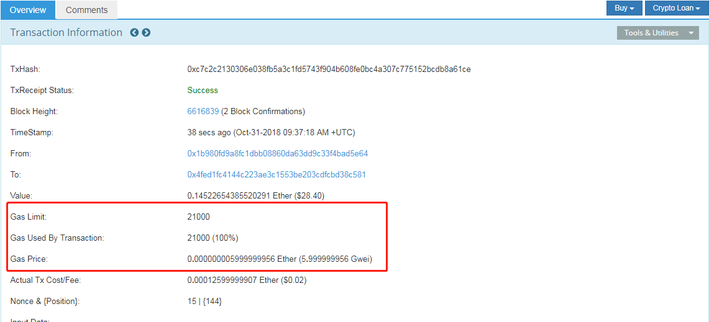
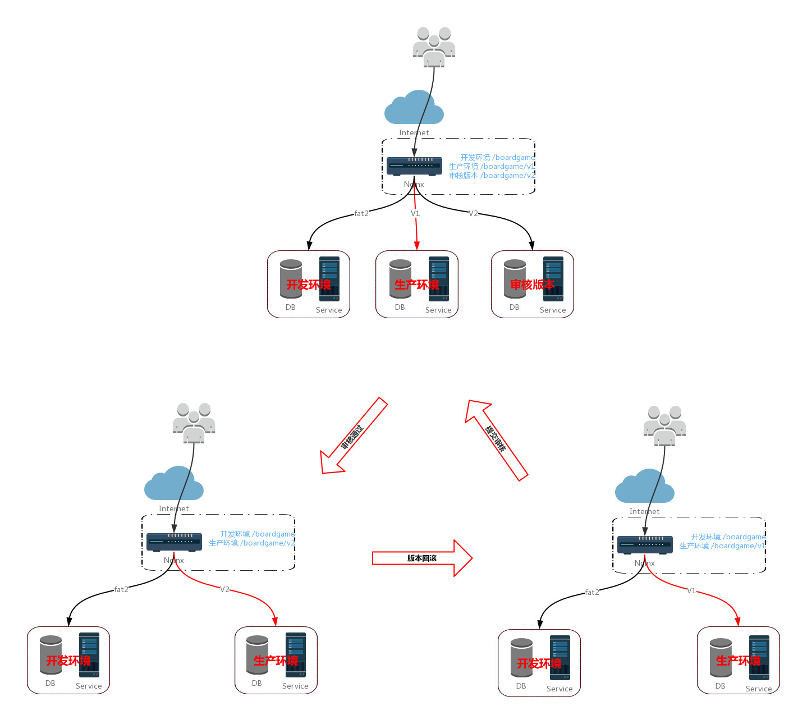

[TOC]

------

## 编程相关

### 术语

#### ACK、utACK

- `Concept ACK`

  Agree with the idea and overall direction, but haven't reviewed the code changes or tested them.

- `utACK (untested ACK)`

  Reviewed and agree with the code changes but haven't actually tested them.

- `Tested ACK`

  Reviewed the code changes and have verified the functionality or bug fix.

- `ACK`

  A loose ACK can be confusing. It's best to avoid them unless it's a documentation/comment only change in which case there is nothing to test/verify; therefore the tested/untested distinction is not there.

- `NACK`

  Disagree with the code changes/concept. Should be accompanied by an explanation.

### JavaScript

#### var、let、const 区别

- 使用 var 声明的变量，其作用域为该语句所在的函数内，且存在变量提升现象
- 使用 let 声明的变量，其作用域为该语句所在的代码块内，不存在变量提升
- 使用 const 声明的是常量，在后面出现的代码中不能再修改该常量的值

### Solidity

#### 不同合约中共享 enum

在合约 Supplier 中定义枚举

```javascript
contract Supplier {
  enum State { inactive, active, kaput }
  State constant DEFAULT_STATE = State.inactive

  State public status;

  function Supplier() {
    status = DEFAULT_STATE;
  }
}
```

在合约 Producer 中使用

```javascript
contract Producer {
  function addSupplier(Supplier _supplier) {
    require(_supplier.status() == Supplier.State.active);
  }
}
```

总结：使用时，加上枚举所在合约作为域前缀即可，例如 `Supplier.State.active`

#### 合约函数可见性修饰符

- **public** - all can access
- **external** - Cannot be accessed internally, only externally
- **internal** - only this contract and contracts deriving from it can access
- **private** - can be accessed only from this contract

#### How to get contract internal transactions?

There's not currently any way to do this using the web3 API. Internal transactions, despite the name (which isn't part of the yellowpaper; it's a convention people have settled on) aren't actual transactions, and aren't included directly in the blockchain; they're value transfers that were initiated by executing a contract.

As such, they're not stored explicitly anywhere: they're the effects of running the transaction in question on the blockchain state. Blockchain explorers like etherscan obtain them by running a modified node with an instrumented EVM, which record all the value transfers that took place as part of transaction execution, storing them separately.

### Bitcoin

#### minrelaytxfee、mintxfee

> 参考资料：https://bitcointalk.org/index.php?topic=2045575.0

- minrelaytxfee is used to define what the minimum fee should be on a transaction for your node to relay it

- mintxfee is the minimum fee that the client will *create* a transaction with

> So, if minrelaytxfee is set to 0.00001 your node will happily relay any transactions with that fee or higher (ie. yours and other peoples txes)... however, if you then set mintxfee to 0.00005, then any transaction you create will have that value as the minimum possible fee, but you'll still relay other peoples txes with fees of only 0.00001. 

#### 挖空块

##### 空块出现的原因

挖空块是因为区块的传输需要时间，比如 1M 区块现在一般需要 6 秒传完， 那矿池就有 1% 的概率（6 秒/区块间隔 600秒），在传输区块 N 的过程中又挖出了一个块。 这时候矿池就有 2 个选择： 

- 原始方案：在块 N 传输结束后，才开始在 N 的基础上挖 N+1块， 传输过程中，认为别人还没挖出 N 块，所以把自己挖出的块，也打包交易，作为 N 块广播， 当然这样自己的 N 块大概率被孤立（因为别人已经先于你打包，广播出去了） 
- 改进方案：在收到块 N 的区块头，还没传完区块数据时，就认为别人已经挖出了 N 块，开始在N的基础上挖 N+1 块， 但这就有个问题，N 块没传完，不知道别人打包了什么交易，如果 N+1 打包交易，那有可能打包到 N 块已打包的交易，就冲突了， 所以用这种提早挖 N+1 块的方法，如果在 6 秒内挖出了，那就只能打空块。 也就是说，这 6 秒的块，矿池 要么选择被孤立掉，损失 1% 产出（原始方案） 要么选择不被孤立，打空块（改进方案） 

> **利益驱动尽量不挖空块，**包含基础奖励的 12.5 BTC，但没有打包交易费的奖励（现在约 1.5 BTC） 矿池每打一个空块，就会损失 1.5 BTC 的打包手续费，所以矿池都在想尽办法，不打空块。 

##### 如何解决空块问题

因为挖空块不去打包交易，本质是为了避免打包了已经被上一个区块打包的交易导致区块无效，从而造成更大的经济损失。因此，通过精心构造一些不可能出现在上一个区块的交易即可。例如，自己找一些零散的 UTXO 来整合，和交易所合作，交易所使用端到端独家提供一些交易，这些交易不被广播，只可能出现在挖空块的矿池里，这样空块就不会“空”了。

#### Stopping Hash field in GetBlocks Message

- Node1 announces block B3, using an `inv` message with B3's gash.
- Node2 does not know about B3, or its parent B2, but does know the grandparent B1. It sends a `getblocks` message, starting from B1, but stopping at B3.
- Node1 replies with an `inv` for B2, but not with B3 or any potential successor B4 thay may have appeared.

The purpose is just avoiding sending too many hashes in case the sender already knows some successor.

> Note that since Bitcoin Core 0.10.0, getblocks is no longer used. getheaders has similar logic though.

### Ethereum

#### Can I Speed Up My Transaction?

> 可通过 [https://ethgasstation.info/](https://ethgasstation.info/) 查看最近交易的平均交易费，以及交易费对应的优先级、大概确认时间等信息。

可以通过设置高额的 `gas price` 提高交易处理的优先级，进而达到加快交易确认速度。

> You can actually choose the priority level of your transaction. Miners will “work on” and execute transactions that offer a **higher gas price**, as they’ll get to keep the fees that you pay. Therefore, they will be incentivized to prioritize transactions that have a higher Gwei.
>
> If you want your transaction to be executed at a faster speed, then you have to be willing to pay a higher gas price. You’re essentially “jumping the line”, beating everybody that paid a lower gas price. 

#### Gas/Gas Price/Gas Limit 之间的关系

 

Looking at this transaction at [Etherscan](https://etherscan.io/), we can see the breakdown of all terms associated with gas. Here’s what they mean:

**Gas Limit:** Maximum amount of gas that a user will pay for this transaction. The default amount for a standard ETH transfer is 21,000 gas

**Gas Used by Txn**: Actual amount of gas used to execute the transaction. Since this is a standard transfer, the gas used is also 21,000

**Gas Price:** Amount of ETH a user is prepared to pay for each unit of gas. The user chose to pay 8 Gwei for every gas unit, which is considered a “high priority” transaction and would be executed very fast

**Actual Tx Cost Fee:** This is the actual amount of fees that the user will pay for the transaction in Ether value (USD value is in brackets). Not bad; the user paid a total of 2 cents for his ETH to be transferred in less than 1 minutes!

In summary, the ultimate formula to calculate the amount of fees you'll end up paying for a transaction is:

`实际交易费用 = 交易实际消耗的 Gas * Gas Price`

### 数据库

#### SQL 注入

SQL 注入攻击（SQL Injection），简称注入攻击，是 Web 开发中最常见的一种安全漏洞。可以用它来从数据库获取敏感信息，或者利用数据库的特性执行添加用户，导出文件等一系列恶意操作，甚至有可能获取数据库乃至系统用户最高权限。而造成 SQL 注入的原因是因为程序没有有效过滤用户的输入，使攻击者成功的向服务器提交恶意的 SQL 查询代码，程序在接收后错误的将攻击者的输入作为查询语句的一部分执行，导致原始的查询逻辑被改变，额外的执行了攻击者精心构造的恶意代码。

假设有如下登陆表单：

```html
<form action="/login" method="POST">
<p>Username: <input type="text" name="username" /></p>
<p>Password: <input type="password" name="password" /></p>
<p><input type="submit" value="登陆" /></p>
</form>
```

登陆逻辑的 SQL 可能是这样的：

```go
username:=r.Form.Get("username")
password:=r.Form.Get("password")
sql:="SELECT * FROM user WHERE username='"+username+"' AND password='"+password+"'"
```

如果用户的输入的用户名如下，密码任意

```bash
myuser' or 'foo' = 'foo' --
```

那么我们的 SQL 就变成了如下所示

```sql
SELECT * FROM user WHERE username='myuser' or 'foo' = 'foo' --'' AND password='xxx'
```

在 SQL 里面 `--` 是注释标记，所以查询语句会在此中断。这就让攻击者在不知道任何合法用户名和密码的情况下成功登录了。

### curl

#### --data 与 --data-binary 选项

- 参数内容从标准输入读取，无差别
- 参数从文件读取，`--data` 会将回车换行符去掉，`--data-binary` 反之

### 微信小程序审核发布回退

#### 环境与分支说明

假设小程序开发分支、生产分支、提交审核（待发布）分支分别为 fat2、v1、v2，通过 Nginx 匹配 URL 实现开发、生产、审核环境的隔离。

| 环境     | git 分支 | URL 匹配前缀  | 后台服务监听端口 |
| -------- | -------- | ------------- | ---------------- |
| 开发环境 | fat2     | /boardgame    | 10000            |
| 生产环境 | v1       | /boardgame/v1 | 10001            |
| 审核版本 | v2       | /boardgame/v2 | 10002            |

#### Nginx 配置

```bash
    upstream boardgame_server {
        server 127.0.0.1:10000;
    }

    upstream boardgame_server_v1 {
        server 127.0.0.1:10001;
    }

    upstream boardgame_server_v2 {
        server 127.0.0.1:10002;
    }

    server {
        listen       443;
        listen       [::]:443;
        server_name  api.bigsillybear.com;
        root         /usr/share/nginx/html;

        ssl_certificate         "/etc/letsencrypt/live/api.bigsillybear.com/fullchain.pem";
        ssl_certificate_key     "/etc/letsencrypt/live/api.bigsillybear.com/privkey.pem";
        ssl_session_cache shared:SSL:1m;
        ssl_session_timeout  10m;
        ssl_ciphers HIGH:!aNULL:!MD5;
        ssl_prefer_server_ciphers on;

        # Load configuration files for the default server block.
        include /etc/nginx/default.d/*.conf;

        location /boardgame/v1/ {
                proxy_redirect          off;
                proxy_set_header        Host            $host;
                proxy_set_header        X-Real-IP       $remote_addr;
                proxy_set_header        X-Forwarded-For $proxy_add_x_forwarded_for;
                proxy_pass              http://boardgame_server_v1;
        }

        location /boardgame/v2 {
                proxy_redirect          off;
                proxy_set_header        Host            $host;
                proxy_set_header        X-Real-IP       $remote_addr;
                proxy_set_header        X-Forwarded-For $proxy_add_x_forwarded_for;
                proxy_pass              http://boardgame_server_v2;
        }

        location /boardgame/ {
                proxy_redirect          off;
                proxy_set_header        Host            $host;
                proxy_set_header        X-Real-IP       $remote_addr;
                proxy_set_header        X-Forwarded-For $proxy_add_x_forwarded_for;
                proxy_pass              http://boardgame_server;
        }

        error_page 404 /404.html;
            location = /40x.html {
        }

        error_page 500 502 503 504 /50x.html;
            location = /50x.html {
        }
    }
}
```

#### 审核、发布、回退流程

- 审核通过之后，将生产环境升级为 v2（如果涉及到数据库结构变更，需要先对数据库结构及其数据备份，然后升级）
- 升级到 v2 之后，如果存在重大 bug，需要对 v2 进行回滚，即，将生产环境回滚到 v1



#### 版本迭代原则

假设 V(n) 成为生产环境版本，提交审核版本为 V(n+1)，此时，V(n)、V(n+1) 即对应上图中的 v1、v2

### 哈希冲突解决

#### 开放地址法

开放地址法使用公式：`Hi=(H(key)+di) MOD m i=1,2,…,k(k<=m-1)`
其中，`m` 为哈希表的表长。`di` 是产生冲突的时候的增量序列。

- 如果 `di` 取值连续，如 `1,2,3,…m-1`，称线性探测再散列
- 如果 `di` 按绝对值取值，如 `1,-1,2,-2,4,-4,9,-9,16,-16,…k*k,-k*k(k<=m/2)`，称二次探测再散列
- 如果 `di` 取值可能为伪随机数列，称伪随机探测再散列

#### 再哈希法

有多个候选哈希函数，当发生冲突时，使用下一个哈希函数，直到无冲突

#### 链地址法（拉链法）

将所有关键字为同义词的记录存储在同一线性链表中

## 计算机组成原理

### 原码、反码、补码

> **总结：**补码的补码等于原码

- 原码

原码就是符号位加上真值的绝对值，即用第一位表示符号，其余位表示值。比如如果是 8 位二进制

> [+1]~原~ = 0000 0001
>
> [-1]~原~ = 1000 0001

第一位是符号位。因为第一位是符号位，所以 8 位二进制数的取值范围就是

> [1111 1111, 0111 1111]

即

> [-127, 127]

原码是人脑最容易理解和计算的表示方式

- 反码

反码的表示方法是：正数的反码是其本身；负数的反码是在其原码的基础上，符号位不变，其余各个位取反。

> [+1] = [00000001]~原~ = [00000001]~反~
>
> [-1] = [10000001]~原~ = [11111110]~反~

可见，如果一个反码表示的是负数，人脑无法直观的看出来它的数值。通常要将其转换成原码再计算。

- 补码

补码的表示方法是：正数的补码就是其本身；负数的补码是在其原码的基础上，符号位不变，其余各位取反，最后 +1（即在反码的基础上 +1）

> [+1] = [00000001]~原~ = [00000001]~反~ = [00000001]~补~
>
> [-1] = [10000001]~原~ = [11111110]~反~ = [11111111]~补~

对于负数，补码表示方式也是人脑无法直观看出其数值的。通常也需要转换成原码再计算其数值。

## 计算机网络

###  `MSL`

概念：`MSL`，`Maximum Segment Lifetime`，报文最长存活时间，是任何报文在网络上存在的最长时间，超过这个时间报文将被丢弃。

`2 MSL` 即两倍的 `MSL`，TCP 的 `TIME_WAIT` 状态也称为 `2 MSL` 等待状态，当 TCP 的一端发起主动关闭，在发出最后一个`ACK` 包后，即第 3 次握手完成后发送了第四次握手的 `ACK` 包后就进入了 `TIME_WAIT` 状态，必须在此状态上停留两倍的 `MSL` 时间，等待 `2 MSL` 时间主要目的是怕最后一个  `ACK` 包对方没收到，那么对方在超时后将重发第三次握手的 `FIN` 包，主动关闭端接到重发的 `FIN` 包后可以再发一个 `ACK` 应答包。在 `TIME_WAIT` 状态时两端的端口不能使用，要等到 `2 MSL` 时间结束才可继续使用。当连接处于 `2 MSL` 等待阶段时任何迟到的报文段都将被丢弃。在实际应用中可以通过设置 `SO_REUSEADDR` 选项达到不必等待 `2 MSL` 时间结束再使用此端口。`RFC 793` 中规定 `MSL` 为2分钟，实际应用中常用的是 30 秒，1 分钟和 2 分钟等。

###  `TTL`

概念：`TTL`，`time to live`，生存时间，IP 数据报包含 `TTL` 字段，这个生存时间是由源主机设置初始值但不是存的具体时间，而是存储了一个 IP 数据报可以经过的最大路由数，每经过一个处理它的路由器此值就减 1，当此值为 0 则数据报将被丢弃，同时发送 `ICMP` 报文通知源主机。

### `TCP_NODELAY`

`Nagle` 化在这里的含义是采用 `Nagle` 算法把较小的包组装为更大的帧。 John Nagle 是 `Nagle` 算法的发明人，后者就是用他的名字来命名的，他在 1984 年首次用这种方法来尝试解决福特汽车公司的网络拥塞问题（欲了解详情请参看 IETF RFC 896）。他解决的问题就是所谓的 `silly window syndrome`，中文称“愚蠢窗口症候群”，具体含义是，因为普遍终端应用程序每产生一次击键操作就会发送一个包，而典型情况下一个包会拥有一个字节的数据载荷以及 40 个字节长的包头，于是产生 4000% 的过载，很轻易地就能令网络发生拥塞。 `Nagle` 化后来成了一种标准并且立即在因特网上得以实现。它现在已经成为缺省配置了，但在我们看来，有些场合下把这一选项关掉也是合乎需要的。

现在让我们假设某个应用程序发出了一个请求，希望发送小块数据。我们可以选择立即发送数据或者等待产生更多的数据然后再一次发送两种策略。如果我们马上发送数据，那么交互性的以及客户/服务器型的应用程序将极大地受益。如果请求立即发出那么响应时间也会快一些。以上操作可以通过设置套接字的 `TCP_NODELAY` 选项来完成，这样就禁用了 `Nagle` 算法。

> - 在 C++ 中，可以通过 `setsockopt` 启用 `TCP_NODELAY`
>
> ```cpp
> static void _set_tcp_nodelay(int fd) {
> 	int enable = 1;
> 	setsockopt(fd, IPPROTO_TCP, TCP_NODELAY, (void*)&enable, sizeof(enable));
> }
> ```
>
> - 在 Java 中，Socket 对象上有一个 `setTcpNoDelay` 的方法，直接设置成 true 即可

## 数据通信

### 单工、半双工、全双工

> 根据数据信息在传输线上的传送方向，数据通信方式分为单工通信 半双工通信和全双工通信 3 种。

- 单工通信

数据信息在通信线上始终向一个方向传输，数据信息永远从发送端传输到接收端，任何时候都不能改变信号的传输方向。例如，计算机发送打印数据给打印机，打印机只能从计算机接收数据信息，不能进行相反方向的信息传输。

- 半双工通信

数据信息可以双向传输，但必须交替进行，同一时刻只允许信号在**一个信道**上单向传输。半双工通信要求两端都具有发送装置和接受装置，因此，半双工通信实际上是一种可切换方向的单工通信。例如，对讲机通信就是典型的半双工通信方式，由于对讲机传送和接收使用相同的频率，在一方讲话的时候另一方不能讲话（只能听），但双方可以交互切换模式（讲或听）。

- 全双工通信

全双工通信允许数据同时在两个方向的传输，即有**两个信道**，可同时进行双向的数据传输。全双工通信是两个单工通信的结合，要求收发双方都有独立的接收和发送能力。全双工通信效率高，控制简单，但造价高。例如，计算机之间的通信是全双工方式。

## 社会经济学

### 马太效应

> 马太效应的名字就来源于圣经《新约·马太福音》中的一则寓言：从前，一个国王要出门远行，临行前，交给 3个仆人每人一锭银子，吩咐道:“你们去做生意，等我回来时，再来见我。”国王回来时，第一个仆人说:“主人，你交给我的一锭银子，我已赚了 10 锭。”于是，国王奖励他 10 座城邑。第二个仆人报告:“主人，你给我的一锭银子，我已赚了 5 锭。”于是，国王奖励他 5 座城邑。第三仆人报告说:“主人，你给我的 1 锭银子，我一直包在手帕里，怕丢失，一直没有拿出来。”于是，国王命令将第三个仆人的1锭银子赏给第一个仆人，说:“凡是少的，就连他所有的，也要夺过来。凡是多的，还要给他，叫他多多益善。”这就是“马太效应”，反映当今社会中存在的一个普遍现象，即赢家通吃 。

马太效应 `Matthew Effect`，指强者愈强、弱者愈弱的现象，广泛应用于社会心理学、教育、金融以及科学领域。马太效应，是社会学家和经济学家们常用的术语，反映的社会现象是两极分化，富的更富，穷的更穷。
马太效应，名字来自圣经《新约·马太福音》一则寓言： “凡有的，还要加倍给他叫他多余；没有的，连他所有的也要夺过来”。表面看起来“马太效应”与“平衡之道”相悖，与“二八定则”类似，但是实则它只不过是“平衡之道”的一极。

## 语言学

### 逻辑自洽

逻辑自洽 `logic self-consistency`，指的是一个语言学的原则，即一个理论在语言本身的陈述上是不矛盾的，人们通过仔细分析这个理论的文字符号，没有发现任何的矛盾，达到了自我的完备。

逻辑的英文是 `logic`，其中 `log` 是语言的意思，所以 `logic` 就是“语言的规则”，或者说“语言的可分析性”。因此“逻辑自洽”其实是一个语言学的原则，即一个理论在语言本身的陈述上是不矛盾的，人们通过仔细分析这个理论的文字符号，没有发现任何的矛盾，达到了自我的完备。“逻辑”是一种语言上的可证伪性，人们不用借助实验，仅仅依靠分析语言陈述和符号结构就可以对一个理论进行证伪，**因此“逻辑”是科学理论的思维基础，“逻辑自洽”是科学理论成立的基本前提**。

> 任何一种科学学说之所以能被称之为科学，是因为它具有可证伪性。“逻辑自洽”是科学理论成立的必要条件，需要通过实践来检验其正确性。