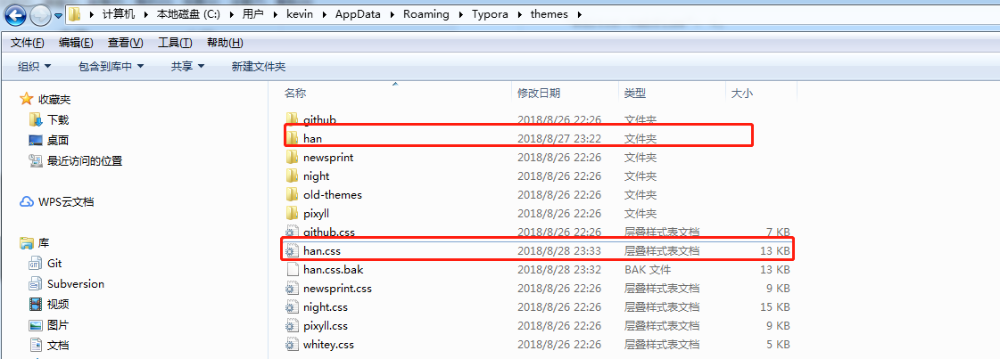
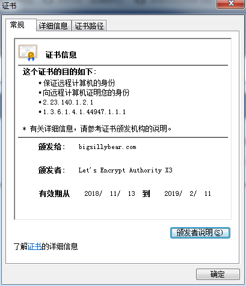
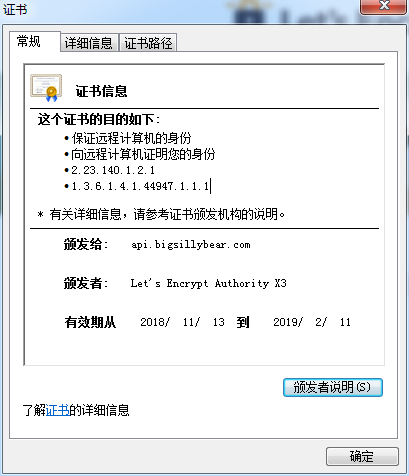
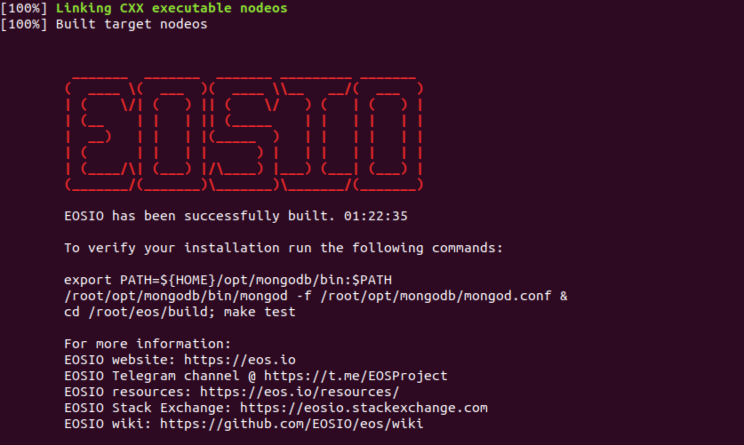
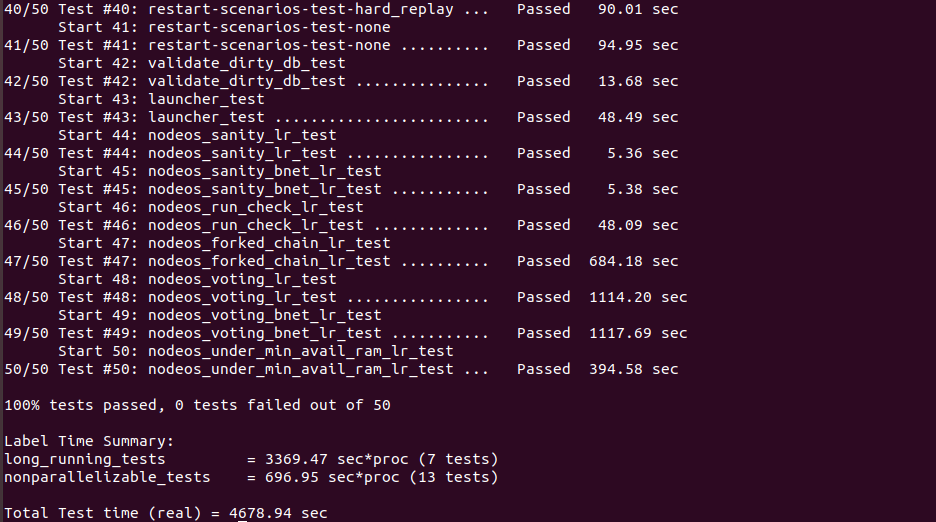
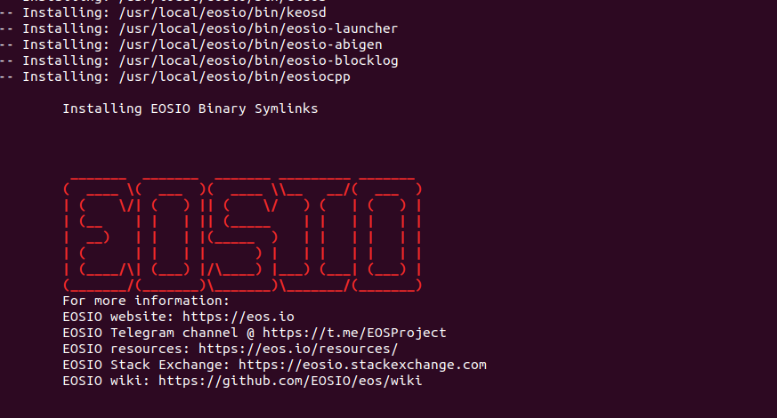
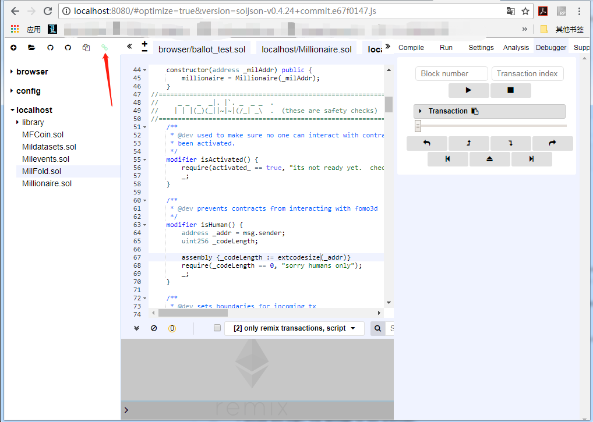
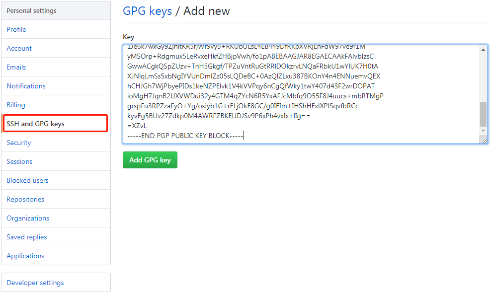
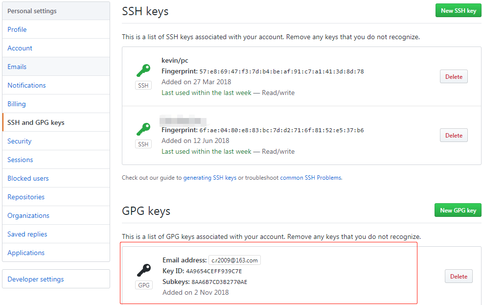

[TOC]

------

##  Git 客户端基本配置项

```bash
# 执行方式：命令行执行即可
# 提交/检出 不转换
git config --global core.autocrlf false
# 拒绝提交包含混合换行符的文件
git config --global core.safecrlf true
git config --global alias.st status
git config --global alias.co checkout
git config --global alias.ct commit
git config --global alias.df diff
git config --global alias.br branch
git config --global color.ui true
git config --global alias.lg "log --color --graph --pretty=format:'%Cred%h%Creset %C(bold blue)<%an>%Creset ---%C(yellow)%d%Creset %s %Cgreen(%cr)' --abbrev-commit"
# 指定 vim 作为默认的编辑器
git config core.editor vim --global
git config --global user.name xx
git config --global user.email xx@xxx.cn
```

## Git .gitignore

```bash
# From https://github.com/github/gitignore

# Prerequisites
*.d

# Compiled Object files
*.slo
*.lo
*.o
*.obj

# Precompiled Headers
*.gch
*.pch

# Compiled Dynamic libraries
*.so
*.dylib
*.dll

# Fortran module files
*.mod
*.smod

# Compiled Static libraries
*.lai
*.la
*.a
*.lib

# Executables
*.exe
*.out
*.app

# CMake
CMakeCache.txt
CMakeFiles
CMakeScripts
Testing
Makefile
cmake_install.cmake
install_manifest.txt
compile_commands.json
CTestTestfile.cmake

# Config
*.conf

# Log
log/
*.log

# Generated binary file/directory
debug/
release/
bin/
debug
```

## VIM 基础配置

> **VIM 配置文件位置：**~/.vimrc
>
> **点此下载：**[vimrc](https://dudebing99.github.io/blog/archives/config/vimrc)（下载后重命名为 .vimrc）

```bash
set nocompatible
set backspace=indent,eol,start
set incsearch
set number
set hlsearch
set ignorecase
set tabstop=4
set shiftwidth=4
set softtabstop=4
set expandtab
set fileencodings=utf-8,gbk
set relativenumber " show relative line number
set ruler          " show the current line number and column number
set showcmd        " show the current typing command
set scrolloff=7    " Set 7 lines to the cursor - when moving vertically using j/k
set encoding=utf-8
set fileencodings=utf-8,ucs-bom,cp936,gb18030,big5,euc-jp,euc-kr,latin1
set helplang=en
set termencoding=utf-8
set laststatus=2
set cursorline

set guifont=Courier_New:h14:cANSI
set history=9999
set selection=exclusive
set selectmode=mouse,key
set fillchars=vert:\ ,stl:\ ,stlnc:\
set showmatch
set matchtime=1
set linebreak
set colorcolumn=100
set wrap
set tw=100

let mapleader = "\<Space>"
nmap <Leader><Leader> V
nnoremap <Leader>w :wq!<CR> "save file"
nmap <leader><Space><Space> :%s/\s\+$//<CR> "trimTrailingWhitespace"

" 自动补全 "
" inoremap ( ()<ESC>i<CR><CR><ESC>k
" inoremap [ []<ESC>i<CR><CR><ESC>k
" inoremap { {}<ESC>i<CR><CR><ESC>k
" inoremap " ""<ESC>i
" inoremap ' ''<ESC>i
" inoremap /* /* */<ESC>i

imap jj <ESC>
```

## VS Code 基础配置

> **入口：**文件 -> 首选项 -> 配置
>
> **备注：**前两个配置项根据实际情况设置

```json
{
    "go.gopath": "d:\\go",
    "terminal.integrated.shell.windows": "C:\\Program Files\\Git\\bin\\bash.exe",
    "editor.wordWrapColumn": 100,
    "files.eol": "\n",
    "editor.insertSpaces": true,
    "editor.tabSize": 4,
    "files.trimTrailingWhitespace": true,
    "files.autoSave": "afterDelay",
    "editor.formatOnSave": true,
    "editor.formatOnPaste": true,
    "explorer.confirmDelete": true,
    "editor.detectIndentation": true,
    "team.showWelcomeMessage": false,
    "python.linting.flake8Enabled": true,
    "files.autoGuessEncoding": true
}
```

## VS Code 快捷键

- 打开命令面板：`Ctrl Alt P`
- 查找文件：`Ctrl P`
- 结构导航：`Alt N`
- 跳转到指定行：`Alt G`
- 查找：`Ctrl F`
- 替换：`Ctrl H`
- 放大/缩小：`Ctrl +`/`Ctrl -`

## VS Code 插件

###  EditorConfig for Visual Studio Code

> 设置文件编码、换行、去除行末空白、Tab 等

1. 安装插件
2. 项目文件夹根目录创建这个文件 `.editorconfig`，内容如下

```bash
root = true

[*]
charset = utf-8
indent_style = space
indent_size = 4
end_of_line = lf
insert_final_newline = true
trim_trailing_whitespace = true
```

### Clang-Format

1. 安装插件
2. 设置编码风格（以谷歌编码风格为例，可以个性化调整）

在 `setting.json` 中添加如下配置项即可

```bash
"C_Cpp.clang_format_fallbackStyle": "{BasedOnStyle: Google, IndentWidth: 4, ColumnLimit: 0 , AlignConsecutiveAssignments: true}",
```

## Typora Han 主题配置

在 Typora 主题配置目录新建 `han`，将如下内容保存为 `han.css`，[点此下载](https://dudebing99.github.io/blog/archives/config/han.css)，目录如下所示



```scss
@charset "utf-8";

:root {
  --active-file-bg-color: #dadada;
  --active-file-bg-color: rgba(32, 43, 51, 0.63);
  --active-file-text-color: white;
  --bg-color: #fff;
  --text-color: #333;
  --side-bar-bg-color: #f5f5f5;
  --control-text-color: #666;
}

/* 防止用户自定义背景颜色对网页的影响，添加让用户可以自定义字体 */
html {
  color: #333;
  background: #fff;
  -webkit-text-size-adjust: 100%;
  -ms-text-size-adjust: 100%;
  text-rendering: optimizelegibility;
  font-size: 14px;
  -webkit-font-smoothing: initial;
}

#write {
  max-width: 960px;
  padding-top: 2em;
  padding-left: 60px;
  padding-right: 60px;
  min-height: calc(100vh - 6em);
  -webkit-font-smoothing: antialiased;
  font-size: 16px;
}

.typora-node #write {
  min-height: calc(100% - 6em);
}

pre.md-meta-block {
  background: #f5f5f5;
  padding: 1em;
  border-radius: 3px;
  font-size: 14px;
}

@media screen and (max-width: 800px) {
    html {
      font-size: 14px;
    }

    #write {
      padding-left: 30px;
      padding-right: 30px;
      font-size: 14px;
    }
}

@media screen and (min-width: 1100px) {
    body, #footer-word-count-info {
      background: #f5f5f5;
    }

    body.pin-outline,
    .pin-outline #footer-word-count-info,
    .pin-outline footer {
      background: #fff;
    }

    #write {
      max-width: 1000px;
      padding: 40px 60px;
      background: #fff;
      margin: 3em auto 3em;
      border: 1px solid #ddd;
      border-width: 0 1px;
    }

    .pin-outline #write {
      max-width: 1000px;
      background: #fff;
      margin: 0 0 0;
      border: 0;
      padding-left: 60px;
      padding-right: 60px;
    }

    footer {
      background-color: transparent;
    }
}

@media screen and (min-width: 1300px) {
    body.pin-outline,
    .pin-outline #footer-word-count-info,
    .pin-outline footer {
      background: #f5f5f5;
    }

    .pin-outline  #write {
      max-width: 1000px;
      padding: 40px 60px;
      background: #fff;
      margin: 3em auto 3em;
      border: 1px solid #ddd;
      border-width: 0 1px;
    }

    .pin-outline footer {
      background-color: transparent;
    }

    #footer-word-count-info {
      background: #f5f5f5;
    }
}


/* 如果你的项目仅支持 IE9+ | Chrome | Firefox 等，推荐在 <html> 中添加 .borderbox 这个 class */
html.borderbox *, html.borderbox *:before, html.borderbox *:after {
  -moz-box-sizing: border-box;
  -webkit-box-sizing: border-box;
  box-sizing: border-box;
}

/* 内外边距通常让各个浏览器样式的表现位置不同 */
body, dl, dt, dd, ul, ol, li, h1, h2, h3, h4, h5, h6, code, form, fieldset, legend, input, textarea, p, blockquote, th, td, hr, button, article, aside, details, figcaption, figure, footer, header, menu, nav, section {
  margin: 0;
  padding: 0;
}

/* 重设 HTML5 标签, IE 需要在 js 中 createElement(TAG) */
article, aside, details, figcaption, figure, footer, header, menu, nav, section {
  display: block;
}

/* HTML5 媒体文件跟 img 保持一致 */
audio, canvas, video {
  display: inline-block;
}

/* 要注意表单元素并不继承父级 font 的问题 */
body, button, input, select, textarea {
  font: 300 1em/1.8 "PingFang SC", "Lantinghei SC", "Microsoft Yahei", "Hiragino Sans GB", "Microsoft Sans Serif", "WenQuanYi Micro Hei", sans;
}

body {
  font-family: "PingFang SC", "Lantinghei SC", "Microsoft Yahei", "Hiragino Sans GB", "Microsoft Sans Serif", "WenQuanYi Micro Hei", sans;
}

h1, h2, h3, h4, h5, h6 {
  font-family: "TimesNewRomanPS-ItalicMT", "PingFang SC", "Lantinghei SC", "Microsoft Yahei", "Hiragino Sans GB", "Microsoft Sans Serif", "WenQuanYi Micro Hei", sans;
  /*font-family: "PingFang SC", "Lantinghei SC", "Microsoft Yahei", "Hiragino Sans GB", "Microsoft Sans Serif", "WenQuanYi Micro Hei", sans;*/
  -webkit-font-smoothing: initial;
  font-weight: 100;
  color: var(--text-color);
  line-height: 1.35; 
  font-variant-numeric: lining-nums;
  margin-bottom: 1em;
}

em {
  font-family: Georgia-Italic, STSongti-SC-Light, serif;
}

strong em,
em strong {
  font-family: Georgia-BoldItalic, STSongti-SC-Regular, serif;
}

button::-moz-focus-inner,
input::-moz-focus-inner {
  padding: 0;
  border: 0;
}

/* 去掉各Table cell 的边距并让其边重合 */
table {
  border-collapse: collapse;
  border-spacing: 0;
}

/* 去除默认边框 */
fieldset, img {
  border: 0;
}

/* 块/段落引用 */
blockquote {
  position: relative;
  color: #999;
  font-weight: 400;
  border-left: 1px solid #1abc9c;
  padding-left: 1em;
  margin: 1em 3em 1em 2em;
}

@media only screen and ( max-width: 640px ) {
  blockquote {
    margin: 1em 0;
  }
}

/* Firefox 以外，元素没有下划线，需添加 */
acronym, abbr {
  border-bottom: 1px dotted;
  font-variant: normal;
}

/* 添加鼠标问号，进一步确保应用的语义是正确的（要知道，交互他们也有洁癖，如果你不去掉，那得多花点口舌） */
abbr {
  cursor: help;
}

address, caption, cite, code, dfn, th, var {
  font-style: normal;
  font-weight: 400;
}

/* 去掉列表前的标识, li 会继承，大部分网站通常用列表来很多内容，所以应该当去 */
ul, ol {
  list-style: none;
}

/* 对齐是排版最重要的因素, 别让什么都居中 */
caption, th {
  text-align: left;
}

q:before, q:after {
  content: '';
}

/* 统一上标和下标 */
sub, sup {
  font-size: 75%;
  line-height: 0;
  position: relative;
}

:root sub, :root sup {
  vertical-align: baseline; /* for ie9 and other modern browsers */
}

sup {
  top: -0.5em;
}

sub {
  bottom: -0.25em;
}

/* 让链接在 hover 状态下显示下划线 */
a {
  color: #1abc9c;
}

a:hover {
  text-decoration: underline;
}

#write a {
  border-bottom: 1px solid #1abc9c;
}

#write a:hover {
  border-bottom-color: #555;
  color: #555;
  text-decoration: none;
}

/* 默认不显示下划线，保持页面简洁 */
ins, a {
  text-decoration: none;
}

/* 标记，类似于手写的荧光笔的作用 */
mark {
  background: #fffdd1;
  border-bottom: 1px solid #ffedce;
  padding: 2px;
  margin: 0 5px;
}

/* 代码片断 */
pre, code, pre tt {
  font-family: Courier, 'Courier New', monospace;
}

#write .md-fences {
  border: 1px solid #ddd;
  padding: 1em 0.5em;
  display: block;
  -webkit-overflow-scrolling: touch;
}

/* 一致化 horizontal rule */
hr {
  border: none;
  border-bottom: 1px solid #cfcfcf;
  margin-bottom: 0.8em;
  height: 10px;
}

#write strong {
  font-weight: 900;
  color:#383838;
  /*font-weight: bloder;
  /*color: #000;*/
}

.code-tooltip.md-hover-tip strong {
  color: white;
}

/* 保证块/段落之间的空白隔行 */
#write p, #write .md-fences, #write ul, #write ol, #write dl, #write form, #write hr, #write figure,
#write-p, #write-pre, #write-ul, #write-ol, #write-dl, #write-form, #write-hr, #write-table, blockquote {
  margin-bottom: 1.2em
}

html {
  font-family: PingFang SC, Verdana, Helvetica Neue, Microsoft Yahei, Hiragino Sans GB, Microsoft Sans Serif, WenQuanYi Micro Hei, sans-serif;
}

/* 标题应该更贴紧内容，并与其他块区分，margin 值要相应做优化 */
#write h1, #write h2, #write h3, #write h4, #write h5, #write h6,
#write-h1, #write-h2, #write-h3, #write-h4, #write-h5, #write-h6 {
  margin-top: 1.2em;
  margin-bottom: 0.6em;
  line-height: 1.35;
  color: #000;
}

#write h1, #write-h1 {
  font-size: 2.4em;
  padding-bottom: 1em;
  border-bottom: 3px double #eee;
}

#write h2, #write-h2 {
  font-size: 1.8em;
}

#write h3, #write-h3 {
  font-size: 1.6em;
}

#write h4, #write-h4 {
  font-size: 1.4em;
}

#write h5, #write h6, #write-h5, #write-h6 {
  font-size: 1.2em;
}

/* 在文章中，应该还原 ul 和 ol 的样式 */
#write ul, #write-ul {
  margin-left: 1.3em;
  list-style: disc;
}

#write ol, #write-ol {
  list-style: decimal;
  margin-left: 1.9em;
}

#write li ul, #write li ol, #write-ul ul, #write-ul ol, #write-ol ul, #write-ol ol {
  margin-bottom: 0.8em;
  margin-left: 2em;
}

#write li ul, #write-ul ul, #write-ol ul {
  list-style: circle;
}

#write table th, #write table td {
  border: 1px solid #ddd;
  padding: 0.5em 1em;
  color: #666;
}

#write table .md-table-edit th {
  border: none;
  padding: 0;
  color: inherit;
}

#write table th, #write-table th {
  background: #fbfbfb;
}

#write table thead th, #write-table thead th {
  background: #f1f1f1;
}

#write table caption {
  border-bottom: none;
}

#write em {
  font-weight: inherit;
  font-style: inherit;
}

li>p {
    margin-bottom: 0 !important;
}

/* Responsive images */
#write img {
  max-width: 100%;
}

a.md-toc-inner {
    border-bottom: 0 !important;
}

.md-toc-h1:first-of-type:last-of-type{
  display: none;
}

.md-toc {
  font-size: inherit;
}

.md-toc-h1 .md-toc-inner {
  font-weight: normal;
}

.md-table-edit th {
  padding: 0 !important;
  border: 0 !important;
}

.mac-seamless-mode #write {
  min-height: calc(100vh - 6em - 20px);
}

.typora-quick-open-item.active {
    color: var(--active-file-text-color);
}

*.in-text-selection, ::selection {
    background: var(--active-file-bg-color);
    text-shadow: none;
    color: white;
}

.btn-primary {
    background-color: #2d2d2d;
    border-color: #020202;
}

.btn-primary:hover, .btn-primary:focus, .btn-primary.focus, .btn-primary:active, .btn-primary.active, .open > .dropdown-toggle.btn-primary {
    background-color: #4e4c4e;
    border: #4e4c4e;
}

#preference-dialog .modal-content{
  background: #6e757a;
  --bg-color: #6e757a;
  --text-color: #f1f1f1;
  color: #f1f1f1;
}

#typora-source,
.typora-sourceview-on  {
  --bg-color: #eee;
  background: #eee;
}

.cm-s-typora-default .cm-header, .cm-s-typora-default .cm-property {
    color: #116098;
}

.cm-s-typora-default .cm-link {
    color: #11987d;
}

.cm-s-typora-default .cm-em {
  font-family: Georgia-Italic, STSongti-SC-Light, serif;
  color: #6f6400;
}

.cm-s-typora-default .cm-em{
    color: rgb(0, 22, 45);
}

.CodeMirror.cm-s-typora-default div.CodeMirror-cursor{
    border-left: 3px solid #6e757a;
}

.cm-s-typora-default .CodeMirror-selectedtext,
.typora-sourceview-on .CodeMirror-focused .CodeMirror-selected {
    background: #6e757a;
    color: white;
}

.file-node-icon.fa.fa-folder:before {
  color: rgba(32, 43, 51, 0.49);
}

#preference-dialog .megamenu-menu-panel h1 {
  margin-bottom: 1em;
}

::-webkit-scrollbar-corner {
  display: none;
  background: transparent;
}

.cm-s-inner {
  background-color: #263238;
  color: rgba(233, 237, 237, 1);
}
.cm-s-inner .CodeMirror-gutters {
  background: #263238;
  color: rgb(83,127,126);
  border: none;
}
.cm-s-inner .CodeMirror-guttermarker, .cm-s-inner .CodeMirror-guttermarker-subtle, .cm-s-inner .CodeMirror-linenumber { color: rgb(83,127,126); }
.cm-s-inner .CodeMirror-cursor { border-left: 1px solid #f8f8f0; }
.cm-s-inner div.CodeMirror-selected { background: rgba(255, 255, 255, 0.15); }
.cm-s-inner.CodeMirror-focused div.CodeMirror-selected { background: rgba(255, 255, 255, 0.10); }
.cm-s-inner .CodeMirror-line::selection, .cm-s-inner .CodeMirror-line > span::selection, .cm-s-inner .CodeMirror-line > span > span::selection { background: rgba(255, 255, 255, 0.10); }
.cm-s-inner .CodeMirror-line::-moz-selection, .cm-s-inner .CodeMirror-line > span::-moz-selection, .cm-s-inner .CodeMirror-line > span > span::-moz-selection { background: rgba(255, 255, 255, 0.10); }

.cm-s-inner .CodeMirror-activeline-background { background: rgba(0, 0, 0, 0); }
.cm-s-inner .cm-keyword { color: rgba(199, 146, 234, 1); }
.cm-s-inner .cm-operator { color: rgba(233, 237, 237, 1); }
.cm-s-inner .cm-variable-2 { color: #80CBC4; }
.cm-s-inner .cm-variable-3 { color: #82B1FF; }
.cm-s-inner .cm-builtin { color: #DECB6B; }
.cm-s-inner .cm-atom { color: #F77669; }
.cm-s-inner .cm-number { color: #F77669; }
.cm-s-inner .cm-def { color: rgba(233, 237, 237, 1); }
.cm-s-inner .cm-string { color: #C3E88D; }
.cm-s-inner .cm-string-2 { color: #80CBC4; }
.cm-s-inner .cm-comment { color: #546E7A; }
.cm-s-inner .cm-variable { color: #82B1FF; }
.cm-s-inner .cm-tag { color: #80CBC4; }
.cm-s-inner .cm-meta { color: #80CBC4; }
.cm-s-inner .cm-attribute { color: #FFCB6B; }
.cm-s-inner .cm-property { color: #80CBAE; }
.cm-s-inner .cm-qualifier { color: #DECB6B; }
.cm-s-inner .cm-variable-3 { color: #DECB6B; }
.cm-s-inner .cm-tag { color: rgba(255, 83, 112, 1); }
.cm-s-inner .cm-error {
  color: rgba(255, 255, 255, 1.0);
  background-color: #EC5F67;
}
.cm-s-inner .CodeMirror-matchingbracket {
  text-decoration: underline;
  color: white !important;
}

/**apply to code fences with plan text**/
.md-fences {
  background-color: #263238;
  color: rgba(233, 237, 237, 1);
  border: none;
}

.md-fences .code-tooltip {
  background-color: #263238;
}
```

## Makefile 模板

```bash
INCLUDES := -I. -I./include -I/opt/Ice-3.5.1/include
LIBS := -Wl,--enable-new-dtags -Wl,-rpath,/opt/Ice-3.5/lib64
LIBS += -Wl,-Bstatic  -L./lib -lcpp_redis -ltacopie
LIBS += -Wl,-Bdynamic -L/opt/Ice-3.5.1/lib64 -lIce -lIceUtil

CXX := g++ -std=c++11
CXXFLAGS := -rdynamic -m64 -Wall -Wextra -pthread -fPIC -g $(INCLUDES)
# 把所有警告当做错误：-Werror，支持 C++ 11：-std=c++11
CXXFLAGS +=  -Werror -std=c++11

TARGETS := server
TARGETS += client

all: $(TARGETS)

db.cpp db.h: db.ice
	slice2cpp $^

server: db.o dbi.o server.o
	$(CXX) -o $@ $^ $(LIBS)

client: db.o dbi.o client.o
	$(CXX) -o $@ $^ $(LIBS)

clean:
	rm -f *.o $(TARGETS)
```
## CentOS 安装配置 vsftpd

### 授权用户访问模式

```bash
0. 运行环境：Cent OS 6.8/vsftpd 2.2.2

1. 安装配置vsftpd
yum install vsftpd ftp -y
chkconfig vsftpd on

2. 添加用户
> useradd -d /home/ftp -g ftp -s /sbin/nologin XXXftp -p XXX123!
> passwd XXXftp

3. 修改配置 /etc/vsftpd/vsftpd.conf
anonymous_enable=NO
local_enable=YES
write_enable=YES
local_umask=022
dirmessage_enable=YES
xferlog_enable=YES
connect_from_port_20=YES
xferlog_std_format=YES
ftpd_banner=Welcome to FTP service.
listen=YES

pam_service_name=vsftpd
userlist_enable=YES
userlist_deny=NO
tcp_wrappers=YES
download_enable=YES
# 限速 500KByte
local_max_rate=500000

4. 修改配置文件 /etc/vsftpd/user_list
# vsftpd userlist
# If userlist_deny=NO, only allow users in this file
# If userlist_deny=YES (default), never allow users in this file, and
# do not even prompt for a password.
# Note that the default vsftpd pam config also checks /etc/vsftpd/ftpusers
# for users that are denied.
#root
#bin
#daemon
#adm
#lp
#sync
#shutdown
#halt
#mail
#news
#uucp
#operator
#games
#nobody
XXXftp

5. 防火墙开放 21 端口
6. 启动服务 service vsftpd start
7. 验证
> ftp ftp.xxx.cn
Connected to ftp.xxx.cn (xxx.xxx.xxx.xxx).
220 (vsFTPd 2.2.2)
Name (ftp.xxx.cn:kevin): XXXftp
331 Please specify the password.
Password:
230 Login successful.
Remote system type is UNIX.
Using binary mode to transfer files.
```
### 匿名用户访问模式
```bash
0. 运行环境：Cent OS 6.8/vsftpd 2.2.2

1. 安装配置vsftpd
yum install vsftpd ftp -y
chkconfig vsftpd on

2. 修改配置文件
anonymous_enable=YES
local_enable=YES
local_umask=022
write_enable=YES
dirmessage_enable=YES
xferlog_enable=YES
chown_uploads=NO
xferlog_std_format=YES
chroot_local_user=NO
listen=YES

userlist_enable=YES
anon_umask=022
anon_upload_enable=YES
anon_mkdir_write_enable=YES
anon_other_write_enable=YES

pam_service_name=vsftpd

connect_from_port_20=YES
tcp_wrappers=YES

pasv_enable=YES
pasv_min_port=30000
pasv_max_port=31000

3. 开启防火墙 /etc/sysconfig/iptables
-A INPUT -p tcp -m multiport --dport 20,21  -m state --state NEW -j ACCEPT
-A INPUT -p tcp -m state --state NEW -m tcp --dport 21 -j ACCEPT
-A INPUT -p tcp --dport 30000:31000 -j ACCEPT
```

## CentOS 安装配置 Apache Tomcat 9，支持 http2

```bash
#!/bin/sh

PWD=`pwd`
ROOT=$PWD

echo "install gcc"
yum install gcc -y

echo "install expect"
yum install expect -y

echo "yum install curl"
yum install curl -y

echo "install jdk"
tar -zxvf jdk-8u111-linux-x64.tar.gz
mv jdk1.8.0_111/ /usr/local

cat >> /etc/profile << EOF
#add jdk related environment variables
JAVA_HOME=/usr/local/jdk1.8.0_111
CLASSPATH=.:\$JAVA_HOME/jre/lib/rt.jar:\$JAVA_HOME/lib/dt.jar:\$JAVA_HOME/lib/tools.jar
JRE_HOME=\$JAVA_HOME/jre

export JAVA_HOME=\$JAVA_HOME
export CLASSPATH=\$CLASSPATH
export JRE_HOME=\$JRE_HOME
export PATH=\$PATH:\$JAVA_HOME/bin
EOF

echo "set env temporary"
JAVA_HOME=/usr/local/jdk1.8.0_111
CLASSPATH=.:$JAVA_HOME/jre/lib/rt.jar:$JAVA_HOME/lib/dt.jar:$JAVA_HOME/lib/tools.jar
JRE_HOME=$JAVA_HOME/jre
export JAVA_HOME=$JAVA_HOME
export CLASSPATH=$CLASSPATH
export JRE_HOME=$JRE_HOME
export PATH=$PATH:$JAVA_HOME/bin

echo "install apr"
tar -xzvf apr-1.5.2.tar.gz
cd apr-1.5.2
./configure --prefix=/usr/local/apr
make -j4
make install
cd -
rm -rf apr-1.5.2

echo "install apr-util"
tar -xzvf apr-util-1.5.4.tar.gz
cd apr-util-1.5.4
./configure --prefix=/usr/local/apr-util --with-apr=/usr/local/apr
make -j4
make install
cd -
rm -rf apr-util-1.5.4

echo "install openssl"
tar -xzvf openssl-1.0.2h.tar.gz
cd openssl-1.0.2h
./config shared --prefix=/usr/local/openssl
make depend
make -j4
make install
cd -
rm -rf openssl-1.0.2h

echo "install apache tomcat"
tar -xzvf apache-tomcat-9.0.0.M17.tar.gz
mv apache-tomcat-9.0.0.M17 /usr/local
cd /usr/local/apache-tomcat-9.0.0.M17/bin
tar -xzvf tomcat-native.tar.gz
cd tomcat-native-1.2.10-src/native
./configure --prefix=/usr/local/native --with-apr=/usr/local/apr --with-ssl=/usr/local/openssl
make -j4
make install

cat >> /etc/profile << EOF
#add native related environment variables
NATIVE_HOME=/usr/local/native

export NATIVE_HOME=\$NATIVE_HOME
export LD_LIBRARY_PATH=\$LD_LIBRARY_PATH:\$NATIVE_HOME/lib
EOF

NATIVE_HOME=/usr/local/native
export NATIVE_HOME=$NATIVE_HOME
export LD_LIBRARY_PATH=$LD_LIBRARY_PATH:$NATIVE_HOME/lib

echo "gen cert related"
mkdir $ROOT/cert
cd $ROOT/cert
openssl genrsa -out server.key 2048
openssl rsa -in server.key -out server.key

cat > gen_cert.sh << EOF
#!/usr/bin/expect -f

set timeout 30

spawn openssl req -new -x509 -key server.key -out ca.crt -days 3650
expect {
    "Country Name (2 letter code)" {
        send "cn\r";
        exp_continue
    }

    "State or Province Name (full name)" {
        send "Guang Dong\r";
        exp_continue
    }

    "Locality Name (eg, city)" {
        send "Shen Zhen\r";
        exp_continue
    }

    "Organization Name (eg, company)" {
        send "xxx.com\r";
        exp_continue
    }

    "Organizational Unit Name (eg, section)" {
        send "Dev\r";
        exp_continue
    }

    "Common Name (eg, your name or your server's hostname)" {
        send "stream service\r";
        exp_continue
    }

    "Email Address" {
        send "dev@xxx.com\r";
        exp_continue
    }
}
EOF

chmod +x gen_cert.sh
./gen_cert.sh
cd $ROOT
cp -r $ROOT/cert/* /usr/local/apache-tomcat-9.0.0.M17/conf
rm -rf $ROOT/cert

echo "modify tomcat conf"
cat > /usr/local/apache-tomcat-9.0.0.M17/conf/server.xml << EOF
<?xml version="1.0" encoding="UTF-8"?>
<!--
  Licensed to the Apache Software Foundation (ASF) under one or more
  contributor license agreements.  See the NOTICE file distributed with
  this work for additional information regarding copyright ownership.
  The ASF licenses this file to You under the Apache License, Version 2.0
  (the "License"); you may not use this file except in compliance with
  the License.  You may obtain a copy of the License at

      http://www.apache.org/licenses/LICENSE-2.0

  Unless required by applicable law or agreed to in writing, software
  distributed under the License is distributed on an "AS IS" BASIS,
  WITHOUT WARRANTIES OR CONDITIONS OF ANY KIND, either express or implied.
  See the License for the specific language governing permissions and
  limitations under the License.
-->
<!-- Note:  A "Server" is not itself a "Container", so you may not
     define subcomponents such as "Valves" at this level.
     Documentation at /docs/config/server.html
 -->
<Server port="8005" shutdown="SHUTDOWN">
  <Listener className="org.apache.catalina.startup.VersionLoggerListener" />
  <!-- Security listener. Documentation at /docs/config/listeners.html
  <Listener className="org.apache.catalina.security.SecurityListener" />
  -->
  <!--APR library loader. Documentation at /docs/apr.html -->
  <Listener className="org.apache.catalina.core.AprLifecycleListener" SSLEngine="on" />
  <!-- Prevent memory leaks due to use of particular java/javax APIs-->
  <Listener className="org.apache.catalina.core.JreMemoryLeakPreventionListener" />
  <Listener className="org.apache.catalina.mbeans.GlobalResourcesLifecycleListener" />
  <Listener className="org.apache.catalina.core.ThreadLocalLeakPreventionListener" />

  <!-- Global JNDI resources
       Documentation at /docs/jndi-resources-howto.html
  -->
  <GlobalNamingResources>
    <!-- Editable user database that can also be used by
         UserDatabaseRealm to authenticate users
    -->
    <Resource name="UserDatabase" auth="Container"
              type="org.apache.catalina.UserDatabase"
              description="User database that can be updated and saved"
              factory="org.apache.catalina.users.MemoryUserDatabaseFactory"
              pathname="conf/tomcat-users.xml" />
  </GlobalNamingResources>

  <!-- A "Service" is a collection of one or more "Connectors" that share
       a single "Container" Note:  A "Service" is not itself a "Container",
       so you may not define subcomponents such as "Valves" at this level.
       Documentation at /docs/config/service.html
   -->
  <Service name="Catalina">

    <!--The connectors can use a shared executor, you can define one or more named thread pools-->
    <!--
    <Executor name="tomcatThreadPool" namePrefix="catalina-exec-"
        maxThreads="150" minSpareThreads="4"/>
    -->


    <!-- A "Connector" represents an endpoint by which requests are received
         and responses are returned. Documentation at :
         Java HTTP Connector: /docs/config/http.html
         Java AJP  Connector: /docs/config/ajp.html
         APR (HTTP/AJP) Connector: /docs/apr.html
         Define a non-SSL/TLS HTTP/1.1 Connector on port 8080
    -->
    <Connector port="8080" protocol="HTTP/1.1"
               connectionTimeout="20000"
               redirectPort="8443" />
    <!-- A "Connector" using the shared thread pool-->
    <!--
    <Connector executor="tomcatThreadPool"
               port="8080" protocol="HTTP/1.1"
               connectionTimeout="20000"
               redirectPort="8443" />
    -->
    <!-- Define a SSL/TLS HTTP/1.1 Connector on port 8443
         This connector uses the NIO implementation. The default
         SSLImplementation will depend on the presence of the APR/native
         library and the useOpenSSL attribute of the
         AprLifecycleListener.
         Either JSSE or OpenSSL style configuration may be used regardless of
         the SSLImplementation selected. JSSE style configuration is used below.
    -->
    <!--
    <Connector port="8443" protocol="org.apache.coyote.http11.Http11NioProtocol"
               maxThreads="150" SSLEnabled="true">
        <SSLHostConfig>
            <Certificate certificateKeystoreFile="conf/localhost-rsa.jks"
                         type="RSA" />
        </SSLHostConfig>
    </Connector>
    -->
    <!-- Define a SSL/TLS HTTP/1.1 Connector on port 8443 with HTTP/2
         This connector uses the APR/native implementation which always uses
         OpenSSL for TLS.
         Either JSSE or OpenSSL style configuration may be used. OpenSSL style
         configuration is used below.
    -->
    <!--
    <Connector port="8443" protocol="org.apache.coyote.http11.Http11AprProtocol"
               maxThreads="150" SSLEnabled="true" >
        <UpgradeProtocol className="org.apache.coyote.http2.Http2Protocol" />
        <SSLHostConfig>
            <Certificate certificateKeyFile="conf/localhost-rsa-key.pem"
                         certificateFile="conf/localhost-rsa-cert.pem"
                         certificateChainFile="conf/localhost-rsa-chain.pem"
                         type="RSA" />
        </SSLHostConfig>
    </Connector>
    -->

    <Connector port="8443" protocol="org.apache.coyote.http11.Http11AprProtocol"
               maxThreads="150" SSLEnabled="true" >
        <UpgradeProtocol className="org.apache.coyote.http2.Http2Protocol" />
        <SSLHostConfig>
            <Certificate certificateKeyFile="conf/server.key"
                certificateFile="conf/ca.crt"
                         type="RSA" />
        </SSLHostConfig>
    </Connector>

    <!-- Define an AJP 1.3 Connector on port 8009 -->
    <Connector port="8009" protocol="AJP/1.3" redirectPort="8443" />


    <!-- An Engine represents the entry point (within Catalina) that processes
         every request.  The Engine implementation for Tomcat stand alone
         analyzes the HTTP headers included with the request, and passes them
         on to the appropriate Host (virtual host).
         Documentation at /docs/config/engine.html -->

    <!-- You should set jvmRoute to support load-balancing via AJP ie :
    <Engine name="Catalina" defaultHost="localhost" jvmRoute="jvm1">
    -->
    <Engine name="Catalina" defaultHost="localhost">

      <!--For clustering, please take a look at documentation at:
          /docs/cluster-howto.html  (simple how to)
          /docs/config/cluster.html (reference documentation) -->
      <!--
      <Cluster className="org.apache.catalina.ha.tcp.SimpleTcpCluster"/>
      -->

      <!-- Use the LockOutRealm to prevent attempts to guess user passwords
           via a brute-force attack -->
      <Realm className="org.apache.catalina.realm.LockOutRealm">
        <!-- This Realm uses the UserDatabase configured in the global JNDI
             resources under the key "UserDatabase".  Any edits
             that are performed against this UserDatabase are immediately
             available for use by the Realm.  -->
        <Realm className="org.apache.catalina.realm.UserDatabaseRealm"
               resourceName="UserDatabase"/>
      </Realm>

      <Host name="localhost"  appBase="webapps"
            unpackWARs="true" autoDeploy="true">

        <!-- SingleSignOn valve, share authentication between web applications
             Documentation at: /docs/config/valve.html -->
        <!--
        <Valve className="org.apache.catalina.authenticator.SingleSignOn" />
        -->

        <!-- Access log processes all example.
             Documentation at: /docs/config/valve.html
             Note: The pattern used is equivalent to using pattern="common" -->
        <Valve className="org.apache.catalina.valves.AccessLogValve" directory="logs"
               prefix="localhost_access_log" suffix=".txt"
               pattern="%h %l %u %t &quot;%r&quot; %s %b" />

      </Host>
    </Engine>
  </Service>
</Server>
EOF

echo "start tomcat"
cd /usr/local/apache-tomcat-9.0.0.M17/bin
./startup.sh

sleep 5

echo "test tomcat"
curl -k -I https://localhost:8443

echo "stop tomcat"
cd /usr/local/apache-tomcat-9.0.0.M17/bin
./shutdown.sh

echo ""
echo "ATTENTION: RUN 'source /etc/profile'"
echo ""
```

## CentOS 配置 VNC

1. 安装软件包

   yum install tigervnc* -y

2. 修改 /root/.vnc/xstartup 文件，包括注释、新增，如下所示

   \# xterm -geometry 80x24+10+10 -ls -title "VNCDESKTOP Desktop" &

   \# twm &

   gnome-session &

3. 修改 /etc/sysconfig/vncservers，修改如下行

   VNCSERVERARGS[1]="-geometry 1360x768"

4. 配置防火墙，允许默认端口 5901（或者，关闭防火墙）

5. 启动服务

   service vncserver start

6. 安装客户端，并连接

   客户端连接服务器信息 VNC Server: xxx.xxx.xxx.xxx:5901

   > xxx.xxx.xxx.xxx 为 VNC Server 的 IP 地址

7. 其他命令

   - vncpasswd *修改 VNC 连接密码*
   - vncserver --list *查看启动的会话实例（session）*
   - vncserver :2 *启动第二个实例*，默认监听 5902 端口，具体可通过 netstat 命令查看
   - vncserver -kill :2 *停止第二个实例*


## CentOS 安装 Python 3.5

```bash
1. CentOS 6.8 安装 Python 的依赖包

yum groupinstall "Development tools"
yum install zlib-devel bzip2-devel openssl-devel ncurses-devel sqlite-devel readline-devel tk-devel gdbm-devel db4-devel libpcap-devel xz-devel

2. 下载 Python3.5 的源码包并编译

wget https://www.python.org/ftp/python/3.5.0/Python-3.5.0.tgz
tar xf Python-3.5.0.tgz
cd Python-3.5.0
./configure --prefix=/usr/local --enable-shared
make
make install
ln –s /usr/local/bin/python3 /usr/bin/python3

3. 在运行 Python 之前需要配置库

echo /usr/local/lib >> /etc/ld.so.conf.d/local.conf
ldconfig

4. 运行演示
python3 --version
Python 3.5.0

5. 删除编译 Python 时所需要的库（可不删除）
yum groupremove "Development tools" --remove-leaveas
yum remove zlib-devel bzip2-devel openssl-devel ncurses-devel sqlite-devel readline-devel tk-devel gdbm-devel db4-devel libpcap-devel xz-devel --remove-leaves

6. 设置别名方便使用
alias py=python3
```

## CentOS 安装 ICE

```bash
1.下载 Ice 源码
cd /opt
wget http://www.zeroc.com/download/Ice/3.5/Ice-3.5.1.tar.gz
wget http://www.zeroc.com/download/Ice/3.5/ThirdParty-Sources-3.5.1.tar.gz

2. 安装依赖库
yum -y install gcc gcc-c++ expat-devel bzip2 bzip2-devel
yum -y install openssl*

2.1 安装第三方资源
tar xvf ThirdParty-Sources-3.5.1.tar.gz
cd ThirdParty-Sources-3.5.1
tar xvf mcpp-2.7.2.tar.gz
cd mcpp-2.7.2
patch -p0 < ../mcpp/patch.mcpp.2.7.2
./configure CFLAGS=-fPIC --enable-mcpplib --disable-shared
make && make install
cd ../

2.2 安装 BerkeleyDB
tar zxf db-5.3.21.NC.tar.gz
cd db-5.3.21.NC
patch -p0 < ../db/patch.db.5.3.21
cd build_unix
../dist/configure --prefix=/usr --enable-cxx
make && make install

（说明：db 的默认安装 prefix 路径是：/usr/local/BerkeleyDB.5.3，需要改为 /usr，否则 make Ice 时会找不到路径）

3. 安装 ICE
cd /opt
tar xvf Ice-3.5.1.tar.gz
cd Ice-3.5.1/cpp
make && make install

4. 环境变量设置（vim /etc/profile）
#add ice install dir to path for all users
ICE_HOME=/opt/Ice-3.5.1

export LD_LIBRARY_PATH=$LD_LIBRARY_PATH:$ICE_HOME/lib:$ICE_HOME/lib64
export PATH=$PATH:$ICE_HOME/bin
```

## CentOS 安装 GCC 4.9.2

> 注意：GCC 4.8.1 支持 C++11 全部特性

```bash
1. 下载 GCC 的源码包 gcc-4.9.2.tar.gz，以及三个依赖的安装包，依赖包的版本及其下载地址在 GCC 源码包目录 gcc-4.9.2/contrib/download_prerequisites 脚本文件中有指明。
	ftp://ftp.gnu.org/gnu/gmp/gmp-4.3.2.tar.bz2
	http://www.mpfr.org/mpfr-2.4.2/mpfr-2.4.2.tar.bz2
	http://www.multiprecision.org/mpc/download/mpc-0.8.1.tar.gz

	备用下载地址：http://ftp.vim.org/languages/gcc/infrastructure/

2. 编译、安装依赖包
2.1 安装 gmp-4.3.2
	cd gmp-4.3.2
	mkdir build && cd build
	../configure --prefix=/usr/local/gmp-4.3.2
	make -j4
	make install

2.2 安装 mpfr
	cd mpfr-2.4.2
	mkdir build && cd build
	../configure --prefix=/usr/local/mpfr-2.4.2 --with-gmp=/usr/local/gmp-4.3.2
	make -j4
	make install

2.3 安装 mpc
	cd mpc-0.8.1
	mkdir build && cd build
	../configure --prefix=/usr/local/mpc-0.8.1 --with-gmp=/usr/local/gmp-4.3.2 --with-mpfr=/usr/local/mpfr-2.4.2
	make -j4
	make install

2.4 在 /etc/profile 添加环境变量
	GCC_RELATED_LIBS=/usr/local/gmp-4.3.2/lib:/usr/local/mpfr-2.4.2/lib:/usr/local/mpc-0.8.1/lib
	export LD_LIBRARY_PATH=$LD_LIBRARY_PATH:$GCC_RELATED_LIBS

3. 安装 GCC
	cd gcc-4.9.2
	mkdir build && cd build
	../configure --prefix=/usr/local/gcc-4.9.2 --enable-threads=posix --disable-checking --disable-multilib --enable-languages=c,c++ --with-gmp=/usr/local/gmp-4.3.2 --with-mpfr=/usr/local/mpfr-2.4.2 --with-mpc=/usr/local/mpc-0.8.1
	make -j4
	make install
```

## CentOS 配置 MySQL

> - 主要包括**配置防火墙**、**修改初始密码**、**允许远程访问**三部分
> - MySQL 配置文件位置： /etc/my.cnf

1. 开启 3306 端口
```bash
/sbin/iptables -I INPUT -p tcp --dport 3306 -j ACCEPT
/etc/rc.d/init.d/iptables save
```

2. 修改初始密码

```bash
mysql -uroot -p123456（初始密码为空）
> use mysql;
> update user set password=password('123456') where user='root';
> flush privileges;
```
3. 允许远程访问

```bash
> grant all privileges on *.* to 'root'@'%' identified by '123456' with grant option;
```
## CentOS 安装 Redis 4.0.9

1. 运行环境：Cent OS 6.8
2. 安装

```bash
wget http://download.redis.io/releases/redis-4.0.9.tar.gz
tar -xzvf redis-4.0.9.tar.gz
cd redis-4.0.9
make -j4
# 测试，可跳过
make test
make install

# 拷贝默认配置文件
mkdir -p /etc/redis
cp sentinel.conf redis.conf /etc/redis/
```
3. 配置 redis.conf

> Redis server/cluster 对应的配置文件 redis.conf
>
> Redis Sentinel 对应的配置文件 sentinel.conf

```bash
# 默认只监听 127.0.0.1:6379，一般情况下，需要添加外网监听
bind 127.0.0.1 192.168.2.99
protected-mode yes
port 6379
tcp-backlog 511
timeout 0
tcp-keepalive 300
daemonize yes
supervised no
pidfile /var/run/redis.pid
loglevel notice
logfile /var/log/redis.log
databases 16
always-show-logo yes
save 900 1
save 300 10
save 60 10000
stop-writes-on-bgsave-error yes
rdbcompression yes
rdbchecksum yes
dbfilename dump.rdb
dir /var/lib/redis
slave-serve-stale-data yes
slave-read-only yes
repl-diskless-sync no
repl-diskless-sync-delay 5
repl-disable-tcp-nodelay no
slave-priority 100
lazyfree-lazy-eviction no
lazyfree-lazy-expire no
lazyfree-lazy-server-del no
slave-lazy-flush no
appendonly no
appendfilename "appendonly.aof"
appendfsync everysec
no-appendfsync-on-rewrite no
auto-aof-rewrite-percentage 100
auto-aof-rewrite-min-size 64mb
aof-load-truncated yes
aof-use-rdb-preamble no
lua-time-limit 5000
slowlog-log-slower-than 10000
slowlog-max-len 128
latency-monitor-threshold 0
notify-keyspace-events ""
hash-max-ziplist-entries 512
hash-max-ziplist-value 64
list-max-ziplist-size -2
list-compress-depth 0
set-max-intset-entries 512
zset-max-ziplist-entries 128
zset-max-ziplist-value 64
hll-sparse-max-bytes 3000
activerehashing yes
client-output-buffer-limit normal 0 0 0
client-output-buffer-limit slave 256mb 64mb 60
client-output-buffer-limit pubsub 32mb 8mb 60
hz 10
aof-rewrite-incremental-fsync yes
```
4. 运行与测试

```bash
redis_server /etc/redis/redis.conf
```

```bash
[root@localhost ~]# redis-cli
127.0.0.1:6379> ping
PONG
127.0.0.1:6379> set name kevin
OK
127.0.0.1:6379> get name
"kevin"
127.0.0.1:6379> exit
```
## CentOS 安装 Siege

> **Siege** 是 linux 下的一个 web 系统的压力测试工具，支持多链接，支持 get 和 post 请求，可以对 web 系统进行多并发下持续请求的压力测试。

1. 运行环境：Cent OS 6.8
2. 安装
```bash
wget http://download.joedog.org/siege/siege-latest.tar.gz
tar -xzvf siege-latest.tar.gz
# 根据实际情况切换目录
cd siege-4.0.4/
./configure
make -j4
make install
```

3. 使用 siege -h 查看简要使用说明；使用 man siege 查看详细使用说明，包括示例。

## CentOS/Ubuntu 安装 wrk

> 一个简单的 http benchmark 工具，能做很多基本的 http 性能测试，wrk 能用很少的线程压出很大的并发量。

1. 运行环境：CentOS 6.8
2. 安装

```bash
git clone https://github.com/wg/wrk.git
cd wrk
make -j
```

3. 将 wrk 所在路径添加环境变量，或者 mv wrk /bin 即可

## CentOS 安装 pip

```bash
# 安装 Python 2.7.4

# 安装 setuptools
wget --no-check-certificate https://pypi.python.org/packages/source/s/setuptools/setuptools-1.4.2.tar.gz
# 解压:
tar -xvf setuptools-1.4.2.tar.gz
cd setuptools-1.4.2
# 使用 Python 2.7.4 安装 setuptools
python setup.py install

# 安装 pip
curl  https://bootstrap.pypa.io/get-pip.py | python2.7 -

# 确认安装
[root@localhost~]# pip -V
pip 10.0.1 from /usr/local/lib/python2.7/site-packages/pip (python 2.7)
```

## CentOS 安装 MySQLdb

```bash
wget https://files.pythonhosted.org/packages/a5/e9/51b544da85a36a68debe7a7091f068d802fc515a3a202652828c73453cad/MySQL-python-1.2.5.zip
unzip MySQL-python-1.2.5.zip
cd MySQL-python-1.2.5
python setup.py install
```

## CentOS 安装 protobuf 3.5.1

```bash
# 墙内需要找其他下载源
wget https://github.com/google/protobuf/releases/download/v3.5.1/protobuf-cpp-3.5.1.tar.gz
tar -xzvf protobuf-cpp-3.5.1.tar.gz
cd protobuf-3.5.1/
./configure --prefix=/usr
make -j4
make install
```

## CentOS 配置静态 IP

```bash
[root@localhost ~]# cat /etc/sysconfig/network-scripts/ifcfg-eth0 
DEVICE="eth0"
NAME="eth0"
BOOTPROTO="static"
HWADDR="00:50:56:23:48:ea"
IPV6INIT="no"
NM_CONTROLLED="yes"
ONBOOT="yes"
TYPE="Ethernet"
UUID="646484f7-86d3-44f8-a679-e7c8da598401"
IPADDR=192.168.2.99
NETMASK=255.255.255.0
GATEWAY=192.168.2.254
DNS1=114.114.114.114
DNS2=8.8.8.8

[root@localhost ~]# cat /etc/resolv.conf
nameserver 114.114.114.114
nameserver 8.8.8.8
```

## CentOS 安装 locust 0.8.1

> locust 是基于 python 的性能测试工具，通过编写 python 代码来完成性能测试的。

```bash
sudo pip install locustio
```

安装包含多个依赖库，大致信息如下所示

```bash
Successfully installed Jinja2-2.10 Werkzeug-0.14.1 click-6.7 flask-1.0.2 gevent-1.3.5 greenlet-0.4.14 itsdangerous-0.24 locustio-0.8.1 msgpack-python-0.5.6 pyzmq-17.1.0 six-1.11.0
```

确认 locust 安装成功

```bash
[kevin@iZwz9cynwitmm46uagetmvZ ~]$ locust --version
[2018-07-22 17:07:53,502] iZwz9cynwitmm46uagetmvZ/INFO/stdout: Locust 0.8.1
[2018-07-22 17:07:53,502] iZwz9cynwitmm46uagetmvZ/INFO/stdout:
```

## CentOS 安装配置 zookeeper/kafka

```bash
zookeeper-3.4.6 安装配置
0. 设置机器名
    hostname XXX

1. 修改 /etc/hosts
    192.168.2.2 master
    192.168.2.3 node1
    192.168.2.4 node2

2. 做 三台主机 master/node1/node2 之间的机器互信
    2.1    每台机器执行 ssh-keygen -t rsa -P ''  #产生密钥对
    2.2    将2.1中三个公钥写入authorized_keys #~/.ssh/id_rsa.pub >> authorized_keys
    2.3    将2.2中authorized_keys拷贝到每台机器~/.ssh

3. 下载 zookeeper-3.4.6
    wget http://mirrors.hust.edu.cn/apache/zookeeper/zookeeper-3.4.6/zookeeper-3.4.6.tar.gz

4. 解压，添加环境变量 /etc/profile
    export ZOOKEEPER_HOME=/app/zookeeper-3.4.6
    export PATH=$PATH:$ZOOKEEPER_HOME

5. 配置/app/zookeeper-3.4.6/zoo.cfg
# The number of milliseconds of each tick
tickTime=2000
# The number of ticks that the initial
# synchronization phase can take
initLimit=10
# The number of ticks that can pass between
# sending a request and getting an acknowledgement
syncLimit=5
# the directory where the snapshot is stored.
# do not use /tmp for storage, /tmp here is just
# example sakes.
dataDir=/app/zookeeper-3.4.6/snapshot
dataLogDir=/app/zookeeper-3.4.6/log
# the port at which the clients will connect
clientPort=2181
# the maximum number of client connections.
# increase this if you need to handle more clients
#maxClientCnxns=60
#
# Be sure to read the maintenance section of the
# administrator guide before turning on autopurge.
#
# http://zookeeper.apache.org/doc/current/zookeeperAdmin.html#sc_maintenance
#
# The number of snapshots to retain in dataDir
#autopurge.snapRetainCount=3
# Purge task interval in hours
# Set to "0" to disable auto purge feature
#autopurge.purgeInterval=1
server.1=master:2888:3888
server.2=node1:2888:3888
server.3=node2:2888:3888

6. 配置 /app/zookeeper-3.4.6/snapshot/myid
（备注：创建myid：在zoo.cfg配置文件中的 dataDir 的目录下面创建 myid，每个节点myid要求不一样）
master：echo 1 > /app/zookeeper-3.4.6/snapshot/myid
node1:  echo 2> /app/zookeeper-3.4.6/snapshot/myid
node2:  echo 3 > /app/zookeeper-3.4.6/snapshot/myid

7. 启动 ./bin/zkServer.sh start
JMX enabled by default
Using config: /app/zookeeper-3.4.6/bin/../conf/zoo.cfg
Starting zookeeper ... STARTED

8. 查看 zookeeper 节点状态
[root@localhost bin]# ./zkServer.sh status
JMX enabled by default
Using config: /app/zookeeper-3.4.6/bin/../conf/zoo.cfg
Mode: leader

kafka 安装配置

1. 下载 wget http://mirrors.cnnic.cn/apache/kafka/0.10.0.0/kafka_2.11-0.10.0.0.tgz

2. 配置config/server.properties
# Licensed to the Apache Software Foundation (ASF) under one or more
# contributor license agreements.  See the NOTICE file distributed with
# this work for additional information regarding copyright ownership.
# The ASF licenses this file to You under the Apache License, Version 2.0
# (the "License"); you may not use this file except in compliance with
# the License.  You may obtain a copy of the License at
#
#    http://www.apache.org/licenses/LICENSE-2.0
#
# Unless required by applicable law or agreed to in writing, software
# distributed under the License is distributed on an "AS IS" BASIS,
# WITHOUT WARRANTIES OR CONDITIONS OF ANY KIND, either express or implied.
# See the License for the specific language governing permissions and
# limitations under the License.
# see kafka.server.KafkaConfig for additional details and defaults

############################# Server Basics #############################

# The id of the broker. This must be set to a unique integer for each broker.
broker.id=0

############################# Socket Server Settings #############################

# The address the socket server listens on. It will get the value returned from
# java.net.InetAddress.getCanonicalHostName() if not configured.
#   FORMAT:
#     listeners = security_protocol://host_name:port
#   EXAMPLE:
#     listeners = PLAINTEXT://your.host.name:9092
listeners=PLAINTEXT://master:9092

# Hostname and port the broker will advertise to producers and consumers. If not set,
# it uses the value for "listeners" if configured.  Otherwise, it will use the value
# returned from java.net.InetAddress.getCanonicalHostName().
#advertised.listeners=PLAINTEXT://your.host.name:9092

# The number of threads handling network requests
num.network.threads=3

# The number of threads doing disk I/O
num.io.threads=8

# The send buffer (SO_SNDBUF) used by the socket server
socket.send.buffer.bytes=102400

# The receive buffer (SO_RCVBUF) used by the socket server
socket.receive.buffer.bytes=102400

# The maximum size of a request that the socket server will accept (protection against OOM)
socket.request.max.bytes=104857600


############################# Log Basics #############################

# A comma seperated list of directories under which to store log files
log.dirs=/app/kafka_2.11-0.10.0.0/kafka-logs

# The default number of log partitions per topic. More partitions allow greater
# parallelism for consumption, but this will also result in more files across
# the brokers.
num.partitions=1

# The number of threads per data directory to be used for log recovery at startup and flushing at shutdown.
# This value is recommended to be increased for installations with data dirs located in RAID array.
num.recovery.threads.per.data.dir=1

############################# Log Flush Policy #############################

# Messages are immediately written to the filesystem but by default we only fsync() to sync
# the OS cache lazily. The following configurations control the flush of data to disk.
# There are a few important trade-offs here:
#    1. Durability: Unflushed data may be lost if you are not using replication.
#    2. Latency: Very large flush intervals may lead to latency spikes when the flush does occur as there will be a lot of data to flush.
#    3. Throughput: The flush is generally the most expensive operation, and a small flush interval may lead to exceessive seeks.
# The settings below allow one to configure the flush policy to flush data after a period of time or
# every N messages (or both). This can be done globally and overridden on a per-topic basis.

# The number of messages to accept before forcing a flush of data to disk
#log.flush.interval.messages=10000

# The maximum amount of time a message can sit in a log before we force a flush
#log.flush.interval.ms=1000

############################# Log Retention Policy #############################

# The following configurations control the disposal of log segments. The policy can
# be set to delete segments after a period of time, or after a given size has accumulated.
# A segment will be deleted whenever *either* of these criteria are met. Deletion always happens
# from the end of the log.

# The minimum age of a log file to be eligible for deletion
log.retention.hours=168

# A size-based retention policy for logs. Segments are pruned from the log as long as the remaining
# segments don't drop below log.retention.bytes.
#log.retention.bytes=1073741824

# The maximum size of a log segment file. When this size is reached a new log segment will be created.
log.segment.bytes=1073741824

# The interval at which log segments are checked to see if they can be deleted according
# to the retention policies
log.retention.check.interval.ms=300000

############################# Zookeeper #############################

# Zookeeper connection string (see zookeeper docs for details).
# This is a comma separated host:port pairs, each corresponding to a zk
# server. e.g. "127.0.0.1:3000,127.0.0.1:3001,127.0.0.1:3002".
# You can also append an optional chroot string to the urls to specify the
# root directory for all kafka znodes.
zookeeper.connect=master:2181,node1:2181,node2:2181

# Timeout in ms for connecting to zookeeper
zookeeper.connection.timeout.ms=6000

delete.topic.enable=true
auto.leader.rebalance.enable=true

3. 启动 nohup ./kafka-server-start.sh ../config/server.properties &
```

## Gerrit 使用者初始配置

> **Tips:** 公司启用 Gerrit 代码审查，作为使用者，例如开发人员，须完成初始配置之后才能使用 Gerrit。

1. 使用 CM 分配的 Gerrit 账号登陆 gerrit WEB 服务器
2. 进入设置（Setting），填写个人邮箱，点击注册邮箱（Register New Mail）
3. 登陆个人邮箱，找到 Gerrit 发送的验证邮件，点击邮件链接进行确认激活
4. 安装 Git 客户端
5. 生成 SSH 公钥（ssh-kengen -t rsa）
> 如果客户端使用的 openssl 库版本较高而服务器端版本较低，openssl 高版本禁用某些安全性较低的算法，这种情形下，需要在客户端的 .ssh 目录（即，id_rsa.pub所在目录）新建一个文件 config（Windows 下注意去掉后缀），内容如下

```bash
Host 172.13.31.14
    KexAlgorithms +diffie-hellman-group1-sha1
```

6. 登陆 Gerrit，进入个人中心，将上一步产生的公钥 id_rsa.pub 添加到 SSH 公钥（SSH Public Keys）

## CentOS 安装 gSOAP 2.8.18

1. 安装 gSOAP 2.8.18

```bash
unzip gsoap_2.8.18.zip
cd gsoap_2.8.18
./configure --prefix=/usr/local
make -j4 && make install
```

2. 添加环境变量 /etc/profile

   GSOAP=/usr/local/gsoap_2.8.18

   PATH=\$GSOAP/bin:$ATH

   export PATH

3. source /etc/profile

## CentOS 安装 flask

```bash
pip install flask flask-restful
```

## CentOS 安装 telnet

```bash
yum install -y telnet
```

## CentOS 安装 fio

```bash
yum install libaio-devel
wget http://brick.kernel.dk/snaps/fio-2.0.7.tar.gz 
yum install libaio-devel 
tar -zxvf fio-2.0.7.tar.gz 
cd fio-2.0.7 
make 
make install
```

## CentOS 配置 Nginx 用户认证

1. 利用 htpasswd 生成密码文件

```basic
htpasswd -cb push4.passwd.20180531 push4 lucky2018
```

2. 配置 Nginx

```bash
server {
        listen       80;
        server_name  push4.vnay.vn;
        auth_basic "Restricted";
        auth_basic_user_file /usr/local/nginx/conf/push4.passwd.20180531;
        root /usr/local/vntop/server/push_server/static;
        index index.html;
        location /pushserver
        {
           proxy_set_header X-Real-IP $remote_addr;
           proxy_set_header X-Forwarded-For $proxy_add_x_forwarded_for;
           proxy_set_header Host $http_host;
           proxy_pass http://10.99.0.4:42290;
        }
}
```

3. reload nginx

```bash
/usr/local/nginx/sbin/nginx -t
/usr/local/nginx/sbin/nginx -s reload
```

## Lets Encrypt 证书制作、使用

### 证书制作

1. 获取 certbot 客户端

```bash
wget https://dl.eff.org/certbot-auto
chmod a+x certbot-auto
```

2. 生成证书

```bash
/opt/certbot-auto certonly --webroot -w /usr/share/nginx/html --agree-tos --email xuchao@danbay.cn -d api.danbay.cn
```


3. 查看证书文件

```bash
tree /etc/letsencrypt/live/
```


### 证书更新

```bash
# 证书默认 90 有效，更新不能太频繁，同一域名一周之内最多只能更新5次
/opt/certbot-auto renew
```

### 综合使用

**基础环境：**Nginx 1.12.2/CentOS 7.4

**域名解析：**bigsillybear.com/api.bigsillybear.com

**证书：**bigsillybear.com/api.bigsillybear.com

**目标：**

- `Nginx` 监听 80、443、11111 端口，且反向代理 10000 端口

- 支持 `http://bigsillybear.com` 与 `https://bigsillybear.com`
- 只支持 `https://bigsllybear.com:11111`
- 支持 `https://api.bigsillybear.com`

```bash
# For more information on configuration, see:
#   * Official English Documentation: http://nginx.org/en/docs/
#   * Official Russian Documentation: http://nginx.org/ru/docs/

user nginx;
worker_processes auto;
error_log /var/log/nginx/error.log;
pid /run/nginx.pid;

# Load dynamic modules. See /usr/share/nginx/README.dynamic.
include /usr/share/nginx/modules/*.conf;

events {
    worker_connections 1024;
}

http {
    log_format  main  '$remote_addr - $remote_user [$time_local] "$request" '
                      '$status $body_bytes_sent "$http_referer" '
                      '"$http_user_agent" "$http_x_forwarded_for"';

    access_log  /var/log/nginx/access.log  main;

    sendfile            on;
    tcp_nopush          on;
    tcp_nodelay         on;
    keepalive_timeout   65;
    types_hash_max_size 2048;

    include             /etc/nginx/mime.types;
    default_type        application/octet-stream;

    # Load modular configuration files from the /etc/nginx/conf.d directory.
    # See http://nginx.org/en/docs/ngx_core_module.html#include
    # for more information.
    include /etc/nginx/conf.d/*.conf;

    server {
        listen       80 default_server;
        listen       [::]:80 default_server;
        server_name  _;
        root         /usr/share/nginx/html;

        # Load configuration files for the default server block.
        include /etc/nginx/default.d/*.conf;

        location / {
        }

        error_page 404 /404.html;
            location = /40x.html {
        }

        error_page 500 502 503 504 /50x.html;
            location = /50x.html {
        }
    }

    # Settings for a TLS enabled server.
    server {
        listen       443 ssl http2 default_server;
        listen       [::]:443 ssl http2 default_server;
        server_name  bigsillybear.com;
        root         /usr/share/nginx/html;

        ssl_certificate         "/etc/letsencrypt/live/bigsillybear.com/fullchain.pem";
        ssl_certificate_key     "/etc/letsencrypt/live/bigsillybear.com/privkey.pem";
        ssl_session_cache shared:SSL:1m;
        ssl_session_timeout  10m;
        ssl_ciphers HIGH:!aNULL:!MD5;
        ssl_prefer_server_ciphers on;

        # Load configuration files for the default server block.
        include /etc/nginx/default.d/*.conf;

        location / {
        }

        error_page 404 /404.html;
            location = /40x.html {
        }

        error_page 500 502 503 504 /50x.html;
            location = /50x.html {
        }
    }

    server {
        listen       11111;
        listen       [::]:11111;
        server_name  bigsillybear.com;
        root         /usr/share/nginx/html;

        ssl                     on;
        error_page 497          https://$host:443$uri;
        #error_page 497         https://$host:443$request_uri?$args;
        ssl_certificate         "/etc/letsencrypt/live/bigsillybear.com/fullchain.pem";
        ssl_certificate_key     "/etc/letsencrypt/live/bigsillybear.com/privkey.pem";
        ssl_session_cache shared:SSL:1m;
        ssl_session_timeout  10m;
        ssl_ciphers HIGH:!aNULL:!MD5;
        ssl_prefer_server_ciphers on;

        # Load configuration files for the default server block.
        include /etc/nginx/default.d/*.conf;

        location / {
        }

        error_page 404 /404.html;
            location = /40x.html {
        }

        error_page 500 502 503 504 /50x.html;
            location = /50x.html {
        }
    }

    upstream api_server {
        server 127.0.0.1:10000;
    }

    server {
        listen       443;
        listen       [::]:443;
        server_name  api.bigsillybear.com;
        root         /usr/share/nginx/html;

        ssl_certificate         "/etc/letsencrypt/live/api.bigsillybear.com/fullchain.pem";
        ssl_certificate_key     "/etc/letsencrypt/live/api.bigsillybear.com/privkey.pem";
        ssl_session_cache shared:SSL:1m;
        ssl_session_timeout  10m;
        ssl_ciphers HIGH:!aNULL:!MD5;
        ssl_prefer_server_ciphers on;

        # Load configuration files for the default server block.
        include /etc/nginx/default.d/*.conf;

        location / {
                proxy_redirect          off;
                proxy_set_header        Host            $host;
                proxy_set_header        X-Real-IP       $remote_addr;
                proxy_set_header        X-Forwarded-For $proxy_add_x_forwarded_for;
                proxy_pass              http://api_server;
        }

        error_page 404 /404.html;
            location = /40x.html {
        }

        error_page 500 502 503 504 /50x.html;
            location = /50x.html {
        }
    }

}
```

**验证结果**

```bash
root@iZwz978rorvlg75nct99l1Z:~# curl -I http://bigsillybear.com
HTTP/1.1 200 OK
Server: nginx/1.12.2
Date: Wed, 14 Nov 2018 09:16:03 GMT
Content-Type: text/html
Content-Length: 3700
Last-Modified: Tue, 06 Mar 2018 09:26:21 GMT
Connection: keep-alive
ETag: "5a9e5ebd-e74"
Accept-Ranges: bytes

root@iZwz978rorvlg75nct99l1Z:~# curl -I https://bigsillybear.com
HTTP/1.1 200 OK
Server: nginx/1.12.2
Date: Wed, 14 Nov 2018 09:16:06 GMT
Content-Type: text/html
Content-Length: 3700
Last-Modified: Tue, 06 Mar 2018 09:26:21 GMT
Connection: keep-alive
ETag: "5a9e5ebd-e74"
Accept-Ranges: bytes
```

```bash
root@iZwz978rorvlg75nct99l1Z:~# curl https://bigsillybear.com:11111 -I
HTTP/1.1 200 OK
Server: nginx/1.12.2
Date: Wed, 14 Nov 2018 08:59:57 GMT
Content-Type: text/html
Content-Length: 3700
Last-Modified: Tue, 06 Mar 2018 09:26:21 GMT
Connection: keep-alive
ETag: "5a9e5ebd-e74"
Accept-Ranges: bytes

root@iZwz978rorvlg75nct99l1Z:~# curl http://bigsillybear.com:11111 -I 
HTTP/1.1 302 Moved Temporarily
Server: nginx/1.12.2
Date: Wed, 14 Nov 2018 09:00:04 GMT
Content-Type: text/html
Content-Length: 161
Connection: close
Location: https://bigsillybear.com:443/
```

```bash
root@iZwz978rorvlg75nct99l1Z:~# curl http://bigsillybear.com:10000/
{
    "id": 0, 
    "message": "hello world"
}
root@iZwz978rorvlg75nct99l1Z:~# curl https://api.bigsillybear.com/
{
    "id": 0, 
    "message": "hello world"
}
```

> 由于 `api.bigsillybear.com` 只针对 443 端口（未针对 80 端口）配置了规则，相当于只配置了客户端访问`https://api.bigsillybear.com` 的规则而未配置 `http://api.bigsillybear.com` 的规则，使用 `curl https://api.bigsillybear.com/` 将自动匹配到 `http://bigsillybear.com`

使用谷歌浏览器，查看证书信息如下





## 安装配置 CURL 支持 http2

###基础环境

- CentOS 6.8
- Python 2.6.6
- CURL 7.19.7

### 安装依赖库

```bash
yum install -y readline-devel sqlite-devel lz4 lz4-devel gdbm gdbm-devel bzip2 openssl openssl-devel libdbi-devel ncurses-libs zlib-devel _bsddb bz2 dl
```

### 安装 Python 2.7.3

> nghttp2 依赖 Python 2.7.x

```bash
# 下载、安装 Python 2.7.3
wget http://python.org/ftp/python/2.7.3/Python-2.7.3.tar.bz2
tar -jxvf Python-2.7.3.tar.bz2
cd Python-2.7.3
./configure
make -j4 all
make install

# 修复其他服务（如，YUM）对旧版本 Python 2.6.6 的依赖
mv /usr/bin/python /usr/bin/python-2.6.6
ln -sf /usr/local/bin/python2.7 /usr/bin/python
sed -i "s/#\!\/usr\/bin\/python/#\!\/usr\/bin\/python-2.6.6/" /usr/bin/yum
```

### 安装 nghttp2 v1.14.x

> CURL 依赖 nghttp2 提供对 http2 的支持，因此，需要先安装 nghttp2

```bash
git clone https://github.com/tatsuhiro-t/nghttp2.git
cd nghttp2

# 默认 master 分支，切换到特定的分支，例如 v1.14.x
git checkout -b v1.14.x origin/v1.14.x

autoreconf -i
automake
autoconf
./configure
make -j4
make install
echo '/usr/local/lib' > /etc/ld.so.conf.d/local.conf
ldconfig

# 查看 nghttp2
[root@localhost curl-7.46.0]# whereis libnghttp2
libnghttp2: /usr/local/lib/libnghttp2.a /usr/local/lib/libnghttp2.la /usr/local/lib/libnghttp2.so
```

### 安装 CURL 7.46.0

```bash
# 安装 CURL 7.46.0
wget http://curl.haxx.se/download/curl-7.46.0.tar.bz2
tar -xvjf curl-7.46.0.tar.bz2
cd curl-7.46.0
./configure --with-nghttp2=/usr/local --with-ssl
make -j4
make install

# 替换旧版本
ln -sf /usr/local/bin/curl /usr/bin/curl
```

### 确认 CURL 版本以及是否支持 http2

```bash
# 查看 CURL 版本以及所有支持的协议、特性
[root@localhost curl-7.46.0]# curl --version
curl 7.46.0 (x86_64-pc-linux-gnu) libcurl/7.46.0 OpenSSL/1.0.1e zlib/1.2.3 nghttp2/1.14.1
Protocols: dict file ftp ftps gopher http https imap imaps pop3 pop3s rtsp smb smbs smtp smtps telnet tftp
Features: IPv6 Largefile NTLM NTLM_WB SSL libz HTTP2 UnixSockets

# 如下提示则表明此版本 CURL 支持 http2
[root@localhost curl-7.46.0]# curl --http2 -I https://nghttp2.org/
HTTP/2.0 200
date:Thu, 12 Apr 2018 16:31:22 GMT
content-type:text/html
last-modified:Thu, 12 Apr 2018 15:17:17 GMT
etag:"5acf787d-19d8"
accept-ranges:bytes
content-length:6616
x-backend-header-rtt:0.001775
strict-transport-security:max-age=31536000
server:nghttpx
via:2 nghttpx
x-frame-options:SAMEORIGIN
x-xss-protection:1; mode=block
x-content-type-options:nosniff
```

## Mail 发送邮件

1. 配置 /etc/mail.rc
```bash
set from=xuchao@bigsillybear.com smtp="smtp.bigsillybear.com"
set smtp-auth-user="xuchao@bigsillybear.com" smtp-auth-password="HiBigsillybear"
set smtp-auth=login
```

2. 发送邮件

```bash
# 发送主题为 test，邮件正文为 ca.pem 文件内容，包含附件 ca.pem 的邮件到 cloud_dev@bigsillybear.com
mail -s "test" -a ca.pem cloud_dev@bigsillybear.com < ca.pem

# 发送主题为 test，邮件正文为 hello world 的邮件到 cloud_dev@bigsillybear.com
echo "hello world"|mail -s "test" cloud_dev@bigsillybear.com
```
## Windows 安装配置 nodejs/npm

> **说明：**使用 Node.js 的 npm 命令需要访问国外的站点，但由于国内网络的问题，可能安装 react-native-cli 的速度会比较慢，甚至完全无法安装，淘宝为国内开发者提供了 npm 镜像服务。

> **环境：**node-v8.11.1-x64/Windows 7 64位旗舰版

1. 下载 nodejs（已包含 npm），官网 https://nodejs.org/en/
2. 使用淘宝 npm 镜像安装 react-native-cli

```bash
# 安装 nrm 模块，方便我们切换 npm 下载源
npm install -g nrm
# 安装 npm2
npm install -g npm@2
# 创建一个名为 cnpm 的安装点，后面我们可以使用这个安装点从淘宝提供的 npm 镜像站点安装 React Native
npm install -g cnpm --registry=https://registry.npm.taobao.org
# npm 后接参数的命令都可以把 npm 换为 cnpm 来加快速度，比如安装 react-native-cli
cnpm install -g react-native-cli
```
## Windows 安装 Git Bash 支持 wget/make/protoc

> **参考资料：**[How to add more to Git Bash on Windows](https://gist.github.com/evanwill/0207876c3243bbb6863e65ec5dc3f058)

### wget

1. 下载 [wget.exe](https://eternallybored.org/misc/wget/1.19.4/64/wget.exe)

2. 拷贝 wget.exe 到 Git 安装目录，默认路径 C:\Program Files\Git\mingw64\bin\（需根据 Git 实际安装路径调整）

### make

1. 下载 [make-4.2.1-without-guile-w32-bin.zip](https://sourceforge.net/projects/ezwinports/files/make-4.2.1-without-guile-w32-bin.zip/download)（适用于 Windows 64 位系统）

2. 解压

3. 将解压后的所有文件拷贝到 Git 安装目录，默认路径 C:\Program Files\Git\mingw64\（需根据 Git 实际安装路径调整，**另外，如果某些文件原来此目录已存在，切记不要覆盖，选择跳过即可**）

### protoc

1. 下载 [exe](https://github.com/google/protobuf/releases)

2. 解压

3. 将解压后的所有文件拷贝到 Git 安装目录，默认路径 C:\Program Files\Git\mingw64\（需根据 Git 实际安装路径调整，**另外，如果某些文件原来此目录已存在，切记不要覆盖，选择跳过即可**）

4. 确认配置成功

   打开 Git Bash，输入 protoc --version

```bash
$ protoc --version
libprotoc 3.5.1
```
## Visual Studio Code 配置 GoLang 开发环境

1. 官网下载 GoLang 安装包，安装之后 go version 查看版本

```bash
$ go version
go version go1.10.1 windows/amd64
```

> **安装时勾选添加环境变量，不需要单独添加环境变量；否则，需要新添加环境变量，如下：**
>
> 	计算机（右键）-> 属性 -> 高级系统设置 -> 高级 -> 环境变量 -> 系统变量
>
> - 添加 变量名 GOROOT，值为安装目录，如  C:\app\Go\
> - 变量名 Path，追加值  C:\app\Go\bin;

2. 设置环境变量 GOPATH，具体操作如步骤 1 所示，值为后续你存放源码的目录，如 D:\go
3. 打开 Git Bash，依次安装如下依赖项

```bash
go get -u -v github.com/nsf/gocode
go get -u -v github.com/rogpeppe/godef
go get -u -v github.com/golang/lint/golint
go get -u -v github.com/lukehoban/go-outline
go get -u -v sourcegraph.com/sqs/goreturns
go get -u -v golang.org/x/tools/cmd/gorename
go get -u -v github.com/tpng/gopkgs
go get -u -v github.com/newhook/go-symbols
go get -u -v golang.org/x/tools/cmd/guru

# 可选择性下载
# protobuf 相关，需要安装 protoc
go get -u -v github.com/golang/protobuf/protoc-gen-go
go get -u -v github.com/golang/protobuf/proto
# grpc
go get -u -v google.golang.org/grpc
```

> **请注意大坑：**步骤  3 需要墙外操作，F**K

4. 安装 VS Code
5. 安装 VS Code 各种插件，打开 VS Code，按 Ctrl+Shift+P，输入 install ext，输入 go，选中安装即可

> VS Code 支持各种语法，同理，安装对应的插件即可，如，需要支持 C++，安装 C++ 插件即可

## Ubuntu 替换源

> **环境：**Ubuntu 14.04.5 LTS

1. 备份

```bash
sudo cp /etc/apt/sources.list /etc/apt/sources.list.bak
```

2. 替换阿里云的源

> 通过 `lsb_release -c` 查看系统版本，例如 14.04 对应 `trusty`，而 18.04 对应 `bionic`。因此，如果需要替换 18.04 为阿里云的源，替换 `trusty` 为 `bionic` 即可。

```bash
su -

cat > /etc/apt/sources.list << EOF
deb http://mirrors.aliyun.com/ubuntu/ trusty main restricted universe multiverse
deb http://mirrors.aliyun.com/ubuntu/ trusty-security main restricted universe multiverse
deb http://mirrors.aliyun.com/ubuntu/ trusty-updates main restricted universe multiverse
deb http://mirrors.aliyun.com/ubuntu/ trusty-proposed main restricted universe multiverse
deb http://mirrors.aliyun.com/ubuntu/ trusty-backports main restricted universe multiverse
deb-src http://mirrors.aliyun.com/ubuntu/ trusty main restricted universe multiverse
deb-src http://mirrors.aliyun.com/ubuntu/ trusty-security main restricted universe multiverse
deb-src http://mirrors.aliyun.com/ubuntu/ trusty-updates main restricted universe multiverse
deb-src http://mirrors.aliyun.com/ubuntu/ trusty-proposed main restricted universe multiverse
deb-src http://mirrors.aliyun.com/ubuntu/ trusty-backports main restricted universe multiverse
EOF

apt-get update
```

## Ubuntu 安装 golang 1.10.3

> **注意：**golang 编译器存在较多 bug，在编译 golang 库时，可能因为编译器本身的 bug 导致编译失败，例如，以太坊源码编译。

1. 下载安装（[官方下载源](https://golang.org/dl/)）

```bash
wget https://dl.google.com/go/go1.10.3.linux-amd64.tar.gz
tar -xzvf go1.10.3.linux-amd64.tar.gz
mv go /usr/local
```

2. 设置环境变量（/etc/profile 添加）

```bash
export GOROOT=/usr/local/go
# 设置 golang 工作空间，根据实际情况修改
export GOPATH=/opt/go
export PATH=$GOROOT/bin:$GOPATH/bin:$PATH
```

3. 使环境变量生效

```bash
source /etc/profile
```

## Ubuntu 安装 bitcoin

> **环境：**Ubuntu 14.04.5 LTS

1. 安装依赖项

```bash
sudo apt-get install build-essential libtool autotools-dev automake pkg-config libssl-dev libevent-dev bsdmainutils python3 libboost-system-dev libboost-filesystem-dev libboost-chrono-dev libboost-program-options-dev libboost-test-dev libboost-thread-dev software-properties-common -y
sudo add-apt-repository ppa:bitcoin/bitcoin
sudo apt-get update
sudo apt-get install libdb4.8-dev libdb4.8++-dev -y
sudo apt-get install libminiupnpc-dev libzmq3-dev libqt5gui5 libqt5core5a libqt5dbus5 qttools5-dev qttools5-dev-tools libprotobuf-dev protobuf-compiler libqrencode-dev -y
```

2. 克隆仓库

```bash
git clone https://github.com/bitcoin/bitcoin.git
```

3. 配置

> 可以根据需要配置，通过 `./configure --help` 查看全部支持配置选项，例如，不编译 qt 相关、测试用例，可以使用 `./configure --with-gui=no --disable-tests --disable-gui-tests`

```bash
./autogen.sh
./configure
```

*配置检查通过，输出的信息大致如下所示。可以看到如下同时编译了钱包、gui*

```bash
Options used to compile and link:
  with wallet   = yes
  with gui / qt = yes
    qt version  = 5
    with qr     = yes
  with zmq      = yes
  with test     = yes
  with bench    = yes
  with upnp     = yes
  use asm       = yes
  sanitizers    =
  debug enabled = no
  gprof enabled = no
  werror        = no

  target os     = linux
  build os      =

  CC            = gcc
  CFLAGS        = -g -O2
  CPPFLAGS      =   -U_FORTIFY_SOURCE -D_FORTIFY_SOURCE=2  -DHAVE_BUILD_INFO -D__STDC_FORMAT_MACROS
  CXX           = g++ -std=c++11
  CXXFLAGS      =   -Wstack-protector -fstack-protector-all  -Wall -Wextra -Wformat -Wvla -Wformat-security  -Wno-unused-parameter   -g -O2
  LDFLAGS       = -pthread  -Wl,-z,relro -Wl,-z,now -pie
  ARFLAGS       = cr
```

4. 编译、安装

```bash
make
make install
```
## Windows 安装 bitcoin

> **环境：**Windows 7 Ultimate x64
>
> **参考文档：**
>
> - [中文](http://blog.sina.com.cn/s/blog_5922b3960101s5j9.html)
> - [英文](https://bitcointalk.org/index.php?topic=149479.0)

### 准备编译环境

1. 安装 msys shell（Windows 平台模式 shell 的程序）

   从 http://sourceforge.net/projects/mingw/files/Installer/mingw-get-setup.exe/download 下载安装包，安装如下四项：

   - msys-base-bin
   - msys-autoconf-bin
   - msys-automake-bin
   - msys-libtool-bin

2. 安装 MinGW-builds 工具链

   从 http://sourceforge.net/projects/mingw-w64/files/Toolchains%20targetting%20Win32/Personal%20Builds/mingw-builds/4.9.2/threads-posix/dwarf/i686-4.9.2-release-posix-dwarf-rt_v3-rev1.7z/download 下载并解压到 C:\

3. 添加环境变量

   将 2 中工具链的目录添加到环境变量 Path，即，追加 C:\mingw32\bin;

4. 验证工具链安装配置正确

   ```bash
   $ gcc -v
   Using built-in specs.
   COLLECT_GCC=C:\mingw32\bin\gcc.exe
   COLLECT_LTO_WRAPPER=C:/mingw32/bin/../libexec/gcc/i686-w64-mingw32/4.9.2/lto-wrapper.exe
   Target: i686-w64-mingw32
   Configured with: ../../../src/gcc-4.9.2/configure --host=i686-w64-mingw32 --build=i686-w64-mingw32 --target=i686-w64-mingw32 --prefix=/mingw32 --with-sysroot=/c/mingw492/i686-492-posix-dwarf-rt_v3-rev1/mingw32 --with-gxx-include-dir=/mingw32/i686-w64-mingw32/include/c++ --enable-shared --enable-static --disable-multilib --enable-languages=ada,c,c++,fortran,objc,obj-c++,lto --enable-libstdcxx-time=yes --enable-threads=posix --enable-libgomp --enable-libatomic --enable-lto --enable-graphite --enable-checking=release --enable-fully-dynamic-string --enable-version-specific-runtime-libs --disable-sjlj-exceptions --with-dwarf2 --disable-isl-version-check --disable-cloog-version-check --disable-libstdcxx-pch --disable-libstdcxx-debug --enable-bootstrap --disable-rpath --disable-win32-registry --disable-nls --disable-werror --disable-symvers --with-gnu-as --with-gnu-ld --with-arch=i686 --with-tune=generic --with-libiconv --with-system-zlib --with-gmp=/c/mingw492/prerequisites/i686-w64-mingw32-static --with-mpfr=/c/mingw492/prerequisites/i686-w64-mingw32-static --with-mpc=/c/mingw492/prerequisites/i686-w64-mingw32-static --with-isl=/c/mingw492/prerequisites/i686-w64-mingw32-static --with-cloog=/c/mingw492/prerequisites/i686-w64-mingw32-static --enable-cloog-backend=isl --with-pkgversion='i686-posix-dwarf-rev1, Built by MinGW-W64 project' --with-bugurl=http://sourceforge.net/projects/mingw-w64 CFLAGS='-O2 -pipe -I/c/mingw492/i686-492-posix-dwarf-rt_v3-rev1/mingw32/opt/include -I/c/mingw492/prerequisites/i686-zlib-static/include -I/c/mingw492/prerequisites/i686-w64-mingw32-static/include' CXXFLAGS='-O2 -pipe -I/c/mingw492/i686-492-posix-dwarf-rt_v3-rev1/mingw32/opt/include -I/c/mingw492/prerequisites/i686-zlib-static/include -I/c/mingw492/prerequisites/i686-w64-mingw32-static/include' CPPFLAGS= LDFLAGS='-pipe -L/c/mingw492/i686-492-posix-dwarf-rt_v3-rev1/mingw32/opt/lib -L/c/mingw492/prerequisites/i686-zlib-static/lib -L/c/mingw492/prerequisites/i686-w64-mingw32-static/lib -Wl,--large-address-aware'
   Thread model: posix
   gcc version 4.9.2 (i686-posix-dwarf-rev1, Built by MinGW-W64 project)
   ```

### 安装依赖库

> 依赖库统一安装到目录 C:\deps

1. 安装 openssl

   - 从 http://www.openssl.org/source/openssl-1.0.1g.tar.gz 下载安装包拷贝到 C:\deps

   - 启动 msys，即，C:\MinGW\msys\1.0\msys.bat)运行这个msys.bat，就会启动一个shell环境，提示符 $

   - 执行如下命令

     ```bash
     cd /c/deps/
     tar -xvfz openssl-1.0.1l.tar.gz
     cd openssl-1.0.1l
     ./configure no-zlib no-shared no-dso no-krb5 no-camellia no-capieng no-cast no-cms no-dtls1 no-gost no-gmp no-heartbeats no-idea no-jpake no-md2 no-mdc2 no-rc5 no-rdrand no-rfc3779 no-rsax no-sctp no-seed no-sha0 no-static_engine no-whirlpool no-rc2 no-rc4 no-ssl2 no-ssl3 mingw
     make depend
     make
     ```

2. 安装 Berkeley DB

   - 从 http://download.oracle.com/berkeley-db/db-4.8.30.NC.tar.gz 下载安装包并拷贝到 C:\deps

   - 执行如下命令

     ```bash
     cd /c/deps/
     tar -xvfz db-4.8.30.NC.tar.gz
     cd db-4.8.30.NC/build_unix
     ../dist/configure --enable-mingw --enable-cxx --disable-shared --disable-replication
     make
     ```

3. 安装 boost

   - 从 http://sourceforge.net/projects/boost/files/boost/1.57.0/ 下载安装包并解压到 C:\deps

   - 执行如下命令

     ```bash
     cd C/deps/boost_1_57_0
     ./bootstrap.bat mingw
     ./b2 --build-type=complete --with-chrono --with-filesystem --with-program_options --with-system --with-thread toolset=gcc variant=release link=static threading=multi runtime-link=static stage
     ```

4. 安装 Miniupnpc

   - 从 http://miniupnp.free.fr/files/download.php?file=miniupnpc-1.9.20150206.tar.gz 下载安装包并拷贝到 C:\deps

   - 执行如下命令

     ```bash
     cd C/deps
     tar -xzvf miniupnpc-1.9.20150206.tar.gz
     cd miniupnpc-1.9.20150206
     mingw32-make -f Makefile.mingw init upnpc-static
     ```

5. 安装 protobuf

   - 从 https://github.com/google/protobuf/releases/download/v2.6.1/protobuf-2.6.1.tar.gz 下载安装包并拷贝到 C:\deps

   - 执行如下命令

     ```bash
     tar -xzvf protobuf-2.6.1.tar.gz
     cd protobuf-2.6.1
     ./configure --disable-shared
     make
     ```

6. 安装 qrencode

   - 从 http://download.sourceforge.net/libpng/libpng-1.6.16.tar.gz 下载安装包并拷贝到 C:\deps

   - 执行如下命令

     ```bash
     tar -xzvf libpng-1.6.16.tar.gz
     cd libpng-1.6.16
     ./configure --disable-shared
     make
     cp .libs/libpng16.a .libs/libpng.a
     ```

   - 从 http://fukuchi.org/works/qrencode/qrencode-3.4.4.tar.gz 下载安装包并拷贝到 C:\deps

   - 执行如下命令

     ```bash
     tar -xzvf qrencode-3.4.4.tar.gz
     cd qrencode-3.4.4
     LIBS="../libpng-1.6.16/.libs/libpng.a ../../mingw32/i686-w64-mingw32/lib/libz.a" \
     png_CFLAGS="-I../libpng-1.6.16" \
     png_LIBS="-L../libpng-1.6.16/.libs" \
     ./configure --enable-static --disable-shared --without-tools
     ```

7. 安装 QT 5

   - 从 http://mirrors.tuna.tsinghua.edu.cn/qt/archive/qt/5.3/5.3.2/submodules/qtbase-opensource-src-5.3.2.7z 下载安装包、解压并拷贝到 C:\Qt\5.3.2

   - 从 http://mirrors.tuna.tsinghua.edu.cn/qt/archive/qt/5.3/5.3.2/submodules/qttools-opensource-src-5.3.2.7z 下载安装包、解压并拷贝到 C:\Qt\qttools-opensource-src-5.3.2

   - Windows 命令行（CMD）执行如下命令

     > **编译加速：**如下编译耗时较长，可通过 mingw32-make -j4 加快编译速度（根据机器实际情况调整参数）
     >
     > **错误处理：**出现 'fputs' is not a member of 'std' 编译错误时，在出错的文件所在目录 Makefile.Debug/Makefile.Release 文件，CXXFLAGS 添加编译选项 -std=c++11

     ```bash
     set INCLUDE=C:\deps\libpng-1.6.16;C:\deps\openssl-1.0.1l\include
     set LIB=C:\deps\libpng-1.6.16\.libs;C:\deps\openssl-1.0.1l

     cd C:\Qt\5.3.2
     configure.bat -release -opensource -confirm-license -static -make libs -no-sql-sqlite -no-opengl -system-zlib -qt-pcre -no-icu -no-gif -system-libpng -no-libjpeg -no-freetype -no-angle -no-vcproj -openssl -no-dbus -no-audio-backend -no-wmf-backend -no-qml-debug
     mingw32-make -j4

     set PATH=%PATH%;C:\Qt\5.3.2\bin
     cd C:\Qt\qttools-opensource-src-5.3.2
     qmake qttools.pro
     mingw32-make -j4
     ```

### 安装 bitcoin

1. 下载源码包 https://github.com/bitcoin/bitcoin/archive/v0.9.4.zip

2. 解压到 C:\

3. 执行如下命令

   ```bash
   cd /c/bitcoin-0.9.4

   ./autogen.sh

   CPPFLAGS="-I/c/deps/db-4.8.30.NC/build_unix \
   -I/c/deps/openssl-1.0.1l/include \
   -I/c/deps \
   -I/c/deps/protobuf-2.6.1/src \
   -I/c/deps/libpng-1.6.16 \
   -I/c/deps/qrencode-3.4.4" \
   LDFLAGS="-L/c/deps/db-4.8.30.NC/build_unix \
   -L/c/deps/openssl-1.0.1l \
   -L/c/deps/miniupnpc \
   -L/c/deps/protobuf-2.6.1/src/.libs \
   -L/c/deps/libpng-1.6.16/.libs \
   -L/c/deps/qrencode-3.4.4/.libs" \
   BOOST_ROOT=/c/deps/boost_1_57_0 \
   ./configure \
   --disable-upnp-default \
   --disable-tests \
   --with-qt-incdir=/c/Qt/5.3.2/include \
   --with-qt-libdir=/c/Qt/5.3.2/lib \
   --with-qt-plugindir=/c/Qt/5.3.2/plugins \
   --with-qt-bindir=/c/Qt/5.3.2/bin \
   --with-protoc-bindir=/c/deps/protobuf-2.6.1/src

   make

   strip src/bitcoin-cli.exe
   strip src/bitcoind.exe
   strip src/qt/bitcoin-qt.exe
   ```

## Windows 安装 ethereum

> **环境：**Windows 7 Ultimate x64

1. 从 [官方下载源 ](https://golang.org/dl/) 下载 golang 1.10.3，并配置环境变量

```bash
GOPATH=D:\go
GOROOT=C:\Go\
PATH 添加 %GOROOT%\bin;%GOPATH%\bin
```

2. 下载并安装 [tdm-gcc](https://sourceforge.net/projects/tdm-gcc/)
3. 从 github 克隆 [以太坊仓库](https://github.com/ethereum/go-ethereum.git) 到 D:\go\src\github.com\ethereum\go-ethereum
4. 编译 geth

```bash
cd /d/go/src/github.com/ethereum/go-ethereum
go install ./cmd/geth
```

5. 在目录 D:\go\bin 生成 geth.exe

## Ubuntu 安装 ethereum

> **环境：**Ubuntu 14.04.5 LTS
>
> **GCC：**gcc (Ubuntu 4.8.4-2ubuntu1~14.04.4) 4.8.4
>
> **Golang：**go version go1.10.3 linux/amd64 （**注意：低版本 Golang 编译器存在 bug**）

1. 下载

```bash
mkdir -p $GOPATH/src/github.com/ethereum
cd $GOPATH/src/github.com/ethereum
git clone https://github.com/ethereum/go-ethereum.git
```

2. 编译

```bash
cd go-ethereum
make all
```

3. 查看编译文件

```bash
root:go-ethereum# cd build/bin
root:bin# ls
abigen  bootnode  clef  ethkey  evm  examples  faucet  geth  p2psim  puppeth  rlpdump  simulations  swarm  swarm-smoke  wnode
```

4. 安装合约编译器 SolC

> solc, the Solidity commandline compiler.
>
> This program comes with ABSOLUTELY NO WARRANTY. This is free software, and you
> are welcome to redistribute it under certain conditions. See 'solc --license'
> for details.
>
> Usage: solc [options] [input_file...]
> Compiles the given Solidity input files (or the standard input if none given or
> "-" is used as a file name) and outputs the components specified in the options
> at standard output or in files in the output directory, if specified.
> Imports are automatically read from the filesystem, but it is also possible to
> remap paths using the context:prefix=path syntax.
> Example:
> ​    solc --bin -o /tmp/solcoutput dapp-bin=/usr/local/lib/dapp-bin contract.sol

```bash
sudo add-apt-repository ppa:ethereum/ethereum
sudo apt-get update
sudo apt-get install solc
which solc
```

5. 安装 nodejs

```bash
wget https://nodejs.org/dist/v8.11.3/node-v8.11.3-linux-x64.tar.xz
xz -d node-v8.11.3-linux-x64.tar.xz
tar -xvf node-v8.11.3-linux-x64.tar.xz
# 清理已安装的 node/nodejs/npm
cd node-v8.11.3-linux-x64/
cp -r bin/* /usr/local/bin
cp -r include/* /usr/loca/include
cp -r lib/* /usr/local/lib
echo "/usr/local/bin >> ~/.bashrc"
source ~/.bashrc
```

5. 替换 npm 淘宝源

```bash
echo "registry = https://registry.npm.taobao.org" >> ~/.npmrc
```

6. 安装 web3

> **备注：**以太坊 [官方 wiki](https://github.com/ethereum/wiki/wiki/JavaScript-API) 的 API，基于 web3 的版本是 0.2x.x。如果直接用 `npm install web3` ，安装的版本为 1.0.0-beta.35，API 使用差异巨大，如果采用此方法安装，参考实际版本的 [web3.js](http://web3js.readthedocs.io/en/1.0/web3.html#version)。 

```bash
# npm init
npm install web3@0.20.1
```

## Ubuntu 安装 lua

> **运行环境：**Ubuntu 14.04

```bash
curl -R -O http://www.lua.org/ftp/lua-5.3.0.tar.gz
tar -zxf lua-5.3.0.tar.gz
cd lua-5.3.0
make linux test
make install
```

## Ubuntu 安装搜狗拼音输入法

1. 在 https://pinyin.sogou.com/linux/ 下载安装包
2. dpkg -i sogoupinyin_*.deb
3. 配置输入法，系统设置 --> 语言支持 --> 把里面的 IBus 改为 fcitx --> 重启生效

## Ubuntu svn 提交编辑器

	修改 ~/.subversion/config 配置项，如下所示

```bash
### Set editor-cmd to the command used to invoke your text editor.
###   This will override the environment variables that Subversion
###   examines by default to find this information ($EDITOR,
###   et al).
# editor-cmd = editor (vi, emacs, notepad, etc.)
editor-cmd = vi
```

## Ubuntu 安装 vim 8.1

```bash
# 安装依赖库
apt-get install libncurses5-dev libncursesw5-dev

# 下载解压
curl -O http://ftp.vim.org/vim/unix/vim-8.1.tar.bz2
bzip2 -d vim-8.1.tar.bz2
tar -xvf vim-8.1.tar

# 编译、安装
cd vim81
./configure
make -j4
make install

# 覆盖老版本
cp /usr/local/bin/vim /usr/bin/vim
```

## Ubuntu 禁用 ipv6

1. 在 /etc/sysctl.conf 追加如下内容

```bash
#disable IPv6
net.ipv6.conf.all.disable_ipv6 = 1
net.ipv6.conf.default.disable_ipv6 = 1
net.ipv6.conf.lo.disable_ipv6 = 1
```

2. 执行 sysctl -p 使之生效

## Ubuntu 设置语言环境为中文

1. 安装 zh_CN.UTF-8 语言

```bash
kevin@ubuntu:~$ sudo locale-gen zh_CN.UTF-8
kevin@ubuntu:~$ locale
LANG=en_US.UTF-8
LANGUAGE=
LC_CTYPE="en_US.UTF-8"
LC_NUMERIC="en_US.UTF-8"
LC_TIME="en_US.UTF-8"
LC_COLLATE="en_US.UTF-8"
LC_MONETARY="en_US.UTF-8"
LC_MESSAGES="en_US.UTF-8"
LC_PAPER="en_US.UTF-8"
LC_NAME="en_US.UTF-8"
LC_ADDRESS="en_US.UTF-8"
LC_TELEPHONE="en_US.UTF-8"
LC_MEASUREMENT="en_US.UTF-8"
LC_IDENTIFICATION="en_US.UTF-8"
LC_ALL=
```

2. 设置环境变量

```bash
kevin@ubuntu:~$ vim ~/.profile
# 添加下面内容
export LANG="zh_CN.UTF-8"
export LC_ALL="zh_CN.UTF-8"
```

## Ubuntu 设置静态 IP

```bash
root@ubuntu:~# cat /etc/network/interfaces
# interfaces(5) file used by ifup(8) and ifdown(8)
auto lo
iface lo inet loopback
 
auto eth0
iface eth0 inet static
 
address 192.168.2.100 
netmask 255.255.255.0
gateway 192.168.2.254

root@ubuntu:~# cat /etc/resolvconf/resolv.conf.d/base 
nameserver 114.114.114.114
nameserver 8.8.8.8
```

## Ubuntu 安装 eos

> **环境：**Ubuntu Ubuntu 18.04 LTS

1. 下载、编译

> 运行脚本之后，提示安装依赖包，输入 `Yes` 即可

```bash
git clone https://github.com/EOSIO/eos --recursive
root@ubuntu:~/eos# ./eosio_build.sh
```

> 默认**最小硬盘限制**为 `20G`，**最小内存限制**为 `7000M`，如果编译机器物理硬件较差，可以适当修改

> 修改**最小硬盘限制**：修改文件 `eosio_build.sh` 中 `DISK_MIN=20`

> 修改**最小内存限制**：修改文件 `scripts/eosio_build_ubuntu.sh` 中 `"${MEM_MEG}" -lt 7000`



2. 运行上述提示，测试正确性

```bash
export PATH=${HOME}/opt/mongodb/bin:$PATH
/root/opt/mongodb/bin/mongod -f /root/opt/mongodb/mongod.conf &
cd /root/eos/build; make test
```



3. 安装 eos

```bash
root@ubuntu:~/eos# ./eosio_install.sh 
```



## Ubuntu 安装 fio

> FIO 是测试 IOPS 的非常好的工具，用来对硬件进行压力测试和验证。

```bash
apt-get install libaio-dev
wget http://brick.kernel.dk/snaps/fio-2.0.7.tar.gz 
yum install libaio-devel 
tar -zxvf fio-2.0.7.tar.gz 
cd fio-2.0.7 
make 
make install
```

## Shell 终端提示符设置

```bash
PS1 是 linux 里头的一个默认的环境变量，用来设置命令提示符的环境变量。
    \d ：代表日期，格式为 weekday month date，例如："Mon Aug 1"
    \H ：完整的主机名称。例如：我的机器名称为：fc4.linux，则这个名称就是 fc4.linux
    \h ：仅取主机的第一个名字，如上例，则为 fc4，.linux 则被省略
    \t ：显示时间为 24 小时格式，如：HH：MM：SS
    \T ：显示时间为 12 小时格式
    \A ：显示时间为 24 小时格式：HH：MM
    \u ：当前用户的账号名称
    \v ：BASH 的版本信息
    \w ：完整的工作目录名称。家目录会以 ~ 代替
    \W ：利用 basename 取得工作目录名称，所以只会列出最后一个目录
    \# ：下达的第几个命令
    \$ ：提示字符，如果是 root 时，提示符为：# ，普通用户则为：$
```

**目标：**让 shell 只显示最后一个目录名而不显示完整的路径，并且不显示主机名

1. 编辑 ~/.bashrc，将所有的 PS1 中的 \w 替换为 \W，并去掉 @\h
2. 重新打开终端即可生效

**修改前**

```bash
root@ibc-VirtualBox:~/chaincode/tmp#
```

**修改后**

```bash
root:fabric#
```

## Windows 安装 remix-ide

1. 安装 npm

   > 参考安装 npm，可使用淘宝 cnpm 加速

2. 安装依赖

   ```bash
   # 编译C++原生模块
   npm install -g node-gyp
   # 下载 windows 系统的编译器
   npm install -g --production windows-build-tools
   ```

3. 安装 remix-ide（自动下载安装 remixd）

   > 如果安装出错，请尝试升级 npm：`npm install npm@latest -g`

   ```bash
   npm install -g remix-ide
   ```

4. 在合约文件目录运行 remix-ide

   `redix-ide` 服务监听本地 8080 端口，同时调用 `remixd` 服务监听本地的 65520 端口，如下所示

   ```bash
   $ remix-ide
   setup notifications for E:\iblocktech\mf\contractcode
   Shared folder : E:\iblocktech\mf\contractcode
   Starting Remix IDE at http://localhost:8080 and sharing E:\iblocktech\mf\contrac                                                                                            tcode
   Mon Aug 13 2018 14:57:01 GMT+0800 (中国标准时间) Remixd is listening on 127.0.0.1:65520
   origin http://localhost:8080
   Mon Aug 13 2018 14:57:23 GMT+0800 (中国标准时间) Connection accepted.
   setup notifications for E:\iblocktech\mf\contractcode
   ```

5. 打开浏览器，访问 `http://localhost:8080`，通过 `remixd` 服务配置 `remix-ide` 与本地合约文件，如下所示



## Windows 安装 julia 1.0.0

1. 官网下载 julia 安装包

2. 添加环境变量

   将 julia 安装路径添加到环境变量 `Path` 即可

## Windows 配置 GPG 签名 commit

1. 安装 gpg4win
2. 生成 GPG 密钥

```bash
$ gpg --list-secret-keys --keyid-format LONG
gpg: /c/Users/kevin/.gnupg/trustdb.gpg: trustdb created

kevin@kevin-PC MINGW64 /d/blog (master)
$ gpg --gen-key
gpg (GnuPG) 1.4.22; Copyright (C) 2015 Free Software Foundation, Inc.
This is free software: you are free to change and redistribute it.
There is NO WARRANTY, to the extent permitted by law.

Please select what kind of key you want:
   (1) RSA and RSA (default)
   (2) DSA and Elgamal
   (3) DSA (sign only)
   (4) RSA (sign only)
Your selection? 1
RSA keys may be between 1024 and 4096 bits long.
What keysize do you want? (2048)
Requested keysize is 2048 bits
Please specify how long the key should be valid.
         0 = key does not expire
      <n>  = key expires in n days
      <n>w = key expires in n weeks
      <n>m = key expires in n months
      <n>y = key expires in n years
Key is valid for? (0)
Key does not expire at all
Is this correct? (y/N) y

You need a user ID to identify your key; the software constructs the user ID
from the Real Name, Comment and Email Address in this form:
    "Heinrich Heine (Der Dichter) <heinrichh@duesseldorf.de>"

Real name: Kevin
Email address: c.r2009@163.com
Comment: wupolifa1
You selected this USER-ID:
    "Kevin (wupolifa1) <c.r2009@163.com>"

Change (N)ame, (C)omment, (E)mail or (O)kay/(Q)uit? O
You need a Passphrase to protect your secret key.

We need to generate a lot of random bytes. It is a good idea to perform
some other action (type on the keyboard, move the mouse, utilize the
disks) during the prime generation; this gives the random number
generator a better chance to gain enough entropy.
....+++++
+++++
We need to generate a lot of random bytes. It is a good idea to perform
some other action (type on the keyboard, move the mouse, utilize the
disks) during the prime generation; this gives the random number
generator a better chance to gain enough entropy.
.........+++++
.+++++
gpg: key FF939C7E marked as ultimately trusted
public and secret key created and signed.

gpg: checking the trustdb
gpg: 3 marginal(s) needed, 1 complete(s) needed, PGP trust model
gpg: depth: 0  valid:   1  signed:   0  trust: 0-, 0q, 0n, 0m, 0f, 1u
pub   2048R/FF939C7E 2018-11-01
      Key fingerprint = 7032 C3B1 BC33 6747 3FD9  04C7 4A96 54CE FF93 9C7E
uid                  Kevin (wupolifa1) <c.r2009@163.com>
sub   2048R/3B2770AE 2018-11-01
```

> 其中，`pub` 为公钥，`sub` 为私钥

3. 获取公钥

> 通过 `gpg --list-keys` 查看 `Pub GPG key ID`
>

```bash
$ gpg --armor --export FF939C7E
-----BEGIN PGP PUBLIC KEY BLOCK-----

mQENBFvbIzsBCADD4jQLsEmpRLyy99iSIU666JF+2abGACpab+KT1KTFGFncTscr
//4cf90fQvxYe5O5AwirDT7Gfa8QY4QVDVCY+RysYMYExEcmdLwzqI7yiCd7n8h7
PQ9/oaA4i6X/VgTZehYdI0MSzcPIK1XywyJgW/0HYrDoZbs9bXlNGamp7vGTiT4h
gq3HdAPUXa65/4r0dQdWmrhYrR4Ls8hyUnx6KQQ+LC3kMmu87Z32J3I8uGwVpKk9
mOYnxM9jaPcHMwjQXBzed8rmL6S1yps21i1ct9pgz7k0u5G8i5z2AaijCsG/X1Pd
Rieh5aWN9/uRL6ivfRt/Xn4BaLFRWzE9DFzbABEBAAG0I0tldmluICh3dXBvbGlm
YTEpIDxjLnIyMDA5QDE2My5jb20+iQE4BBMBAgAiBQJb2yM7AhsDBgsJCAcDAgYV
CAIJCgsEFgIDAQIeAQIXgAAKCRBKllTO/5Ocfs/vB/4qqvw9lEFwdIsBXOg7y/Bz
tyspDY0qvl0F2a9DFgY2HnUgHFD99GMG8YWXg4gP+EQ/P/ZWz5kmYdgT64vSrKEJ
n94Mc/Wt8AvRF1Z2C0Cld4Eyg9KGF6+z8eBEaGbjCREyaKMSkQ4Butk0LUZHQbJX
DmZFJ4IPZDm8u/XXLYudUTRWuwofXvqRVAYNRRspkXBz5F4/fzPa3uS1dU9SdydM
RHZ3I4ivr3ZyckpXtF8H9skVKxnyR9CTq2K+ZYgQ4Y3rY//itcjjxw51XIizDMtX
pTzD1fenf1u5smUgmTifnnOmJ4UuX207jpdBHCqihcUxFrHZBwd8XuPtm2Xzjo7P
uQENBFvbIzsBCADPjsXvIKzdhN9is0Q7GupI8vrClOQZxk5MXSnFC9nEjWYCxtwp
TRbOSIz6soJDtgAP9ywsIZLJCnRtFxEbmNq62FqGV28wlaFQ9DXGGOFwWZ9SnUDQ
vlw91WaZmRNfp2TlYcRyYReeP0RpSaIUqLBM7m5x5oL+I8nQSGQ7IhDSa4JPTkxz
N1D+rn8GSqnLKSy/3hJ8TJRLu8NDmVrZL9Bono/+2uktgStZ4tkCW8JRRxr+luTH
1Je6k7wxGy9ZjnltKR5rjWr9vy5+RKUbULsE4EB449DfRKpXVRjEnFdW97ve9r1M
yMSOrp+Rdgmux5LeRvxeHkfZHBjpVwh/fo1pABEBAAGJAR8EGAECAAkFAlvbIzsC
GwwACgkQSpZUzv+TnH5Gkgf/TPZuVntRuGtRRlDOkzrvLNQaFRbkU1wYlUK7H0tA
XJNlqLmSs5xbNgIYVUnDmlZz05sLQDeBC+0AzQlZLxu387BKOnY4n4ENNuemvQEX
hCHJGh7WjPbyePIDs1keNZPElvk1V4kVVPqy6nCgQfWky1twY407d43F2wrDOPAT
ioMgH7JqnB2UXVWDui32y4GTM4qZYcN6R5YxAFJcMbfq9O55F8J4uucs+mbRTMgP
grspFu3RPZzaFyO+Yg/osiyb1G+rELjOkE8GC/g0IEIm+IHShHExlXPlSqvfbRCc
kyvEg5BUv27Zdkp0M4AWRFZBKEUDJSv9P6xPh4vxIx+lIg==
=XZvL
-----END PGP PUBLIC KEY BLOCK-----
```

4. 拷贝上面得到的公钥到 github 账号设置 `SSH and GPG keys`





5. 设置 git 签名时使用的 `key`

```bash
$ git config --global user.signingkey FF939C7E
```

6. 设置使用 GPG 签名 `commit`

```bash
$ git config commit.gpgsign true
```

> 设置全局生效，使用 `git config --global commit.gpgsign true`

> 关闭，使用 `git config commit.gpgsign false`

> 也可以每次提交时，指定使用 GPG 签名 `git commit -S -m "your commit message"`

```bash
kevin@kevin-PC MINGW64 /d/blog (master)
$ git commit -m "config: Windows 配置 GPG 签名 commit" -S

You need a passphrase to unlock the secret key for
user: "Kevin (wupolifa1) <c.r2009@163.com>"
2048-bit RSA key, ID FF939C7E, created 2018-11-01

[master 9059a7a] config: Windows 配置 GPG 签名 commit
 4 files changed, 152 insertions(+), 4 deletions(-)
 create mode 100644 pic/config/gpg1.png
 create mode 100644 pic/config/gpg2.png
```


