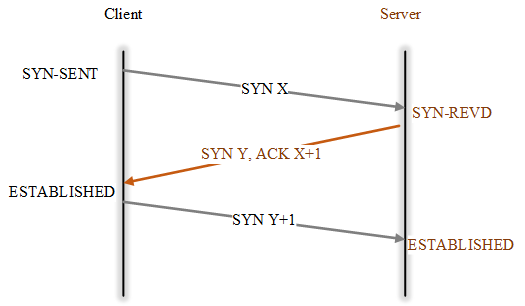
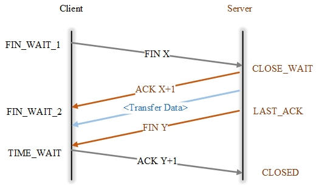
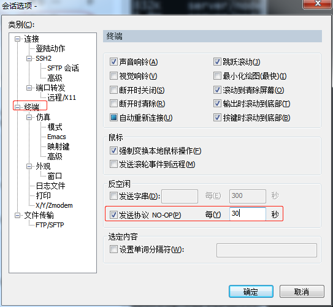

[TOC]

------

## 内存泄露排查

### OOM 导致被杀

利用 `dmesg` 查看

```bash
dmesg | grep a.out
```

### 较为明显的内存泄漏

> 通过系统自带的命令持续地观察进程内存的占用情况，即可发现有明显内存泄漏的进程；更进一步，当进程运行一段时间导致系统内存耗尽，将会被操作系统杀掉。

- 利用 `free` 查看系统内存
- 利用 `top`/`htop` 查看进程占用内存

```bash
top -d 1 -p pid
```

- 利用 ps 查看进程占用内存


```bash
watch -n1 'ps -aux|grep -v grep|grep pid'
```

### 不太明显的内存泄漏

- 利用 `valgrind` 工具查看内存分配、释放、泄漏


```bash
valgrind --log-file=valgrind.log --tool=memcheck --leak-check=full --show-reachable=no --workaround-gcc296-bugs=yes ./a.out
```

## 进程异常排查

### 查看系统级别是否运行异常

- 利用 `top`/`htop` 查看全局资源使用

- 利用 `free` 查看系统内存使用

- 利用 `iostat` 查看磁盘 `I/O` 是否异常

- 利用 `df -i` 查看系统 `inode` 使用是否异常；`df -h` 查看系统磁盘使用是否异常

- 利用 `ss`/`netstat` 查看系统网络连接是否异常


```bash
# 查看网络统计信息
root@:~# netstat -s|grep -E "rejects|overflowed|timeout|dropped"
    6 dropped because of missing route
    479629 times the listen queue of a socket overflowed
    482420 SYNs to LISTEN sockets dropped
    5 timeouts after SACK recovery
    2 timeouts in loss state
    12200 other TCP timeouts
    582 connections aborted due to timeout

# 查看网络连接信息
root@:~# netstat -nap
Active Internet connections (servers and established)
Proto Recv-Q Send-Q Local Address           Foreign Address         State       PID/Program name
tcp        0      0 0.0.0.0:4501            0.0.0.0:*               LISTEN      25511/coind     
tcp        0      0 0.0.0.0:22              0.0.0.0:*               LISTEN      907/sshd        
tcp        0      0 0.0.0.0:7901            0.0.0.0:*               LISTEN      25511/coind     
tcp        0      0 127.0.0.1:32000         0.0.0.0:*               LISTEN      1688/java       
tcp        0      0 172.18.219.68:7901      47.104.240.30:49308     ESTABLISHED 25511/coind     
tcp        0      0 172.18.219.68:7901      39.104.158.97:54688     ESTABLISHED 25511/coind     
tcp        0      0 172.18.219.68:7901      47.99.132.207:56138     ESTABLISHED 25511/coind     
tcp        0      0 172.18.219.68:22        219.133.101.96:42080    ESTABLISHED 9831/0          
tcp        0      0 172.18.219.68:58788     47.104.240.30:7901      ESTABLISHED 25511/coind     
tcp        0      0 172.18.219.68:58600     47.99.132.207:7901      ESTABLISHED 25511/coind     
tcp        0      0 172.18.219.68:7901      39.106.164.24:59070     ESTABLISHED 25511/coind     
tcp        0      0 172.18.219.68:58122     106.11.248.209:80       ESTABLISHED 1287/AliYunDun  
tcp       32      0 172.18.219.68:43932     100.100.0.13:3128       CLOSE_WAIT  1688/java       
tcp        0      0 172.18.219.68:7901      47.104.229.53:46200     ESTABLISHED 25511/coind     
tcp        0      0 127.0.0.1:32000         127.0.0.1:31000         ESTABLISHED 1686/wrapper    
tcp        0      0 172.18.219.68:7901      116.62.67.116:59758     ESTABLISHED 25511/coind     
tcp        0      0 172.18.219.68:58226     106.14.112.174:7901     ESTABLISHED 25511/coind 
```

- 利用 `ifstat` 查看系统网络流量是否异常

### 测试 TCP/UDP 端口连通性

- TCP

```bash
root@ubuntu:~# nc -z -v 192.168.1.175 22
Connection to 192.168.1.175 22 port [tcp/ssh] succeeded!
```

```bash
root@ubuntu:~# telnet 192.168.1.175 22
Trying 192.168.1.175...
Connected to 192.168.1.175.
Escape character is '^]'.
SSH-2.0-OpenSSH_6.6.1p1 Ubuntu-2ubuntu2.10
```

- UDP

```bash
# nc -z -v -u 192.168.10.12 123
Connection to 192.118.20.95 123 port [udp/ntp] succeeded!
```

### 查看进程级别是否运行异常

- `top`/`htop` 查看进程资源使用是否正常（特别注意，内存是否一致在增加）

- `lsof` 查看进程打开的文件句柄数

- 查看进程堆栈信息（2388 为进程号）


```bash
[root@www ~]# cat /proc/2388/stack
[<ffffffff811f2bb5>] poll_schedule_timeout+0x55/0xb0
[<ffffffff811f413d>] do_sys_poll+0x4cd/0x580
[<ffffffff811f42f4>] SyS_poll+0x74/0x110
[<ffffffff81645909>] system_call_fastpath+0x16/0x1b
[<ffffffffffffffff>] 0xffffffffffffffff
```

- `strace` 查看系统调用和信号


```bash
[root@www ~]#  strace -s 99 -ffp 3363
Process 3363 attached with 2 threads
[pid  3365] restart_syscall(<... resuming interrupted call ...> <unfinished ...>
[pid  3363] select(18, [13 16 17], NULL, NULL, {29, 702368}) = 1 (in [16], left {23, 709762})
[pid  3363] fcntl(16, F_GETFL)          = 0x802 (flags O_RDWR|O_NONBLOCK)
[pid  3363] accept4(16, 0, NULL, SOCK_CLOEXEC) = -1 EAGAIN (Resource temporarily unavailable)
Process 3365 detached
```

- `gdb attach` 进程并获取堆栈信息


``` bash
[root@www ~]# gdb attach 2388
GNU gdb (GDB) Red Hat Enterprise Linux 7.6.1-80.el7
Copyright (C) 2013 Free Software Foundation, Inc.
License GPLv3+: GNU GPL version 3 or later <http://gnu.org/licenses/gpl.html>
This is free software: you are free to change and redistribute it.
There is NO WARRANTY, to the extent permitted by law.  Type "show copying"
and "show warranty" for details.
This GDB was configured as "x86_64-redhat-linux-gnu".
For bug reporting instructions, please see:
<http://www.gnu.org/software/gdb/bugs/>...
Attaching to process 2388
Reading symbols from /home/mysql/bin/mysqld...
done.
Reading symbols from /usr/lib64/libpthread.so.0...Reading symbols from /usr/lib/debug/usr/lib64/libpthread-2.17.so.debug...done.
done.

(gdb) 
(gdb) bt
#0  0x00007f88e3f4669d in poll () at ../sysdeps/unix/syscall-template.S:81
#1  0x0000000000d2ae9d in Mysqld_socket_listener::listen_for_connection_event (this=0x5933700)
    at /root/lnmp1.3-full/src/mysql-5.7.11/sql/conn_handler/socket_connection.cc:848
#2  0x000000000077e069 in connection_event_loop (this=0x59a6050) at /root/lnmp1.3-full/src/mysql-5.7.11/sql/conn_handler/connection_acceptor.h:66
#3  mysqld_main (argc=45, argv=0x3b56bd8) at /root/lnmp1.3-full/src/mysql-5.7.11/sql/mysqld.cc:4941
#4  0x00007f88e3e7bb15 in __libc_start_main (main=0x756100 <main(int, char**)>, argc=10, ubp_av=0x7ffe5ab6c418, init=<optimized out>, fini=<optimized out>, 
    rtld_fini=<optimized out>, stack_end=0x7ffe5ab6c408) at libc-start.c:274
#5  0x00000000007734dd in _start ()
```

- java 程序，可以借助 `jstack`、`jstat`、`jmap`、`jinfo` 等查看进程的运行信息

## 进程后台运行

- 代码层面，不同语言均可调用系统接口 daemon() 去实现
- damon/damonlize 等小工具（不同系统名字略有不同）
- screen/tmux
- nohup
- systemd/supervisor

## TCP 协议

### TCP 连接建立

在 TCP/IP 协议中，TCP 协议提供可靠的连接服务，采用三次握手建立一个连接。

- 第一次握手：建立连接时，客户端发送 `SYN` 到服务器，并进入 `SYN_SEND` 状态，等待服务器确认
- 第二次握手：服务器收到 `SYN`，必须确认客户的 `SYN`，同时自己也发送一个 `SYN`，即 `SYN + ACK`，此时服务器 进入 `SYN_RECV` 状态
- 第三次握手：客户端收到服务器的 `SYN＋ACK`，向服务器发送确认包 `ACK`，此包发送完毕，客户端和服务器进入 `ESTABLISHED` 状态，完成三次握手。 完成三次握手，客户端与服务器开始传送数据。



**为什么要三次握手？**

防止失效的连接请求突然传到服务器端，让服务器端误认为要建立连接。

### TCP 连接释放

在 TCP/IP 协议中，TCP 协议提供可靠的连接服务，采用四次挥手释放一个连接。



**为什么 Client 进入 TIME-WAIT 后必须等待 2 MSL？**

- 保证 Client 发送的最后一个 ACK 报文段能达到 Server
- 防止失效的报文段出现在连接中

## HTTP 压力测试

### wrk

- wrk 是一款现代化的 http 压测工具，提供 lua 脚本的功能可以满足每个请求或部分请求的差异化
- wrk 中执行 http 请求的时候，调用 lua 分为3个阶段，setup，running，done，每个 wrk 线程中都有独立的脚本环境
- 可以参考 [wrk benchmark](https://github.com/wg/wrk) 项目包含的样例（目录 scripts）以及说明（SCRIPTING）


#### wrk的全局属性

```lua
wrk = {
  scheme  = "http",
  host    = "localhost",
  port    = nil,
  method  = "GET",
  path    = "/",
  headers = {},
  body    = nil,
  thread  = <userdata>,
}
```

#### wrk 的全局方法

```lua
-- 生成整个 request 的 string，与全局属性 wrk table 配合使用
function wrk.format(method, path, headers, body)
-- 获取域名的 IP 和端口，返回 table
function wrk.lookup(host, service)
-- 判断 addr 是否能连接，例如：`127.0.0.1:80`，返回 true 或 false
function wrk.connect(addr)
```

#### 启动阶段

> 在脚本文件中实现 setup 方法，wrk 就会在测试线程已经初始化但还没有启动的时候调用该方法。wrk 会为每一个测试线程调用一次 setup 方法，并传入代表测试线程的对象 thread 作为参数。setup 方法中可操作该thread 对象，获取信息、存储信息、甚至关闭该线程。 

thread提供了 1 个属性，3 个方法 

- thread.addr 设置请求需要打到的 ip
- thread:get(name) 获取线程全局变量
- thread:set(name, value) 设置线程全局变量
- thread:stop() 终止线程

#### 运行阶段

> init 由测试线程调用，只会在进入运行阶段时，调用一次。支持从启动 wrk 的命令中，获取命令行参数； delay 在每次发送 request 之前调用，如果需要 delay，那么 delay 相应时间； request 用来生成请求；每一次请求都会调用该方法，所以注意不要在该方法中做耗时的操作； reponse 在每次收到一个响应时调用；为提升性能，如果没有定义该方法，那么 wrk 不会解析 headers 和 body。

- function init(args)  每个线程仅调用 1 次，args 用于获取命令行中传入的参数, 例如 --env=pre
- function delay()  每次请求调用 1 次，发送下一个请求之前的延迟, 单位为 ms 
- function request()  每次请求调用 1 次，返回 http 请求  
- function response(status, headers, body)  每次请求调用 1 次，返回 http 响应

#### 结束阶段

> 该方法在整个测试过程中只会调用一次，可从参数给定的对象中，获取压测结果，生成定制化的测试报告。 

```lua
function done(summary, latency, requests)


latency.min              -- minimum value seen
latency.max              -- maximum value seen
latency.mean             -- average value seen
latency.stdev            -- standard deviation
latency:percentile(99.0) -- 99th percentile value
latency(i)               -- raw value and count

summary = {
  duration = N,  -- run duration in microseconds
  requests = N,  -- total completed requests
  bytes    = N,  -- total bytes received
  errors   = {
    connect = N, -- total socket connection errors
    read    = N, -- total socket read errors
    write   = N, -- total socket write errors
    status  = N, -- total HTTP status codes > 399
    timeout = N  -- total request timeouts
  }
}
```

#### wrk 使用手册

```bash
使用方法: wrk <选项> <被测 HTTP 服务的 URL>                            
  Options:                                            
	-c, --connections <N>  跟服务器建立并保持的 TCP 连接数量  
    -d, --duration    <T>  压测时间           
    -t, --threads     <N>  使用多少个线程进行压测   
                                                      
	-s, --script      <S>  指定 Lua 脚本路径       
	-H, --header      <H>  为每一个 HTTP 请求添加 HTTP 头      
        --latency          在压测结束后，打印延迟统计信息   
        --timeout     <T>  超时时间     
	-v, --version          打印正在使用的 wrk 的详细版本信息
                                                      
  <N>代表数字参数，支持国际单位 (1k, 1M, 1G)
  <T>代表时间参数，支持时间单位 (2s, 2m, 2h)
```

#### 示例 1

> 启动 4 个线程，创建 100 个连接，持续 10s，请求百度主页（**支持 HTTP/HTTPS**）

```bash
root@ubuntu:~/wrk# wrk -t4 -c100 -d10s https://www.baidu.com
Running 10s test @ https://www.baidu.com
  4 threads and 100 connections
  Thread Stats   Avg      Stdev     Max   +/- Stdev
    Latency    77.65ms  122.51ms   1.88s    88.42%
    Req/Sec   618.40    200.60     1.25k    77.58%
  24500 requests in 10.04s, 360.47MB read
  Socket errors: connect 0, read 130, write 0, timeout 0
Requests/sec:   2439.09
Transfer/sec:     35.89MB
```

**结果分析：**

- `avg/stddev/max` 平均值/标准差/最大值
- `+/- stddev` 正负一个标准差，落在正负一个标准差的次数所占比重，值越大数据越稳定
- `latency` 时延，对应响应时间
- `Req/Sec` 单个线程每秒钟请求数，值越大性能越高
- `Requests/sec` 所有线程总共平均每秒钟请求数

#### 示例 2

> 每个线程要先进行认证，认证之后获取 token 以进行压测。在没有token的情况下，先访问 /authenticate 认证。认证成功后，读取 token 并替换 path 为 /resource。

```lua
token = nil
path  = "/authenticate"

request = function()
   return wrk.format("GET", path)
end

response = function(status, headers, body)
   if not token and status == 200 then
      token = headers["X-Token"]
      path  = "/resource"
      wrk.headers["X-Token"] = token
   end
end
```

#### 示例 3

> 启动 4 个线程，创建 100 个连接，持续 10s，每个请求发送不同的数据

脚本内容如下所示

```lua
wrk.method = "POST"  
wrk.body   = ""
-- 可以根据实际接口请求路径修改
wrk.path   = "/"
wrk.headers["Content-Type"] = "text/plain" 

-- 每次修改充值积分值，保证每次交易都能成功提交，否则，可能因为交易仍在内存池中，
-- 判定为同一笔交易导致提交失败。当然，也可在脚本中每次选用不同的目标账户进行充值。
local value = 1
local a = '{\"jsonrpc\": \"1.0\", \"id\":\"curltest\", \"method\": \"creditrechargetx\", \"params\": [\"wWPAztEx3m5hArykWaH3qQZ13NtxaZXJts\", \"82908-1\", 0, 10000, 0, \"wNYc86E6JVvQfmgzQDESR81J7UuLtt9WDx\", '
local b = '] }'

request = function()

    local data = string.format("%s%d%s", a, value, b)
    value = value + 1

    return wrk.format(nil, nil, nil, data)
end

-- 请求之间设置 30~40 ms 的随机延迟
--function delay()
--   return math.random(30, 40)
--end

-- 可打印响应内容
--response = function(status, headers, body)
--    print(string.format("status: %d", status))
--    print(body)
--end
```

执行压测用例

```bash
root@ubuntu:~/wrk# wrk -t4 -c100 -d10s -s creditrecharge.lua http://192.168.1.213:6901
Running 10s test @ http://192.168.1.213:6901
  4 threads and 100 connections
  Thread Stats   Avg      Stdev     Max   +/- Stdev
    Latency   688.24ms  363.88ms   2.00s    84.39%
    Req/Sec    52.32     50.44   242.00     83.33%
  1435 requests in 10.09s, 667.72KB read
  Socket errors: connect 0, read 0, write 0, timeout 15
Requests/sec:    142.25
Transfer/sec:     66.19KB
```

## GDB 小技巧

### 基本操作

- 基础

```bash
# 列出源码的一部分
list

# 单步调试，不进入函数
next
# 单步调试，进入函数
step

# 运行加载了的程序
run
# 继续执行程序
continue
# 退出调试
quit

# 输出特定变量的值
print
# 设置断点
break
# 查看所有断点信息
info breakpoints
# 删除断点
delete <num>

# 查看本地变量
info locals
# 查看 goroutine 列表（GoLang 专用）
info goroutines
# 查看所有的线程
info threads
# 切换到某个线程
thread <线程号>
# 查看当前变量的类型
whatis <变量名>

# 监视一个变量的值，一旦发生变化，程序将会被暂停
watch

# 改变运行过程中的变量值
set variable <var>=<value>

# 打印所有线程堆栈
thread apply all bt

# 打印堆栈(backtrace)
bt
# 可以通过 'frame' 命令中明确指定号码，或者使用 'up' 命令在堆栈中上移以及 'down' 命令在堆栈中下移来切换帧。要获取有关帧的进一步信息，如它的地址和程序语言，可以使用命令 'info frame'
frame
```

- 调整堆栈层级

```bash
#0  __lll_lock_wait () at ../nptl/sysdeps/unix/sysv/linux/x86_64/lowlevellock.S:135
135     in ../nptl/sysdeps/unix/sysv/linux/x86_64/lowlevellock.S

# 进入上一层堆栈
(gdb) up
#1  0x00007f23cb9d2664 in _L_lock_952 () from /lib/x86_64-linux-gnu/libpthread.so.0
(gdb) up
#2  0x00007f23cb9d24c6 in __GI___pthread_mutex_lock (mutex=0x60adf38388 <mempool+8>) at ../nptl/pthread_mutex_lock.c:114
114     ../nptl/pthread_mutex_lock.c: No such file or directory.

# 进入下一层堆栈
(gdb) down
#1  0x00007f23cb9d2664 in _L_lock_952 () from /lib/x86_64-linux-gnu/libpthread.so.0
```

### 调试 coredump

- 生成 coredump 文件

```bash
# 方式一
gcore -o xxx.core pid

# 方式二
gdb attach pid
gcore
```

- 调试 coredump 文件

```bash
gdb xxx -c xxx.core
```

## VIM 小技巧

```bash
# VIM 替换时带确认，即，对于任何一个匹配项，需要确认是否替换
:%s/a/b/gc

# 上下(垂直）分割当前打开的文件
Ctrl+w s

# 左右（水平）分割当前打开的文件
Ctrl+w v

# 关闭当前窗口，对应 :close 
# 注意：最后一个窗口不能使用 close 关闭，使用 close 只是暂时关闭窗口，其内容还在缓存中。
Ctrl+w c
# 关闭当前窗口，对应 :q
Ctrl+w q

# 横向切割窗口
:new 文件名
:split 文件名 或简写为 :sp 文件名

# 纵向切割窗口
:vsplit 文件名 或简写为 :vsp 文件名

# 关闭当前窗口，对应 :close，使用 close 只是暂时关闭窗口，其内容还在缓存中。
Ctrl+w c
# 关闭当前窗口，对应 :q，与 close 不同之处在于永久关闭窗口，因此可关闭最后一个打开的窗口。
Ctrl+w q

# 切换窗口：连续两次 Ctrl+w 依次切换打开的窗口
Ctrl+w Ctrl+w
# 切换窗口：Ctrl+w 配合h/j/k/l 或者 上下左右方向键
Ctrl+w h/j/k/l

# 显示空格、TAB
# TAB 键显示为 ^I，$ 显示在每行的结尾，表示换行；空格仍然显示为空格。
:set list		进入 List Mode
:set nolist		退出 List Mode
```

## Git 小技巧

### 基本操作

```bash
# 克隆远程仓库到本地
git clone ssh://kevin@192.168.5.32:29418/dummy.git

# 查看本地变更信息
git status
# 查看本地当前目录变更信息
git status .

# 添加提交信息（交互式编辑）
git commit
# 添加提交信息（非交互式）
git commit -m "fix(module): free memory"
# 追加新的变更到上次提交（即，commit id 不变，多次修改的内容合并到一次提交）
git commit --amend

# 修改本次提交的作者信息
git commit --amend --author="kevin <dudebing99@gmail.com>" -C HEAD

# 查看当前所在分支
git branch
# 查看远程分支
git branch -r

# 查看远程仓库地址
git remote -v

# 以远程分支或 tag 创建本地分支
git checkout -b <local branch> <remote branch OR tag>

# 以某个分支强制覆盖本地分支并推送
git reset --hard <remote_branch>
git push -f

# 切换 HEAD 指向的默认分支
git remote set-head origin <target_branch>

# 设置当前分支的默认远程分支，git push 即可缺省推到远程分支
git push --set-upstream origin <target_branch>
```

### git stash

默认情况下，git stash 缓存文件的策略如下：

**会缓存下列文件**

- 添加到暂存区的修改（`staged changes`）
- Git 跟踪的但并未添加到暂存区的修改（`unstaged changes`）

**不会缓存以下文件**

- 在工作目录中新的文件（`untracked files`）
- 被忽略的文件（`ignored files`）

> 使用 -u 或者 --include-untracked 可以 stash untracked 的文件

> 使用 -a 或者 --all 命令可以  stash 当前目录下的所有修改

```bash
# 保存未提交的变更(建议通过 sava "fix(xxx): xxx)" 备注变更说明）
git stash save "fix(xxx): xxx"
# 可在 git stash 之后拉取远程最新代码
git pull
# 然后，pop 之前保存的未提交的更新，做修改、合并，最后再提交
git stash pop

# pop 指定栈层次， git stash pop stash@{0} 命令等同于 git stash pop
git stash pop stash@{id}

# 查看所有的 stash
git stash list

# 移除某个 stash
git stash drop stash@{id}
# 移除所有的 stash
git stash clear
```

### 合并分支到主干

```bash
# 假设在 dev 分支开发完
git add .
git commit -m "feat: ..."
git push -u origin dev

# 切换到（本地）master
git checkout master
# 拉取最新
git pull

# 将 dev 合并到（本地）master
git merge dev

# 可能需要解决冲突，然后 add，commit

# 推送到远程 master
git push origin master
```

### 查看历史提交信息

```bash
# 查看所有提交日志
git log

# 查看某次 commit 的修改内容
git show <commit-id>

# 查看某个文件的所有的修改内容
git log -p <filename>

# 查看某个文件的最近 2 次的更新内容
git log -p -2 <filename>

# 查看最近一次所有的更新内容（如下两种方法）
git log -p -1
git diff HEAD^

# 查看某个文件的最后一次更新内容由谁提交（对应到每一行）
git blame <filename>
```

### 仓库迁移

```bash
# 1. 本地有仓库 project1
# 2. 在 github 新建仓库 project2
# 3. 以镜像推送到 project2 上，可以保留 project1 的所有提交记录
git push --mirror git@github.com:dudebing99/project2.git
```

### 合并多次提交

1. 将头部指针指向要合并的第一个提交的前一个提交

```bash
git reset --soft <commit id>
```

2. 重新提交

```bash
git commit -m "New Commit Message"
```

### github 同步 fork 仓库

> 以同步 `master` 分支为例，其他分支同理

1. 克隆已 `fork` 的项目到本地

```bash
git clone git@github.com:YOUR-USERNAME/YOUR-FORKED-REPO.git
```

2. 添加远程原始仓库

```bash
cd into/cloned/fork-repo
git remote add upstream git://github.com/ORIGINAL-DEV-USERNAME/REPO-YOU-FORKED-FROM.git
git fetch upstream
```

3. 同远程原始仓库同步

> `git pull` 与 `git pull upstream master` 的区别，前者表示拉取自己远程仓库（默认为 `master` 分支），后者表示拉取外部的上游分支

```bash
git pull upstream master
```

4. 同步之后推送到 `github` 已 `fork` 的项目

```bash
git push
```

### github 提交 PR

> 一般地，为每一个 `PR` 创建一个分支

1. 将远程分支（待提交 `PR` 的目标仓库的目标分支）检出作为本地分支 `<local branch>`

```bash
git checkout -b <local branch> upstream/master
```

2. 将某次（或多次）提交 `cherry-pick` 到本地分支 `<local branch>`

```bash
# 一次提交
git cherry-pick 30cd5a3

# 多次提交 (commit from, commit to]
git cherry-pick <commit from>..<commit to>
```

3. 将本地分支推到自己的远程仓库

```bash
git push origin <remote branch>
```

4. 在 `github` 上面基于 `<remote branch>` 与 `upstream/master` 提交 `PR`

## 同步机器时间、硬件时钟

```bash
yum install rdate -y
# 设置时区
timedatectl set-timezone Asia/Shanghai
# 同步机器时间、硬件时钟
rdate -t 30 -s time.nist.gov && hwclock -w 
```

## 网络测速

1. 安装 speedtest

```bash
pip install speedtest-cli
```

2. 测速

> 使用 speedtest 或者 speedtest-cli 命令测试，更精确测速，可以选择指定服务器

```bash
root@iZwz978rorvlg75nct99l1Z:~# speedtest-cli
Retrieving speedtest.net configuration...
Testing from Aliyun Computing Co. (120.79.48.91)...
Retrieving speedtest.net server list...
Selecting best server based on ping...
Hosted by China Telecom Xiangyang Branch (XiangYang) [340.23 km]: 24.964 ms
Testing download speed................................................................................
Download: 494.36 Mbit/s
Testing upload speed................................................................................................
Upload: 201.21 Mbit/s
```

## SSH 机器互信（免密登陆）

**目标：**client 被 server 信任，即，client 可以通过免密 ssh 登陆 server。

1. client 产生公钥


```bash
ssh-keygen -t rsa
# 后续回车即可
```

2. 将步骤 1 中产生的 id_rsa.pub 拷贝并追加到 server 已授权 key 文件中

```bash
cat id_rsa.pub >> root/.ssh/authorized_keys
```
3. 重启 server 端 ssh 服务

```bash
# Ubuntu，service ssh restart 即可
service sshd restart
```
## PSSH 批量操作

1. 目标机器均已经对操作机器做互信
2. 通过 PSSH 批量操作，如下所示

```bash
root@iZwz9b1eyn1aqqy0s3qbadZ:~/pssh-tool# cat hosts 
120.76.61.90:22
47.99.204.62:22
116.62.234.240:22
47.99.178.161:22
47.98.49.93:22
47.99.194.5:22
47.52.193.118:22
47.105.140.237:22
47.105.65.96:22
root@iZwz9b1eyn1aqqy0s3qbadZ:~/pssh-tool# pssh -h hosts -l root -P date
120.76.61.90: Thu Dec 13 17:16:43 CST 2018
[1] 17:16:43 [SUCCESS] 120.76.61.90:22
47.52.193.118: Thu Dec 13 17:16:43 CST 2018
[2] 17:16:43 [SUCCESS] 47.52.193.118:22
47.99.204.62: Thu Dec 13 17:16:43 CST 2018
[3] 17:16:43 [SUCCESS] 47.99.204.62:22
47.98.49.93: Thu Dec 13 17:16:43 CST 2018
[4] 17:16:43 [SUCCESS] 47.98.49.93:22
47.99.178.161: Thu Dec 13 17:16:43 CST 2018
[5] 17:16:43 [SUCCESS] 47.99.178.161:22
116.62.234.240: Thu Dec 13 17:16:43 CST 2018
[6] 17:16:43 [SUCCESS] 116.62.234.240:22
47.99.194.5: Thu Dec 13 17:16:43 CST 2018
[7] 17:16:43 [SUCCESS] 47.99.194.5:22
47.105.65.96: Thu Dec 13 17:16:43 CST 2018
[8] 17:16:43 [SUCCESS] 47.105.65.96:22
47.105.140.237: Thu Dec 13 17:16:44 CST 2018
[9] 17:16:44 [SUCCESS] 47.105.140.237:22
```

## SSH 禁用超时

**目标：**SSH 空闲之后，默认断掉，每次需要重连太过麻烦，可以修改 SSH 服务端设置禁用超时；也可以客户端定时发送心跳包保活。

- SSH 服务器

1. 在 /etc/ssh/sshd_config 添加/修改如下配置项

```bash
TCPKeepAlive yes
ClientAliveInterval 30
ClientAliveCountMax 999999
```

2. 重启 server 端 ssh 服务

```bash
# Ubuntu，service ssh restart 即可
service sshd restart
```

- SSH 客户端

  在 /etc/ssh/ssh_config 添加/修改如下配置项 `ServerAliveInterval 30`

> 在客户端配置后，就会有反空闲设置，即每 30s 会自动和服务端做一次确认。如果在 Windows 下使用 SecureCRT，如下操作即可



> 如果在 Windows 下使用 Putty，putty -> Connection -> Seconds between keepalives ( 0 to turn off )，默认为 0，改为30

## 跳板机 Jumpserver 上传/下载文件

> **需求：**linux 服务器大多是通过 ssh 客户端来进行远程的登陆和管理，使用跳板机 Jumpserver，传输文件是个基础需求，可以借助 rz/sz 实现

> **限制：**rz/sz 只支持对文件（不支持文件夹）操作

### 上传文件 rz

```bash
rz -bye
```

### 下载文件 sz

```bash
[xbuser@push4 push_server]$ sz ce.sh
rz
Starting zmodem transfer.  Press Ctrl+C to cancel.
  100%       1 KB    0 KB/s 00:00:25       0 Errors
```

## MySQL 小技巧

### MySQL 清理控制台

```sql
system clear
```

### MySQL 查看表结构

```sql
show create table multi_app_user_tbl;
```

**输出**

```basic
mysql> show create table multi_app_user_tbl\G
*************************** 1. row ***************************
       Table: multi_app_user_tbl
Create Table: CREATE TABLE `multi_app_user_tbl` (
  `id` int(11) NOT NULL AUTO_INCREMENT COMMENT '自增 ID',
  `uniq_user_id` varchar(64) NOT NULL COMMENT '用户唯一 ID',
  `org_user_id` int(11) NOT NULL COMMENT '用户 ID',
  PRIMARY KEY (`id`),
  UNIQUE KEY `idx_org_user_id` (`org_user_id`),
  KEY `idx_uniq_user_id_user_id` (`uniq_user_id`)
) ENGINE=MyISAM AUTO_INCREMENT=4662 DEFAULT CHARSET=utf8
1 row in set (0.00 sec)
```

### MySQL 随机排序

```sql
select * from multi_app_user_tbl order by rand() limit 3;
```

**输出**

```basic
mysql> select * from multi_app_user_tbl order by rand() limit 3;
+------+--------------------------------------------+-------------+
| id   | uniq_user_id                               | org_user_id |
+------+--------------------------------------------+-------------+
| 1576 | advid:2b3f4008-9d2c-4410-8ff0-fb1a37021831 |      309614 |
| 2545 | advid:629e3632-83fc-41f6-b7a7-507d07da323a |      220043 |
| 2984 | advid:5a21e37d-8472-4b4b-aaad-c3828ab3a6fa |      190268 |
+------+--------------------------------------------+-------------+
3 rows in set (0.01 sec)

mysql> select * from multi_app_user_tbl order by rand() limit 3;
+------+--------------------------------------------+-------------+
| id   | uniq_user_id                               | org_user_id |
+------+--------------------------------------------+-------------+
| 1615 | advid:eca90566-6048-4ff5-a1e3-c979d467221f |      307227 |
| 2646 | advid:a383d2fc-22e5-4ccc-b5d7-de80cc8f8eed |      283161 |
| 1913 | advid:fb082377-24a0-4936-a189-50563515c5cd |      281130 |
+------+--------------------------------------------+-------------+
3 rows in set (0.00 sec)
```

### 快捷选择 MySQL 实例

1. 创建脚本 xdb.sh

```bash
#!/bin/bash

db=""
case $1 in
"log")
    db="mysql -uroot -p123456 -h log.lsb.com -Dlog"
    ;;
"reclog")
    db="mysql -uroot -p123456 -h 10.10.10.10 -Dreclog"
    ;;
"push")
    db="mysql -uroot -p123456 -h 10.10.10.10 -Dpush"
    ;;
*)
    echo "no param set"
esac

echo "Attention: connect to database: $1"
$db
```

2. chmod +x xdb.sh

3. 使用 `./xdb.sh log` 即可快捷登陆 log.lsb.com 的数据库 log


### 条件插入

**场景：**先根据条件判断某条记录是否存在，不存在则插入；存在即跳过。

**语法：**insert into table(column1, column2, ..., columnN) select value1, value2, value3, ..., valueN from dual where not exists (condition clause)

   ```sql
insert into push_log_tbl(guid, origin_url, new_url, beg_ts) select '1111', '', '', sysdate() from dual where not exists (select guid from push_log_tbl where guid='1111');
   ```

### timestamp 字段查询

**场景一：**查询某个时间范围的数据

```sql
SELECT `id`, `create_time` FROM `record` WHERE (create_time >= '2011-05-27 11:27:00') ORDER BY id DESC LIMIT 0, 20
```

**场景二：**查询某一天数据

```sql
select guid, content_id, title, long_text, new_url, ttl, icon, picture, push_enum from vntopnews_push.push_content_tbl where date_format(create_time,'%Y-%m-%d')='2011-05-27' order by create_time asc
```

### 时间相关函数

#### 查询 utc 时间戳、utc 日期、utc 时间、now()

```sql
mysql> select utc_timestamp(), utc_date(), utc_time(), now();
+---------------------+------------+------------+---------------------+
| utc_timestamp()     | utc_date() | utc_time() | now()               |
+---------------------+------------+------------+---------------------+
| 2018-05-26 08:27:00 | 2018-05-26 | 08:27:00   | 2018-05-26 16:27:00 |
+---------------------+------------+------------+---------------------+
```

#### now() 与 sysdate() 异同

```sql
mysql> select now(), sleep(3), now();
+---------------------+----------+---------------------+
| now()               | sleep(3) | now()               |
+---------------------+----------+---------------------+
| 2018-05-26 16:25:29 |        0 | 2018-05-26 16:25:29 |
+---------------------+----------+---------------------+
```

```sql
mysql> select sysdate(), sleep(3), sysdate();
+---------------------+----------+---------------------+
| sysdate()           | sleep(3) | sysdate()           |
+---------------------+----------+---------------------+
| 2018-05-26 16:24:56 |        0 | 2018-05-26 16:24:59 |
+---------------------+----------+---------------------+
```

#### date_add 函数

```sql
mysql> select date_add(now(), interval -1 day) as t1, date_add(now(), interval 8 hour) as t2, now();
+---------------------+---------------------+---------------------+
| t1                  | t2                  | now()               |
+---------------------+---------------------+---------------------+
| 2018-05-25 16:39:34 | 2018-05-27 00:39:34 | 2018-05-26 16:39:34 |
+---------------------+---------------------+---------------------+
```

### INSERT INTO SELECT 语句

```sql
INSERT INTO table2 SELECT * FROM table1;
```

```sql
INSERT INTO table2 (column_name(s));
SELECT column_name(s) FROM table1;
```

### 查看表创建时间

```sql
show table status
```

```sql
select CREATE_TIME from INFORMATION_SCHEMA.TABLES where TABLE_NAME='latest_active_user_tbl';
```

### 三目表达式

```sql
select name,if(sex=0,'女','男') as sex from student;
```

### between ... and ...

SQL 中使用 `between ... and ...`，查询条件是闭区间，且上下限调换不等价，如下所示

`between a and b => x ∈ [a, b] => x ≥ a && x ≤ b`

`where id between a and b => where id >= a and id <= b`

- 查询 id ≥ 1 且 id ≤ 3 的记录

```sql
select * from tbl where id between 1 and 3;
```

- 查询 id ≥ 3 且 id ≤ 1 的记录

```sql
select * from tbl where id between 3 and 1;
```

所以，在处理起始终止范围查询业务逻辑时，SQL 中使用 `between ... and ...` 一定需要处理好上下限。即，前端、后端都应该确保上下限 `a ≤ b`。

## NGINX 基础配置

### 配置静态资源

#### 使用 alias 重定义路径

静态资源如下所示

```bash
[kevin@iZwz9cynwitmm46uagetmvZ opt]$ tree -L 3 static*
static1
└── json
    └── dummy.json
static2
└── index.html

1 directory, 2 files
```

Nginx 配置如下

```bash
server {
	listen       443 ssl http2 default_server;
	listen       [::]:443 ssl http2 default_server;
	server_name  bigsillybear.com;
	ssl_certificate /etc/letsencrypt/live/api.bigsillybear.com/fullchain.pem; # managed by Certbot
	ssl_certificate_key /etc/letsencrypt/live/api.bigsillybear.com/privkey.pem; # managed by Certbot
	ssl_session_cache shared:SSL:1m;
	ssl_session_timeout  10m;
	ssl_ciphers HIGH:!aNULL:!MD5;
	ssl_prefer_server_ciphers on;
	
	# Load configuration files for the default server block.
	include /etc/nginx/default.d/*.conf;
	
	# 使用正则表达式
	location ~  ^/hello1/(\w+).(\w+)$ {
	   alias /opt/static1/$2/$1.$2;
	}
	
	# 不使用正则表达式
	location /hello2/ {
	    alias /opt/static2/;
	    index  index.html index.htm;
	}
}
```

测试结果

```bash
[kevin@iZwz9cynwitmm46uagetmvZ opt]$ curl https://bigsillybear.com/hello1/dummy.json
{
    "id": 99,
    "msg": "hello world"
}
[kevin@iZwz9cynwitmm46uagetmvZ opt]$ curl https://bigsillybear.com/hello2/
<html>
    <body>
        <h1>Hello World</h1>
        <p>Hello World</p>
    </body>
</html>
```

#### 使用 root 指定前缀

静态资源如下所示

```bash
[kevin@iZwz9cynwitmm46uagetmvZ opt]$ tree -L 3 static3/
static3/
└── index.html

0 directories, 1 file
```

Nginx 配置如下

```bash
server {
	listen       443 ssl http2 default_server;
	listen       [::]:443 ssl http2 default_server;
	server_name  bigsillybear.com;
	ssl_certificate /etc/letsencrypt/live/api.bigsillybear.com/fullchain.pem; # managed by Certbot
	ssl_certificate_key /etc/letsencrypt/live/api.bigsillybear.com/privkey.pem; # managed by Certbot
	ssl_session_cache shared:SSL:1m;
	ssl_session_timeout  10m;
	ssl_ciphers HIGH:!aNULL:!MD5;
	ssl_prefer_server_ciphers on;
	
	# Load configuration files for the default server block.
	include /etc/nginx/default.d/*.conf;
	
	location /static3/ {
    	root  /opt;
    	index  index.html index.htm;
    }
}
```

测试结果

```bash
[kevin@iZwz9cynwitmm46uagetmvZ opt]$ curl https://bigsillybear.com/static3/
<html>
    <body>
        <h1>Hello World</h1>
        <p>Hello World</p>
    </body>
</html>
```

### Location 匹配规则

#### 语法规则

```bash
location [ = | ~ | ~* | ^~ ] uri { ... }
location @name { ... }
```

`location` 为关键字，后面跟着可选的修饰符，后面是要匹配的字符，花括号中是要执行的操作

- `=` 表示精确匹配。只有请求的 `uri` 路径与后面的字符串完全相等时，才会命中
- `~` 表示该规则是使用正则定义的，区分大小写
- `~*` 表示该规则是使用正则定义的，不区分大小写
- `^~` 表示如果该符号后面的字符是最佳匹配，采用该规则，不再进行后续的查找

#### 匹配过程

> 匹配开始前，对请求的 `url` 序列化。例如，对 `%xx` 等字符进行解码，去除 `url` 中多个相连的 `/`，解析 `url` 中`.`，`..` 

> `location` 有两种表示形式，一种是使用前缀字符，一种是使用正则。如果是正则的话，前面有 `~ `或 `~*` 修饰符

具体的匹配过程如下：

1. 首先先检查使用前缀字符定义的 `location`，选择最长匹配的项并记录下来
2. 如果找到了精确匹配的 `location`，也就是使用了 `=` 修饰符的 `location`，结束查找，使用它的配置
3. 按顺序查找使用正则定义的 `location`，如果匹配则停止查找，使用它定义的配置
4. 如果没有匹配的正则 `location`，则使用前面记录的最长匹配前缀字符 `location`

#### 示例详解

假设有如下配置文件

```bash
location = / {
    [ configuration A ]
}

location / {
    [ configuration B ]
}

location /user/ {
    [ configuration C ]
}

location ^~ /images/ {
    [ configuration D ]
}

location ~* \.(gif|jpg|jpeg)$ {
    [ configuration E ]
}
```

请求 `/` 精准匹配 A，不再往下查找

请求 `/index.html` 匹配 B。首先查找匹配的前缀字符，找到最长匹配是配置 B，接着又按照顺序查找匹配的正则。结果没有找到，因此使用先前标记的最长匹配，即配置 B

请求 `/user/index.html` 匹配 C。首先找到最长匹配 C，由于后面没有匹配的正则，所以使用最长匹配 C
请求 `/user/1.jpg` 匹配E。首先进行前缀字符的查找，找到最长匹配项 C，继续进行正则查找，找到匹配项 E。因此使用  E

请求 `/images/1.jpg `匹配 D。首先进行前缀字符的查找，找到最长匹配 D。但是，特殊的是它使用了 `^~` 修饰符，不再进行接下来的正则的匹配查找，因此使用 D。这里，如果没有前面的修饰符，其实最终的匹配是 E

请求 `/documents/about.html` 匹配 B。因为 B 表示任何以`/`开头的 URL 都匹配。在上面的配置中，只有 B 能满足，所以匹配 B

#### location @name 使用

> @用来定义一个命名 location。主要用于内部重定向，不能用来处理正常的请求（该块不能被外部 Client 所访问，只能被内部配置指令所访问，比如 try_files、error_page）

> 命名 location 中不能再嵌套其它的命名 location

```bash
location / {
    try_files $uri $uri/ @custom
}
location @custom {
    # do something
}
```

上例中，当尝试访问 uri 找不到对应的文件就重定向到我们自定义的命名 location（此处为custom）

#### URL 尾部的 `/`

- 如果 URL 结构是 `https://domain.com/ `的形式，尾部有没有 `/` 都不会造成重定向。因为浏览器在发起请求的时候，默认加上了 `/`，即使浏览器在地址栏里也不会显示 `/`

- 如果 URL 的结构是 `https://domain.com/some-dir/`。尾部如果缺少 `/` 将导致重定向。因为根据约定，URL 尾部的 `/` 表示目录，没有 `/` 表示文件。所以访问 `/some-dir/` 时，服务器会自动去该目录下找对应的默认文件。如果访问 `/some-dir` 的话，服务器会先去找 `some-dir` 文件，找不到的话会将 `some-dir` 当成目录，重定向到 `/some-dir/`，去该目录下找默认文件

#### 配置静态资源

静态资源有两种配置模式，目录匹配或后缀匹配，任选其一或搭配使用

```bash
location ^~ /static/ {
    root /webroot/static/;
}
```

```bash
location ~* \.(gif|jpg|jpeg|png|css|js|ico)$ {
    root /webroot/res/;
}
```

#### 实践原则

- location 配置有两种形式，前缀字符和正则。查找匹配的时候，先查找前缀字符，选择最长匹配项，再查找正则。正则的优先级高于前缀字符

- **使用正则定义的 `location` 在配置文件中出现的顺序很重要**。正则的查找是按照在配置文件中的顺序进行的。因此正则的顺序很重要，建议越精细的放的越靠前，因为找到第一个匹配的正则后，查找就停止了，后面定义的正则就是再匹配也没有机会
- **使用精确匹配可以提高查找的速度**。如果根域名经常被访问的话建议使用 `=`

#### 参考资料

- [https://www.nginx.com/resources/wiki/start/topics/tutorials/config_pitfalls/](https://www.nginx.com/resources/wiki/start/topics/tutorials/config_pitfalls/)
- [https://segmentfault.com/a/1190000013267839](https://segmentfault.com/a/1190000013267839)
- [https://www.cnblogs.com/dadonggg/p/7797281.html](https://www.cnblogs.com/dadonggg/p/7797281.html)

## NGINX 性能优化

> nginx 默认的配置 `/etc/nginx/nginx.conf`，当然，一般 `nginx.conf` 会引用其他目录的配置文件，例如目录 `conf.d`，如下讨论主要基于 `nginx.conf` 全局配置。

> NGINX 官方配置说明：http://nginx.org/en/docs/ngx_core_module.html

### 高层的配置

> `nginx.conf` 文件中，nginx 中有少数的几个高级配置在模块部分之上。

```bash
user www-data;
pid /var/run/nginx.pid;

worker_processes auto;
worker_rlimit_nofile 100000;
```

- `user` 配置 nginx 启动用户，默认即可
- `pid` 配置 nginx 进程号存放文件，默认即可
- `worker_process` 定义 nginx 对外提供 web 服务是的工作进程数量。最优值取决于诸多因素，包括但不限于 CPU 核心数量。一般配置为机器 CPU 核心数量即可（`auto` 将尝试自动检测机器 CPU 核心数量）
- `worker_rlimit_nofile` 更改工作进程的最大打开文件数限制。如果没设置的话，这个值为操作系统的限制。设置后你的操作系统和 nginx 可以处理比 `ulimit -a` 更多的文件，所以把这个值设高，这样 nginx 就不会出现 `too many open files` 的问题

### Events 模块

> events 模块中包含 nginx 中所有处理连接的设置。

```bash
events {
    worker_connections 2048;
    multi_accept on;
    use epoll;
}
```

- `worker_connections` 设置单个工作进程同时打开的连接数限制，如高层配置中 `worker_rlimit_nofile` 设置了较高的值，可以适当地提高这个值

> 工作进程同时打开的连接数限制也由系统的可用 socket 连接数限制，所以设置不切实际的高没什么好处。

- `multi_accept` 设置 nginx 收到一个新连接通知后接受尽可能多的连接

  ```bash
  Syntax:	multi_accept on | off;
  Default:	
  multi_accept off;
  Context:	events
  ```

  If `multi_accept` is disabled, a worker process will accept one new connection at a time. Otherwise, a worker process will accept all new connections at a time.

- `use` 设置用于复用客户端线程的轮询方法。如果你使用 `Linux 2.6+`，你应该使用 `epoll`。如果你使用 `BSD`，你应该使用 `kqueue`

> 如果你不知道 nginx 该使用哪种轮询方法的话，不配置该选项即可，它会选择一个最适合你操作系统的。

## LINUX 内核调优参数

> 通过 `sysctl -a` 查看系统内核参数

### 网络

> Setting tcp_tw_recycle to 1 makes a Linux host drop TIME_WAIT connections much faster.  Instead of a predefined 2*MSL period of 60s, the host will use a timeout based on RTT estimate.  For LANs, it is usually several milliseconds. 

> Setting tcp_tw_reuse to 1 will make a host reuse the same connection quickly for outgoing connections.  

> Many WEB sites say that setting the following tunable will change the 2*MSL (TIME_WAIT) period:
>
> \# echo 30 > /proc/sys/net/ipv4/tcp_fin_timeout 
>
> Is this correct? 
>
> Answer:  No.  The tcp(7) manpage states correctly that this tunable does something different: 
>
> ​	tcp_fin_timeout (integer; default: 60) 
>
> ​	This  specifies  how many seconds to wait for a final FIN packet before the socket is forcibly closed. 
>
> There is a hardwired constant, TCP_TIMEWAIT_LEN (defined to 60s), which is used in a number of places.  There is no way to change it without recompilation.   

```bash
######################## cat /proc/sys/net/ipv4/tcp_syncookies
# 默认值：1
# 作用：是否打开 SYN Cookie 功能，该功能可以防止部分 SYN 攻击
net.ipv4.tcp_syncookies = 1

######################## cat /proc/sys/net/ipv4/ip_local_port_range
# 默认值：32768   61000
# 作用：可用端口的范围
net.ipv4.ip_local_port_range = 1024  65535

######################## cat /proc/sys/net/ipv4/tcp_timestamps 
# 默认值：1
# 作用：TCP 时间戳
net.ipv4.tcp_timestamps = 1

######################## cat /proc/sys/net/ipv4/tcp_tw_recycle
# 默认值：0
# 作用：针对 TIME-WAIT，不要开启
net.ipv4.tcp_tw_recycle = 0

######################## cat /proc/sys/net/ipv4/tcp_tw_reuse
# 默认值：0
# 作用：针对 TIME-WAIT，做为客户端可以启用
net.ipv4.tcp_tw_reuse = 1

######################## cat /proc/sys/net/ipv4/tcp_max_tw_buckets 
# 默认值：262144
# 作用：针对 TIME-WAIT，配置其上限。如果降低这个值，可以显著的发现 TIME-WAIT 的数量减少，但系统日志中可能出现如下记录：
# kernel: TCP: time wait bucket table overflow
# 对应的，如果升高这个值，可以显著的发现 TIME-WAIT 的数量增加。
# 综合考虑，保持默认值。
net.ipv4.tcp_max_tw_buckets = 262144

######################## cat /proc/sys/net/ipv4/tcp_max_orphans 
# 默认值：16384
# 作用：orphans 的最大值
net.ipv4.tcp_max_orphans = 3276800

######################## cat /proc/sys/net/ipv4/tcp_keepalive_intvl 
# 默认值：75
# 作用：探测失败后，间隔几秒后重新探测
net.ipv4.tcp_keepalive_intvl = 30

######################## cat /proc/sys/net/ipv4/tcp_keepalive_probes 
# 默认值：9
# 作用：探测失败后，最多尝试探测几次
net.ipv4.tcp_keepalive_probes = 3

######################## cat /proc/sys/net/ipv4/tcp_keepalive_time 
# 默认值：7200
# 作用：间隔多久发送1次 keepalive 探测包
net.ipv4.tcp_keepalive_time = 1200

######################## cat /proc/sys/net/ipv4/tcp_max_syn_backlog
# 默认值：128
# 作用：增大 SYN 队列的长度，容纳更多连接
net.ipv4.tcp_max_syn_backlog = 819200

######################## cat /proc/sys/net/core/somaxconn
# 默认值：128
# 作用：已经成功建立连接的套接字将要进入队列的长度
net.core.somaxconn = 65536
```

## Bash 共享屏幕/录制屏幕

### 共享终端

- 借助管道实现，共享者在终端进行如下操作

```bash
$ mkfifo share.fifo
$ script -f share.fifo
```

- 观看者在终端进行如下操作

```bash
$ cat share.fifo
```

### 录制屏幕与回放

- 录制

```bash
$ script -t 2> timing.log -a output.session
```

- 回放(单纯回放，不会有实际操作)

```bash
$ scriptreplay timing.log output.session
```

## nginx 配置文件错误检查

> 使用 `-t` 检测配置文件无误，然后重启服务即可 `nginx -s reload`

```bash
[kevin@iZwz9cynwitmm46uagetmvZ opt]$ sudo nginx -t
nginx: the configuration file /etc/nginx/nginx.conf syntax is ok
nginx: configuration file /etc/nginx/nginx.conf test is successful
```

