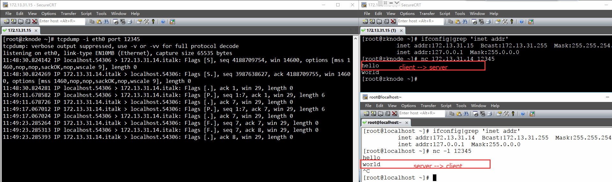
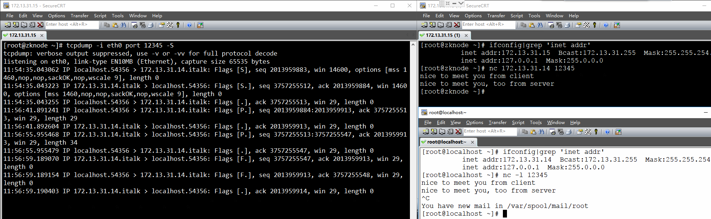

[TOC]

------

## Windows 上帝模式：包含 Windows 常用的设置

1. 在桌面新建一个文件夹

2. 重命名为 GodMode.{ED7BA470-8E54-465E-825C-99712043E01C}
## 网页自动刷新

功能：实现每 10s 自动刷新

头部加入 \<meta http-equiv="refresh" content="10">

## vagringd 的 memcheck 工具检测内存泄露

valgrind --log-file=valgrind.log --tool=memcheck --leak-check=full --show-reachable=no --workaround-gcc296-bugs=yes ./a.out

## tcpdump 抓包之三次握手、四次挥手

### TCP 连接建立（三次握手）

客户端 A，服务器 B，初始序号 seq，确认号 ack

初始状态：B 处于监听状态，A 处于打开状态

- A -> B : seq = x （A 向 B 发送连接请求报文段，A 进入同步发送状态 SYN-SENT）
- B -> A : ack = x + 1,seq = y （B 收到报文段，向 A 发送确认，B 进入同步收到状态 SYN-RCVD）
- A -> B : ack = y+1 （A 收到 B 的确认后，再次确认，A 进入连接状态 ESTABLISHED）

连接后的状态：B 收到 A 的确认后，进入连接状态 ESTABLISHED

> **为什么要三次握手？**
>
> 防止失效的连接请求突然传到服务器端，让服务器端误认为要建立连接。

### TCP 连接释放（四次挥手）

- A -> B : seq = u （A 发出连接释放报文段，进入终止等待1状态 FIN-WAIT-1）

- B -> A : ack = u + 1, seq = v （B 收到报文段，发出确认，TCP 处于半关闭，B 还可向 A 发数据，B 进入关闭等待状态 CLOSE_WAIT）

- B -> A : seq = w （B 发出连接释放报文段，进入最后确认状态 LAST-ACK）

  ==注意：如果 B 收到 A 的 FIN 报文之后，无数据待发，上述两个步骤合并，即，B 发送一个既包含对 A 的 FIN 报文的确认，又包含主动发起的 FIN 报文。==

  ==B -> A : ack = u + 1, seq = w（即，FIN 报文序号为 w）==

- A -> B : ack = w + 1 （A 发出确认，进入时间等待状态 TIME-WAIT）

经过 2MSL（Maximum Segment Lifetime）后，A 才进入 CLOSED 状态

> **为什么 A 进入 TIME-WAIT 后必须等待 2MSL？**
>
> - 保证 A 发送的最后一个 ACK 报文段能达到 B
> - 防止失效的报文段出现在连接中

### tcpdump 抓包实例一（ack 相对序号）

>  **tcpdump 参数 -S：**-S     Print absolute, rather than relative, TCP sequence numbers.
>
> 默认情况下，打印的 ack 序号是相对序号。

1. 服务器端（172.13.31.14）监听 12345 端口
2. 客户端（172.13.31.15）连接服务器
3. 客户端向服务器端发送 hello
4. 服务器端向客户端发送 world
5. 服务器端主动关闭连接



### tcpdump 抓包实例二（ack 绝对序号）

1. 服务器端（172.13.31.14）监听 12345 端口
2. 客户端（172.13.31.15）连接服务器
3. 客户端向服务器端发送 nice to meet you from client
4. 服务器端向客户端发送 nice to meet you, too from server
5. 服务器端主动关闭连接



## SVN 周报自动提交

```bash
#!/bin/sh

# 说明：自动拉取上周已提交周报，并复制一份以当天日期命名的周报，逃脱检查周报是否提交。

cd /home/kevin/daily/Kevin

echo "svn update"
svn up

old_file=工作周报-Kevin-`date +%Y%m%d --date="-7 day"`.doc
new_file=工作周报-Kevin-`date +%Y%m%d`.doc

# 周报未提交，才进行操作
if [ -f $new_file ]; then
    echo "file existed, exit"
    exit 0
else
    echo "create file"
    cp $old_file $new_file

    echo "commit file"
    svn add $new_file
    svn commit $new_file -m "M Commit week report"
    exit 0
fi
```

```bash
# 添加 crontab 任务
3 18 * * 5 sh /home/kevin/daily/auto.sh
```

## VIM 小技巧

```bash
# VIM 替换时带确认，即，对于任何一个匹配项，需要确认是否替换
:%s/a/b/gc

# 上下(垂直）分割当前打开的文件
Ctrl+w s

# 左右（水平）分割当前打开的文件
Ctrl+w v

# 关闭当前窗口，对应 :close 
# 注意：最后一个窗口不能使用 close 关闭，使用 close 只是暂时关闭窗口，其内容还在缓存中。
Ctrl+w c
# 关闭当前窗口，对应 :q
Ctrl+w q

# 横向切割窗口
:new 文件名
:split 文件名 或简写为 :sp 文件名

# 纵向切割窗口
:vsplit 文件名 或简写为 :vsp 文件名

# 关闭当前窗口，对应 :close，使用 close 只是暂时关闭窗口，其内容还在缓存中。
Ctrl+w c
# 关闭当前窗口，对应 :q，与 close 不同之处在于永久关闭窗口，因此可关闭最后一个打开的窗口。
Ctrl+w q

# 切换窗口：连续两次 Ctrl+w 依次切换打开的窗口
Ctrl+w Ctrl+w
# 切换窗口：Ctrl+w 配合h/j/k/l 或者 上下左右方向键
Ctrl+w h/j/k/l

# 显示空格、TAB
# TAB 键显示为 ^I，$ 显示在每行的结尾，表示换行；空格仍然显示为空格。
:set list		进入 List Mode
:set nolist		退出 List Mode
```

## Git 小技巧

### 基本操作

```bash
# 克隆远程仓库到本地
git clone ssh://kevin@192.168.5.32:29418/dummy.git

# 查看本地变更信息
git status
# 查看本地当前目录变更信息
git status .

# 添加提交信息（交互式编辑）
git commit
# 添加提交信息（非交互式）
git commit -m "fix(module): free memory"
# 追加新的变更到上次提交（即，commit id 不变，多次修改的内容合并到一次提交）
git commit --amend

# 修改本次提交的作者信息
git commit --amend --author="kevin <dudebing99@gmail.com>" -C HEAD
```

### 合并分支到主干

```bash
# 假设在 dev 分支开发完
git add .
git commit -m "feat: ..."
git push -u origin dev

# 切换到（本地）master
git checkout master
# 拉取最新
git pull

# 将 dev 合并到（本地）master
git merge dev

# 可能需要解决冲突，然后 add，commit

# 推送到远程 master
git push origin master
```

### 查看历史提交信息

```bash
# 查看所有提交日志
git log

# 查看某次 commit 的修改内容
git show <commit-id>

# 查看某个文件的所有的修改内容
git log -p <filename>

# 查看某个文件的最近 2 次的更新内容
git log -p -2 <filename>

# 查看最近一次所有的更新内容（如下两种方法）
git log -p -1
git diff HEAD^

# 查看某个文件的最后一次更新内容由谁提交（对应到每一行）
git blame <filename>
```

## Windows 清理系统垃圾

使用说明：保存为 clear.bat，双击运行即可。

```bash
@echo off
echo 正在清除系统垃圾文件，请稍等......
del /f /s /q %systemdrive%\*.tmp
del /f /s /q %systemdrive%\*._mp
del /f /s /q %systemdrive%\*.log
del /f /s /q %systemdrive%\*.gid
del /f /s /q %systemdrive%\*.chk
del /f /s /q %systemdrive%\*.old
del /f /s /q %windir%\*.bak
del /f /s /q %windir%\prefetch\*.*
rd /s /q %windir%\temp & md %windir%\temp
del /f /q %userprofile%\cookies\*.*
del /f /q %userprofile%\recent\*.*
del /f /s /q "%userprofile%\Local Settings\Temporary Internet Files\*.*"
del /f /s /q "%userprofile%\Local Settings\Temp\*.*"
del /f /s /q "%userprofile%\recent\*.*"
echo 清除系统垃圾完成！
echo. & pause
```

## Windows 图标显示异常修复

使用说明：保存为 icon_recover.bat，双击运行即可。

```bash
taskkill /f /im explorer.exe

echo 清理系统图标缓存数据库
attrib -h -s -r "%userprofile%\AppData\Local\IconCache.db"
del /f "%userprofile%\AppData\Local\IconCache.db"
attrib /s /d -h -s -r "%userprofile%\AppData\Local\Microsoft\Windows\Explorer\*"
del /f "%userprofile%\AppData\Local\Microsoft\Windows\Explorer\thumbcache_32.db"
del /f "%userprofile%\AppData\Local\Microsoft\Windows\Explorer\thumbcache_96.db"
del /f "%userprofile%\AppData\Local\Microsoft\Windows\Explorer\thumbcache_102.db"
del /f "%userprofile%\AppData\Local\Microsoft\Windows\Explorer\thumbcache_256.db"
del /f "%userprofile%\AppData\Local\Microsoft\Windows\Explorer\thumbcache_1024.db"
del /f "%userprofile%\AppData\Local\Microsoft\Windows\Explorer\thumbcache_idx.db"
del /f "%userprofile%\AppData\Local\Microsoft\Windows\Explorer\thumbcache_sr.db"

start explorer
```

## 同步机器时间、硬件时钟

```bash
yum install rdate -y
# 设置时区
timedatectl set-timezone Asia/Shanghai
# 同步机器时间、硬件时钟
rdate -t 30 -s time.nist.gov && hwclock -w 
```

## SSH 机器互信（免密登陆）

**目标：**client 被 server 信任，即，client 可以通过免密 ssh 登陆 server。

1. client 产生公钥

   ```bash
   ssh-keygen -t rsa
   # 后续回车即可
   ```

2. 将步骤 1 中产生的 id_rsa.pub 拷贝并追加到 server 已授权 key 文件中

   ```bash
   cat id_rsa.pub >> root/.ssh/authorized_keys
   ```

3. 重启 server 端 ssh 服务

   ```bash
   service sshd restart
   ```

   ​


