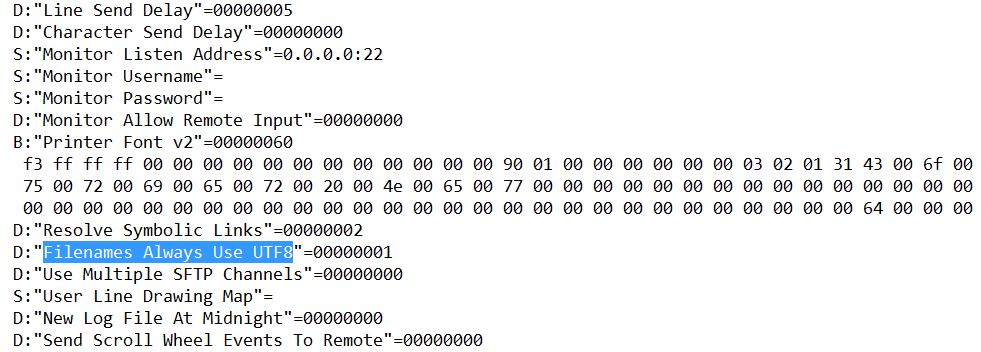

[TOC]

------

## 解决 root 分区空间不足的问题

**系统环境**

CentOS release 6.8 (Final)

**问题描述**

在安装操作系统时采取默认分区策略或者当初分配的策略与后面实际使用差异，导致某些分区仍然有大量的可用空间，但是 root 分区空间不够。

**解决方式**

```bash
# 前提：home 分区仍有大量空间，root 分区空间不够
# 查看分区
df -h

# 取消挂载
umount /home

# 分区检测
e2fsck -f /dev/mapper/VolGroup-lv_home

# 将 lv_home 虚拟分区设为 100G
resize2fs -p /dev/mapper/VolGroup-lv_home 100G

# 挂载
mount /home

# 释放空间
lvreduce -L 100G /dev/mapper/VolGroup-lv_home

# 查看可用空间大小
vgdisplay

# 根据上述命令的提示，假设可用空间为 300G，扩展 lv_root 虚拟分区
lvextend -L +300G /dev/mapper/VolGroup-lv_root

# 重设分区大小
resize2fs -p /dev/mapper/VolGroup-lv_root
```

## Host SMbus controller not enabled

**系统环境**

CentOS/VMware® Workstation 12 Pro 

**问题描述**

在 VMWare 虚拟机启动 CentOS 时，出现如上警告信息

**解决方式**

在 /etc/modprobe.d/blacklist.conf 文件里添加如下内容：
blacklist i2c_piix4

## intel_rapl: no valid rapl domains found in package 0

**系统环境**

CentOS/VMware® Workstation 12 Pro 

**问题描述**

在 VMWare 虚拟机启动 CentOS 时，出现如上警告信息

**解决方式**

在 /etc/modprobe.d/blacklist.conf 文件里添加如下内容：
blacklist intel_rapl

## sd 0:0:0:0: [sda] Assuming drive cache: write through

**系统环境**

CentOS/VMware® Workstation 12 Pro 

**问题描述**

在 VMWare 虚拟机启动 CentOS 时，出现如上警告信息

**解决方式**

1. 在 /etc/default/grub 文件里去掉 rhgb 参数

2. 执行 grub2-mkconfig -o /boot/grub2/grub.cfg

   > "rhgb" 表示 "redhat graphics boot"，就是图形进度条模式


3. 最后reboot

## MySQL 插入关键字导致 SQL 执行失败

**系统环境**

MySQL

**问题描述**

在 MySQL 表中某字段包含关键字 key，导致 SQL 语句执行报错，数据无法正常插入表中。错误信息大致如下：

*You have an error in your SQL syntax; check the manual that corresponds to your MySQL server version for the right syntax to use near ...*

**解决方式**

执行如下 SQL  报错：INSERT into tb_map(key, value) VALUES('a',' 123'); 

> key 是 MySQL 关键字之一

正确写法：INSERT into tb_map(\`key\`, value) VALUES('a',' 123'); 

> 使用 转义符号：\`关键字\`

## SecureFX 中文文件名乱码

**系统环境**

SecureFx Version 7.0.3 (build 480)

**问题描述**

SecretFx 显示中文文件名时出现乱码

**解决方式**

1. 打开安装目录，进入子目录：SecureCRT7\App\VanDyke Clients\CONFIG\Sessions
2. 找到 D:"Filenames Always Use UTF8"=00000000 改成 00000001，如下所示


## MySQL 重置密码

**系统环境**

CentOS 6.8 x64/MySQL 5.6.35

**问题描述**

MySQL 用户密码丢失，重置用户密码

**解决方式**

```bash
service mysqld stop

mysqld_safe --skip-grant-talbes &

mysql -uroot
> use mysql;
> update user set password=PASSWORD('123456') where user='root';
> flush privileges;

pkill mysqld_safe

service mysql start
```

## SecureCRT 冻结终端/解除冻结/全屏/清屏

**系统环境**

SecureCRT Version 7.0.3 (build 480)

**问题描述**

略。

**解决方式**

- Ctrl + s：冻结终端
- Ctrl + q：解除冻结
- Alt + Enter：全屏/退出全屏
- Ctrl + L：清屏 clear

## SourceInSight 支持 .cc 文件

**系统环境**

Windows 7 Ultimate/SourceInSight 4.0

**问题描述**

略。

**解决方式**

Options -> Document Options，Document Type 下拉选 C++ Source File, File Filter 中加入 *.cc

## 设置网卡自启动

**系统环境**

CentOS

**问题描述**

略。

**解决方式**

将 /etc/sysconfig/network-scripts/ifctg-xxx 中如下内容修改

ONBOOT=no 修改为 ONBOOT=yes

> 备注：重启网卡或系统生效。

## CentOS 图形、多用户（命令行）模式切换

**系统环境**

CentOS 7.x

**问题描述**

CentOS 7.x 不在使用 init 托管服务，systemd 取而代之。

**解决方式**

1. 命令（多用户）模式

   systemctl set-default multi-user.target

2. 图形模式

   systemctl set-default graphical.target

## IceGrid 应用进程权限

**系统环境**

CentOS 7.x/Ice 3.6.1

**问题描述**

IceGrid Node 节点部署的应用进程无法创建日志目录

**原因分析**

IceGrid Node 节点应用进程默认以 everyone 用户启动，进程需要在运行目录写日志文件，而 everyone 用户不具备该目录的写权限，导致无法创建日志目录。

**解决方式**

**方法 1：**将应用写日志文件的目录赋予 everyone 用户权限。

**方法 2：**IceGrid 机制允许修改用户进程启动默认启动的用户，详见 ICE 官方文档。

## Failed to continue: "Cannot find Delve debugger. Ensure it is in your \`GOPATH/bin\` or \`PATH\`."

**系统环境**

Windows 7 x64 Ultimate/VS Code v1.23.0

**问题描述**

略

**解决方式**

1. 确认已经正确设置 GOPATH 环境变量，并将  %GOPATH%\bin 追加到 PATH 环境变量

2. 打开 Git Bash，运行 go get github.com/derekparker/delve/cmd/dlv


