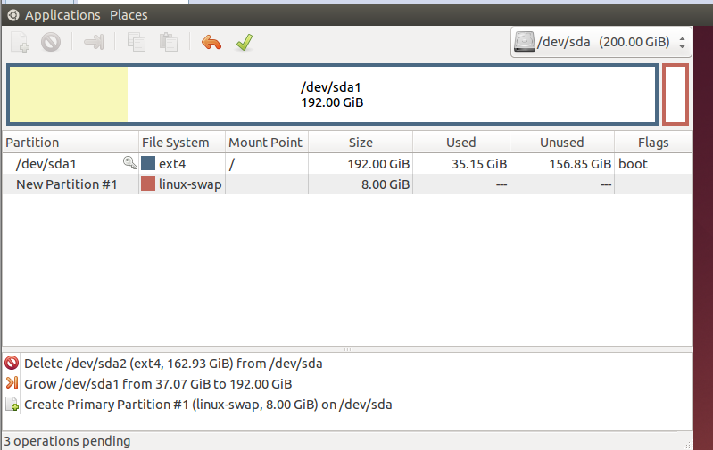
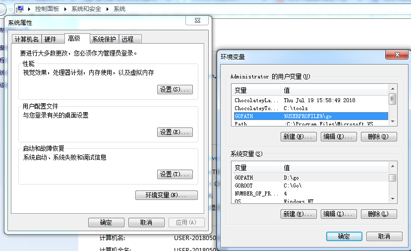
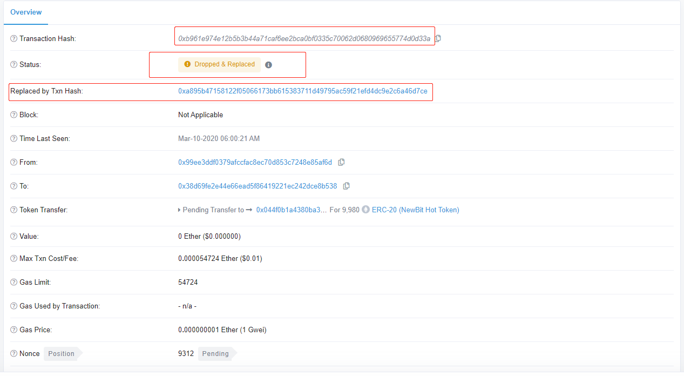
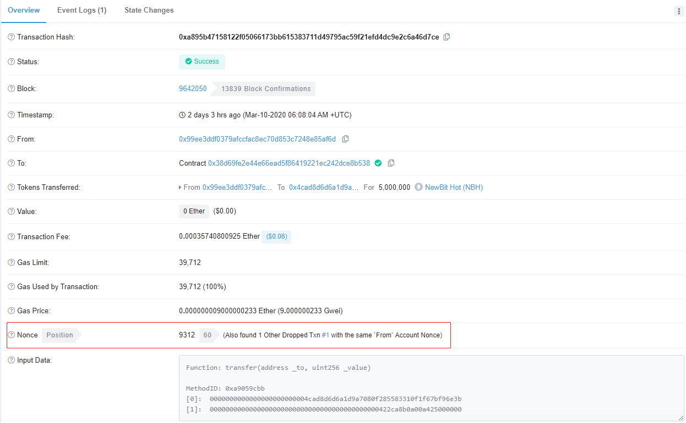

[TOC]

------

## [VMWare] Host SMbus controller not enabled

**系统环境**

CentOS/VMware® Workstation 12 Pro

**问题描述**

在 VMWare 虚拟机启动 CentOS 时，出现如上警告信息

**解决方式**

在 /etc/modprobe.d/blacklist.conf 文件里添加如下内容：

```bash
blacklist i2c_piix4
```

## [VMWare] intel_rapl: no valid rapl domains found in package 0

**系统环境**

CentOS/VMware® Workstation 12 Pro

**问题描述**

在 VMWare 虚拟机启动 CentOS 时，出现如上警告信息

**解决方式**

在 /etc/modprobe.d/blacklist.conf 文件里添加如下内容：
blacklist intel_rapl

## [VMWare] sd 0:0:0:0: [sda] Assuming drive cache: write through

**系统环境**

CentOS/VMware® Workstation 12 Pro

**问题描述**

在 VMWare 虚拟机启动 CentOS 时，出现如上警告信息

**解决方式**

> "rhgb" 表示 "redhat graphics boot"，就是图形进度条模式

1. 在 /etc/default/grub 文件里去掉 rhgb 参数
2. 执行 grub2-mkconfig -o /boot/grub2/grub.cfg
3. reboot

## [VMWare] 虚拟机磁盘空间不足

**系统环境**

Ubuntu 14.04.5 LTS/VMware® Workstation 12 Pro

**问题描述**

虚拟机 Ubuntu 磁盘空间不足，导致无法使用，需要扩容

**解决方式**

1. 删除虚拟机的所有快照
2. 虚拟机设置 -> 硬件 -> 磁盘 -> 扩展，设置一个足够的空间，例如 200G
3. 通过 `apt-get install gparted -y` 安装 `gparted`
4. 图形界面模式下，运行 `gparted`，扩展分区即可

> 扩展前，`/dev/sda1` 实际 40G，使用将近 40G。首先，将 `/dev/sda1` 之外的分区（虚拟机安装 Ubuntu 系统时默认处理，所以关键分区是 sda1，此分区不能删除）全部删除；然后，扩展`/dev/sda1` 分区，并重新建立交换分区。



## [VMWare] output error file to the following location A:\GHOSTERR.TXT

**系统环境**

宿主机 Windows 7/虚拟机 Windows XP

**问题描述**

VMWare 安装 Windows XP 虚拟机时报错，错误信息如下：output error file to the following location A:\GHOSTERR.TXT

**解决方式**

因为虚拟机磁盘没有分区，所以Ghost版系统找不到安装系统的主分区。先执行自带的分区工具对磁盘进行分区，然后安装操作系统即可。

## [MySQL] 插入关键字导致 SQL 执行失败

**系统环境**

MySQL 5.6.x

**问题描述**

在 MySQL 表中某字段包含关键字 key，导致 SQL 语句执行报错，数据无法正常插入表中。错误信息大致如下：

*You have an error in your SQL syntax; check the manual that corresponds to your MySQL server version for the right syntax to use near ...*

**解决方式**

执行如下 SQL  报错：INSERT into tb_map(key, value) VALUES('a',' 123');

> key 是 MySQL 关键字之一

正确写法：INSERT into tb_map(\`key\`, value) VALUES('a',' 123');

> 使用 转义符号：\`关键字\`

## [MySQL] 字段包含单引号、双引号导致 SQL 语法错误

**系统环境**

CentOS 6.8 x64/MySQL 5.6.35

**问题描述**

略

**解决方式**

SQL 中利用 `\` 转义即可，如下两种方式均可

```sql
-- 单引号转义
insert into blog_info_tbl (title, url) values ('kevin\'s blog', 'https://dudebing99.github.io/Blog/');

-- 双引号转义
insert into blog_info_tbl (title, url) values ('\"kevin\" blog', 'https://dudebing99.github.io/Blog/');
```

## [MySQL] 重置密码

**系统环境**

CentOS 6.8 x64/MySQL 5.6.35

**问题描述**

MySQL 用户密码丢失，重置用户密码

**解决方式**

> 高版本 MySQL 中没有 mysqld_safe，可以在配置文件 my.conf 添加 `skip-grant-tables`  达到同样效果

```bash
service mysqld stop

mysqld_safe --skip-grant-tables &

mysql -uroot
> use mysql;
> update user set password=PASSWORD('123456') where user='root';
> flush privileges;

pkill mysqld_safe

service mysql start
```

## [MySQL]  Your password does not satisfy the current policy requirements 

**系统环境**

CentOS 7.2/mysql  Ver 14.14 Distrib 5.7.28, for Linux (x86_64) using  EditLine wrapper

**问题描述**

MySQL 修改密码提示如上错误

**原因分析**

密码强度不满足默认级别，需要增加密码强度或者降低密码级别

**解决方式**

1. 查看默认密码策略

```sql
SHOW VARIABLES LIKE 'validate_password%'; 
```

2. 如果降低密码级别

> 可以降低级别，可以设置密码长度

```sql
set global validate_password_policy=LOW;
set global validate_password_length=6; 
```

3. 修改密码

```sql
ALTER USER 'root'@'localhost' IDENTIFIED BY '123456';
```

## [MySQL] ORDER BY clause is not in GROUP BY clause

**系统环境**

CentOS 6.8 x64/5.7.18 MySQL Community Server

**问题描述**

```sql
mysql> select org_user_id, uniq_user_id from (select * from multi_app_user_tbl) as tmp group by uniq_user_id;
ERROR 1055 (42000): Expression #1 of SELECT list is not in GROUP BY clause and contains nonaggregated column 'tmp.org_user_id' which is not functionally dependent on columns in GROUP BY clause; this is incompatible with sql_mode=only_full_group_by
```

**原因分析**

Select 语句选择的列与 Group by 包含的列不一致，MySQL 默认有此限制。

**解决方式**

1. 可以修改业务的 SQL，遵循此限制
2. 可以取消 MySQL 此限制，如下所示

```sql
mysql> select @@sql_mode\G
*************************** 1. row ***************************
@@sql_mode: ONLY_FULL_GROUP_BY,STRICT_TRANS_TABLES,NO_ZERO_IN_DATE,NO_ZERO_DATE,ERROR_FOR_DIVISION_BY_ZERO,NO_AUTO_CREATE_USER,NO_ENGINE_SUBSTITUTION
1 row in set (0.00 sec)
mysql> set global sql_mode='STRICT_TRANS_TABLES,NO_ZERO_IN_DATE,NO_ZERO_DATE,ERROR_FOR_DIVISION_BY_ZERO,NO_AUTO_CREATE_USER,NO_ENGINE_SUBSTITUTION';
```

**或修改 MySQL 配置文件** my.ini，添加或修改如下配置项

```bash
sql_mode=STRICT_TRANS_TABLES,NO_ZERO_IN_DATE,NO_ZERO_DATE,ERROR_FOR_DIVISION_BY_ZERO,NO_AUTO_CREATE_USER,NO_ENGINE_SUBSTITUTION
```

## [MySQL] ERROR 1820 (HY000): You must reset your password using ALTER USER statement before executing this statement.

**系统环境**

CentOS 7.6/MySQL 5.7.29

**问题描述**

略

**解决方式**

```mysql
mysql> alter user 'root'@'localhost' identified by '123456';
```

## [MySQL] Specified key was too long; max key length is 767 bytes

**系统环境**

CentOS 7.6/MySQL 5.5.60

**问题描述**

MySQL 建表 SQL 中，表中某些字段属性为 `varchar(256)`，并且，该列上建立了索引，执行 SQL 时报错，如上所示

**问题原因**

767 bytes is the stated prefix limitation for InnoDB tables in MySQL version 5.6 (and prior versions). It's 1,000 bytes long for MyISAM tables. In MySQL version 5.7 and upwards this limit has been increased to 3072 bytes.

5.6 及其之前版本，InnoDB 引擎限制索引前缀长度为 767 字节，例如，utf8 编码下，一个 `varchar` 编码占用 3 个字节

- INNODB `utf8` `VARCHAR(255)`
- INNODB `utf8mb4` `VARCHAR(191)`

**解决方式**

- 升级 MySQL 到 5.7 版本及其以上
- 修改列长度 `varchar(256) -> varchar(255)`

## [MySQL] Table performance_schema.session_variables doesn’t exist

**系统环境**

CentOS 7.2/MySQL 5.7

**问题描述**

MySQL 由 5.6 升级到 5.7 之后，执行 SQL 报错，信息如上。

**问题原因**

略。

**解决方式**

```bash
mysql_upgrade -u root -p --force
systemctl restart mysqld
```

## [MySQL] ERROR! The server quit without updating PID file (/application/mysql-5.7.20/data/localhost.localdomain.pid).
**系统环境**

CentOS 6.1/MySQL 5.7.20

**问题描述**

启动服务报上述错误

**问题原因**

```bash
[root@localhost modules]# cat /etc/my.cnf
[mysqld]
port=3306
datadir=/application/mysql-5.7.20/data
socket=/application/mysql-5.7.20/mysql/tmp/mysql.sock
log_error=/var/mysql/log/error.log
basedir=/application/mysql-5.7.20
```

根据配置文件指定的日志文件，查看日志信息如下

> 实际原因可能是其他，思路都是先查看此日志文件定位错误原因

```bash
2020-03-06T17:27:51.108248Z 0 [Note] IPv6 is available.
2020-03-06T17:27:51.108258Z 0 [Note]   - '::' resolves to '::';
2020-03-06T17:27:51.108269Z 0 [Note] Server socket created on IP: '::'.
2020-03-06T17:27:51.108296Z 0 [ERROR] Could not create unix socket lock file /application/mysql-5.7.20/mysql/tmp/mysql.sock.lock.
2020-03-06T17:27:51.108301Z 0 [ERROR] Unable to setup unix socket lock file.
2020-03-06T17:27:51.108306Z 0 [ERROR] Aborting
```

关键信息，无法创建锁文件，由于使用用户 mysql 运行 MySQL 服务，而目录 `/application/mysql-5.7.20/mysql/tmp/` 使用 root 创建，所以 mysql 无权限写入锁文件

**解决方案**

由于目录权限问题，加上权限即可

```bash
[root@localhost data]# chown -R mysql:mysql /application/mysql-5.7.20/
```

## [MySQL] ERROR 2002 (HY000): Can't connect to local MySQL server through socket '/var/run/mysqld/mysqld.sock'

**系统环境**

CentOS 6.1/MySQL 5.7.20

**问题描述**

本机使用命令 `mysql -uroot -p` 连接服务端，报如上错误

**问题原因**

默认情况下，MySQL 客户端会认为连接本机，所以会尝试以 socket 文件方式进行连接这时根据配置文件 `/etc/my.cnf` 去查找 socket 文件路径，由于未配置导致错误

**解决方案**

1. 指定 socket 文件路径，如下所示

```bash
[client]
default-character-set=utf8
socket=/application/mysql-5.7.20/mysql/tmp/mysql.sock
```

2. 不使用 socket 文件通信，使用网络通信

```bash
[root@localhost ~]# mysql -h 127.0.0.1 -u root -p
```

## [SecureFX] 中文文件名乱码

**系统环境**

SecureFx Version 7.0.3 (build 480)

**问题描述**

SecretFx 显示中文文件名时出现乱码

**解决方式**

1. 打开安装目录，进入子目录：SecureCRT7\App\VanDyke Clients\CONFIG\Sessions
2. 找到 D:"Filenames Always Use UTF8"=00000000 改成 00000001，如下所示

```basic
D:"Restart Data Size"=00000000
S:"Restart Datafile Path"=
D:"Max Transfer Buffers"=00000004
D:"Filenames Always Use UTF8"=00000001
D:"Use Multiple SFTP Channels"=00000000
D:"Suppress Stat On CWD"=00000000
```

## [SecureCRT] 冻结终端/解除冻结/全屏/清屏

**系统环境**

SecureCRT Version 7.0.3 (build 480)

**问题描述**

略。

**解决方式**

- Ctrl + s：冻结终端
- Ctrl + q：解除冻结
- Alt + Enter：全屏/退出全屏
- Ctrl + L：清屏 clear

## [SourceInSight] 支持 .cc 文件

**系统环境**

Windows 7 Ultimate/SourceInSight 4.0

**问题描述**

略。

**解决方式**

Options -> Document Options，Document Type 下拉选 C++ Source File, File Filter 中加入 *.cc

## [CentOS] 设置网卡自启动

**系统环境**

CentOS

**问题描述**

略。

**解决方式**

将 /etc/sysconfig/network-scripts/ifctg-xxx 中如下内容修改

ONBOOT=no 修改为 ONBOOT=yes

> 备注：重启网卡或系统生效。

## [CentOS] 图形、多用户（命令行）模式切换

**系统环境**

CentOS 7.x

**问题描述**

CentOS 7.x 不在使用 init 托管服务，systemd 取而代之。

**解决方式**

1. 命令（多用户）模式

```bash
systemctl set-default multi-user.target
```

2. 图形模式

```bash
systemctl set-default graphical.target
```

## [CentOS] 解决 root 分区空间不足的问题

**系统环境**

CentOS release 6.8 (Final)

**问题描述**

在安装操作系统时采取默认分区策略或者当初分配的策略与后面实际使用差异，导致某些分区仍然有大量的可用空间，但是 root 分区空间不够。

**解决方式**

```bash
# 前提：home 分区仍有大量空间，root 分区空间不够
# 查看分区
df -h

# 取消挂载
umount /home

# 分区检测
e2fsck -f /dev/mapper/VolGroup-lv_home

# 将 lv_home 虚拟分区设为 100G
resize2fs -p /dev/mapper/VolGroup-lv_home 100G

# 挂载
mount /home

# 释放空间
lvreduce -L 100G /dev/mapper/VolGroup-lv_home

# 查看可用空间大小
vgdisplay

# 根据上述命令的提示，假设可用空间为 300G，扩展 lv_root 虚拟分区
lvextend -L +300G /dev/mapper/VolGroup-lv_root

# 重设分区大小
resize2fs -p /dev/mapper/VolGroup-lv_root
```

## [CentOS] Centos warning: setlocale: LC_CTYPE: cannot change locale (UTF-8): No such file or directory

**系统环境**

CentOS 7.6

**问题描述**

shell 登陆系统，弹出如下警告信息

```bash
Last login: Sun Apr 21 15:52:04 2019 from 223.104.63.174

Welcome to Alibaba Cloud Elastic Compute Service !

-bash: warning: setlocale: LC_CTYPE: cannot change locale (UTF-8): No such file or directory
```

**原因分析**

语言环境设置错误

**解决方式**

设置语言环境变量，内容如下

```bash
[root@wwhs-i-deer ~]# cat /etc/environment
LANG=en_US.utf-8
LC_ALL=en_US.utf-8
```

## [Ubuntu] 图形、命令行模式切换

**系统环境**

Ubuntu 14.04

**问题描述**

略。

**解决方式**

1. 修改 /etc/default/grub


```bash
# 图形模式
GRUB_CMDLINE_LINUX_DEFAULT="quiet splash"
# 命令行模式
GRUB_CMDLINE_LINUX_DEFAULT="quiet splash text"
```

2. 执行 update-grub
3. reboot

## [Ubuntu] the listen queue of a socket overflowed

**系统环境**

Ubuntu 14.04

**问题描述**

客户端连接服务端失败，利用 ss/netstat 查看网络的统计数据，发现异常 `the listen queue of a socket overflowed`

```bash
root@iZwz9iz7dge6lus7u0uvuzZ:~# netstat -s|grep -E "overflowed"
    470847 times the listen queue of a socket overflowed
```

**原因分析**

在使用 `wrk` 作为客户端对服务端进行压力测试时偶尔出现连接无响应，进而查看到网络统计信息中有如上错误。

查看系统支持的最大全连接数 128

```bash
root@:~# cat  /proc/sys/net/core/somaxconn 
128
```

而使用 `wrk` 并发的连接数设置超过了该限制，例如，设置 `wrk` 并发连接 200。此时，服务端的全连接一定会溢出，查看系统溢出之后如何处理

```bash
root@:~# cat /proc/sys/net/ipv4/tcp_abort_on_overflow
0
```

`tcp_abort_on_overflow` 为 0 表示三次握手第三步的时候，如果全连接队列满了，那么服务端扔掉客户端发过来的`ack`

> `tcp_abort_on_overflow` 设置成 1，表示三次握手第三步的时候，如果全连接队列满了，服务端发送一个`reset` 包给客户端，表示废掉连接

**解决方式**

1. 在配置文件 `/etc/sysconf.conf` 添加（或修改）该设置

```bash
net.core.somaxconn=32768
```

2. 运行 `sysctl -p` 使配置生效

## [Ubuntu] 域名解析未生效

**系统环境**

Ubuntu 14.04

**问题描述**

在 `/etc/resolv.conf` 配置域名解析如下所示

```bash
root@ubuntu:~# cat /etc/resolv.conf 
# Dynamic resolv.conf(5) file for glibc resolver(3) generated by resolvconf(8)
#     DO NOT EDIT THIS FILE BY HAND -- YOUR CHANGES WILL BE OVERWRITTEN
nameserver 114.114.114.114
nameserver 8.8.8.8
```

重启电脑域名解析未生效（该文件为空）

**原因分析**

如上注释说明，不要试图修改该文件，系统重启内容将被覆盖

**解决方式**

在 `/etc/resolvconf/resolv.conf.d/base` 配置即可解决

```bash
root@ubuntu:~# cat /etc/resolvconf/resolv.conf.d/base 
nameserver 114.114.114.114
nameserver 8.8.8.8
```

## [IceGrid] 应用进程权限

**系统环境**

CentOS 7.x/Ice 3.6.1

**问题描述**

IceGrid Node 节点部署的应用进程无法创建日志目录

**原因分析**

IceGrid Node 节点应用进程默认以 everyone 用户启动，进程需要在运行目录写日志文件，而 everyone 用户不具备该目录的写权限，导致无法创建日志目录。

**解决方式**

**方法 1：**将应用写日志文件的目录赋予 everyone 用户权限。

**方法 2：**IceGrid 机制允许修改用户进程启动默认启动的用户，详见 ICE 官方文档。

## [VSCode] Failed to continue: "Cannot find Delve debugger. Ensure it is in your \`GOPATH/bin\` or \`PATH\`."

**系统环境**

Windows 7 x64 Ultimate/VS Code v1.23.0

**问题描述**

略。

**解决方式**

1. 确认已经正确设置 GOPATH 环境变量，并将  %GOPATH%\bin 追加到 PATH 环境变量

2. 打开 Git Bash，运行 go get github.com/derekparker/delve/cmd/dlv

## [Django] Signal only works in main thread

**系统环境**

CentOS 7.x/Python 2.7.x/django 1.11.7

**问题描述**

运行报错

**解决方式**

运行时加入追加如下参数 --nothreading --noreload

## [Django] memory leak with gunicorn

**系统环境**

CentOS 7.x/Python 2.7.x/django 1.11.7

**问题描述**

Django 项目运行时内存泄漏，正常情况下，应当找出内存泄漏的地方并且修复，但是如果是引入的第三方库引入的（或者团队的其他成员的代码引入），无法迅速地正面解决（find it and fix it）

**解决方式**

运行时添加如下参数 --max-requests 1000，该参数指定当工作线程（gunicorn workers）在处理完 1000 个请求时，主进程将其杀掉并释放这些工作线程占用（存在内存泄漏）的内存，然后重新分配新的工作线程。

> 实际上，主进程杀掉并重新拉起新的子进程时，不会影响对客户端的请求的处理。例如，nginx 代理 Django 后端服务，客户端的请求不会受到影响。

## [Python] MySQL 结果集返回字典格式

**系统环境**

 CentOS 7.x/Python 2.7.4

**问题描述**

Python 的 MySQLdb 模块访问 MySQL 的一个模块，默认查询结果是 tuple 类型，使用只能根据字段的位置作为下标去访问，使用不方便且容易出错

**解决方式**

初始化 MySQL 连接时，显示指定结果集为字典类型 cursorclass=MySQLdb.cursors.DictCursor，如下所示

```python
import MySQLdb
import MySQLdb.cursors

def get_db_conn(mysql_config):
    db = MySQLdb.connect(host=mysql_config['host'],
                         port=mysql_config['port'],
                         user=mysql_config['user'],
                         passwd=mysql_config['passwd'],
                         db=mysql_config['db'],
                         cursorclass=MySQLdb.cursors.DictCursor)
    db.set_character_set('utf8mb4')
    cursor = db.cursor()
    cursor.execute('SET NAMES utf8mb4;')

    return db, cursor
```

## [Python] module not found error 可能原因

**系统环境**

CentOS 7.x/Python 2.7.4

**问题描述**

导入 Python 模块，提示找不到模块

**解决方式**

  1. 如果引用的模块包含多级目录，需要在每一级目录添加一个  `__init__.py` 文件（内容为空即可）
  2. 子目录中的文件引用父目录的模块，可将父目录的路径添加进来，举例如下

```bash
sys.path.insert(0, os.path.abspath(os.path.join(os.path.dirname(__file__), "..")))
```

## [Python] ImportError: No module named flask_restful

**系统环境**

CentOS 7.x/Python 2.7.5

**问题描述**

使用 `flask_restful`，提示如上错误

**解决方式**

`flask_restful` 独立于 `flask`，需要单独安装。

首先查看已安装模块，发现只包含 `flask`，未包含 `flask-restful`

```bash
[kevin@iZwz9cynwitmm46uagetmvZ nginx]$ pip freeze|grep -i flask
You are using pip version 8.1.2, however version 18.1 is available.
You should consider upgrading via the 'pip install --upgrade pip' command.
Flask==1.0.2
```

通过 `pip` 安装 `flask_restful` 即可

```bash
pip install flask-restful
```

确认 `flask_restful` 已安装

```bash
[kevin@iZwz9cynwitmm46uagetmvZ nginx]$ pip freeze|grep -i flask
You are using pip version 8.1.2, however version 18.1 is available.
You should consider upgrading via the 'pip install --upgrade pip' command.
Flask==1.0.2
Flask-RESTful==0.3.6
```

## [Flask] request.remote_addr 无法获取用户真实 IP

**系统环境**

CentOS 7.4/Python 2.7.5

**问题描述**

Flask 中使用 `request.remote.addr` 无法获取用户真实 IP，均为 `127.0.0.1`

**原因分析**

服务经过了 Nginx 反向代理，直接使用 `request.remote.addr` 获取的 IP 为 Nginx 的地址，对应的 Nginx 代理配置如下所示：

```bash
location / {
        proxy_redirect          off;
        proxy_set_header        Host            $host;
        proxy_set_header        X-Real-IP       $remote_addr;
        proxy_set_header        X-Forwarded-For $proxy_add_x_forwarded_for;
        proxy_pass              http://api_server;
}
```

**解决方式**

正确处理后端服务经过 Nginx 代理这种情况即可，代码如下所示：

```python
client_ip = request.headers.getlist("X-Forwarded-For")[0] if request.headers.getlist("X-Forwarded-For") else request.remote.addr
```

## [Flask] view[write_offset:write_offset+buffer_size]

 **系统环境**

CentOS 7.4/Flask 1.0.2/Python 2.7.5

**问题描述**

app.py 运行过程中报如下错误

```bash
Exception happened during processing of request from ('172.16.80.1', 52437)
Traceback (most recent call last):
File "/usr/lib/python2.7/SocketServer.py", line 593, in process_request_thread
self.finish_request(request, client_address)
File "/usr/lib/python2.7/SocketServer.py", line 334, in finish_request
self.RequestHandlerClass(request, client_address, self)
File "/usr/lib/python2.7/SocketServer.py", line 651, in init
self.finish()
File "/usr/lib/python2.7/SocketServer.py", line 710, in finish
self.wfile.close()
File "/usr/lib/python2.7/socket.py", line 279, in close
self.flush()
File "/usr/lib/python2.7/socket.py", line 303, in flush
self._sock.sendall(view[write_offset:write_offset+buffer_size])
```

**问题分析**

服务器在接受一个请求，如果处理时间较长，当服务器还没有处理完而客户端中断了连接时（比如关闭了浏览器），由于flask server 在发送数据时没有确认连接状态而直接进行 flush，就会导致发生这个错误。这个异常只会影响服务端的单个请求，不会影响并行的其它请求。

**解决方式**

暂无。

## [Pip] str(c.version) for c in all_candidates SyntaxError: invalid syntax

**系统环境**

CentOS 6.x/Python 2.6.6

**问题描述**

执行 pip install --upgrade pip 报错，如上所示

**解决方式**

python 版本过低，安装 python 2.7.x 或以上版本

## [Ubuntu] libssl-dev : Depends: libssl1.0.0 (= 1.0.1f-1ubuntu2) but 1.0.1f-1ubuntu2.19 is to be installed

> **类似问题：**software-properties-common : Depends: python3-software-properties (= 0.92.37.8) but it is not going to be installed

**系统环境**

Ubuntu 14.04

**问题描述**

执行 `apt-get install libssl-dev` 安装 libssl-dev 出错，具体信息如下所示

```bash
The following packages have unmet dependencies:
 software-properties-common : Depends: python3-software-properties (= 0.92.37.8) but it is not going to be installed
E: Unable to correct problems, you have held broken packages.
```

**解决方式**

```bash
root@datachain-test002:~# aptitude install libssl-dev
The following NEW packages will be installed:
  libssl-dev{b} libssl-doc{a} zlib1g-dev{ab} 
0 packages upgraded, 3 newly installed, 0 to remove and 1 not upgraded.
Need to get 2,209 kB of archives. After unpacking 8,290 kB will be used.
The following packages have unmet dependencies:
 zlib1g-dev : Depends: zlib1g (= 1:1.2.8.dfsg-1ubuntu1.1) but 1:1.2.8.dfsg-2ubuntu4.1 is installed.
 libssl-dev : Depends: libssl1.0.0 (= 1.0.1f-1ubuntu2.26) but 1.0.2g-1ubuntu4.11 is installed.
The following actions will resolve these dependencies:

     Keep the following packages at their current version:
1)     libssl-dev [Not Installed]                         
2)     zlib1g-dev [Not Installed]                         

Accept this solution? [Y/n/q/?] n
Accept this solution? [Y/n/q/?] Y
```

## [Ubuntu] [: 1: unexpected operator

**系统环境**

Ubuntu 14.04

**问题描述**

执行 shell 脚本，报错 [: 1: unexpected operator

**原因分析**

Ubuntu shell 下默认的脚本解析器是 dash，会使一些 bash 脚本执行失败。

**解决方式**

sudo dpkg-reconfigure dash
选择 NO

## [Ubuntu] lua.c:80:31: fatal error: readline/readline.h: No such file or directory

**系统环境**

Ubuntu 14.04

**问题描述**

源码编译 lua 5.3 时，报错 lua.c:80:31: fatal error: readline/readline.h: No such file or directory

**原因分析**

缺少 libreadline-dev 依赖包

**解决方式**

执行  apt-get install libreadline-dev

## [Ubuntu] ssh root 登陆 Permission denied

**系统环境**

Ubuntu 14.04

**问题描述**

安装 ssh 服务之后，root 账户无法 ssh 登陆，提示权限不足

**解决方式**

1. 修改 /etc/ssh/sshd_config

```bash
#PermitRootLogin without-password
PermitRootLogin yes
```

2. 重启服务生效

```bash
service ssh restart
```

## [Ubuntu] 重置 root 密码

**系统环境**

Ubuntu 14.04

**问题描述**

忘记 root 登陆密码

**解决方式**

1. 开机引导界面，选择“Ubuntu 高级选项”，回车
2. 选择“Ubuntu <省略> recovery mode”，按 “e" 键进行编辑
3. 在界面中找到 “recovery nomodeset”，并替换为 quiet splash rw init=/bin/bash，回车
4. 系统进入命令行模式，输入 passwd 更改 root 密码（同理，可以更改其他账户密码）
5. 重启系统

## [Ubuntu] protobuf 冲突导致编译失败

**系统环境**

Ubuntu 14.04

**问题描述**

Ubuntu 系统自带 protobuf，项目中使用高版本 protobuf（由源码编译），与系统自带的产生冲突，导致项目编译、链接失败

**解决方式**

1. 彻底卸载系统自带 protobuf

```bash
apt-get purge --remove libprotobuf*
apt-get purge --remove protobuf-compiler
# 借助 whereis/find 查找 protobuf 相关库、可执行程序、头文件并删除（根据实际情况调整）
rm -rf /usr/local/lib/libprotobuf* /usr/lib/libprotobuf* /usr/lib/x86_64-linux-gnu/libprotobuf* /usr/local/include/google/protobuf /usr/include/google/protobuf /usr/bin/protoc /usr/bin/X11/protoc
```

2. 重新源码编译、安装高版本 protobuf

## [Ubuntu] error: C++ preprocessor "/lib/cpp" fails sanity check

**系统环境**

Ubuntu 14.04

**问题描述**

Ubuntu 源码编译 protobuf，执行 ./configure 配置时检查出错，原因是缺少必要的 C++ 库

**解决方式**

```bash
apt-get install build-essential g++ -y
```

> 如果是 CentOS，运行如下命令即可 `yum install glibc-headers gcc-c++ -y`
>

## [Ubuntu] Package libdb4.8++-dev is not available, but is referred to by another package.

**系统环境**

Ubuntu 14.04

**问题描述**

Ubuntu 无法安装 libdb4.8++-dev

**解决方式**

```bash
add-apt-repository ppa:bitcoin/bitcoin
apt-get update
apt-get install -y libdb4.8-dev libdb4.8++-dev
```

## [Ubuntu] E: Unable to correct problems, you have held broken packages.

**系统环境**

Ubuntu 16.04

**问题描述**

执行 `apt-get install vim -y` 出错，提示包冲突，如下所示

```bash
root@ubuntu:~# apt-get install vim -y
Reading package lists... Done
Building dependency tree       
Reading state information... Done
Some packages could not be installed. This may mean that you have
requested an impossible situation or if you are using the unstable
distribution that some required packages have not yet been created
or been moved out of Incoming.
The following information may help to resolve the situation:

The following packages have unmet dependencies:
 vim : Depends: vim-common (= 2:7.4.052-1ubuntu3.1) but 2:7.4.1689-3ubuntu1.2 is to be installed
E: Unable to correct problems, you have held broken packages.
```

**解决方式**

卸载冲突的包，重新执行 `apt-get install vim -y` 即可

```bash
root@ubuntu:~# apt-get remove --purge vim-common
Reading package lists... Done
Building dependency tree       
Reading state information... Done
The following packages will be REMOVED:
  ubuntu-minimal* vim-common* vim-tiny*
0 upgraded, 0 newly installed, 3 to remove and 2 not upgraded.
After this operation, 1,520 kB disk space will be freed.
Do you want to continue? [Y/n] Y
(Reading database ... 177073 files and directories currently installed.)
Removing ubuntu-minimal (1.361.1) ...
Removing vim-tiny (2:7.4.1689-3ubuntu1.2) ...
Purging configuration files for vim-tiny (2:7.4.1689-3ubuntu1.2) ...
Removing vim-common (2:7.4.1689-3ubuntu1.2) ...
Purging configuration files for vim-common (2:7.4.1689-3ubuntu1.2) ...
Processing triggers for man-db (2.7.5-1) ...
Processing triggers for mime-support (3.59ubuntu1) ...
Processing triggers for hicolor-icon-theme (0.15-0ubuntu1.1) ...
Processing triggers for gnome-menus (3.13.3-6ubuntu3.1) ...
Processing triggers for desktop-file-utils (0.22-1ubuntu5.2) ...
Processing triggers for bamfdaemon (0.5.3~bzr0+16.04.20180209-0ubuntu1) ...
Rebuilding /usr/share/applications/bamf-2.index...
```

## [Ubuntu] shell 命令无法自动补全

**系统环境**

Ubuntu 14.04

**问题描述**

用户登录 shell，无法利用 tab 进行命令补全

**原因分析**

创建用户时未指定用户默认 shell

```bash
$ cat /etc/passwd|grep kevin
kevin:x:1005:1005::/home/kevin
```

因此，shell 默认成了 dash。另外，可以通过命令 `which sh` 进行确认。默认的 dash 无法进行命令补全。

**解决方式**

指定用户的默认 shell 为 bash（或其他，如 zsh），登出再登录即可生效。

## [Ubuntu] "No package 'libffi' found"

**系统环境**

Ubuntu 14.04

**问题描述**

执行 pip install 时，报如上错误。

**解决方式**

```bash
apt-get install yum install libffi-devel
```

## [Ubuntu] RuntimeError: cryptography requires setuptools 18.5 or newer

**系统环境**

Ubuntu 14.04

**问题描述**

略。

**解决方式**

```bash
pip install virtualenv --upgrade
```

## [Ubuntu] /usr/lib/x86_64-linux-gnu/libstdc++.so.6: version `GLIBCXX_3.4.21' not found 

**系统环境**

Ubuntu 14.04

**问题描述**

可执行程序无法运行，ldd 查看可执行程序，依赖的 libstdc++ 库版本过低。默认的 gcc 4.8（包含的 libstdc++）版本过低，需要升级到 gcc 4.9

**解决方式**

```bash
sudo add-apt-repository ppa:ubuntu-toolchain-r/test
sudo apt-get update
sudo apt-get install g++-4.9
```

## [Golang] package xxx: cannot download, $GOPATH not set. For more details see: go help gopath

**系统环境**

Linux

**问题描述**

运行 go get 下载出错，错误信息如上，提示未设置 GOPATH 环境变量

**解决方式**

```bash
# 根据实际工程路径修改
echo "export GOPATH=$HOME/go" >> /etc/profile
# 使环境变量生效
soure /etc/profile
```

## [Golang] go-get=1: dial tcp  i/o timeout)

**系统环境**

Linux

**问题描述**

运行 go get 下载出错，提示 i/o 超时

```basic
Fetching <https://golang.org/x/net/html?go-get=1> https fetch failed: Get <https://golang.org/x/net/html?go-get=1>: dial tcp 216.239.37.1:443: i/o timeout package golang.org/x/net/html: unrecognized import path "golang.org/x/net/html" (https fetch: Get <https://golang.org/x/net/html?go-get=1>: dial tcp 216.239.37.1:443: i/o timeout)
```

**原因分析**

因为 the fucking gfw，导致无法直接通过 go get 下载，需要 git clone 对应仓库到本地并放到对应的目录，即，完成 go get 做的工作。缺少其他包，可采用同样的方式解决。

**解决方式**

```bash
# 需要设置 GOPATH 环境变量
mkdir -p $GOPATH/src/golang.org/x
cd $GOPATH/src/golang.org/x
git clone https://github.com/golang/text.git
```

## [Golang] GOPATH 环境变量被覆盖

**系统环境**

Windows 7 Ultimate x64

**问题描述**

安装 golang 之后，在系统变量设置 GOPATH=D:\go，但是未生效

```basic
$ echo $GOPATH
C:\Users\Administrator\go
```

**原因分析**

安装 golang 之后，默认给用户变量添加 GOPATH=%USERPROFILE%\go，导致覆盖了系统变量 GOPATH，如下所示：



**解决方式**

删除用户变量 GOPATH 即可（当然，删除系统变量，然后修改用户变量 GOPATH 为目标目录也可）

## [geth] unexpected directory layout

**系统环境**

Ubuntu 14.04

**问题描述**

源码编译以太坊，运行 go install ./cmd/geth 报错，详细错误如下

```bash
unexpected directory layout:
        import path: github.com/elastic/gosigar
        root: /root/go/src
        dir: /root/go/src/github.com/ethereum/go-ethereum/vendor/github.com/elastic/gosigar
        expand root: /root/go/src
        expand dir: /root/go/src/github.com/ethereum/go-ethereum/vendor/github.com/elastic/gosigar
        separator: /
```

**解决方式**

安装缺失的库

```bash
go get -u -v github.com/elastic/gosigar
```

## [geth] Block sealing failed err="waiting for transactions"

> **参考资料：**https://github.com/ethereum/go-ethereum/issues/15646

**系统环境**

Ubuntu 14.04/geth 1.8.13

**问题描述**

以太坊以开发者模式运行，启动挖矿时报错，如下所示：

```bash
> miner.start()
INFO [07-24|20:13:55.983] Transaction pool price threshold updated price=1
INFO [07-24|20:13:55.983] Starting mining operation 
null
> INFO [07-24|20:13:55.983] Commit new mining work                   number=1 txs=0 uncles=0 elapsed=148.484µs
WARN [07-24|20:13:55.984] Block sealing failed                     err="waiting for transactions"
```

**解决方式**

开发者模式运行，当有交易时节点才启动挖矿，因此，创建一个交易即可触发节点的挖矿。

## [geth] Please enable network time synchronisation in system settings

**系统环境**

Ubuntu 14.04/geth 1.8.13

**问题描述**

以太坊 Testnet 运行 `./geth --datadir="./testnet" --testnet console`，错误信息如上所示

**原因分析**

节点所在机器时间未同步

**解决方式**

> 参考资料：https://github.com/ethereum/go-ethereum/issues/14717

同步节点所在机器时间，参考方式如下

```bash
sudo apt-get update
sudo apt-get install ntp
sudo service ntp start
```

## [geth] Cannot start mining without etherbase err="etherbase must be explicitly specified"

**系统环境**

Ubuntu 14.04/geth 1.8.13

**问题描述**

以太坊 Testnet 运行，开启挖矿时报错

**原因分析**

原因是当前环境没有账户，需要建立一个账户 

**解决方式**

创建账户，并解锁账户，之后启动挖矿即可

```basic
personal.newAccount('123')
personal.unlockAccount(eth.accounts[0])
miner.start()
```

## [geth] first argument must be the account to unlock

**系统环境**

Windows 7 Ultimate x64/geth 1.8.13

**问题描述**

以太坊私有网络，在控制台尝试解锁账户时报错，如上所示

**原因分析**

以太坊私有网络初始无账户，对不存在的账户解锁必然出错

**解决方式**

首先先建立账户 `personal.newAccount('password')` 即可，然后尝试解锁账户

## [geth] remove the blockchain and state databases

**系统环境**

Ubuntu 14.04/geth 1.8.13

**问题描述**

区块同步数据始终失败或者数据目录被部分破坏，需要情况数据重新同步

**解决方式**

```bash
root@iZwz978rorvlg75nct99l1Z:~/eth# geth removedb
Remove local database? [y/N] 
```

## [geth] account unlock with HTTP access is forbidden

**系统环境**

CentOS 7.2/geth 1.9.8

**问题描述**

通过 RPC 解锁账户报错，如上所示。

**解决方式**

出于安全考虑，默认禁止了HTTP通道解锁账户，如果了解此风险，可以强制打开，运行加入选项 `--allow-insecure-unlock` 即可。

## [NPM] sh: 1: node: not found npm WARN This failure might be due to the use of legacy binary 

**系统环境**

Ubuntu 14.04

**问题描述**

npm install 安装包的时候报错，如上所示。

**原因分析**

新版本的 nodejs，已经将原来 /usr/bin/node 改成 /usr/bin/nodejs，所以报如上错误。 

**解决方式**

```bash
apt-get install nodejs-legacy
```

## [NPM] npm WARN enoent ENOENT: no such file or directory

**系统环境**

Ubuntu 14.04

**问题描述**

npm install 安装包的时候报错，npm WARN enoent ENOENT: no such file or directory, open '\<root>/node_modules/supertest/package.json'

**解决方式**

运行 npm init 进行初始化即可

## [web3.js] Error: Error: Method eth_compileSolidity not supported.

**系统环境**

Ubuntu 14.04/Solc 0.20.1/node 8.11.3/npm 5.6.0

**问题描述**

调用 web3.js 编译合约接口时，报错，对应代码如下所示：

```javascript
let calc = web3.eth.compile.solidity(source);
```

**原因分析**

> the developers decided that making a node compile a contract like this to be out of scope. So this functionality has been [deprecated](https://github.com/ethereum/EIPs/issues/209). There were many reasons behind this, but the main ones are that RPC calls are beyond the responsibilities of the eth API, and node compilation like this is not sufficient. You can use an on-line compiler like Remix, or a compiler like solc to get the bytecode and go from there. 

新版本 web3.js 废弃了该接口

**解决方式**

利用 Solc 提前编译好合约，js 代码中不依赖该接口即可

## [web3.js] 监听合约事件失败

**系统环境**

Ubuntu 14.04/Solc 0.20.1/node 8.11.3/npm 5.6.0

**问题描述**

监听合约事件，但是无法捕获事件，代码如下所示

```javascript
contract_.Sent().watch(function(error, result) {
    if (!error) {
        console.log("\nCoin transfer: " + result.args.amount +
            " coins were sent from " + result.args.from +
            " to " + result.args.to + ".");
        console.log("Sender: " + contract_.balances.call(result.args.from) +
            ", Receiver: " + contract_.balances.call(result.args.to) + "\n");
    }
})

console.log("mint's hash: ", contract_.mint(web3.eth.accounts[0], 666, {from: web3.eth.accounts[0],
gas:3000000}));
console.log("minter's balance: ", contract_.balances.call(web3.eth.accounts[0]));
console.log("mint's hash ", contract_.send(web3.eth.accounts[3], 99, {from: web3.eth.accounts[0],
gas:3000000}));
console.log("minter's balance: ", contract_.balances.call(web3.eth.accounts[0]));
console.log("receiver's balance: ", contract_.balances.call(web3.eth.accounts[3]));

process.exit(0);
```

**原因分析**

由于事件监听属于回调，执行合约交易之后，立即调用 process.exit(0) 退出程序，导致监听合约事件失败。

**解决方式**

去掉 process.exit(0) 即可，如下所示

```javascript
contract_.Sent().watch(function(error, result) {
    if (!error) {
        console.log("\nCoin transfer: " + result.args.amount +
            " coins were sent from " + result.args.from +
            " to " + result.args.to + ".");
        console.log("Sender: " + contract_.balances.call(result.args.from) +
            ", Receiver: " + contract_.balances.call(result.args.to) + "\n");
    }
})

console.log("mint's hash: ", contract_.mint(web3.eth.accounts[0], 666, {from: web3.eth.accounts[0],
gas:3000000}));
console.log("minter's balance: ", contract_.balances.call(web3.eth.accounts[0]));
console.log("mint's hash ", contract_.send(web3.eth.accounts[3], 99, {from: web3.eth.accounts[0],
gas:3000000}));
console.log("minter's balance: ", contract_.balances.call(web3.eth.accounts[0]));
console.log("receiver's balance: ", contract_.balances.call(web3.eth.accounts[3]));

setTimeout(function() {
    process.exit(0);
}, 5000);
```

## [remix-ide] 通过 Web3 Provider 连接本地节点失败

**系统环境**

Windows 7 Ultimate x64/geth 1.8.13

**问题描述**

通过浏览器（http://localhost:8080）打开 remix-ide 主页，运行环境选择本地节点时（running 菜单，运行环境选择 Web3 Provider 连接本地节点），连接本地节点失败

**原因分析**

本地运行 geth 节点，参数中未添加 `--rpccorsdomain`，导致浏览器无法访问本地节点，如 geth 帮助信息所示

```bash
$ ./geth.exe help|grep rpc
  --rpc                  Enable the HTTP-RPC server
  --rpcaddr value        HTTP-RPC server listening interface (default: "localhost")
  --rpcport value        HTTP-RPC server listening port (default: 8545)
  --rpcapi value         API's offered over the HTTP-RPC interface
  --rpccorsdomain value  Comma separated list of domains from which to accept cross origin requests (browser enforced)
  --rpcvhosts value      Comma separated list of virtual hostnames from which to accept requests (server enforced). Accepts '*' wildcard. (default: "localhost")
```

**解决方式**

运行 geth 节点加入 `--rpccorsdomain`，例如，` ./geth --datadir "./dev" --dev --rpc --rpccorsdomain "*" console`

## [julia] ERROR: UndefVarError: Pkg not defined

> **参考资料：**https://github.com/JuliaLang/julia/issues/28574

**系统环境**

Windows 7 Ultimate x64/julia 1.0.0

**问题描述**

julia 安装包失败，如下所示

```bash
julia> Pkg.add("IJulia")
ERROR: UndefVarError: Pkg not defined
Stacktrace:
 [1] top-level scope at none:0
```

**原因分析**

julia 1.0.0 版本安装包方式已经不兼容旧版本

**解决方式**

julia 控制台输入 `]` 进入包管理模式（输入 `backspace` 退出包管理模式），如下所示

```bash
(v1.0) pkg> add IJulia
 Resolving package versions...
  Updating `C:\Users\Administrator\.julia\environments\v1.0\Project.toml`
 [no changes]
  Updating `C:\Users\Administrator\.julia\environments\v1.0\Manifest.toml`
 [no changes]
```

## [julia] ERROR: LoadError: LoadError: LoadError: UndefVarError: @printf not defined

**系统环境**

Windows 7 Ultimate x64/julia 1.0.0

**问题描述**

代码中使用 @printf，如下所示

```julia
@printf "volume = %0.3f\n" vol
```

运行时报错 `ERROR: LoadError: LoadError: UndefVarError: @printf not defined`

**原因分析**

Julia 1.0.0 之后，很多特性从基础库中移除，需要显示引用

**解决方式**

使用 `@printf` 需要显示引用 `using Printf`

## [solidity] Internal compiler error: Stack too deep, try removing local variables.

> **参考资料：**https://ethereum.stackexchange.com/questions/6061/error-while-compiling-stack-too-deep

**系统环境**

solidity 0.4.24

**问题描述**

solidity 函数编译报错，对应的代码如下

```javascript
function getHistoryRoundInfo(uint256 _rid)
        public
        view
        returns(uint256, uint256, uint256, uint256, uint256, uint256, address[], uint256[])
{
    uint256 length = round_[_rid].winners.length;
    uint256[] memory numbers = new uint256[](length);
    if (round_[_rid].winners.length > 0) {
        for (uint256 idx = 0; idx < length; idx ++) {
            numbers[idx] = round_[_rid].winnerNum[round_[_rid].winners[idx]];
        }
    }

    return (
        uint256(round_[_rid].state),
        round_[_rid].roundDeadline,
        round_[_rid].claimDeadline,
        round_[_rid].drawCode,
        round_[_rid].pot,
        round_[_rid].blockNumber,
        round_[_rid].winners,
        numbers
    );
}
```

**原因分析**

solidity 编译器限制本地变量不超过 16 个，否则报错

```bash
assertThrow(instructionNum <= 16, StackTooDeepException, "Stack too deep, try removing local variables.");
```

**解决方式**

解决思路：1. 将部分逻辑封装成更小的函数；2. 将参数返回值组成数组；3. 减少函数返回值。例如，将返回值组成数组，达到减少本地变量的效果，如下所示

```javascript
function getHistoryRoundInfo(uint256 _rid)
	public
	view
	returns(uint256[], address[], uint256[])
{
    uint256 length = round_[_rid].winners.length;
    uint256[] memory numbers = new uint256[](length);
    if (round_[_rid].winners.length > 0) {
        for (uint256 idx = 0; idx < length; idx ++) {
            numbers[idx] = round_[_rid].winnerNum[round_[_rid].winners[idx]];
        }
    }

    uint256[] memory items = new uint256[](6);
    items[0] = uint256(round_[_rid].state);
    items[1] = round_[_rid].roundDeadline;
    items[2] = round_[_rid].claimDeadline;
    items[3] = round_[_rid].drawCode;
    items[4] = round_[_rid].pot;
    items[5] = round_[_rid].blockNumber;

    return (items, round_[_rid].winners, numbers);
}
```

## [remix-ide] Error: exceeds block gas limit

**系统环境**

Windows 7 Ultimate x64/geth 1.8.13

**问题描述**

`remix-ide` 连接以太坊私有网络调试时，执行交易报错，如上所示

**原因分析**

以太坊节点的 `gaslimit` 小于交易所需消耗的 `gas`，导致交易失败，可以通过 `eth.getBlock("latest")` 进行确认，深层次的原因如下，

- 创世区块指定的 `gaslimit` 太小，导致需要消耗大量 `gas` 的交易失败
- 以太坊私有网络运行过程，如，挖出大量空块，节点不断调低 `gaslimit`，导致交易失败

**解决方式**

- 创世区块指定的 `gaslimit` 设置足够大
- 运行以太坊私有网络节点，添加参数 `--targetgaslimit '9000000000000'`（该设置保证随着挖矿的进行，节点不断调高 `gaslimit` 直到接近 `9000000000000`）

## [nginx] "POST / HTTP/1.1" 499 0 "-" "-"

**系统环境**

Ubuntu 14.04/nginx 1.4.6

**问题描述**

nginx 访问日志（默认路径 `/var/log/nginx/access.log`）存在大量的 499 错误码信息，如下所示

```bash
127.0.0.1 - - [18/Sep/2018:15:50:02 +0800] "POST / HTTP/1.1" 499 0 "-" "-"
```

**原因分析**

在使用 wrk 工具对 nginx 负载的多个后端服务进行性能测试时，nginx 访问日志存在大量的 499 错误码信息。

499 错误码是 nginx 扩展的 HTTP 错误码，如下定义

```cpp
/*
* HTTP does notdefine the code for the case when a client closed
* the connectionwhile we are processing its request so we introduce
* own code to logsuch situation when a client has closed the connection
* before we even tryto send the HTTP header to it
*/
#define NGX_HTTP_CLIENT_CLOSED_REQUEST 499
```

当客户端在请求的响应返回之前主动关闭连接，nginx 记录 499 错误码

**解决方式**

一般情况下，需要优化后端服务，在客户端超时关闭连接之前返回响应就能避免此类问题。

##  [bitcoin] non-mandatory-script-verify-flag (Signature must be zero for failed CHECK(MULTI)SIG operation) (code 64)

**系统环境**

Ubuntu 14.04/bitcoind v0.16.99.0

**问题描述**

2/3 多签交易时，对原始交易签名报错

```bash
root@ubuntu:~# bitcoin-cli -testnet sendrawtransaction 020000000001016ca4682f384bd5294734abebcf99af059cd61a99836214f7c665e68214ed32530100000023220020fe2c7d8886d6dacaec530916a108ad2dd040fbf72c80ea3ddd6d4f220e7e8b3affffffff0150fc23030000000017a914debb602e1c37628d1f411918f87f1680d59e1a0f870400483045022100e17bb27cb49c91bb46dbd60c63dfb08a0f1d0d153b0ca57d5804454921797df50220020a8f79a51d7762a022443313982e8896e56609594522d61737bda06f750d4201483045022100c41206829f3ec4969f2e6e6d4d52ac6b67c5c64248aef34933d5c0baa27c04d7022075b1f4bbac089d9aaa6943c726223a31911438b9acf90884b72be097eda15f7a0169522102f396b11941706b0424499fbf679c3e5987a8d2bf5b47116ec60ceb4f71804d46210256c0ec8ee73ba5fff9b12910880c12be9ff7d15f1f1b5d64685c3bcbdeb6734d210269321ca40da82f1fb8da8932b25beb96b4a84e6af593e89ee64e4c3f867eb7b553ae00000000  
error code: -26
error message:
non-mandatory-script-verify-flag (Signature must be zero for failed CHECK(MULTI)SIG operation) (code 64)
```

**原因分析**

2/3 多签的未花费输出为 0.527 BTC

```bash
root@ubuntu:~# bitcoin-cli -testnet listunspent 0 1000000 "[\"2MwgnLokB4WA9NLNd6yL36AvPHHVChDh5r3\"]"
[
  {
    "txid": "5332ed1482e665c6f7146283991ad69c05af99cfebab344729d54b382f68a46c",
    "vout": 1,
    "address": "2MwgnLokB4WA9NLNd6yL36AvPHHVChDh5r3",
    "label": "test account",
    "redeemScript": "0020fe2c7d8886d6dacaec530916a108ad2dd040fbf72c80ea3ddd6d4f220e7e8b3a",
    "scriptPubKey": "a91430b5e8e9151e46be789562580b0118911d875f3d87",
    "amount": 0.52700000,
    "confirmations": 619,
    "spendable": true,
    "solvable": true,
    "safe": true
  }
]
```

构造的原始交易找零金额为 0.5269 BTC

```bash
root@ubuntu:~# bitcoin-cli -testnet createrawtransaction "[{\"txid\":\"5332ed1482e665c6f7146283991ad69c05af99cfebab344729d54b382f68a46c\",\"vout\":1}]" "[{\"2NDYvTxmsRmyPw612KwBGCqLNsBRQSDpjXL\":0.5269}]"
02000000016ca4682f384bd5294734abebcf99af059cd61a99836214f7c665e68214ed32530100000000ffffffff0150fc23030000000017a914debb602e1c37628d1f411918f87f1680d59e1a0f8700000000
```

但是，在给原始交易签名时，amount 未设置为未花费输出 0.527 BTC，如下所示

```bash
root@ubuntu:~# bitcoin-cli -testnet signrawtransactionwithkey 02000000016ca4682f384bd5294734abebcf99af059cd61a99836214f7c665e68214ed32530100000000ffffffff0150fc23030000000017a914debb602e1c37628d1f411918f87f1680d59e1a0f8700000000 "[\"cPegPf2xaeaqYB9kqqM2gzVPPXnAmwCME2KjsAQG6gkVnbxZpTKo\", \"cQ8ZUeBy27NKafYioHp4f3isHFTFuAx65vPf6dgUgxdNSBegsW3W\"]" "[{\"txid\":\"5332ed1482e665c6f7146283991ad69c05af99cfebab344729d54b382f68a46c\", \"vout\":1, \"scriptPubKey\": \"a91430b5e8e9151e46be789562580b0118911d875f3d87\", \"redeemScript\": \"522102f396b11941706b0424499fbf679c3e5987a8d2bf5b47116ec60ceb4f71804d46210256c0ec8ee73ba5fff9b12910880c12be9ff7d15f1f1b5d64685c3bcbdeb6734d210269321ca40da82f1fb8da8932b25beb96b4a84e6af593e89ee64e4c3f867eb7b553ae\", \"amount\": 0.5269}]"
{
  "hex": "020000000001016ca4682f384bd5294734abebcf99af059cd61a99836214f7c665e68214ed32530100000023220020fe2c7d8886d6dacaec530916a108ad2dd040fbf72c80ea3ddd6d4f220e7e8b3affffffff0150fc23030000000017a914debb602e1c37628d1f411918f87f1680d59e1a0f870400483045022100e17bb27cb49c91bb46dbd60c63dfb08a0f1d0d153b0ca57d5804454921797df50220020a8f79a51d7762a022443313982e8896e56609594522d61737bda06f750d4201483045022100c41206829f3ec4969f2e6e6d4d52ac6b67c5c64248aef34933d5c0baa27c04d7022075b1f4bbac089d9aaa6943c726223a31911438b9acf90884b72be097eda15f7a0169522102f396b11941706b0424499fbf679c3e5987a8d2bf5b47116ec60ceb4f71804d46210256c0ec8ee73ba5fff9b12910880c12be9ff7d15f1f1b5d64685c3bcbdeb6734d210269321ca40da82f1fb8da8932b25beb96b4a84e6af593e89ee64e4c3f867eb7b553ae00000000",
  "complete": true
}
root@ubuntu:~# bitcoin-cli -testnet decoderawtransaction 020000000001016ca4682f384bd5294734abebcf99af059cd61a99836214f7c665e68214ed32530100000023220020fe2c7d8886d6dacaec530916a108ad2dd040fbf72c80ea3ddd6d4f220e7e8b3affffffff0150fc23030000000017a914debb602e1c37628d1f411918f87f1680d59e1a0f870400483045022100e17bb27cb49c91bb46dbd60c63dfb08a0f1d0d153b0ca57d5804454921797df50220020a8f79a51d7762a022443313982e8896e56609594522d61737bda06f750d4201483045022100c41206829f3ec4969f2e6e6d4d52ac6b67c5c64248aef34933d5c0baa27c04d7022075b1f4bbac089d9aaa6943c726223a31911438b9acf90884b72be097eda15f7a0169522102f396b11941706b0424499fbf679c3e5987a8d2bf5b47116ec60ceb4f71804d46210256c0ec8ee73ba5fff9b12910880c12be9ff7d15f1f1b5d64685c3bcbdeb6734d210269321ca40da82f1fb8da8932b25beb96b4a84e6af593e89ee64e4c3f867eb7b553ae00000000
{
  "txid": "05dfc6503286f2472246ea43cdcf3004d0553df8da2635a42eaf2c321b889a03",
  "hash": "549a002ececbfea510d8391f3da54cde2208388b3272a2d8ef9f70523861e011",
  "version": 2,
  "size": 374,
  "vsize": 182,
  "weight": 728,
  "locktime": 0,
  "vin": [
    {
      "txid": "5332ed1482e665c6f7146283991ad69c05af99cfebab344729d54b382f68a46c",
      "vout": 1,
      "scriptSig": {
        "asm": "0020fe2c7d8886d6dacaec530916a108ad2dd040fbf72c80ea3ddd6d4f220e7e8b3a",
        "hex": "220020fe2c7d8886d6dacaec530916a108ad2dd040fbf72c80ea3ddd6d4f220e7e8b3a"
      },
      "txinwitness": [
        "",
        "3045022100e17bb27cb49c91bb46dbd60c63dfb08a0f1d0d153b0ca57d5804454921797df50220020a8f79a51d7762a022443313982e8896e56609594522d61737bda06f750d4201",
        "3045022100c41206829f3ec4969f2e6e6d4d52ac6b67c5c64248aef34933d5c0baa27c04d7022075b1f4bbac089d9aaa6943c726223a31911438b9acf90884b72be097eda15f7a01",
        "522102f396b11941706b0424499fbf679c3e5987a8d2bf5b47116ec60ceb4f71804d46210256c0ec8ee73ba5fff9b12910880c12be9ff7d15f1f1b5d64685c3bcbdeb6734d210269321ca40da82f1fb8da8932b25beb96b4a84e6af593e89ee64e4c3f867eb7b553ae"
      ],
      "sequence": 4294967295
    }
  ],
  "vout": [
    {
      "value": 0.52690000,
      "n": 0,
      "scriptPubKey": {
        "asm": "OP_HASH160 debb602e1c37628d1f411918f87f1680d59e1a0f OP_EQUAL",
        "hex": "a914debb602e1c37628d1f411918f87f1680d59e1a0f87",
        "reqSigs": 1,
        "type": "scripthash",
        "addresses": [
          "2NDYvTxmsRmyPw612KwBGCqLNsBRQSDpjXL"
        ]
      }
    }
  ]
}
```

从而导致发送签名之后的交易报错，如下所示

```bash
root@ubuntu:~# bitcoin-cli -testnet sendrawtransaction 020000000001016ca4682f384bd5294734abebcf99af059cd61a99836214f7c665e68214ed32530100000023220020fe2c7d8886d6dacaec530916a108ad2dd040fbf72c80ea3ddd6d4f220e7e8b3affffffff0150fc23030000000017a914debb602e1c37628d1f411918f87f1680d59e1a0f870400483045022100e17bb27cb49c91bb46dbd60c63dfb08a0f1d0d153b0ca57d5804454921797df50220020a8f79a51d7762a022443313982e8896e56609594522d61737bda06f750d4201483045022100c41206829f3ec4969f2e6e6d4d52ac6b67c5c64248aef34933d5c0baa27c04d7022075b1f4bbac089d9aaa6943c726223a31911438b9acf90884b72be097eda15f7a0169522102f396b11941706b0424499fbf679c3e5987a8d2bf5b47116ec60ceb4f71804d46210256c0ec8ee73ba5fff9b12910880c12be9ff7d15f1f1b5d64685c3bcbdeb6734d210269321ca40da82f1fb8da8932b25beb96b4a84e6af593e89ee64e4c3f867eb7b553ae00000000
error code: -26
error message:
non-mandatory-script-verify-flag (Signature must be zero for failed CHECK(MULTI)SIG operation) (code 64)
```

**解决方式**

在给原始交易签名时，amount 未设置为未花费输出即可（本示例中， amount 对应 0.527）

## [eos] block_log_exception: Block log exception Block log was not setup properly.

**系统环境**

Ubuntu 18.04/nodeos 1.4.3

**问题描述**

nodeos 启动报错，如下所示

```bash
kevin@ubuntu:~$ nodeos --config-dir ~/.local/share/eosio/nodeos/config
info  2018-11-15T07:51:03.418 thread-0  chain_plugin.cpp:333          plugin_initialize    ] initializing chain plugin
warn  2018-11-15T07:51:03.418 thread-0  chain_plugin.cpp:684          plugin_initialize    ] 3190000 block_log_exception: Block log exception
Block log was not setup properly.
    {}
    thread-0  block_log.cpp:537 extract_genesis_state
error 2018-11-15T07:51:03.418 thread-0  main.cpp:132                  main                 ] 3190000 block_log_exception: Block log exception
Block log was not setup properly.
    {}
    thread-0  block_log.cpp:537 extract_genesis_state
rethrow
    {}
    thread-0  chain_plugin.cpp:684 plugin_initialize
```

**解决方式**

删除 `~/.local/share/eosio/nodeos/data` 目录，重新启动即可

## [eos] unable to find plugin: eosio::wallet_api_plugin

**系统环境**

Ubuntu 18.04/nodeos 1.4.3

**问题描述**

`nodeos` 启动报错，如下所示

```bash
error 2018-11-15T07:53:44.135 thread-0  main.cpp:138                  main                 ] /root/eos/libraries/appbase/application.cpp(309): Throw in function appbase::abstract_plugin &appbase::application::get_plugin(const string &) const
Dynamic exception type: boost::exception_detail::clone_impl<boost::exception_detail::error_info_injector<std::runtime_error> >
std::exception::what: unable to find plugin: eosio::wallet_api_plugin
```

**解决方式**

新版本 `nodeos` 已经将钱包插件移除，因此将该配置项从 `config.ini` 移除即可

## [eos] snapshot_exception: Snapshot exception Binary snapshot has unexpected magic number!

**系统环境**

Ubuntu 18.04/nodeos 2.0.3

**问题描述**

使用快照进行同步时出错，信息如上

**解决方式**

1. 删除原有数据目录下所有文件，默认位置 `~/.local/share/eosio/nodeos/data`

```bash
root@ubuntu:~# rm -rf ~/.local/share/eosio/nodeos/data/blocks/ ~/.local/share/eosio/nodeos/data/state/
```

2. 将下载好的快照文件拷贝到快照目录，默认位置 `~/.local/share/eosio/nodeos/data/snapshots/`

```bash
root@ubuntu:~# ls ~/.local/share/eosio/nodeos/data/snapshots/
snapshot-95585964.bin
```

3. 利用快照同步

> 快照同步时需要等待一段时间，依机器配置而定

````bash
root@ubuntu:~# nodeos --delete-all-blocks --snapshot ~/.local/share/eosio/nodeos/data/snapshots/snapshot-95585964.bin 
info  2020-03-05T09:01:01.430 nodeos    main.cpp:106                  main                 ] nodeos version v2.0.3 v2.0.3-94354d2541e077349a280a3c92dff44df43e8dc6
info  2020-03-05T09:01:01.430 nodeos    main.cpp:107                  main                 ] nodeos using configuration file /root/.local/share/eosio/nodeos/config/config.ini
info  2020-03-05T09:01:01.430 nodeos    main.cpp:108                  main                 ] nodeos data directory is /root/.local/share/eosio/nodeos/data
info  2020-03-05T09:01:01.431 nodeos    controller.cpp:541            startup              ] Starting initialization from snapshot, this may take a significant amount of time
````

## [eos] db storage not configured to have enough storage for the provided snapshot, please increase and retry snapshot

**系统环境**

Ubuntu 18.04/nodeos 2.0.3

**问题描述**

使用快照进行同步时出错，如下所示

```bash
info 2019-07-17T10:01:27.517 nodeos controller.cpp:2255 startup ] Starting initialization from snapshot, this may take a significant amount of time
error 2019-07-17T10:01:34.968 nodeos controller.cpp:2261 startup ] db storage not configured to have enough storage for the provided snapshot, please increase and retry snapshot
error 2019-07-17T10:01:36.039 nodeos main.cpp:117 main ] bad alloc
```

**解决方案**

内存分配失败，根据物理内存增加或调整如下配置项，以 64G 为例

> 配置文件默认位置：`~/.local/share/eosio/nodeos/config/config.ini`

```bash
chain-state-db-size-mb = 65536
reversible-blocks-db-size-mb = 65536
```

## [bash] 运行脚本报错 terminated

**系统环境**

Ubuntu 14.04

**问题描述**

脚本文件 `xxx.sh`，脚本内容如下

```bash
#!/bin/bash

pkill xxx

file="xxx"`date +%Y%M%d_%H%M%S`".log"
echo $file
```

运行脚本，报错如下

```bash
root@ubuntu:~/WaykiChain/tps/node2# ./xxx.sh 
已终止
```

**原因分析**

`pkill` 根据进程名模糊匹配，不仅会匹配目标进程 `xxx`，同时会匹配到脚本自身，相当于把自身杀掉了，所以脚本运行被终止。

**解决方式**

- 简单处理，脚本名不要为 `xxx.sh` 即可（不包含 `xxx`，例如，`a.sh`）
- 完善处理，换个实现方案，精确匹配要杀掉的进程，且不要杀掉自身即可

## [vim] can not open file for writing

**系统环境**

CentOS 7.4/vim 7.4

**问题描述**

vim 打开了一个需要 root 权限才能修改的文件，保存时提示如上错误

**解决方式**

vim 输入命令行

```bash
:w !sudo tee % > /dev/null
```

然后，输入用户密码即可

## [git] 拉取 github 仓库特别慢

**系统环境**

Windows 7/git 2.20.1.windows.1

**问题描述**

git 拉取 github 仓库特别慢（无法正常拉取）

**解决方式**

1. 打开站长工具 [DNS 查询](http://tool.chinaz.com/dns)
2. 选择一个 TTL 值较小的记录写入 git 配置文件（位置：git 安装目录/etc/hosts）

> 第 2 步中也可以写入系统 hosts 文件，但是推荐写入 git 即可，不影响系统 DNS 解析；第 2 步选择的记录效果如果不理想，可以选择另外一条记录重试

## [git] gpg failed to sign the data fatal: failed to write commit object

**系统环境**

Windows 7/git 2.20.1.windows.1

**问题描述**

git 提交报错，如上所示。

**解决方式**

由于本地 git 设置了启用 gpg 签名，但本地 gpg 软件已经删除了原来设置的 gpg 签名对应的公私钥，导致报错。可以重新设置 gpg 签名信息，或者禁用 gpg 签名即可。禁用 gpg 签名设置如下：

`git config commit.gpgsign false`

## [swagger] 使用 NGINX 做反向代理调试 swagger，出现端口丢失

**系统环境**

Nginx 1.12.1/CentOS 7

**问题描述**

使用 NGINX 做反向代理调整 swagger，出现端口丢失，请求自动跳转到默认 80 端口，从而导致请求无响应。

**解决方式**

NGINX 配置中添加转发端口，`proxy_set_header Host $host:$server_port;`

```bash
server {  
	listen       8081;         
	server_name  localhost;  
	location / {
		include uwsgi_params;
		proxy_pass http://192.168.99.100:8080;
		proxy_set_header Host $host:$server_port;
		proxy_set_header X-Real-IP $remote_addr;
		proxy_set_header REMOTE-HOST $remote_addr;
		proxy_set_header X-Forwarded-For $proxy_add_x_forwarded_for;
		client_max_body_size    2000m;
	}
}
```

## [gcc] passing const this argument discards qualifiers [-fpermissive]

**系统环境**

GCC 4.8.4/Ubuntu 14.04

**问题描述**

略。

**解决方式**

原来是编译器认为成员函数可能会修改被 `const` 限定的变量，把成员函数也用 `const` 限定一下即可。

## [gcc] internal compiler error: Killed (program cc1plus)

**系统环境**

GCC 4.8.4/Ubuntu 14.04

**问题描述**

在云服务器（无交换分区）使用 GCC 编译，内存消耗完导致 OOM，从而 GCC 被杀掉

**解决方式**

创建交换分区，解决内存不足导致 OOM，如下所示

Run these

- `sudo dd if=/dev/zero of=/swapfile bs=64M count=16`
- `sudo mkswap /swapfile`
- `sudo swapon /swapfile`

That should let you compile your code. **But** make sure you then revert the `swapon` after compilation, with these:

- `sudo swapoff /swapfile`
- `sudo rm /swapfile`

## [gcc] undefined reference to `pthread_create'

**系统环境**

GCC 4.8.4/Ubuntu 14.04

**问题描述**

程序链接时报错，如上所示

**解决方式**

程序中使用 <thread>，依赖 `pthread`，所以链接加入 `-lpthread` 即可

## [gin] logged twice each request

**系统环境**

go version go1.13.4 linux/amd64

**问题描述**

gin 服务器运行在 debug 模式时，每个请求生成了两条日志，如下所示：

```bash
[GIN-debug] [WARNING] Running in "debug" mode. Switch to "release" mode in production.
 - using env:   export GIN_MODE=release
 - using code:  gin.SetMode(gin.ReleaseMode)

[GIN-debug] GET    /api/util/guid            --> istp_scan/pkg/api.(*GUIDController).guid-fm (3 handlers)
[GIN-debug] GET    /version                  --> main.version (3 handlers)
[GIN-debug] Listening and serving HTTP on :8080
[GIN] 2019/12/06 - 06:20:38 | 200 |     114.435µs | 119.139.198.142 | GET      /api/util/guid
[GIN] 2019/12/06 - 06:20:38 | 200 |     131.284µs | 119.139.198.142 | GET      /api/util/guid
```

对应的 gin 初始化代码如下所示：

```go
r := gin.Default()
r.Use(gin.Logger())
r.Use(gin.Recovery())
```

**解决方式**

因为 `gin.Default()` 已经包含 `r.Use(gin.Logger())` 和 `r.Use(gin.Recovery())`

所以直接使用 `gin.Default()` 或者使用如下方式即可

```go
r := gin.New()
r.Use(gin.Logger())
r.Use(gin.Recovery())
```

## [python] SyntaxError: Non-ASCII character '\xe8' in file

**系统环境**

macOS 10.15.2/python 2.7

**问题描述**

Python 文件中包含中文，运行时报错，如上所示。

**解决方式**

Python 默认的是 ASCII 编码方式，如果出现中文会出现问题，所以需要显示的声明编码方式，如下所示：

```python
#!/usr/bin/python
# -*- coding:utf-8 -*-
```

## [eth] 交易被回滚 Dropped & Replaced

**系统环境**

略

**问题描述**

从以太坊区块浏览器查看，交易 `0xb961e974e12b5b3b44a71caf6ee2bca0bf0335c70062d0680969655774d0d33a` 的 nonce 值 9312，被交易 `0xa895b47158122f05066173bb615383711d49795ac59f21efd4dc9e2c6a46d7ce` 替代，即，前者对应的交易被回滚并失效，该 nonce 值被后者对应的交易使用。



进一步，确认交易 `0xa895b47158122f05066173bb615383711d49795ac59f21efd4dc9e2c6a46d7ce` 使用的 nonce 值也为 9312



**解决方式**

重新创建交易即可

## [net/http] panic: http: invalid pattern

**系统环境**

Ubuntu 18.04/golang 1.13.4

**问题描述**

net/http 服务器启动时报错，如上所示

**问题原因**

路由模式匹配出错，无效的路由。对应源码如下

```go
func (mux *ServeMux) Handle(pattern string, handler Handler) {
    mux.mu.Lock()
    defer mux.mu.Unlock()
 
    if pattern == "" {
        panic("http: invalid pattern")
    }
    if handler == nil {
        panic("http: nil handler")
    }
    if _, exist := mux.m[pattern]; exist {
        panic("http: multiple registrations for " + pattern)
    }
 
    if mux.m == nil {
        mux.m = make(map[string]muxEntry)
    }
    e := muxEntry{h: handler, pattern: pattern}
    mux.m[pattern] = e
    if pattern[len(pattern)-1] == '/' {
        mux.es = appendSorted(mux.es, e)
    }
 
    if pattern[0] != '/' {
        mux.hosts = true
    }
}
```

**解决方式**

检查路由模式字符串是否为空，设置不为空即可


